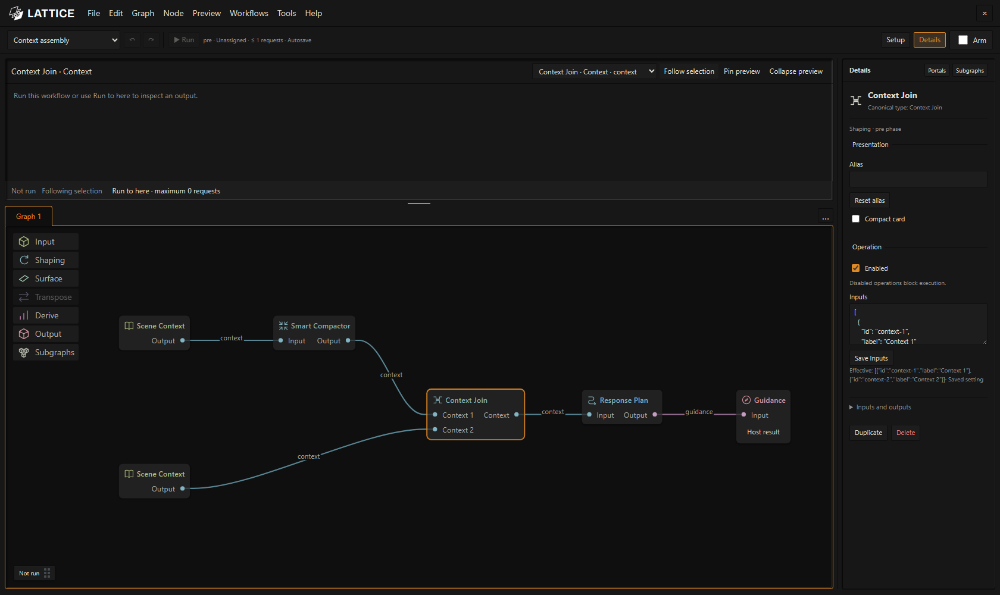
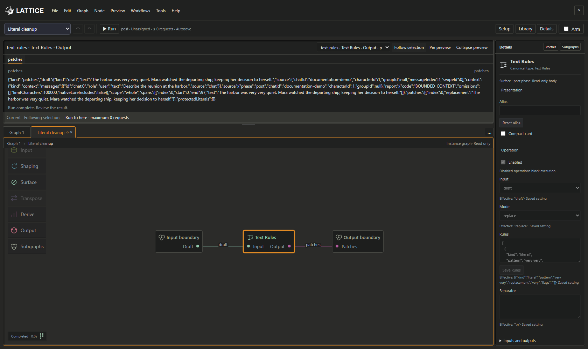
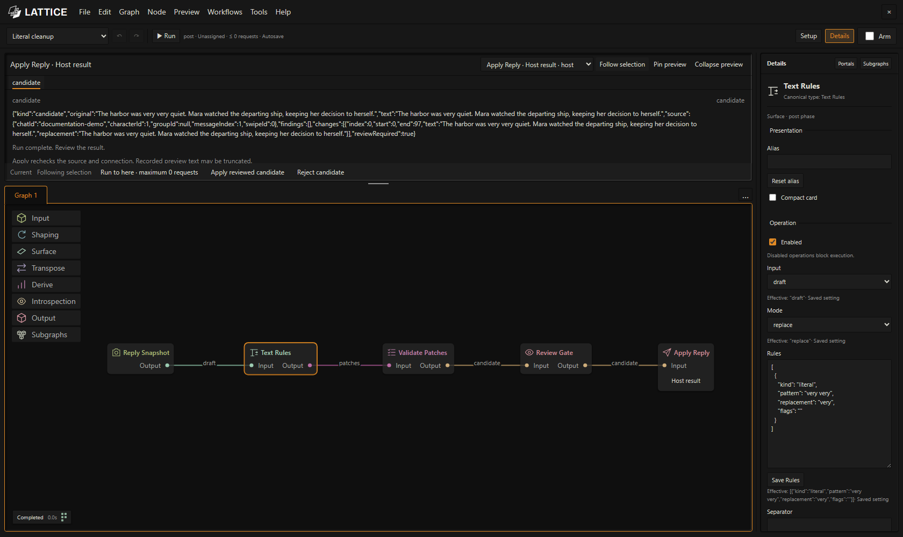

# LATTICE

**A visual workspace for engineering writing workflows.**

LATTICE turns a writing process into a system you can build, inspect, and reuse. Connect context sources, model operations, text transformations, structured data, and review steps in a node graph. Package a useful process as a subgraph, edit its body in a graph tab, and compose it into a larger workflow.

It runs inside SillyTavern. A unified workflow prepares guidance, uses it for the ordinary SillyTavern generation, then processes the completed reply in the same graph. Auxiliary models can revise prose, extract scene records or enrich notes. Review the final result before Apply creates a new swipe and accepts its staged consequences. Legacy pre/post tools remain available.

*Build a writing brief from structured fields, inspect its result in Preview, and configure the selected operation in Details—all in one workspace.*

## What you can build

- **Context preparation pipelines:** select recent material, preserve protected passages, compact context, and combine branches before planning.
- **Scene planning workflows:** define instructions and budgets for model-assisted direction, intentions, constraints, and possible next beats.
- **Structured writing briefs:** parse JSON, select the fields you need, and compose them into repeatable guidance templates.
- **Editorial pipelines:** scan configured patterns, apply literal or regex rules, or ask a model for bounded repairs; validate and review the proposed result.
- **Actor memory and state:** reflect on supplied evidence, express optional behavior guidance, internalize settled events, and track deterministic consequences.
- **Reusable writing tools:** wrap a sequence in a subgraph with named inputs and outputs, then use it in other workflows.

These are combinations of the shipped tools. **File → Open examples…** offers unified story flows alongside the original roleplay lessons. Examples include prose-and-notes chains, item effects, story-time triggers, generic progression and scoped actor memory. Each opens as an editable copy with its own setup instructions. The workflow JSON examples below also explore individual capabilities.

## Key features

| Feature | What it gives you |
| --- | --- |
| **Typed node graphs** | Connect Context, Draft, Text, Data, Guidance, Patches, and Candidate artifacts through named pins. Connections determine dependencies. |
| **Reusable subgraphs** | Package operations behind a typed interface, customize an editable copy, and compose nested processes. |
| **Graph tabs** | Open subgraph bodies without losing your place in the parent workflow. Each instance retains its own view. |
| **Node shelf and contextual search** | Open a family to choose an operation directly, search operations and subgraphs, or discover compatible nodes while connecting a pin. |
| **Node details** | Edit operation controls, aliases, compact cards, and model bindings; inspect effective values and validation issues. |
| **Per-operation model connections** | Choose each model node’s connection profile and model in Details without switching SillyTavern’s main connection; For Each exposes its pinned helper’s role selectors too. |
| **One native workflow** | Connect preparation to Generate Reply, process its owned Draft, and review the result in one graph. |
| **Typed decisions and branches** | Use Decision or configured Jev/Laya Fast Decision with explicit confidence gates, skipped paths and unresolved policies. |
| **Workflow Data and accepted effects** | Read authorized logical targets, project append/keyed updates, and settle file/clock/outcome consequences with the chosen reviewed result. |
| **Scoped character context and Recall** | Process present actors separately and queue selected-actor memories through visible controls or shortcuts. |
| **Recorded previews** | Inspect inputs and outputs, follow selection, pin an artifact, or run only a selected output's dependencies. |
| **Execution visibility** | See node states, expanded subgraph stages, request bounds, actual calls, and failures. |
| **Portals and reroutes** | Keep a large graph readable while preserving its dependencies. |
| **Review before application** | Compare a proposed revision with its original; applying creates a new swipe and preserves the source. |
| **Portable workflow packages** | Import, export, and share workflows with pinned subgraph definitions. Add fragments through a reviewed import. |
| **Editing controls** | Undo/redo, copy/paste, multiselection, pan/zoom, pane resizing, and presentation aliases. |
| **Workflow comments** | Frame selected nodes with a labeled comment, add notes, and move or resize it with undo support. |

*Combine context branches with named inputs. This authored example includes a model planning step; choose that node's connection profile in Details before a full run.*

## Available nodes

The [node reference](docs/node-reference.md) lists the actual reusable operations, ports and controls. **0** calls means no auxiliary model request; the ordinary SillyTavern reply is separate.

| Tools | Examples |
| --- | --- |
| **Native lifecycle** | On Send, Player Event Source, Generate Reply · SillyTavern, Review / Publish |
| **Context and model work** | Scene Context, Actor Context, Model Call, Response Plan, Revise Draft, Extract, Enrich |
| **Assembly and editing** | Compose, Text Rules, Transpose, Draft Text, Render Notes, Append/Combine |
| **Decisions and control** | Decision, Fast Decision, Confidence Gate, Condition, Branch, Join, Collect, pinned For Each |
| **Canonical events and item rules** | Event Normalize, Confirm Events, Scene Presence, Current Holder, Character Direction, Prompted Memory |
| **Randomness** | Effect Library, Random Pick, Effect Author, Stage Outcome, Outcome Commit |
| **Documents and collections** | Read File, Format, Project Document, Write to File; lookup/filter/count/sum/threshold/project/flatten |
| **Time and progression** | Story Clock, Advance Time, Time Trigger, Clock Commit; generic State progression and time-decay |
| **Memory** | Reflect, Internalize, Express, scoped Memory, Recall and Recall Shortcut |

Repair also offers Inspect, Contextual Cleanup and Strict Avoidance modes using the complete category-based policy. Nodes have phase and artifact requirements; the [node reference](docs/node-reference.md) explains their ports and controls. The [reference library guide](docs/lattice-reference-library.md) covers reusable Context Lens, Scene Compass and cleanup workflows.

The shelf and contextual search offer one entry per operation. Choose variants in **Details**: Reflect's Character/Recall/Scene modes, JSON Decode's Parse/Check modes, Reroute's Artifact kind, and the other operation controls. Introspection modes and generic State progression/time-decay use these controls. The Subgraphs shelf shows the latest explicitly saved entry for each reusable item; placed copies retain their exact saved contents.

New Transpose nodes accept and return **Text** in either graph phase. Choose **Input type → Draft** in an After reply graph to produce source-bound Patches for validation and review. Existing saved nodes without an Input type setting retain their Draft behavior. See the [reference library guide](docs/lattice-reference-library.md) for reference inputs and independent mode/scope controls.

Memory is root-only; Commit is a Post/response terminal. Legacy post tools may settle it on a successful full root Run; unified effects wait for the chosen accepted root result. Run to here records a preview without writing. Memory uses the active chat and character, including a required selected actor in group chats. See the [Introspection guide](docs/introspection-package.md) for evidence, controls and persistence limits.

## Reuse a process, inspect its internals

Select processing nodes, right-click, and choose **Create Subgraph**. The editor opens their body in a new editable tab, creates and wires typed input/output boundaries, and reconnects the parent workflow through the new subgraph block. Click a boundary to edit its port in Details. Add Input and Output nodes from the Subgraphs shelf; they are enabled inside editable subgraphs. Save a wrapper with **Add to Subgraphs**, then explicitly create or update a shelf entry. Placed copies retain their saved contents. Undo restores the original nodes and connections in one step.

*The Literal cleanup subgraph exposes Draft → Patches. Its body opens in a tab; validation, review, and application remain in the parent workflow. Pinned bodies are read-only until you make a local copy.*

## Install and try it

1. In SillyTavern, open **Extensions → Install extension**.
2. Enter `https://github.com/MentallyQuill/Lattice`, leaving the branch field blank to install `main`.
3. Install, then reload SillyTavern. Open LATTICE from its logo on the left of the chat bar or with `/lattice`. Fresh launch opens **Unified story workflow**, with Lattice disabled. Existing installations restore their recovery draft; previous workflows remain available through **File → Recover previous workflows**.
4. Keep the starter open, select **Enable Lattice**, and Send a player message in SillyTavern. The starter makes no auxiliary calls and exposes its completed native Draft for review.
5. Select **Review / Publish · Host result** in Preview, inspect it, and Apply or Reject. For a richer pipeline, open a unified example and configure its model nodes, For Each helper roles and required workflow data documents before the next Send.

For updates, use **Manage Extensions**, then reload. Installation, import, and editing do not make model calls.

The [unified workflow guide](docs/unified-workflows.md) walks through applying an example to **Story-2 on default-user**, chaining different models, using Fast Decision, recording private moments, queueing recall and managing accepted effects. A full unified native generation starts with ordinary Send; supported **Run to here** paths inspect without acceptance.

Opening a unified example makes an independent editable copy the active document. It makes no model request and does not change **Enable Lattice**. Set each auxiliary model’s local Connection profile in Details; configure For Each’s **Helper model bindings** separately. **Tools → Workflow Data…** authorizes logical JSON/text targets, and **Tools → Fast connections…** configures typed Jev/Laya endpoints. Local connection IDs and credentials are excluded from portable exports.

Legacy **Before reply (Pre)** workflows still prepare bounded guidance, while **After reply (Post)** workflows remain manual tools for a completed reply. Send follows the open Pre or unified document when **Enable Lattice** is selected; Post tools use manual **Run**. Previous saved graphs remain available through **File → Recover previous workflows**. Migration is explicit reuse in a new unified copy, with no automatic converter.

Open the following technical examples as JSON with **File → Open workflow…**:

| Starter | What it demonstrates | Maximum auxiliary calls |
| --- | --- | ---: |
| [Structured guidance](workflows/structured-guidance.json) | JSON → selected fields → composed writing brief | 0 |
| [Literal cleanup](workflows/literal-cleanup.json) | Deterministic reply edits with validation and review | 0 |
| [Scene guidance](workflows/native-guidance.json) | Context compaction and model-assisted scene direction | 2 |
| [Reviewed AI De-slop](workflows/reviewed-de-slop.json) | Configured pattern scanning and reviewed model repair | 1 |
| [Scene Compass](examples/library/workflows/scene-compass.json) | Reusable context selection and scene direction | 1 |
| [Literal phrase cleanup](examples/library/workflows/literal-cleanup.json) | Reusable phrase repair with review | 1 |
| [Formatting cleanup](examples/library/workflows/formatting-cleanup.json) | Reusable deterministic line-ending cleanup | 0 |
| [Prose cleanup](examples/library/workflows/prose-cleanup.json) | Reusable category-based cleanup | 1 |
| [Reflect and express](examples/introspection/native/reflect-and-express.json) | Focus → character reflection → behavior guidance | 1 Analysis |
| [Internalize and commit](examples/introspection/native/internalize-and-commit.json) | Settled events → experience proposal → root memory commit | 1 Analysis |
| [Consequence clock](examples/introspection/native/consequence-clock.json) | Distinct settled events → deterministic track → root memory commit | 0 |

The technical legacy examples above remain useful for bounded manual inspection. Structured guidance needs no connection profile; Literal cleanup needs a completed text reply. A manual model-backed run can spend tokens; an enabled Send runs guidance again. Reply application requires a fresh, fully reviewed root result.

The two legacy Post Introspection starters write actor memory on a successful full Run. The host checks current evidence and store version before writing and records idempotency receipts. SillyTavern's public metadata save wrapper returns no durability acknowledgment: Preview reports **Memory updated; save unconfirmed** when the local update succeeds but the save is unconfirmed. Confirm refreshed metadata before another commit.

*Inspect the root Host result before choosing Apply reviewed candidate or Reject candidate. Intermediate outputs are diagnostic previews.*

## Learn and build

- [Operator's manual](docs/operators-manual.md) — screenshot-guided workspace, graph editing, subgraphs, Details, Preview, and execution.
- [Node reference](docs/node-reference.md) — every available operation, its artifacts, controls, and connection examples.
- [Connections and comments](docs/connection-comments.md) — smooth connections, workflow annotations, and comment editing shortcuts.
- [Quick start](docs/lattice-workspace.md) — your first two workflows without model calls.
- [Unified workflows](docs/unified-workflows.md) — story setup, one-graph Send/Apply, decisions, actor context, documents, Recall, clocks and migration.
- [Model connections and host integration](docs/native-workflows.md) — local profiles, token budgets, legacy tools, reply review, supported routes, and troubleshooting.
- [Introspection](docs/introspection-package.md) — native starters, original Introspection modes, scoped memory and package APIs.
- [Development guide](docs/development.md) — build tools and reproducible documentation captures.

Screenshots illustrate the editor and existing example tools on a local demonstration host with synthetic writing material; captions identify their demonstrated workflows. The demonstrated completed workflows make no provider requests.

## License

MIT. See [LICENSE](LICENSE) and [third-party notices](THIRD_PARTY_NOTICES.md).
