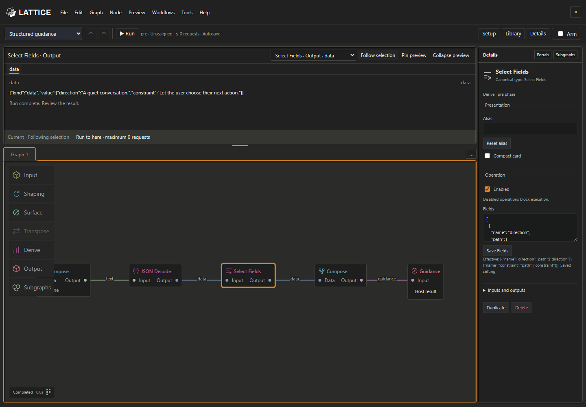

# LATTICE

LATTICE is a visual workflow editor for adding optional planning before a SillyTavern reply and reviewing proposed edits afterward. SillyTavern builds and sends the normal conversation prompt; LATTICE workflows can provide bounded guidance or prepare a reply revision for your review.

## Install

1. In SillyTavern, open **Extensions → Install extension**.
2. Enter `https://github.com/MentallyQuill/Lattice` and leave the branch field blank to install the default branch.
3. Click **Install** (or **Install just for me**) and reload SillyTavern.

Open LATTICE from the button beside Send or type `/canvas`.

## Start with a workflow

Open **Workflows → Workflow examples…** and choose an example. **Literal cleanup** and **Structured guidance** run without a model connection. **Scene guidance** and **Reviewed AI De-slop** use model-backed steps that you configure with SillyTavern Connection Manager profiles.

Open a workflow to inspect and edit its nodes. Run it explicitly and review the recorded outputs in Preview. Assign and enable a workflow only when you want it used during a normal send. Reviewing and applying a proposed reply edit is always a separate action.

| Example | Purpose | Auxiliary model calls |
| --- | --- | ---: |
| [Literal cleanup](workflows/literal-cleanup.json) | Propose a small, rule-based edit to the latest completed text reply | 0 |
| [Structured guidance](workflows/structured-guidance.json) | Build bounded guidance from structured fields | 0 |
| [Scene guidance](workflows/native-guidance.json) | Prepare context and propose optional scene direction | Up to 2 |
| [Reviewed AI De-slop](workflows/reviewed-de-slop.json) | Find configured patterns and prepare a bounded revision | Up to 1 |

Auxiliary calls are separate from SillyTavern's normal reply generation. A manual run may spend tokens; its result is not cached for a later send.

## Documentation

- [LATTICE workspace](docs/lattice-workspace.md): examples, nodes, graph navigation, subgraphs, and run previews.
- [Native workflows](docs/native-workflows.md): setup, model connections, review and apply, limits, and troubleshooting.

## Development

Use Node.js 24 or later. Run `npm ci`, then `npm run check` to validate the source, build, and browser acceptance suite. The extension ships its UI bundle and does not need a runtime npm install.
