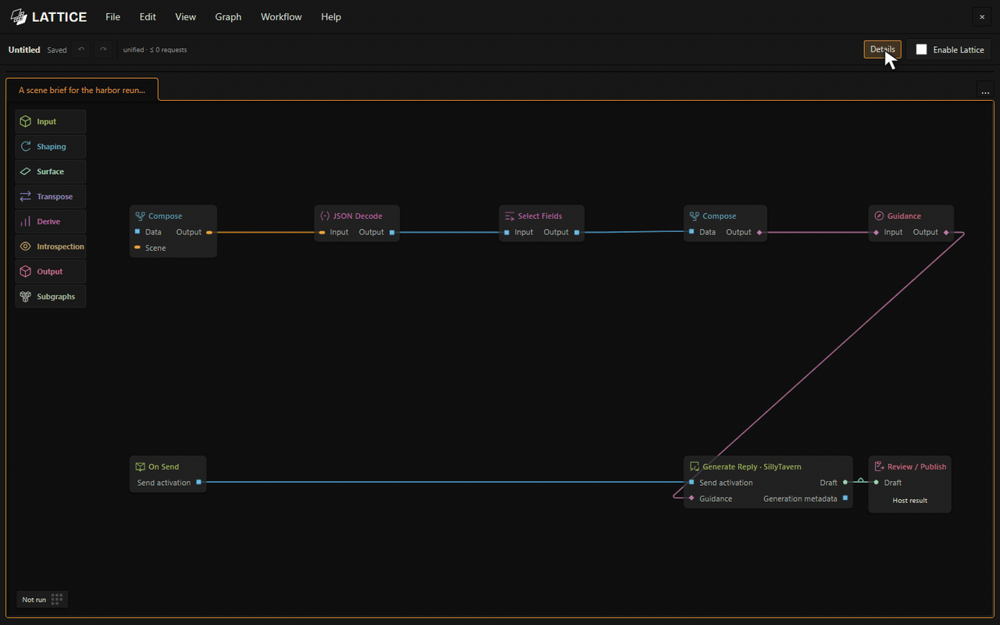
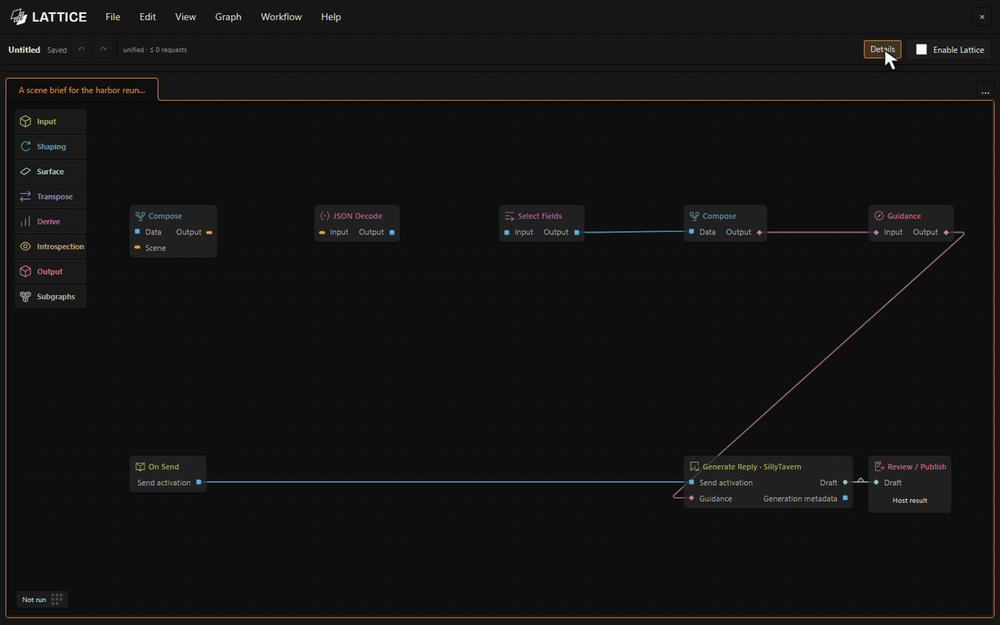
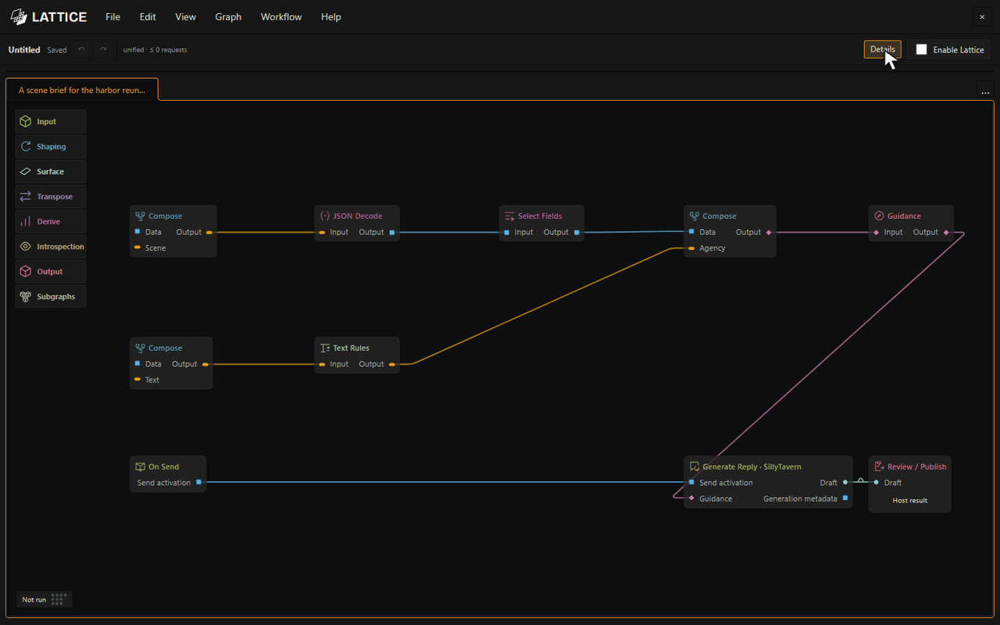

# LATTICE · Beta

**Give your roleplay a little more memory, a little more structure, and a lot more possibility.**

Lattice is a visual story workshop inside SillyTavern. Connect small tools to shape the next scene, give characters their own direction, polish a reply, or keep track of what your story has actually established. Start with an example, change it to suit your world, and build from there.

Your normal SillyTavern model still writes the reply. Lattice can prepare its guidance, bring in other models for specific jobs, and process the result—all in one connected workflow. You inspect the result before accepting it.

*Three story systems, one reply. Open any system to see how it works, edit its rules, or switch it off.*

[Install and try it](#install-and-try-it) · [Operator’s manual](docs/operators-manual.md) · [30 example workflows](docs/examples.md) · [Node reference](docs/node-reference.md)

## What could you build?

**A broken wand with a 10% chance of chaos magic.** Give ordinary magic a weight of 90 and a list of fixed chaos effects a combined weight of 10: butterflies, sudden frost, voices from nowhere. Once an eligible use is confirmed, Lattice’s weighted Random Pick chooses an effect and keeps that draw tied to the event. The fixed selection needs no model call. Models can recognize the action and narrate the consequence; your rules decide the odds. [Build this version](docs/story-systems.md#a-wand-with-a-10-chaos-chance).

And it goes well beyond enchanted items:

| Story idea | What Lattice brings to it |
| --- | --- |
| **A relationship that grows slowly** | Track trust, desire, tension, and excitement with authored limits, cooldowns, and changes over accepted story time. A warm conversation needn’t jump straight to devotion. |
| **One moment, two private perspectives** | Let each present character reflect on the same event using their own context and memories. Give the next reply character-specific direction. |
| **A world with a sense of time** | Advance a story clock after an agreed journey or rest. Trigger weather, a curse, or a routine when the story crosses its scheduled time. |
| **A campaign notebook that earns its entries** | Extract a recap or scene record, review the reply, and save the record only when you accept it. Rejected scenes stay out of the notebook. |
| **A narrator with an editorial team** | Have one model plan the scene, let SillyTavern write it, ask another model to polish the prose, then append useful notes. Choose a connection for each job. |
| **Memories you can call back deliberately** | Queue a character’s memories from the canvas or a shortcut, or author a story trigger for Recall. Inspect what reached the next reply. |

These ideas build on shipped nodes and examples. [Story systems](docs/story-systems.md) explains their rules and setup. The advanced wand lesson also offers a model-authored wild branch; the fixed 90/10 library above is a variation you can author.

## Build it by connecting the pieces

Find a tool by name or browse the shelf, then drag it onto the canvas. Nodes have small, specific jobs: read context, choose fields, compose instructions, call a model, transform text, make a decision, or propose a story-state change.

*Search, grab, place. Configure the tool in Details.*

Connect output pins to compatible input pins to decide what feeds what. Follow the colored connections to understand the process, and inspect recorded results at each step instead of guessing what went into the prompt.

*Here, a written scene brief becomes structured data that the next tool can work with.*

When a useful sequence starts taking up space, select it and turn it into a subgraph. Lattice creates its inputs and outputs, reconnects the parent, and opens the internals in a tab. Save it to the shelf and reuse it in another story.

*Turn a scene-brief pipeline into one reusable block without losing its connections.*

You can also frame sections with comments, open a node’s **?** guide, pin a preview while exploring the graph, and use **Run to here** to inspect a supported part of the process. Undo and redo cover graph edits. [The manual](docs/operators-manual.md) walks through all of it.

## Your story still gets the final say

Lattice’s normal path is **Send → prepare guidance → SillyTavern reply → process → review**. Apply adds the reviewed reply as a new swipe, preserving the original, and accepts that result’s staged story changes. Reject keeps those proposals from becoming accepted state.

*Inspect the recorded result before applying it. Preview and Run to here do not accept story changes.*

## Install and try it

1. In SillyTavern, open **Extensions → Install extension**.
2. Enter `https://github.com/MentallyQuill/Lattice`. Leave the branch blank to install `main`, then reload SillyTavern.
3. Click the Lattice logo beside the chat bar, or type `/lattice`. A fresh installation opens **Unified story workflow** with Lattice disabled.
4. Select **Enable Lattice** and send a player message normally. The starter uses your usual SillyTavern generation and makes no extra model calls.
5. Select **Review / Publish** and inspect its **Host result** in Preview. Choose **Apply reviewed reply** or **Reject reply**.

Ready for more? Open **File → Open examples…**. Thirty lessons take you from scene direction to memories, notebooks, item effects, progression, and relationships. Each opens as an editable copy with setup steps and a stated call budget. Model-based lessons need their connections configured; some also need Workflow Data sources.

Lattice is in beta. Save your workflows and try substantial story systems in a separate chat first. Update through SillyTavern’s **Manage Extensions**, then reload.

## Learn more

- [Operator’s manual](docs/operators-manual.md) — illustrated instructions for editing, running, reviewing, and sharing.
- [Story systems](docs/story-systems.md) — concrete roleplay ideas and their operating rules.
- [30 lessons](docs/examples.md) — choose a starting point and follow its setup.
- [Node reference](docs/node-reference.md) — find a tool’s inputs, outputs, and settings.
- [Unified workflows](docs/unified-workflows.md) — model chains, character context, memories, documents, clocks, and accepted effects.
- [Model setup and troubleshooting](docs/native-workflows.md) — connections, budgets, and host integration.
- [Development](docs/development.md) — builds, checks, and reproducible screenshots and GIFs.

Screenshots and animations show the real beta editor on a local demonstration host with synthetic story material. Captures make no provider requests; model profiles shown are illustrative.

MIT · [License](LICENSE) · [Third-party notices](THIRD_PARTY_NOTICES.md)
