# Expanded Nodes

**LATTICE workflow unification design — 2026-10-10**

**Status:** This document consolidates the proposed node system discussed for LATTICE. It is a design record, not an instruction guide for features already available. The accepted direction is one workflow that can prepare a turn, use normal SillyTavern generation, and continue processing the resulting reply. The names **Decision** and **Fast Decision** are settled. Most new node names, port layouts, defaults, schemas, and execution policies below are proposals that still need an implementation specification.

Read the companion [Workflow Unification Summary](workflow-unification-summary.md) for the runtime architecture, UI changes, migration, and publication choices. Read the current [node reference](../node-reference.md) for operations available today.

## 1. What the expanded system must make possible

The motivating workflow combines several activities without changing active graphs:

1. Read scene context and prepare guidance.
2. Supply that guidance to the ordinary SillyTavern generation.
3. Receive the completed reply as a Draft.
4. Use a different model to revise the prose.
5. Extract notable items or events from that revision.
6. Use scene context and another model to enrich those items.
7. Format a collapsible notes section and append it to the revised reply.
8. Review or publish the assembled result according to the workflow's policy.

The same structure must support conditional character direction, memories triggered by items, and random item effects. These are connected processes with distinct sources, decisions, transformations, and consequences. They should be visible in the graph rather than hidden inside one increasingly large prompt.

The later persistence examples extend that structure to file-backed event ledgers, progression thresholds, paired actor-private memories, and recall armed by a hotkey or activated automatically. Sections 13–16 describe those additional proposed contracts without assuming that a file backend or hotkey system is already available.

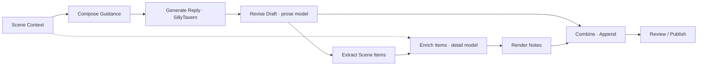

This diagram is a proposed flow, not an importable current workflow. It also leaves publication architecture deliberately visible: compatible continuation permits SillyTavern to publish the original reply before LATTICE revises it; staged single publication requires a new integration point that can retain the base reply as a working Draft. The companion summary explains both options. Neither should be disguised by a node label.

## 2. Shared contracts before individual nodes

### 2.1 Artifacts carry both content and authority

The current artifact vocabulary is a useful starting point. The proposal extends how those artifacts compose rather than treating every value as an interchangeable string.

| Artifact | Proposed role in a unified workflow |
| --- | --- |
| Context | Bounded, attributed scene evidence, character material, and selected history. An extraction or compaction report identifies omissions and derived material. |
| Draft | A working reply revision linked to its source generation or reply snapshot, original text, parent revision, and approved transformation scope. |
| Text | Instructions, templates, references, rendered fragments, and explicit text views. Text is not automatically an authorized reply. |
| Data | Typed JSON-compatible records: decisions, events, holders, inventories, cast outcomes, extracted items, and pending state proposals. |
| Guidance | Bounded direction intended for the ordinary SillyTavern generation. It can be composed and inspected before reaching the generation boundary. |
| Patches | Proposed edits against an identified Draft revision. Their offsets or replacements must match that revision. |
| Candidate | A validated proposed reply with review information and source provenance. It must become composable with further revision stages in the unified design. |

A new Event or Decision artifact kind may eventually be justified. It is not required merely to represent a typed event or judgment: a discriminated Data payload can do that. Exact schema additions remain open.

Persistent-file work introduces proposed **fileRef**, record, projected-document, and mutation-plan payloads. A fileRef identifies an authorized backend target and the revision read, rather than granting arbitrary disk access through a model-generated pathname. Format produces validated records; Update Collection can produce a pure projected update; Write to File stages or commits the mutation. Section 13 defines these contracts. File-backed canon must retain the same event identity and acceptance rules as other state.

The important change is that a validated revision can feed another processor without first being applied to chat. A revision chain could be `base → cleanup → character contribution → notes assembly`. Every step retains its parent and original source. A processor must not silently retarget a later revision's edits against the original text. An explicit conversion can expose Draft text to an extractor or formatter while preserving a provenance reference; reconstructing an authorized Draft from arbitrary Text requires a checked operation.

### 2.2 Data dependencies and activation are different

Having a connected input does not by itself mean a node should run. A source can be available throughout a turn while an item branch activates only for a particular use event. The graph therefore needs defined activation semantics in addition to artifact compatibility.

For example, Scene Context supplies evidence to an Item Use Trigger. The trigger emits zero, one, or several confirmed use events. A For Each node processes each event, and a Collect node returns their outcomes. On a turn with no use event, that collection is empty and the ordinary generation path continues. It must not wait forever for an inactive branch or mistake a skipped branch for a failed model request.

Whether execution uses explicit control ports, event-carrying Data edges, or compiled region metadata is an implementation choice. The visible graph and run trace must still communicate the same behavior: what activated, what was skipped, what completed, and what failed.

### 2.3 An event is not an execution attempt

A cast, item transfer, character entrance, or accepted crafting action needs an identity independent of the attempt running it. Retrying a failed request does not create another cast. Re-rendering notes does not debit materials again. Regenerating prose about a resolved event does not automatically reroll its effect.

A proposed event record includes:

| Field | Purpose |
| --- | --- |
| Event ID and kind | Stable identity for the occurrence and its type. |
| Turn and source identity | The player message, generation, or revision that supplied the evidence. |
| Evidence | Matching passage and, where supported, a span or structured transition. |
| Actor and item IDs | Canonical entities involved, separate from display names and aliases. |
| Event position | Ordering when several actions occur in one message or scene. |
| Resolved state at the event | For example, the holder before a transfer and after it. |
| Outcome status | Pending, resolved, accepted, rejected, or otherwise explicitly unresolved. |

Exact identity construction and persistence are open. Identity must nevertheless survive a retry of the same occurrence and distinguish two genuine uses in one turn. Revision changes that add, delete, or reinterpret an action require explicit invalidation rules; old outcomes cannot simply be attached to a different event because its text looks similar.

### 2.4 Consequences are proposed before they are committed

Nodes that invent memories, choose effects, update inventory, or resolve faction actions should produce pending records. Publication or another explicit acceptance boundary decides which consequences become accepted state. Intermediate branches and unselected alternative replies should not silently become canon.

This is a proposed unified-system safety and consistency contract, not a description of current Memory Commit behavior. Today, memory settlement has its own host path. A migration must reconcile it with the final reply lifecycle. A host write acknowledgment also does not by itself prove a durable save; the run trace should distinguish local settlement from confirmed persistence when such confirmation is available.

## 3. Node families and naming

The following catalog combines existing operations that need changed contracts with proposed additions. It is intentionally larger than a first implementation slice. A family is organization in the shelf, not a restriction that everything in it can only run before or after generation.

| Family | Nodes or capabilities | Design status |
| --- | --- | --- |
| Sources | Scene Context, Reply Snapshot, Text, File Input, Prompt Source; explicit player-message and scene-state sources | Existing foundations; unified source lifetimes and additional selectors proposed |
| Lifecycle | On Send / On Run, Generate Reply · SillyTavern, Review / Publish | Unified lifecycle nodes proposed; current Guidance and Apply Reply are terminal host outputs |
| Detection | Item Mention Trigger, Item Use Trigger, Character Presence / Scene Cast, state-transition triggers | Proposed |
| Decisions | Condition, Decision, Fast Decision, Confidence Gate, Branch | Proposed; Decision and Fast Decision names settled |
| Collections | For Each, Collect, Join, selection and field operations | New activation-aware collection controls proposed; Select Fields already exists |
| Randomness | Random Pick, effect-list parsing and validation, saved-outcome lookup | Proposed |
| Characters and memory | Current Holder, Character Direction, Prompted Memory, scoped reaction and scene merge | Proposed compositions using existing introspection/state foundations |
| Models and revision | Explicit Model Call, Revise Draft, Extract, Enrich, checked revision chaining | Proposed generic capabilities; current specialized nodes already make model calls |
| Presentation | Compose, Combine / Append, Render Notes, Draft Text view | Compose exists; Draft-aware assembly and the other named capabilities proposed |
| State and settlement | Stage Outcome, stage memory/state changes, commit accepted consequences | Proposed coordinated lifecycle using existing Memory and State foundations |
| File persistence | Read File, Format, Write to File, optional pure Update Collection, Count / Sum | Proposed backend-aware record and mutation capabilities; current File Input is an imported snapshot, not a write handle |
| Recall activation | Hotkey Trigger, Arm Recall, automatic keyword/character/event activation, Select Relevant | Proposed shared activation and actor-scoped retrieval capabilities |
| Story time | Story Clock, Advance Time, Time Trigger, interval/delay/cooldown modes | Proposed persistent story-time contracts; deterministic calendar math, not wall-clock scheduling |
| Reusable state progression | State Value / Track / Curve foundations, authored Rule Lookup, numeric reducers, threshold checks, optional tracker preset | Favor modes/extensions and reusable compositions; XP is a recipe, not a dedicated node |

Names such as Prompted Memory or Scene Join may become modes or reusable subgraphs instead of separate shipping operations. The design requires the capability and visible contract; it does not require one shelf entry for every box shown here.

## 4. Sources, generation, and revision nodes

### 4.1 Scene Context and explicit watched sources

**Inputs:** Host-selected conversation and character sources, or an explicitly passed Context in a reusable subgraph. **Outputs:** Context with source identity, scope, omission report, and relevant revisions.

The unified graph needs to distinguish a frozen scene snapshot used to prepare generation from the completed reply that arrives later. They are not interchangeable views of an always-mutating global buffer. A node should say whether it reads the initial scene, the generated Draft, a named revision, or an accepted state snapshot.

For triggers, proposed source controls are **Current player message**, **Completed SillyTavern reply**, **Specific revision output**, and **Confirmed state transition**. Historical Context may inform a decision, but scanning it again is not a new occurrence. Explicit source selection also prevents a memory model's generated mention of an item from recursively activating that same memory branch.

### 4.2 Generate Reply · SillyTavern

**Inputs:** Activation for this turn, optional Guidance, and the frozen identities needed to correlate the turn. **Outputs:** Completed Draft and generation metadata; explicit cancellation or failure status.

This is the main generation boundary. It represents ordinary SillyTavern generation with its own selected model, prompt assembly, character configuration, lore, and compatible integrations. It is not merely another auxiliary Model Call whose prompt happens to contain a copy of the scene. LATTICE prepares bounded guidance, hands control to the host, and resumes when the owning generation completes.

One graph should display the boundary that connects preparation and reply processing. The implementation must distinguish that completion from unrelated message changes, cancelled generations, or a new turn. Re-entrant generation, multiple generation boundaries, and loops spanning them are open choices; an initial implementation can support one boundary without promising arbitrary recursion.

### 4.3 Model Call and Revise Draft

**Model Call inputs:** An explicitly composed request, selected evidence, optional structured schema, and a per-node connection. **Outputs:** Text or validated Data with request metadata. **Revise Draft inputs:** Draft, revision instructions, optional Context or references, and a connection. **Outputs:** Proposed patches or a checked successor Draft, depending on the final artifact design.

Users need separate connections for separate jobs: analysis, prose shaping, character portrayal, item details, and wild-effect invention. The main SillyTavern model remains independent. A selected provider must actually support the needed request capability; “any model” means models available through supported configured connections, not every API format automatically working.

Revision controls should make the authorized change clear: narration, dialogue, a named character contribution, terminology, format, or an explicitly permitted whole-reply rewrite. They should also carry preservation constraints such as events, player actions, protected literals, and accepted random outcomes. A style pass should not quietly turn a failed spell into a successful one.

A structured failure, a transport failure, and a valid but unsuitable result are separate outcomes. Retry limits and review routing should be visible. These nodes must not use a failed request as permission to apply partial text or silently select a different model.

### 4.4 Extract, Enrich, and Draft Text

**Extract inputs:** A chosen Draft revision or explicit Text view, schema/instructions, and optional Context. **Outputs:** Data with source references and distinctions between observations, claims, deductions, and generated additions. Extraction may be deterministic for simple patterns or model-backed for interpretation.

**Enrich inputs:** Extracted records plus relevant Context, instructions, and a model connection. **Outputs:** Enriched records that retain their original identities and evidence. New details should be marked as generated proposals, existing canon, or interpretation rather than being presented as facts merely because they are fluent.

**Draft Text inputs:** Draft. **Outputs:** Text plus a provenance reference in the artifact envelope. This proposed explicit view enables formatters and JSON extraction without granting arbitrary Text the authority to overwrite a reply. A later assembly node must preserve the authoritative Draft input.

For the motivating scene-item workflow, extract from the final narrative revision, enrich against the same accepted scene evidence, then render player-visible notes. Private character memories and unseen facts should not reach the dropdown unless the author explicitly chooses an appropriate private output destination.

## 5. Triggers, conditions, decisions, and branches

### 5.1 Trigger versus Condition

A **Trigger** identifies an occurrence that activates work. A **Condition** evaluates a proposition that determines where already-activated work proceeds. “The broken wand is used” is an event trigger. “The current holder is Mara” is a condition. “Mira remains in the scene” is a condition evaluated on each relevant turn; “Mira enters the scene” is a transition trigger that may activate once per entrance.

| Question | Suitable mechanism |
| --- | --- |
| Did a new source mention an exact item alias? | Deterministic mention trigger |
| Was the item actually used rather than merely discussed? | Use-event detector with an explicit semantic Decision when needed |
| Does confirmed inventory assign this item to this actor? | State lookup and Condition |
| Has this exact event already received an outcome? | Saved-outcome lookup and Condition |
| Is the interpretation uncertain? | Unresolved route, optional Decision fallback, or review |
| Which eligible random effect occurs? | Random Pick, not a decision model |

The trigger output should carry evidence and entity identity, not merely `true`. A condition can emit a typed result and reason without inventing an event. More exact node separation is still open, but the user should be able to inspect why the branch activated.

### 5.2 Activation policies

Proposed policies include **each relevant turn**, **once per turn**, **each distinct occurrence**, **each distinct action**, **when a condition becomes true**, and **once until reset**. These solve different problems; there should not be one ambiguous “trigger once” checkbox.

An item mention memory might be limited to one activation for that item in a turn even if its name appears three times. A broken wand must activate for each genuine cast. A character entrance greeting should not repeat every turn that the character remains present. Exact defaults are open and should be chosen per trigger class rather than assumed across all nodes.

### 5.3 Condition

**Inputs:** Data, Text, or selected state fields. **Outputs:** A typed pass/fail/unresolved result with the tested values. **Calls:** Zero for deterministic predicates.

Proposed operators include equality, inequality, contains, exact alias match, list membership, existence, numeric comparisons, and combinations **All**, **Any**, and **None**. Missing fields, incompatible types, and unknown state need explicit handling. They should not silently become false unless the author deliberately selects that behavior.

A Condition should not hide a model request behind an apparently deterministic comparison. Semantic questions should be connected to Decision or Fast Decision. This keeps cost, latency, and uncertainty legible in both the graph and the run trace.

### 5.4 Decision

**Inputs:** A narrowly stated judgment, relevant Context/Text/Data, response schema, and a configured ordinary model connection. **Outputs:** Validated decision Data with the answer, evidence or explanation when requested, provider metadata, and an explicit unresolved judgment when the model validly reports that the evidence cannot support an answer. A transport failure or schema-validation failure is an execution error, not an unresolved judgment and not a negative answer.

Examples include whether a statement describes an actual wand cast, whether Mira is physically participating, whether two effect descriptions are meaningfully different, and whether a revised paragraph preserves the accepted events. The node should ask the smallest question necessary instead of requesting a large story rewrite and trying to infer its answer afterward.

Decision is the normal connected-model route. It is not called “Standard Decision.” A chat model's self-reported certainty is not a calibrated classifier probability and should not be compared against Fast Decision confidence as though the numbers meant the same thing. The exact output schema and evidence requirements remain implementation decisions.

### 5.5 Fast Decision

**Inputs:** Compact state/evidence, typed questions, a configured compatible fast-decision connection, and the selected task mode. **Outputs:** Typed answer Data retaining provider-specific confidence or probability semantics. **Calls:** A bounded native request, separate from text completion.

The proposed Fast Decision node explicitly targets the Jev-compatible typed API. Hosted **Jev** and self-hosted **Laya** are two connection options for it. Connection setup remains explicit; the node does not install, start, or discover an arbitrary local model by magic.

The primary Jev documentation describes typed choice, score, and yes/no-style questions over supplied state. Its quickstart uses `POST /v1/systemone` with `state`, `model`, and `questions`. These make a dedicated typed adapter appropriate rather than trying to read decision answers from the current auxiliary text-completion response shape. See [Jev introduction](https://docs.typesafe.ai/introduction) and [Jev quickstart](https://docs.typesafe.ai/introduction/quickstart), checked 2026-10-09.

The Laya publisher documents a compatible self-hosted HTTP server and also describes important limits of the model. Roleplay detection should be evaluated on LATTICE's actual scenes before selecting confidence thresholds or claiming reliable zero-shot behavior. Warm or preloaded serving is a proposed operational preference, not a guaranteed latency promise. See [Laya self-hosting](https://huggingface.co/convaiinnovations/laya#self-hosting-jev-compatible-http-server) and [Laya limits](https://huggingface.co/convaiinnovations/laya#honest-limits), checked 2026-10-09.

Proposed task modes are **Yes/No**, **Choice**, and **Score**. A Boolean gate over a probability needs an explicit threshold; a score needs a known range and interpretation. A choice must belong to the offered alternatives. Provider answer fields must remain distinguishable rather than being flattened into a universal “confidence” value.

An optional automatic selection among configured compatible fast connections could be added later. The settled direction does not require automatically switching every Decision node to Jev or Laya. Availability, fallback, privacy, cost, and validation behavior must remain visible.

### 5.6 Confidence Gate and explicit fallback

**Inputs:** Typed decision Data and configured acceptance rules. **Outputs:** Accepted result or unresolved route, with the rule that was applied. **Calls:** Zero.

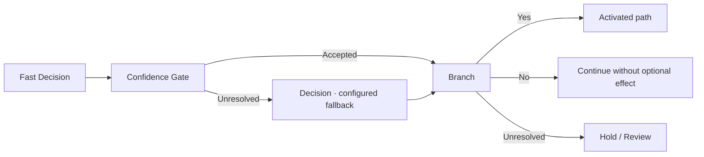

Thresholds, maximum fallback calls, and default error policies have not been settled. A timeout or bad response is a request failure, not a trustworthy “No.” A low-confidence answer is not necessarily a request failure. Both may reach review, but the trace should distinguish them.

### 5.7 Branch and decision batching

**Branch inputs:** A checked Condition or decision result and the artifact being routed. **Outputs:** Activated Yes/No/Unresolved paths, or choice-labeled paths. Only the selected path executes its downstream side-effecting work.

An independent **Decision Batch** is a proposed convenience: several questions about the same frozen state can share a request where the provider supports it. “Is Mira present?” and “Is the silver compass mentioned?” may be independent. “Who holds the compass after the transfer?” depends on interpreting the transfer and may need a later stage. Batching must not erase that dependency or manufacture a holder from a decision asked too early.

## 6. Collections, joining, randomness, and pending outcomes

### 6.1 For Each and Collect

**For Each inputs:** An ordered list of events or records and a bounded body. **Outputs:** One result per entry, including skipped, unresolved, or failed status as appropriate. **Collect inputs:** Those results. **Outputs:** An ordered collection and completion report.

The body needs a stable item identity and access to shared read-only Context. Two wand uses produce two body invocations. A turn with none produces a completed empty collection. Collect is the barrier before main generation when all relevant effects must inform that reply.

Sequential execution is necessary when later events depend on earlier state, such as a wand changing holders between casts. Parallel processing may be suitable for independent character contributions or unrelated item enrichment. The author or compiler must know which case applies. Bounded list sizes, request budgets, and concurrency limits remain specification work.

### 6.2 Join and Scene Join

**Join inputs:** Declared branch results and a merge policy. **Outputs:** A combined artifact or an explicit conflict. A completion-aware Join must know when an optional path was skipped; it must not wait for an output that will never exist.

A Draft-preserving optional join can return the incoming Draft unchanged when a character branch did not activate. A Data collection join can concatenate compatible records while retaining IDs. These are different operations from merging rival edits to the same sentence.

**Scene Join** is the proposed actor-aware version: integrate authorized dialogue or observable behavior from named characters while preserving common events, other characters, and the player's action. Overlapping contributions require a conflict policy or reconciliation stage. Canvas order should not decide which actor's version silently wins.

### 6.3 Random Pick

**Inputs:** A validated eligible list, selection mode, and occurrence identity. **Outputs:** The selected entry, draw metadata, and source-library revision. **Calls:** Zero model calls; actual randomness comes from the runtime.

Uniform and weighted selection are proposed options. Repeat-allowed, no-immediate-repeat, or no-replacement modes may be useful, but their state scope and reset rules are unresolved. The basic requirement is one saved selection per actual wand use. A model may explain or narrate the selection; it must not substitute a plausible-looking choice for the random draw.

Validate all weights before drawing. A negative, nonnumeric, or empty eligible library should fail visibly. Exact zero-weight handling and normalization conventions need a specification. The example later uses positive integer weights that sum to 100 for clarity; no requirement that all libraries total 100 has been settled.

### 6.4 Saved Outcome and Stage Outcome

**Saved Outcome inputs:** Event ID plus scope. **Outputs:** Existing pending or accepted outcome, absent result, or inconsistent/stale status. **Stage Outcome inputs:** Event, selected/generated result, and proposed consequences. **Outputs:** A pending outcome record bound to that occurrence.

These capabilities protect retries. If the draw was a wild surge and effect invention failed, retry that invention step against the same chosen wild-surge entry. If invention already succeeded, reuse the generated effect rather than calling the author model again. A redraw is a separate deliberate operation if the product eventually supports it.

The record should identify the library snapshot and the authoring model/request where applicable. Saving an invented outcome per event does not add it to the user's effect library. Editing the library later must not rewrite what happened in an earlier cast.

## 7. Character scope, item ownership, and memory nodes

### 7.1 Scene Cast / Character Presence

**Inputs:** Relevant scene evidence and confirmed participant state. **Outputs:** Present/absent/unresolved actor records, with evidence and identity. **Calls:** Deterministic when authoritative state is available; Decision or Fast Decision for semantic interpretation when configured.

Presence means participation in the current scene, including explicit entrances and exits. A character mentioned in a letter, remembered in dialogue, quoted, or discussed from afar is not automatically present. A fast detector can help classify evidence, but it should not turn an ambiguous reference into confirmed scene state without a policy.

Character selectors should use stable identity where available. A display name alone can be ambiguous across aliases, impersonation, or multiple versions of a character. Presence updates and entrance events are related outputs, not the same activation policy.

### 7.2 Character Direction

**Inputs:** One actor record, that actor's system instructions, permitted Context, shared scene constraints, and optionally the Draft being augmented. **Outputs:** Actor-scoped dialogue or observable contribution plus preservation checks. **Calls:** One scoped model request per activated actor, within configured bounds.

This meets the request to apply a separate system prompt to one character only while they are in the scene. The separate call receives the character instructions as its system direction. Its output scope is that character, rather than the entire scene. It must not rewrite the player's choices or overwrite another actor's contribution.

Putting a character-specific instruction into the shared SillyTavern system prompt can guide the main model, but it does not provide literal isolation. The isolated interpretation requires a separately scoped request and checked merge. Which use cases can rely on guidance alone versus a separate contribution node should be clear in the UI.

An example actor instruction is: “Mira conceals fear behind dry, practical advice. Write only her dialogue and observable behavior. Do not narrate her private thoughts.” Her contribution might be a terse comment about keeping the lantern steady. The merged scene retains everyone else's actions and the agreed outcome.

### 7.3 Current Holder

**Inputs:** Item identity, event position, and confirmed inventory/transfer state with supporting evidence. **Outputs:** The actor actively holding the item, unresolved result, or explicit multiple/contested status.

The holder is not necessarily the speaker, item owner, person who last named it, or character associated with its lore. “Elias mentions the silver compass” while “Mara holds it” resolves to Mara. “Mara once owned the compass” does not prove she now holds it.

Proposed relationship choices include held, equipped, carried, and owned. The user's requested memory specifically targets the active holder. If a transfer occurs inside a turn, event ordering determines which actor held it at the mention or use. Unknown state routes to clarification, semantic resolution, or review; the node should not pick the nearest name as a hidden fallback.

### 7.4 Item Mention Trigger and Item Use Trigger

**Mention inputs:** Explicit watched source, canonical item plus aliases, and activation policy. **Outputs:** Attributed mention events. A literal alias matcher can be deterministic; entity disambiguation may use a decision stage.

**Use inputs:** Explicit watched source, target item, actor constraints, scene/state evidence, and configured semantic checks. **Outputs:** Attributed candidate-use records for an external confirmation stage, or distinct confirmed actual-use events when the detector's built-in checks are configured and sufficient. Only confirmed events activate outcomes. Discussing, remembering, threatening, or planning a cast is not an actual use. “He raises the broken wand and casts at the chest” is materially different from “If the lock resists, I could try the broken wand.”

The detector should expose evidence for each occurrence. Two casts separated by a transfer should retain their separate actor and holder state. If the workflow watches an ST Draft, it must also decide whether the model is allowed to introduce a new use or whether that would violate the player's selected action. Pre-generation player-action detection avoids some ambiguity; after-generation detection remains useful for authored NPC actions.

### 7.5 Prompted Memory and Character Reaction

**Prompted Memory inputs:** Trigger event, resolved holder, supplied prompt, relevant memory/state, and permitted scene evidence. **Outputs:** A recalled memory, new memory proposal, unresolved result, and any actor-scoped reaction direction. **Calls:** A configured model request when synthesis is needed.

Proposed modes are **Recall existing**, **Create new memory**, and **Recall or create**. These are design options rather than approved default settings. Recall must retain the existing record's identity and source. Creating a memory invents character history; it requires that the workflow author permit that behavior and marks the output as a proposal until accepted.

**Character Reaction** takes the holder's memory and scene scope, producing that actor's authorized observable response or guidance. It should distinguish internal recollection from what other characters can know. A private memory may influence a hesitation without being printed as a player-visible fact or shared with every actor model.

New memory identity and activation identity should prevent duplicates during retries. Publishing a recollection does not necessarily mean creating another copy of its underlying stored memory. Whether a reviewed memory survives rejection of the narrative is an explicit settlement policy, not an incidental order of node execution.

## 8. Presentation and final settlement nodes

### 8.1 Compose, Combine, and Append

Compose already supplies structured text assembly in the current system. The unified proposal adds a checked path for assembling reply content while retaining the Draft as the authoritative narrative source.

**Combine inputs:** An identified Draft plus ordered Text/Data renderings, placement settings, and preservation constraints. **Outputs:** A successor Draft and assembly report. **Append** could be a Combine mode or a separately named node; that UI choice is open.

The requested append behavior adds notes after the revised prose. It must not apply the base reply to chat merely to obtain a new snapshot before assembly. Sections should have stable identities so a retry replaces the workflow's pending section rather than appending it repeatedly. Exact behavior when processing an already-augmented manual snapshot needs separate rules.

### 8.2 Render Notes

**Inputs:** Player-visible records, template, and optional disclosure policy. **Outputs:** Text or a supported presentation fragment, with record provenance. **Calls:** Zero for templating; optional model wording should be an explicit prior step.

The requested dropdown can use a host-supported collapsible section. A proposed Markdown/HTML rendering is:

```html
<details>
<summary>Scene notes</summary>

- Silver compass: Mara holds it; its needle points toward the harbor.
- Broken wand: its last cast produced paper moths around the chest.

</details>
```

This is a presentation example, not a guarantee of identical rendering under every SillyTavern theme or sanitizer. A node should support a safe fallback format when the host cannot render the chosen fragment. The renderer must escape untrusted field values rather than letting an item name become executable markup.

Notes should distinguish confirmed facts, character claims, hypotheses, and generated suggestions. A private-memory destination is separate from the public reply dropdown. A hidden-world-state record should not become visible simply because it shares the same Data structure as a player-facing inventory entry.

### 8.3 Review / Publish and accepted consequences

**Inputs:** Final assembled Draft/Candidate, source identity, pending outcome records, and authored review policy. **Outputs:** Review state or host publication result plus per-consequence settlement status.

Final review behavior remains open: mandatory review, an author-configured gate, and automatic publication policies have different usability and integration costs. The node should make its behavior concrete in the workflow, and every consequence should share a clear acceptance boundary with the narrative that authorizes it.

Compatible continuation can preserve the original ST reply and apply the final revision as a new swipe, using checked source identity. Staged single publication would require ST to provide an unpublished working reply and publish the assembled result once. The expanded nodes should work conceptually with either architecture, while the chosen host adapter exposes the real behavior. No node should promise atomic rollback or durable persistence without host support.

## 9. Recipe: a separate character system prompt only while present

**Requirement from the discussion:** Apply a supplied system prompt to a single character, only when that character is in the scene.

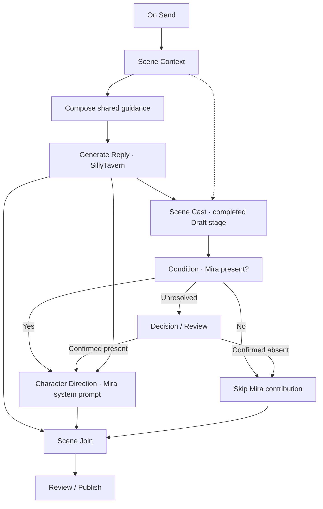

The shown Scene Cast resolves participation from the completed ST Draft at the stage being processed, using the initial Context as supporting evidence. Character Direction waits for that Draft and the affirmative presence route. This lets an entrant become eligible and prevents a character who has exited during generation from remaining eligible merely because the initial scene included them. The contribution must still respect when the actor participates within the scene; an exit does not permit changing actions after departure.

A separate pre-generation variant resolves presence from the initial Context and produces actor-scoped guidance for the main generation instead of merging a finished contribution. Its question is who participates at that preparation stage. In either variant, a branch must not infer presence from a mere later mention in notes, recollection, or quotation.

Suggested Details controls are actor selector, system prompt source, connection, permitted knowledge, contribution scope, presence policy, and unresolved route. These are proposed UI controls. The source of the actor's instructions can be literal Text, an imported file, or a supported Prompt Source read at the root and passed into a subgraph.

The result is one shared scene with a distinctly portrayed actor. A review can inspect the actor contribution separately, see what evidence the model received, and confirm that the merge did not change other actors. For several characters, For Each or independent branches can reuse the same scoped process; shared event reconciliation is required before publication.

## 10. Recipe: an item mention triggers memory for its active holder

**Requirement from the discussion:** When a specified item is mentioned, apply a supplied memory prompt through a model call to the character actively holding that item.

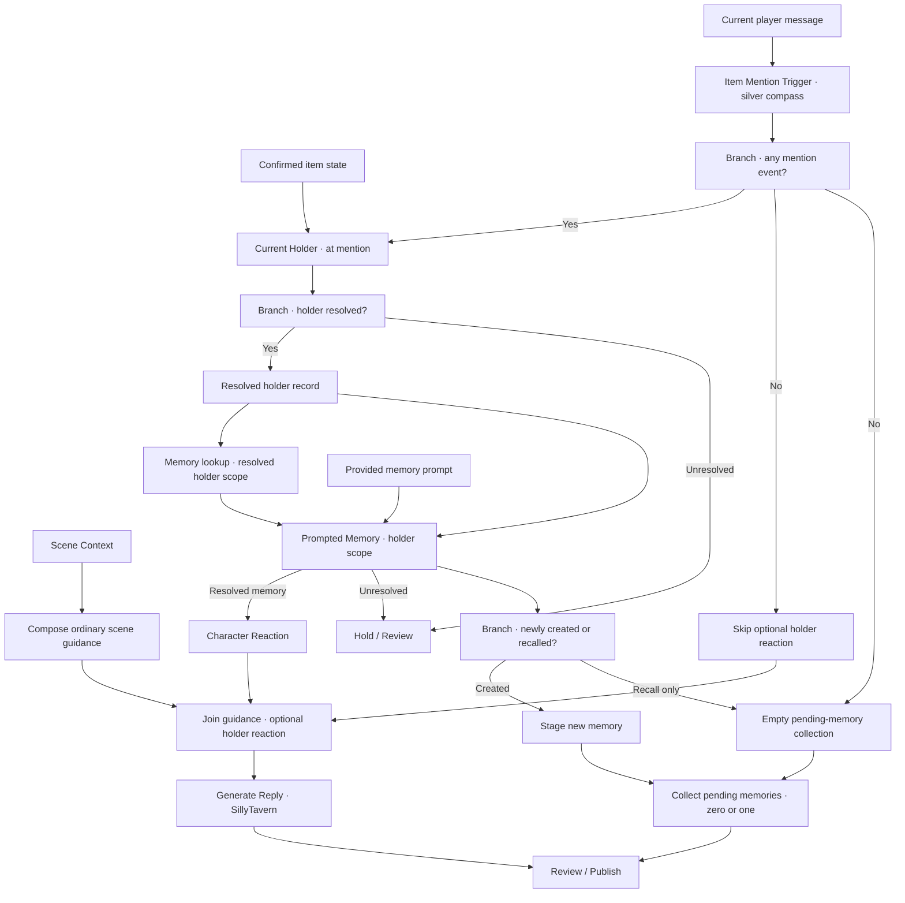

Example: Elias says, “Does that silver compass still work?” Mara is holding it. The prompt asks the holder to recall a relevant emotional association without contradicting established history. Mara recalls her father's farewell at the harbor. The reaction can show her thumb brushing a worn edge before she answers. The workflow must not assign the memory to Elias because he spoke the item's name.

If the memory already exists, the record is recalled rather than duplicated. If the author permits invention, a new memory is staged for Mara with its trigger and source references. The memory lookup receives the resolved holder, so it reads Mara's scope rather than an unqualified collection of everyone's memories. If no confirmed holder exists, the branch remains unresolved and holds the dependent path; neither the memory nor a resulting actor reaction is fabricated for an arbitrary character.

With zero mentions, the reaction branch completes as skipped, ordinary scene guidance reaches generation, and the pending-memory collection is explicitly empty. Recall-only also supplies an empty pending-memory collection. The final settlement therefore receives a completed collection in all successful paths and never waits for a new-memory output that was not produced.

The shown recipe activates before generation. A post-generation variant watches a selected Draft, produces an actor-scoped reaction contribution, and uses Scene Join to revise that Draft before publication. The watched source and activation scope must be explicit. Once per item per turn may suit this example, while each distinct mention is an available proposed policy. The generated memory's own use of “silver compass” does not create another activation by default. Private memory content must remain scoped: player-visible notes can show an observable reaction or an explicitly permitted recollection, but must not expose other actors' secrets.

## 11. Recipe: the broken wand's random effect, including a wild branch

### 11.1 Requirement and precise behavior

**Requirement from the discussion:** Every actual use of the main character's specific broken wand chooses a random effect from a JSON list or plain text. One eligible entry delegates to a different model to invent an effect not already in that list.

The graph below uses pre-generation detection of the player's action. It resolves every confirmed cast before the main reply is generated. An after-generation variant is possible for NPC actions or effects introduced by the scene, but it must check that those uses were authorized and avoid a circular sequence in which effect narration triggers another cast.

The proposed algorithm is:

1. Freeze the selected effect-library snapshot and scene evidence.
2. Identify attributed candidate uses of `broken-wand-01` by the configured main character, then confirm which are actual uses.
3. Resolve their ordering and actor/item state; return an empty collection if none occur.
4. For each event, reuse a saved outcome when valid.
5. For a new event, make one random selection and save that selection before auxiliary invention.
6. For a fixed entry, resolve its authored effect. For a generated entry, invoke the separate effect-author model.
7. Validate structure and mechanical constraints for each resolved effect. Only generated effects receive exact-duplicate and semantic-novelty checks against the library; authored fixed entries intentionally come from that library.
8. Hold unresolved or unacceptable invention for review or bounded retry of invention. Do not silently redraw.
9. Stage each resolved effect and collect all outcomes.
10. Generate the scene with the resolved consequences, append the wand receipt when uses occurred, and settle accepted outcomes with publication.

A confirmed zero-use result produces a completed empty outcome collection and continues ordinary generation. It creates no pending wand outcome or wand receipt and executes no Random Pick, effect-author call, or effect-novelty judgment. A semantic use-detection call may still be necessary to determine that a mention or threat was not an actual use; only a sufficient deterministic prefilter can avoid that detection request. General prose processing may still run according to the workflow's own configuration.

### 11.2 Full nodegraph

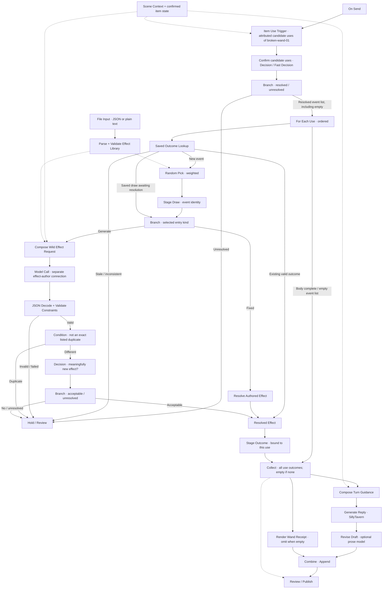

The CHECK box is shorthand for typed confirmation of each attributed candidate, or an independent typed batch where its questions share the same frozen evidence. Decision or Fast Decision answers the confirmation questions; it does not extract an arbitrary event list. An adapter/filter retains each candidate's event ID, evidence, actor, and item identity, and produces the confirmed event collection from accepted answers. A valid empty collection requires no accepted uses and no unresolved candidate; an unresolved candidate holds the dependent path rather than disappearing from the list.

The For Each body is conceptually the cache-through-stage region; Collect waits for all its required outcomes, not merely the first branch that finishes. “Hold” interrupts the dependent generation path until resolution. A bounded author retry would return to the request/author stage with the saved selection; its loop is omitted to keep the main diagram readable. Validation failures do not reach the main scene as accepted effects.

The diagram omits some error edges for readability. Parsing, actual-use CHECK, AUTHOR transport, NOVEL decision transport/validation, and fixed-effect resolution failures all stop dependent execution and surface an error or explicit review hold. They preserve any selection already saved for that event. They must never be converted to an empty event list, a trustworthy “No,” an accepted effect, or a new random draw. A valid unresolved judgment can take the authored review route; that remains distinct from a failed request.

### 11.3 JSON library

The following is a proposed library schema, not a schema already supported by LATTICE:

```json
{
  "itemId": "broken-wand-01",
  "effects": [
    {
      "id": "violet-sparks",
      "kind": "fixed",
      "weight": 40,
      "description": "Harmless violet sparks replace the intended spell."
    },
    {
      "id": "floating-caster",
      "kind": "fixed",
      "weight": 20,
      "description": "The caster floats six inches above the ground for one minute."
    },
    {
      "id": "theatrical-echo",
      "kind": "fixed",
      "weight": 20,
      "description": "The wand theatrically repeats the caster's next spoken sentence."
    },
    {
      "id": "wild-surge",
      "kind": "generate",
      "weight": 20
    }
  ]
}
```

For the final implementation, fixed entries also need explicit mechanical interpretation where the story depends on it: whether the intended spell succeeds, fails, or is replaced; duration; targets; and state consequences. A description-only list can use a configured library policy or an interpretation stage, but those mechanics must be resolved before narration. The example description format keeps the user's simple list usable without pretending prose alone always establishes complete rules.

Validation should reject duplicate entry IDs, unknown kinds, missing fixed descriptions, invalid weights, an empty eligible list, and an item mismatch. The library is frozen for the run. It should not change halfway through two casts because the user replaces the imported file.

### 11.4 Plain-text alternative

An optional parser could accept one entry per line with `weight | description`, and a reserved generated-entry marker:

```text
40 | Harmless violet sparks replace the intended spell.
20 | The caster floats six inches above the ground for one minute.
20 | The wand theatrically repeats the caster's next spoken sentence.
20 | @generate:wild-surge
```

The parser assigns stable IDs within the frozen library revision or asks the author to provide them. The marker is an explicit branch selector, not text passed to the main model to interpret as an effect. Blank/comment-line handling, escaping literal markers, and weight-free uniform lists are useful options but remain open syntax decisions.

### 11.5 Wild-effect author request and response

A composed request can supply the cast evidence, intended spell, current scene, actor and item identity, fixed library descriptions, prior accepted effects if relevant, and the allowed consequence scope. Example instructions:

> Invent one mechanically distinct broken-wand effect that is not any listed effect. Fit the current scene. Preserve the player's selected action and agency. Do not add a second cast, permanent injury, a new secret fact, or an unrelated encounter. State whether the intended spell succeeds, fails, or is replaced. Return the requested structured fields. The effect must end by the scene's end; it may end sooner when the wand is next used.

These limits are an illustrative author policy, not mandatory restrictions for all roleplay. A different campaign may deliberately allow harsher effects. Explicit constraints make that choice authored and inspectable.

```json
{
  "id": "wild-paper-moths",
  "description": "The spell becomes three paper moths that orbit its intended target.",
  "spellOutcome": "replaced",
  "duration": "Until the next cast or the end of the scene, whichever comes first.",
  "consequence": "The target becomes easy to locate, but is otherwise unaffected."
}
```

If the intended target was a locked chest, the lock remains locked; the moths make the chest easy to identify. A prose model can vary the wording while retaining that mechanical consequence.

JSON Decode and field validation check shape, allowed outcome values, bounds, and required fields. Exact duplicate checks catch identical IDs or descriptions. A Decision then compares meaning against the supplied library and author constraints. Semantic novelty is a judgment, not a mathematical guarantee of originality. A different wording of “violet sparks” should not pass merely because its string differs.

Rejected novelty should hold the selected wild event for review or retry its authoring step within an explicit limit. It should not pick a more convenient fixed entry. The accepted invented effect is stored with this cast and can be reused during retries; it is not silently appended to the input JSON file.

### 11.6 Receipt, retry, and multiple-use behavior

```html
<details>
<summary>Broken wand — cast outcome</summary>

- Effect: Three paper moths orbit the chest.
- Intended spell: Replaced; the lock remains locked.
- Duration: Until the next cast or the scene's end, whichever comes first.
- Source: Wild surge, generated for this cast.

</details>
```

A private diagnostic view can include event ID, library revision, selected entry, model request, checks, and settlement status. The public receipt need not expose API details or hidden scene evidence.

Two distinct uses in one player message produce two draws and two outcomes. If one fails author validation, the run should expose which use is unresolved. Sequential effects may influence the next cast, so the loop needs an explicit event-state policy rather than parallelizing by default. If the prose pass fails after effects were resolved, retrying prose preserves the same outcomes. If the user changes the action or rejects the turn, cancellation and invalidation rules decide what pending records survive; these policies remain open.

## 12. Ten additional illustrative flows

These examples expand the discussion's possibilities. They demonstrate the value of unified execution, typed state, explicit model roles, and composed output. They are not ten separately approved shipping commitments. Some require optional domain-specific nodes or reusable subgraphs beyond the initial unification work.

### 12.1 Real dice with a visible outcome receipt

**Flow:** Player action → classify the check → freeze stakes and difficulty → real dice roll → calculate outcome → compose guidance → SillyTavern reply → prose pass → append roll receipt → publish accepted result.

The interesting output is fiction grounded in an actual roll, plus a compact explanation of the result. A success with cost might open the door while breaking the lantern. Stakes and difficulty must be fixed before the draw; otherwise a later model can redefine them to justify whichever outcome it prefers. A mechanical calculator resolves bonuses and thresholds; the model narrates. Retry reuses the roll for the same action. New actions need new identities. The receipt can show roll and cost without revealing hidden difficulty if the campaign intentionally keeps it secret.

### 12.2 An ensemble scene with separate perspectives

**Flow:** Scene Context → resolve cast → restrict knowledge per actor → main generation → parallel character contributions → reconcile shared events → intercut or merge → publish.

The output can shift between a guard, a conspirator, and a traveler while preserving one timeline. The guard hears the sudden silence but does not learn the hidden letter's contents. Each actor model receives only appropriate knowledge and a scoped system prompt. A common event ledger anchors their contributions so they do not independently invent incompatible door positions, injuries, or departures. Parallelism is appropriate only for independent contributions; contradictory versions need an explicit scene reconciliation stage. Player notes can show observable perspectives without leaking private plans.

### 12.3 A mystery evidence board that distinguishes claims from facts

**Flow:** Investigation action → main reply → extract observations and testimony → attach provenance → propose hypotheses → check contradictions → filter spoilers → render evidence board → publish.

The interesting output is a board divided into **observed**, **claimed**, and **possible** records, with links to their source scenes. A witness saying the lighthouse was empty is a claim, not confirmed world truth. A hypothesis model can connect footprints to a wet cloak without making the culprit canonical. Hidden solution state remains separate from player-visible evidence. A contradiction check can flag incompatible testimony while permitting intentional lies. State changes should record accepted evidence, not promote every generated theory into established history.

### 12.4 Downtime with active factions

**Flow:** Confirm elapsed time and world state → simulate faction actions → resolve resource/conflict constraints → prepare arrival guidance → generate scene → select discoverable developments → publish and commit accepted world changes.

The player returns to find a closed market, a new notice, or a shifted patrol route. Faction models can produce separate proposals, while a resolver ensures both sides did not spend the same scarce resource or independently capture the same location. Hidden agreements stay hidden until discoverable evidence enters the scene. The public reply includes consequences the player can encounter; private world records preserve the rest. The simulation needs a bounded time step and explicit acceptance policy, preventing every narrative retry from advancing the world again.

### 12.5 Exploration that grows a map

**Flow:** Known map plus current location → exploration guidance → generation → extract landmarks and exits → validate spatial relationships → merge confirmed discoveries → render map or location cards → publish.

The output can include a usable location card and a map update showing newly confirmed connections. A suspected tunnel and a traversed tunnel should have different status. A model can propose evocative landmarks, while structural checks prevent impossible connections or contradictions with the existing map. Unvisited rooms and secret routes are not automatically shown. Acceptance commits only discoveries supported by the final scene. Rendering an actual graphical map is a separate presentation capability; the basic unified flow can start with structured cards and links.

### 12.6 A puzzle with a checked solution and graded hints

**Flow:** Puzzle constraints → construct mechanism and private solution → deterministic solvability check → guidance → generate presentation → render puzzle artifact → graded hint branches → validate player answer → publish consequences.

The interesting output is a puzzle players can solve, rather than atmospheric prose whose solution changes later. A deterministic checker should validate the proposed puzzle before it reaches the scene when the puzzle type permits one. The answer key remains separate from player-visible artifacts and notes. Hint levels reveal progressively more information through explicit conditions. A model can phrase clues, but its assertion that a puzzle is solvable is not a substitute for the checker. Specialized validators are optional extensions, not part of a promised universal puzzle engine.

### 12.7 Alternate takes that share the same outcome

**Flow:** Native SillyTavern generation → freeze its shared events and results together with the player action → branch into tone models → validate event equivalence → present alternatives → choose one → assemble final reply → publish and settle only its state proposals.

The output might offer a restrained, lyrical, or brisk rendering of one scene. All alternatives retain the same cast outcomes, item transfers, and player actions. A variant that secretly changes the result is rejected or marked as a different branch requiring separate approval. The chooser can be a review UI rather than a model. Unselected prose should not create memories or world changes. This recipe illustrates why pending state and revision provenance matter even when every model is simply “rewriting the scene.”

### 12.8 Crafting with a receipt and specialist detail

**Flow:** Selected recipe and confirmed inventory → calculate costs/result constraints → guidance → generation → specialist enrichment → render experiment or crafting card → publish and commit materials once.

The output can show an unusual potion, its observed properties, consumed materials, and a suggested future trial. Inventory math belongs to a deterministic operation where rules are known. A specialist model can add sensory detail and permitted uncertainty without inventing free ingredients. Suggestions for the next trial do not consume resources now. The crafting event identity protects against double debit during retry. Failed crafting, partial results, and uncertain properties can be explicit records rather than narrative assertions that accidentally become permanent inventory facts.

### 12.9 A scene told through documents and messages

**Flow:** Scene evidence → choose artifact formats → generate shared events → create letters/notices/tickets/messages through scoped voices → check chronology and knowledge → bundle and publish.

The output becomes a packet of in-world artifacts: a station ticket, an official notice, a hastily written message, and a witness account. Each artifact has an author, timestamp, audience, and source scope. A chronology checker catches a notice referring to an event that has not occurred. Knowledge checks prevent an ordinary clerk from describing a secret conversation. Intentional contradictions remain possible because statements are attributed claims, not automatically world facts. Format-specific rendering is optional; Text plus templates can already express much of the idea.

### 12.10 Campaign callbacks with thread tracking

**Flow:** Stored promises, unresolved threads, and accepted scenes → match relevant callbacks → compose callback guidance → generate reply → validate continuity and actor knowledge → link the new scene → stage thread update → publish.

The output can bring back an earlier promise in a way that fits the current location and cast. A callback to a debt is an opportunity or reminder; it does not mark the debt paid. A continuity checker verifies that the actor actually knows about the prior event. The public notes can link the earlier scene while private records retain sensitive context. Thread state changes only when the accepted scene supports them: **renewed**, **advanced**, and **fulfilled** need distinct evidence. Retry should not close a thread merely because one discarded draft resolved it.

## 13. Format, file mutation, and projected collections

### 13.1 Separate the record from the write operation

The new persistence examples need two decisions that should remain visible. **Format** determines the record schema, field mapping, validation, and serialization. **Write to File** determines which target is changed, how it is changed, and when the mutation is accepted. Selecting JSON as a format does not imply replacing a file, and choosing “append” does not define the record's fields.

**Format inputs:** Structured Data, a named record schema or configured field mapping, and optional rendering settings. **Outputs:** Validated record Data and a serialization descriptor or preview. It should report missing required fields and type mismatches. If the input is free prose, an Extract stage or model call must first derive the fields; changing a filename extension from `.txt` to `.json` does not turn prose into structured records.

**Read File inputs:** An explicitly configured supported target. **Outputs:** Frozen contents, parsed document when applicable, and a **fileRef** for the exact target and observed revision. This proposed operation differs from today's File Input, which imports a portable content snapshot. An imported snapshot does not by itself authorize writing back to the original disk file.

**Write to File inputs:** Validated records or a prepared document update, the authorized fileRef or explicitly configured creation target, mutation controls, and settlement policy. **Outputs:** A staged mutation or write result with truthful status. The path to be changed should be selected through an authorized target/backend, not inferred from a character name or unchecked text returned by a model.

### 13.2 Mutation modes

| Proposed mode | Meaning and required checks |
| --- | --- |
| Append Text | Add Text to a `.txt` or `.md` target with an explicit separator. It needs a policy for empty files and whether a trailing separator is added. This alone does not provide record-level deduplication. |
| Add Entries | Add validated records to a selected JSON collection, such as `/souls` or `/memories`, retaining the rest of the document. |
| Add Unique Entries | Add records only when their stable identity is absent. An identical existing record is a no-op; the same identity with different content is a conflict. |
| Upsert by Key | Add a missing keyed record or update an existing one according to a declared field policy. It is an intentional overwrite capability, unlike treating a conflicting duplicate as harmless. |
| Update Fields | Change selected fields while preserving unselected fields, records, and collections. The field set and source revision must be explicit. |
| Replace Contents | Replace the target contents deliberately. This is suitable for a complete prepared document, not a hidden consequence of selecting JSON format. |

For a JSON document, “append” means updating the chosen array and serializing a valid complete JSON document. Raw concatenation of objects after the closing brace is invalid JSON. A JSON Lines backend can literally append one serialized record per line, but it has a different document contract. CSV requires choices about headers, column ordering, quoting, embedded newlines, and schema changes. These formats and backend guarantees remain open implementation choices rather than automatic promises.

The simple graph `Extract → Format → Write to File (Add Entries)` can internally perform the checked collection update. It does not need a separate Update Collection node for every use case. The user should still see the target collection, schema, identity policy, and resulting change.

### 13.3 Optional pure Update Collection

**Inputs:** Parsed document, validated records, collection selector, and mutation policy. **Outputs:** A projected document, change report, and mutation plan. **Side effects:** None.

Update Collection uses the same Add Entries, Add Unique Entries, Upsert, or Update Fields semantics as the persistence node. Its purpose is to let later nodes inspect the result before writing. A soul sword can count its projected ledger and determine whether it crosses a level threshold. A review can show additions and conflicts before acceptance.

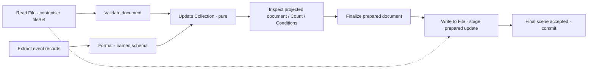

A prepared update must be persisted once. If Update Collection has already added the records to a projected document, Write to File must consume that prepared update or replace the checked document revision. It must not run Add Entries again against the already-updated document. The mutation plan and target revision make this distinction explicit.

### 13.4 Identity, revisions, and commit timing

Proposed controls include target fileRef, collection selector, record schema, identity key such as `eventId` or `recordId`, duplicate policy, missing-file policy, initial document template, and commit timing. A missing collection or file should not be silently invented with an arbitrary schema. The author can explicitly choose creation and provide the initial template.

Read File's exact target and revision follow the mutation through staging. If the file changed after the read, hold on a version conflict or perform an explicitly configured rebase that preserves concurrent changes and revalidates the plan. Replacing a newer file with the old projected snapshot would lose unrelated updates. Whether a backend can provide compare-and-swap, locking, atomic replacement, or crash recovery must be determined before making such guarantees.

A rebase also invalidates decisions that depended on the old document. Recompute counts, threshold crossings, and milestone eligibility, then revalidate any level-up narration or other dependent Draft contribution before publication. Checking only that the new JSON can be written is insufficient. If the reply has already been published when a conflict is discovered, report partial settlement and enter an explicit repair/review path; do not silently commit changed facts beneath obsolete narration.

For canonical story records, the proposed default is to stage the change and commit when the final selected reply is accepted. Earlier drafts, reread history, rendered receipts, and notes do not create new events. A retry uses stable identities and does not duplicate accepted entries. A replacement alternative or corrected accepted scene needs an explicit supersede/correction policy; a later swipe is not automatically another kill or kiss.

Supported storage could be a host-managed store, extension-owned files, an explicitly authorized local directory, or another backend. This document does not choose one, promise arbitrary disk access, or assume multi-file transactions. The run trace must distinguish staged, committed locally, confirmed durable, conflicted, and failed states as supported. A successful request to the host is not sufficient evidence for a durable-save claim.

## 14. Recipe: a soul sword that levels at one hundred captured souls

### 14.1 Event and ledger contracts

The sword's progression is an event-ledger problem. The workflow must detect a real, attributable killing or soul capture by the exact weapon, not a mention, threat, recollection, or imagined victory. Victim, weapon, actor, and scene identities remain distinct. A victim defeated by a different weapon should not be counted just because the soul sword appears in the scene.

A proposed initial JSON document is:

```json
{
  "schemaVersion": 1,
  "swordId": "soul-sword-01",
  "swordLevel": 1,
  "souls": [],
  "milestones": []
}
```

A named capture-record schema can require:

```json
{
  "eventId": "scene-042:capture-01",
  "victimId": "wraith-07",
  "weaponId": "soul-sword-01",
  "sceneId": "scene-042",
  "source": {
    "chatId": "story-2",
    "messageId": "assistant-042",
    "swipeId": "swipe-042-a",
    "revisionId": "draft-042-r2"
  },
  "soulsCaptured": 1,
  "summary": "The soul sword captures the defeated wraith's soul."
}
```

These are illustrative proposed schemas. Stable event IDs identify the accepted occurrence across narration retries; source fields identify the evidence revision and should not themselves make every prose revision a new capture. Victim identity helps distinguish two genuine kills from two descriptions of the same kill.

Use **Count Entries** only if the schema guarantees exactly one captured soul per record. If `soulsCaptured` can vary, use **Sum** of that validated field. A zero or uncertain capture should not be counted as one because it occupies an array slot. The example's progression metric is total captured souls, with a milestone at 100.

### 14.2 Complete flow and empty path

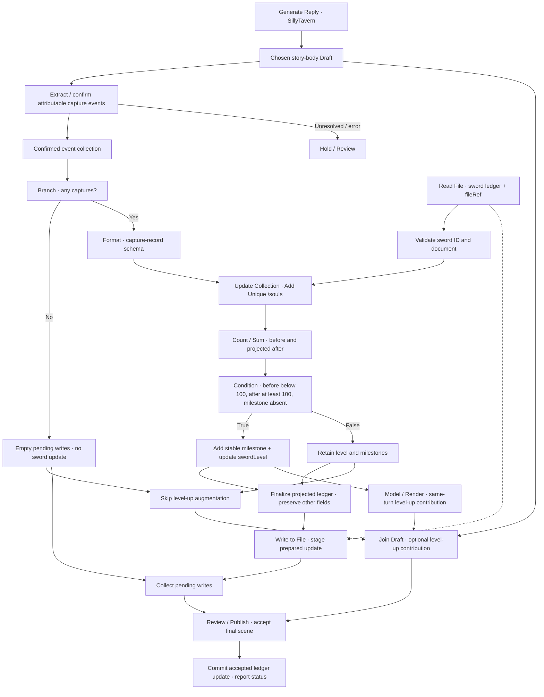

The detection region may combine deterministic weapon filters with Decision or Fast Decision confirmation of candidate events. Typed decisions confirm propositions; an extractor/adapter retains the attributed event records. Unresolved candidates cannot be silently dropped to manufacture an empty collection.

Every valid no-capture run supplies both a completed empty write collection and a skipped level-up contribution. Ordinary reply publication continues. Threshold false still writes legitimate new captures when there are any; it merely skips the level change. Validation, duplicate conflicts, uncertain attribution, or write-preparation failures hold dependent execution. Omitted error edges follow that rule.

### 14.3 The crossing is measured against the projected ledger

Let `before` be the accepted ledger count and `after` the count after Add Unique Entries. The milestone condition is:

```text
before < 100 AND after >= 100 AND milestoneId is absent
```

The milestone identity can be `soul-sword-01:souls:100`. An illustrative record is:

```json
{
  "milestoneId": "soul-sword-01:souls:100",
  "threshold": 100,
  "levelBefore": 1,
  "levelAfter": 2,
  "triggerEventIds": ["scene-042:capture-01"]
}
```

If the sword moves from 99 to 100 in this reply, the workflow can narrate the level-up in the same reply. It does not need to wait until the next turn reads the file. The model or appended section receives the projected outcome, while the file mutation remains pending until that final reply is accepted. The augmentation must preserve the capture facts it depends on.

When souls, milestone, and sword level live in the same file, finalize one prepared document update containing all three changes. Do not append souls in one step and later save a stale full document that loses them. Other fields and earlier records are retained. A separate sword-state file would introduce another consistency problem and is not assumed to be transactional.

If a rebase changes the count or reveals an existing milestone, recompute both the threshold condition and the proposed upgrade. Before publication, revise or remove the level-up contribution if the rebased ledger no longer authorizes it. After publication, a conflict is visible partial settlement requiring repair/review; a changed write must not quietly leave the published reply describing a different progression result.

Two true kills produce two distinct capture entries. A retry of either event is a no-op for an identical existing record and must not award the milestone again. Conflicting content for an existing event ID needs review or an explicit correction policy. Canonical alternatives count once under that policy; selecting another stored swipe does not automatically capture another soul.

Deleting or superseding a capture later does not automatically define how a level should be reversed. Reversible progression, historical milestone retention, and recalculation are open product choices. The initial rule prevents duplicate awards; it does not promise a universal undo system.

## 15. Recipe: one kiss creates two distinct private memories

### 15.1 Shared event, separate reflections

The workflow processes the chosen story-body Draft at a named stage, before notes and diagnostic receipts are appended. Scene Cast confirms that both actors participate at the occurrence, and a semantic confirmation checks that an actual kiss happened. A recollection, hypothetical, plan, quoted story, or failed attempt is not automatically an actual kiss.

The event has one shared stable identity. Each actor gets a distinct reflection record keyed by event plus actor, for example `scene-057:kiss-01:mira` and `scene-057:kiss-01:elias`. The shared facts can match while the feelings differ. Two actor-specific model calls receive their own permitted private context rather than a pooled file of everyone's inner thoughts.

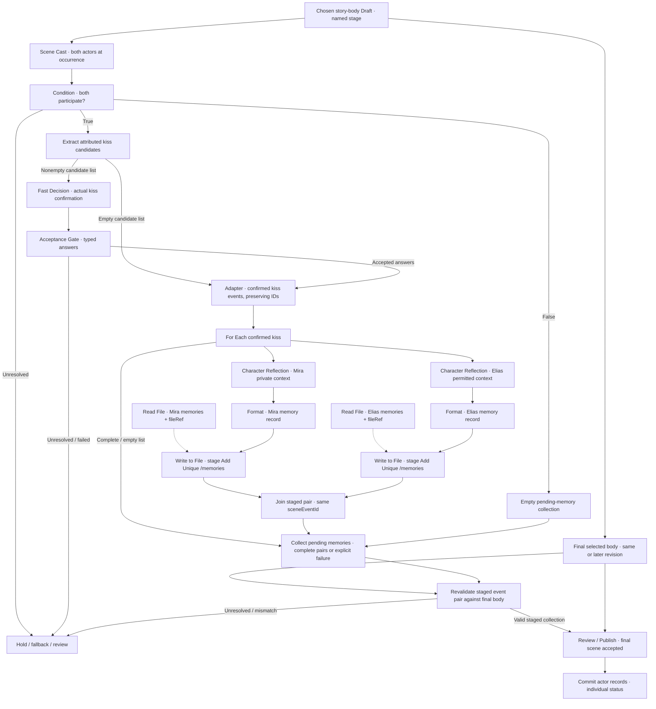

The Fast Decision region asks typed confirmation questions about candidates; it does not generate an arbitrary event array. Its adapter preserves candidate evidence and identities. An empty candidate list bypasses Fast Decision entirely and completes an empty confirmed-event collection without sending an empty question request. Presence false or a valid confirmed no-kiss result also yields an empty collection and ordinary publication. A request failure is distinct from No even though both failure and unresolved routes may lead to a review hold. An explicit Decision fallback can resolve uncertainty where configured.

For multiple kisses, For Each produces a pair per distinct occurrence. Empty input completes without character-reflection calls or writes. Both writes must be prepared or explicitly resolved before a successful pair reaches publication; a skipped actor output is not a substitute for a required reflection.

The pending pair must still match the final selected story body. If a later prose revision changes, removes, or supersedes the kiss or its participants, revalidate the staged records and hold, rebuild, or discard them under the correction policy before acceptance. Notes and diagnostic receipts cannot be used as substitute evidence that the kiss occurred. An unchanged accepted event can retain its stable identity through wording revisions.

### 15.2 Record format and authorship

A proposed memory file starts with `schemaVersion: 1`, an `actorId`, and a `memories` array. A record can be:

```json
{
  "recordId": "scene-057:kiss-01:mira",
  "sceneEventId": "scene-057:kiss-01",
  "actorId": "mira",
  "otherActorId": "elias",
  "sceneSummary": "Mira and Elias share a kiss by the harbor after their conversation.",
  "reflection": "Mira associates the moment with relief after a difficult parting.",
  "reflectionOrigin": "model-authored",
  "visibility": "actor-private",
  "source": {
    "chatId": "story-2",
    "messageId": "assistant-057",
    "swipeId": "swipe-057-a",
    "revisionId": "draft-057-r3"
  },
  "tags": ["first-kiss", "harbor"]
}
```

The partner's record uses its own `recordId`, actor scope, and reflection. `sceneSummary` states shared accepted facts. `reflection` is a separate interpretation with an origin such as **source-provided**, **inferred**, or **model-authored**. Calling a reflection a memory does not make inferred feelings established facts about a player-controlled actor.

An authorship setting should determine whether the workflow may invent inner feelings, only retain supplied feelings, or record observable behavior without asserting private thoughts. Player-controlled actors particularly need that distinction. The example's model-authored reflection is appropriate only when the author permits it. Tags such as `first-kiss` need supporting history or an explicit author instruction; the model should not declare a first occurrence from a short context window alone.

Add Unique Entries uses `recordId`, while `sceneEventId` connects the pair. Identical duplicates are no-ops. Changed reflections under the same ID require an explicit overwrite/correction policy rather than being silently appended as another memory. Both records retain provenance even if their public scene summary is similar.

Each Read File validates the document schema and destination `actorId`; each formatted record must match that actor scope before staging. The corresponding fileRef carries the exact file and revision to that actor's write. A display-name change or a model-provided path must not redirect Mira's record into Elias's file. The reflection models receive separately selected permitted actor Context in addition to the shared event; the diagram's model labels abbreviate those explicit Context inputs.

### 15.3 Two files are not automatically one transaction

Staging the pair permits review before either file changes, but two backend writes can still partially succeed at commit. If Mira's record saves and Elias's write fails, report those separate statuses. Retry only the missing or failed record using the same IDs; do not rewrite a successful record unnecessarily or invent a second kiss.

A backend that offers transactional multi-record storage could provide a stronger pair guarantee, but that is an optional backend capability. Ordinary file targets must not be described as all-or-nothing unless the implementation supports it. The accepted scene and pending persistence repair may consequently have different status. The companion summary should govern how those statuses appear in the unified run lifecycle.

## 16. Recall through a hotkey or automatic trigger

### 16.1 One recall activation contract

The same actor-private memories can feed later characterization through manual or automatic activation. A configured hotkey does not itself generate a reply. It arms a visible, cancellable recall intent for a defined chat/profile, workflow, actor set, memory set, and target generation. Keyword, character, or event triggers can produce the same **Recall Activation** payload.

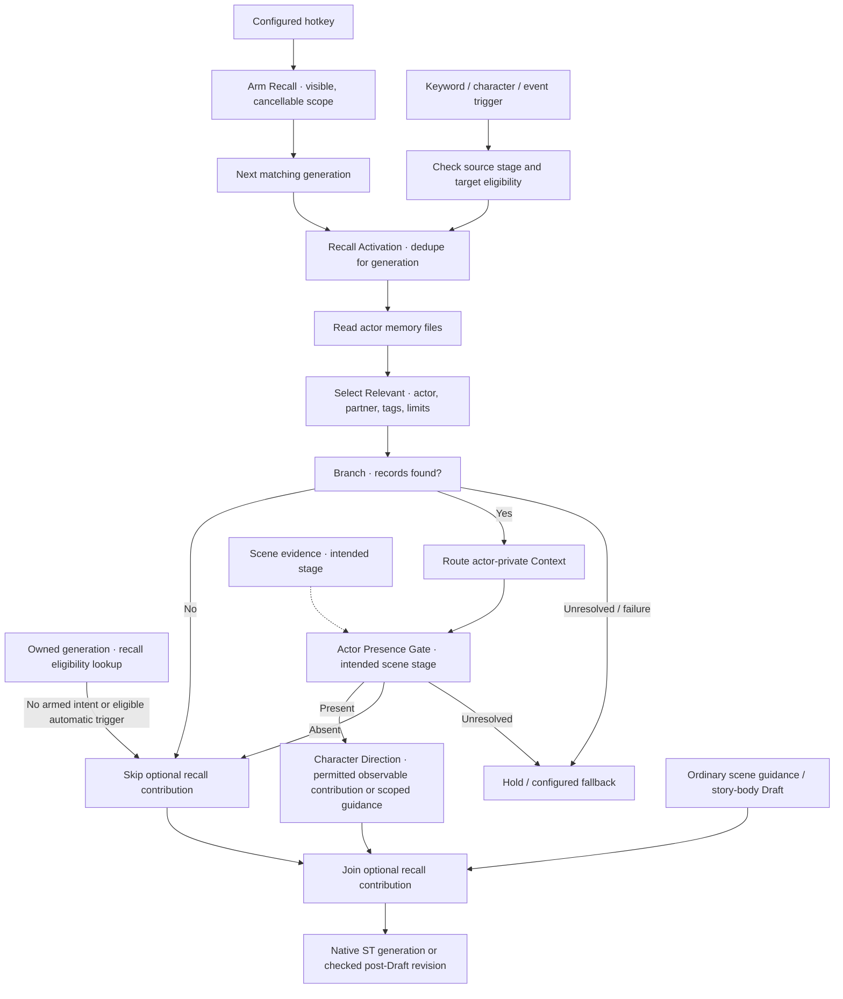

The final box is intentionally stage-dependent. Pre-generation recall can influence the current normal ST generation. Post-generation recall revises an existing Draft through an authorized contribution/merge; it cannot retroactively change the prompt already sent to ST. A trigger first seen in an ST reply can affect post-processing or arm the next eligible generation. A trigger already present in the player's input can affect the current generation when detected during preparation.

For an owned generation with no armed intent and no eligible automatic trigger, recall completes as skipped and the ordinary guidance/Draft join proceeds. It must not wait for a hotkey that the user never pressed. Each Character Direction is also gated on that actor's participation at the intended scene stage; possessing a memory file does not introduce an absent actor. A present actor may recall their own memory involving an absent partner, provided that the partner is not thereby given a new scene contribution.

### 16.2 Target and usage controls are independent

Two controls avoid an ambiguous “use on reply and swipe” setting:

| Control | Proposed options | Meaning |
| --- | --- | --- |
| Target | Reply, Generated Swipe, Both | Which newly generated operation types may consume the armed intent. |
| Uses | Next Match, One per Selected Type, Until Disarmed | Whether the first eligible operation consumes it, each selected type has its own allowance, or it remains armed. |

**Both + Next Match** means the next reply **or** newly generated swipe uses recall once. **Both + One per Selected Type** means one reply **and** one newly generated swipe can each use it. **Until Disarmed** needs an obvious active indicator and a stop control. These are proposed semantics, not current hotkey support.

A newly generated swipe is a generation operation. Selecting an existing swipe is navigation and does not automatically consume recall or create new memories. The visible state could read: **“Recall armed: Mira / Elias · next generated swipe.”** Its scope should prevent accidentally applying Story-2 memories after moving to another chat or profile.

Exactly when the arm is consumed remains open: at generation start, successful recall, or accepted final publication. Cancellation, retries, reload/restart behavior, overlapping hotkeys, conflicting armed intents, and missing files require explicit policies. A retry of the same generation should not accidentally consume another allowance. Manual and automatic activation for the same memory set and generation should deduplicate under a shared identity rather than injecting the same records twice.

### 16.3 Retrieval and private-context routing

**Select Relevant inputs:** Validated actor records, activation scope, current scene, filters, and retrieval budget. **Outputs:** Selected records, omission report, and optional unresolved selection state. Proposed filters include actor, partner, tags, recency, event identity, and explicit user selection. Limits should cover both number of records and token budget. A model-assisted relevance selector is possible, but its call and evidence should be visible.

Read failures are not the same as a valid empty memory collection. An absent file follows the configured missing-file policy; a valid file with no matching records can skip the optional recall branch. Private records remain attached to their actor's permitted context. They should not be blindly injected into the shared ST prompt, shown in public notes, or given to another actor model.

Character Direction can translate a private recollection into permitted observable behavior or scoped guidance: Mira pauses at the harbor rail, or Elias chooses a gentler reply. The process must not assert a player-controlled character's inner feelings without the authorship permission defined in the memory workflow. The public contribution can evoke the shared scene while keeping actor-private interpretations in their own scope.

The recall run should show which records were selected, why, where they were routed, and whether the armed intent remains available. It should separately preview public output and private context so a user can assess both characterization and disclosure before publication.

## 17. Story time, crossed boundaries, and recurring intervals

### 17.1 Story Clock represents time inside the story

**Story Clock inputs:** Accepted clock state or an explicitly configured initial snapshot. **Outputs:** The frozen current story time and its identity/revision. A persistent clock describes the campaign's timeline, not how long the browser has been open or how many real hours passed between user messages. Pausing the application does not by itself advance the story.

An illustrative clock document is:

```json
{
  "schemaVersion": 1,
  "clockId": "story-2-clock",
  "calendarId": "campaign-days",
  "dayLengthMinutes": 1440,
  "absoluteMinute": 360,
  "settledTimeEventIds": []
}
```

In this example, minute 0 starts Day 1, so minute 360 is Day 1 at 06:00. Day and time-of-day are derived from the canonical minute value. A different calendar can use different authored rules, but units, origin, rollover, and invalid dates must be explicit. A model should not silently substitute the computer's date or timezone.

This is a proposed clock schema and capability. The current State modes do not already provide this complete time system. In particular, **State Curve advances by configured steps**, through its recovery phases. One Curve step is not inherently one hour, one turn, or one story day. A rule can deliberately map elapsed story time into curve steps, but that mapping and its rounding must be specified rather than assumed.

### 17.2 Advance Time is an authored proposal

**Advance Time inputs:** Clock snapshot plus an explicit duration, destination time, authored timing rule, or validated extraction of temporal evidence. **Outputs:** Proposed time, the change report, evidence, and any unresolved result. Exact arithmetic makes zero model calls.

“We travel for eight hours” can supply an explicit duration. “Wait until 14:00 tomorrow” can supply a destination under the chosen calendar. An authored rule can assign a known route a two-hour duration. Free prose can pass through Extract and validation when interpretation is needed. Fast Decision may confirm whether a passage explicitly establishes a duration or destination; it is not an oracle for how many hours an unspecified activity probably consumed.

Vague statements such as “a while later” need an unresolved route, an author-defined conversion, or a clearly labeled estimate. An estimate must identify its origin and acceptance policy. It must not become an exact elapsed-time fact merely because it was returned as a number. Contradictory durations, backward movement, and impossible destination times also need explicit handling. Deliberate time travel is a separate authored rule, not ordinary negative elapsed time.

### 17.3 Time Trigger detects crossings

**Time Trigger inputs:** Previous and proposed clock values, a schedule definition, subject/state scope, and the time-event ledger. **Outputs:** Ordered attributed due events with stable schedule-and-boundary identities.

For a due instant, the basic crossing rule is:

```text
previousTime < dueTime <= proposedTime
```

This includes an event reached exactly at the endpoint while excluding a boundary already processed at the start. A daily midnight trigger enumerates the crossed midnights; a daily 14:00 trigger enumerates the crossed 14:00 instants. Each occurrence needs its own identity, such as `midnight-form:day-2`, instead of one permanent “midnight happened” flag.

An illustrative authored schedule includes:

```json
{
  "clockId": "story-2-clock",
  "schedules": [
    {
      "scheduleId": "midnight-form",
      "kind": "daily",
      "minuteOfDay": 0,
      "subjectId": "mira",
      "operation": "set",
      "field": "form",
      "value": "werewolf"
    },
    {
      "scheduleId": "dawn-reversion",
      "kind": "daily",
      "minuteOfDay": 360,
      "subjectId": "mira",
      "operation": "set",
      "field": "form",
      "value": "human"
    },
    {
      "scheduleId": "afternoon-bell",
      "kind": "daily",
      "minuteOfDay": 840,
      "subjectId": "harbor-bell",
      "operation": "record-occurrence"
    }
  ]
}
```

Set the form to `werewolf`; do not toggle it. A repeated evaluation or already-transformed actor must not accidentally become human. Reversion is its own schedule or condition. The authored system also decides whether an offscreen actor changes state, whether only present actors receive observable contributions, and whether a missed observable event is narrated later as history or simply retained in state. A file record or offscreen transition does not introduce that actor into the current scene.

A 14:00 werewolf rule uses the same daily schedule mechanism: set `minuteOfDay` to 840, target the chosen actor, and set `form` to `werewolf`. It can replace the example midnight transformation or be an explicitly separate authored schedule. The bell at 14:00 is only another example event, not a restriction on what a 14:00 trigger may do.

### 17.4 Catch up or interrupt at the next event

Two useful policies have different effects on a long time advance:

| Policy | Proposed behavior |
| --- | --- |
| Bounded ordered catch-up | Enumerate crossed boundaries in time order and resolve them within a configured limit. Simultaneous events use an explicit order or conflict resolver. A limit overflow holds or defers a specified remainder; events are not silently dropped. |
| Interrupt at next event | Advance only to the earliest relevant boundary, resolve it, and return the remaining requested duration. The author decides whether to resume automatically, retain the remainder for the next action, or require a new choice. |

For a 06:00 start and a requested twelve-hour wait, a 14:00 event can interrupt after eight hours with four hours remaining. A catch-up policy can instead process the event and continue to 18:00. Neither behavior should be inferred from a vague “run all triggers” setting. The clock, event ledger, and state projection must agree on how far the accepted scene actually advanced.

Under interruption, the effective clock is 14:00, not the original requested 18:00 destination. Both the effective destination and remaining duration feed guidance or the post-reply revision model as well as settlement. With no due event, the clock still advances to the validated effective destination, and the optional event/state-change collection completes explicitly empty. Unresolved evidence or scheduling failure is not a valid no-occurrence path.

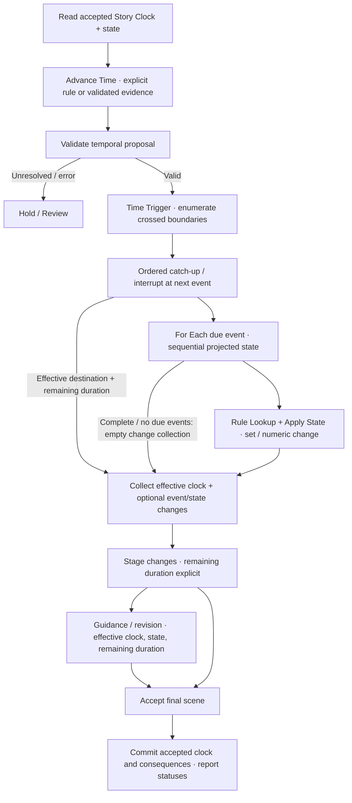

When timing is known before generation, resulting transformations or interruptions can inform normal ST guidance. When elapsed time is inferred from the completed reply, scheduled consequences may require a checked prose revision so the final narrative matches the projected state. A clock update alone cannot retroactively make the original prompt aware of the midnight transformation.

Clock, due-event records, and resulting state remain staged until acceptance. Retrying or generating alternatives starts from the appropriate pre-turn snapshot and reuses event identities; it does not advance an already-projected clock again. How an accepted alternative supersedes earlier canon, how time rollback affects schedules, and how separate storage targets reconcile remain open. File conflict rebasing must recalculate dependent events and narrative as described in Section 13.

The ordered iterator carries projected state from one due event into the next. It begins with the frozen accepted state and returns one final coherent projection; it does not run every transformation independently against the original snapshot or in parallel. Event ledger updates travel with that projection. Schema validation and Format produce a checked clock/state/ledger update before staging writes, and any failure holds the dependent scene rather than masquerading as no due event.

### 17.5 Recurring interval, delay, and cooldown

An **Interval** is a recurring schedule anchored to a story-time origin. A **Delay** is a one-time due event relative to an accepted start event. A **Cooldown** tests eligibility until a defined next-eligible time. These can be modes of the time/condition machinery; they do not necessarily need three new shelf nodes.

For an eight-hour interval anchored at Day 1 06:00, the due sequence is Day 1 14:00, Day 1 22:00, Day 2 06:00, and so on. In minute units, interval 480 and anchor 360 produce `due(n) = 360 + n × 480` for `n = 1, 2, …`. Processing the 14:00 event late at 15:00 does not shift the next due event to 23:00. Cadence stays anchored at 22:00.

An eight-hour delay after one accepted action fires once. An eight-hour cooldown may allow a reward again only at or after the stored eligibility time. These require distinct IDs and state, despite sharing arithmetic. Decision models may help classify whether an authored event occurred; due-time comparison, boundary enumeration, interval multiplication, and cooldown checks remain deterministic.

## 18. Reusable state progression and an XP recipe

### 18.1 Reuse structures instead of a dedicated XP node

The user explicitly clarified that XP should be a recipe built from reusable structures, not a dedicated XP operation. Prefer a mode, extension, or reusable subgraph where existing nodes are sufficient. An optional **Tracker** preset/helper could assemble a useful pattern, but it is not a mandatory new node or another engine.

The current [State operations](../node-reference.md#state) provide foundations: **Value** proposes bounded numeric values; **Track** counts distinct settled event IDs; **Curve** advances step-based recovery toward a baseline. Their current behavior should not be relabeled as full quest adjudication, authored rule execution, or hourly decay. Proposed extensions can build on those contracts while retaining explicit inputs and zero-call deterministic computation.

| Reusable capability | Responsibility |
| --- | --- |
| Event normalization | Convert extracted/confirmed occurrences into validated event records with type, entity IDs, provenance, instance identity, and acceptance status. |
| Deduplication ledger | Determine which stable events were already settled; preserve records needed for correction and replay. Track is a useful foundation, though a full ledger may need richer payloads. |
| Rule Lookup / Rule Table | Select authored rules from Data, a file, or a configured table. This may be a lookup mode rather than a distinct operation. A model does not invent rewards. |
| Apply State / numeric reducer | Compute an add, set, clamp, or other declared update against a frozen state snapshot, preserving unrelated state. Use existing Value or an extension where sufficient. |
| Threshold resolution | Use Condition/Compare for a simple threshold. A reusable threshold mode or helper is justified for enumerating several crossed milestones. |
| Stage and settle | Persist the projected state and ledger only for the final accepted scene, retaining conflict and durability reporting. |

Extraction and semantic confirmation can make model calls. Rule lookup, deduplication, arithmetic, bounds, and threshold calculation do not need a model once the event is known. Failed or unresolved detection is not a reason to apply a reward.

### 18.2 Authored XP rules and identities

An illustrative rule table is:

```json
{
  "ruleSetId": "campaign-progression-01",
  "rules": [
    {
      "ruleId": "quest-completion",
      "eventType": "quest-completed",
      "xpDelta": 100,
      "identity": "questId"
    },
    {
      "ruleId": "repeatable-quest-completion",
      "eventType": "repeatable-quest-completed",
      "xpDelta": 100,
      "identity": "questInstanceId"
    },
    {
      "ruleId": "new-location",
      "eventType": "location-discovered",
      "xpDelta": 20,
      "identity": "locationId"
    }
  ],
  "cumulativeLevelThresholds": [0, 100, 300, 600]
}
```

Quest completion must satisfy the author's completion rule and identify the actual quest. Simply saying “the quest is done” or printing a reward card is not sufficient evidence. A non-repeatable quest settles once by `questId`. A repeatable quest uses a distinct confirmed `questInstanceId`; changing narration or request attempt does not create another instance. Location discovery uses a canonical location identity under an authored first-discovery policy.

The reward table above is illustrative. A campaign can use other values, actor eligibility, shared-party allocation, or prerequisites. Those are authored rules, not free-form suggestions from the main story model. Record the matched rule and rule-set revision with each applied reward.

### 18.3 Projected XP and several crossed thresholds

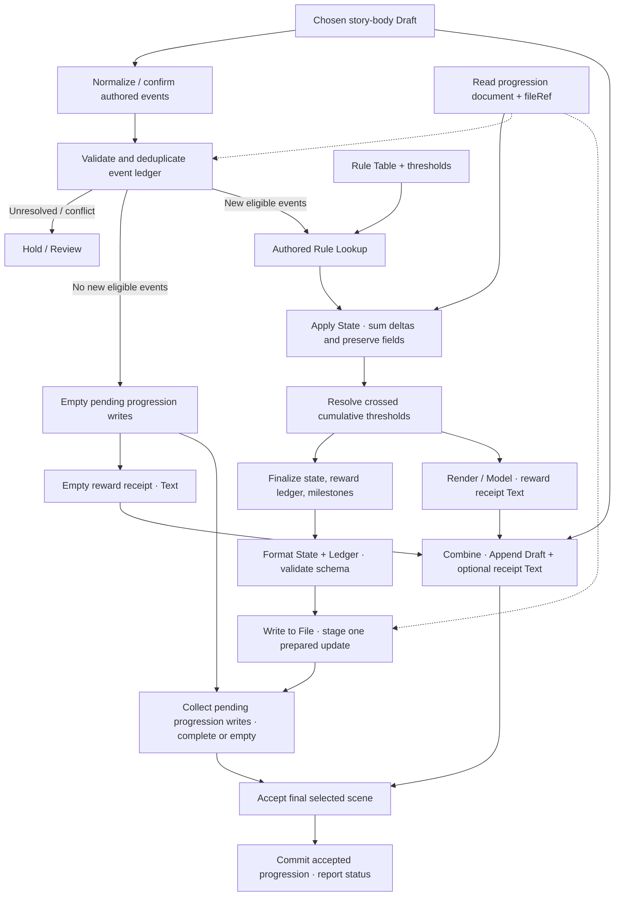

With cumulative thresholds `[0, 100, 300, 600]`, level 1 begins at 0, level 2 at 100, level 3 at 300, and level 4 at 600. Moving from 80 XP to 650 crosses 100, 300, and 600: three milestone crossings, reaching level 4. The threshold resolver must enumerate them rather than increasing level only once because one graph execution occurred. The sum of rewards producing 570 XP in that turn must independently be justified by the authored events and rules; the threshold example does not invent such events.

A simple single milestone can remain a Condition over before/after values. Multiple ordered milestones need a reusable enumeration operation or mode, not an XP-specific black box. Exactly-at-threshold values use an explicit inclusive endpoint policy, and cumulative thresholds must be validated as ordered and unique.

When XP, level, settled event identities, and milestones share a file, produce one projected document and stage one checked write. Do not write XP first, reread a stale level value, and overwrite the new ledger. Rebase conflicts recompute eligible events, totals, thresholds, and dependent reward narration before publication. Conflicts after publication enter visible repair/partial-settlement handling. Negative rewards, level loss, corrections, party allocation, and cap behavior remain authored or open choices; none is silently implied by this example.

The valid no-new-reward path supplies a completed empty pending-write collection and skips the optional reward contribution, allowing ordinary publication. Format validates the projected state and ledger before Write to File consumes the prepared update. A detection, lookup, arithmetic, formatting, or write-preparation failure holds dependent execution; it does not award XP through a fallback that merely generates plausible reward prose.

## 19. A slow-burn relationship recipe

### 19.1 Directed state and separate meanings

Relationships can use the same event normalization, rules, reducers, ledgers, thresholds, and staged persistence. The state is directed: Mira's attraction toward Elias can be 18 while Elias's attraction toward Mira is 31. A single symmetric “relationship score” would erase that distinction.

Persistent attraction and temporary desire/lust intensity can be separate optional fields. Neither is the same as trust, willingness, consent, or an obligation to act. Thresholds can adjust permitted portrayal—hesitation, warmth, attention, or an authored tone change—without compelling a kiss, confession, or sexual act.

An illustrative state record is:

```json
{
  "schemaVersion": 1,
  "relationshipStateId": "story-2-relationships",
  "pairs": {
    "mira->elias": {
      "visibility": "actor-private",
      "attraction": 18,
      "temporaryDesire": 0,
      "trust": 24,
      "settledEventIds": [],
      "sceneAppliedTotals": {},
      "storyDayAppliedTotals": {}
    },
    "elias->mira": {
      "visibility": "actor-private",
      "attraction": 31,
      "temporaryDesire": 0,
      "trust": 42,
      "settledEventIds": [],
      "sceneAppliedTotals": {},
      "storyDayAppliedTotals": {}
    }
  }
}
```

These values are authored or accepted state, not measurements of psychological truth. Actor authority controls whether an automated workflow may infer or invent private feelings, especially for a player-controlled character. The same source-provided/inferred/model-authored distinction used for memories applies here. A player's authored preference can take precedence over an automatic inference; exact override policy needs a specification.

Each directed pair belongs to the subject actor's private scope. Mira's values are not automatically given to Elias's model, inserted into a shared prompt, or printed in notes. Public portrayal uses only an authorized observable contribution. An author-facing tracker preview can expose values under its own permissions without making them shared in-world knowledge.

### 19.2 Small authored changes and pacing rules

A slow-burn recipe can award +1 for an eligible supportive moment or +2 for a more significant authored event. Those deltas come from a rule table. A model can identify candidate events and interpret their context; it should not freely choose a large increase because the prose feels romantic.

Illustrative pacing rules are a maximum positive increase of +2 per stable scene and +4 per story day, numeric bounds 0–100, and optional cooldown or diminishing returns for repeated event classes. These are example author settings, not required defaults. Per-scene identity and story-day boundaries come from accepted scene and clock state; starting a new request or revising a paragraph must not reset the cap.

Attribute each event to its own timestamp/story day, an explicit authored day-attribution rule, or an unresolved route when its timing is unknown. A reply spanning midnight must not assign every gain to the ending day. Process events in order against projected scene/day budgets so a later event sees the allowance already used by earlier events. The chosen attribution rule and evidence belong in the decision report.

The reducer should report raw proposed delta, allowed delta after rules/caps, final bounded value, and the policy that rejected or reduced a reward. A +2 event when a scene has already gained +1 may contribute only +1 under that cap. Whether the unused remainder is discarded, deferred, or never eligible is an authored choice. It must not become a hidden credit automatically collected on the next retry.

A new eligible event capped to a numeric delta of zero is different from having no new eligible event. It can still stage a settled-event, discard, audit, or cooldown-consumption record when the authored policy requires one. A zero change in attraction therefore does not universally imply an empty write collection. Only a path with no required new event/decision/state records can complete as an empty mutation.

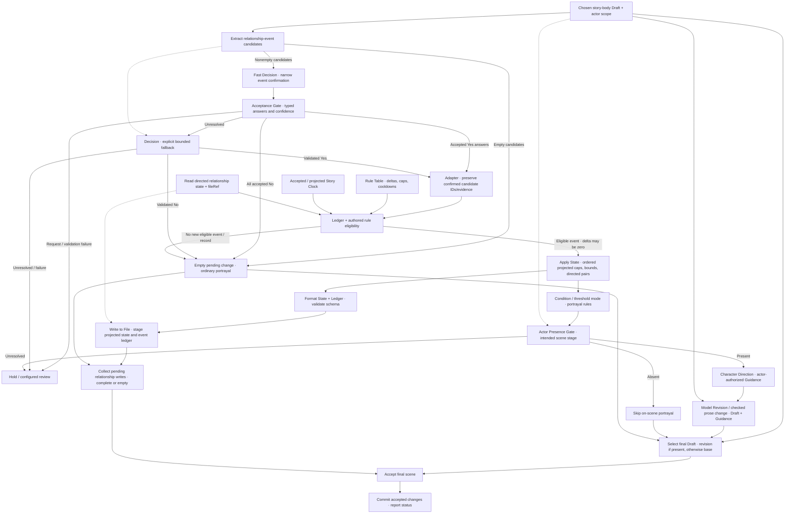

The portrayal branch must respect participation at the intended scene stage, actor knowledge, and the player's selected actions. Offscreen state can be updated only under an explicit rule; it does not authorize adding an absent actor's dialogue. A valid no-change path completes normally. Unresolved events, invalid numeric state, actor-authority failures, and ledger conflicts are distinct from an eligible zero delta.

Fast Decision confirms bounded questions about attributed candidate events; its adapter retains the records and IDs. Accepted No produces an empty change collection. Uncertainty can use the explicitly configured Decision fallback, while transport/schema failures remain failures. Deterministic authored-rule, cap, and cooldown checks still follow confirmation. Character Direction emits Guidance, so the illustrated post-reply route passes that guidance with the Draft into a checked prose revision before joining; raw Guidance is not a Draft. For a pre-generation route, the authorized guidance can instead feed normal ST preparation.

No new eligible event or required record supplies a completed empty write collection and skipped portrayal, so final publication never waits for a Write output that was not produced. An eligible event with zero allowed delta follows the reducer's configured record/consumption policy and may still produce a staged ledger write. Projected private state and the event ledger are formatted and validated before staging. Failures in confirmation, reduction, formatting, or write preparation hold dependent execution and never become relationship rewards.

### 19.3 Avoid echo rewards and distinguish recovery units

A recalled memory, the printed relationship score, a notes dropdown, or repeated narration of an old scene is not a new relationship event. Stable event IDs, authored source selection, and the settled ledger prevent self-reinforcing loops such as a memory causing prose that awards the same affection again. Two directed pairs can evaluate the same shared occurrence under different permitted rules while retaining separate record identities.

Temporary intensity can recover with **State Curve** using explicit steps. Clock-based decay is an optional rule driven by Story Clock, for example a declared amount per completed story-time interval. Those are different units: Curve Steps does not automatically mean elapsed hours. Persistent attraction should not inherit temporary-desire decay merely because both values appear in one file.

Trust and willingness require their own authored meanings and rules if tracked. A high attraction threshold is never evidence that an actor agrees to a particular action. The final scene remains subject to actor authority, player agency, and the workflow's ordinary review rules. File staging also remains tied to the final selected body; later prose changes that remove the qualifying event require recalculation before settlement.

## 20. Details, preview, and run trace expectations

Expanded nodes should make consequential choices inspectable without exposing implementation jargon in the player's reply. Proposed Details controls for trigger nodes are **Watch**, **Match**, **Actor/Item**, **Activation**, and **Unresolved route**. Decision nodes show their question, answer type, connection, and acceptance rules. Model revision nodes show scope and preservation constraints. Random nodes show the library, eligible entries, selection policy, and outcome identity.

A run preview should distinguish:

- Activated, skipped, unresolved, failed, cancelled, awaiting review, and completed nodes.
- Evidence for the trigger and the condition that selected the branch.
- The base generation and every successive Draft revision.
- Exact versus semantic validation results.
- Model connection, request count, timing, and available usage metadata.
- A saved random draw reused during retry versus a genuinely new draw.
- Pending state proposals, accepted local settlement, and confirmed durable persistence where supported.

A preview should also offer the final public reply independently from private diagnostic records. Inspection of a player's notes dropdown is not an excuse to reveal a character's private memory. Source identities and sensitive request contents need appropriate visibility controls.

For file nodes, Details should show backend/target, the read revision, schema, collection selector, mutation mode, unique key, duplicate/conflict behavior, creation template, and stage/commit policy. Preview should distinguish the original document, projected document, and planned changes. A soul threshold shows both before and projected-after values plus its stable milestone identity. A paired-memory preview separates shared scene facts from each actor's reflection and authorship origin, with individual commit results.

For recall, Details should show hotkey binding, chat/profile/workflow scope, memory set, Target, Uses, and consumption policy once defined. The armed indicator must remain visible and cancellable. Run traces distinguish manual from automatic activation while showing their shared deduplication identity, selected record budget, private routing, and whether recall was consumed or retained.

For story time, preview the previous time, requested/proposed time, evidence or estimate origin, ordered due boundaries, active policy, remaining duration, offscreen scope, and staged versus settled clock. Interval controls need anchor and cadence; delay and cooldown controls need their own originating event and eligibility time. Never label a Curve step as an hour unless an explicit mapping is configured.

For reusable progression, show matched authored rule, rule-set revision, event/instance identity, duplicate handling, before/projected-after values, and every crossed milestone. XP is a saved recipe, not a new required node. For directed relationships, preview each pair separately with actor authority, raw/allowed delta, scene/day cap usage, cooldown, bounds, and the portrayal constraint. Private state and public contribution remain separate previews.

The shelf should filter by usable inputs and supported capabilities within the graph, rather than hiding all revision nodes because the root was labeled Pre. Root-only host sources and settlement nodes still require authority rules. A reusable subgraph should receive explicit inputs instead of discovering the current chat on its own.

## 21. Decisions still needed before implementation

| Open choice | Why it matters |
| --- | --- |
| Generic operations versus specialized shelf nodes | Character Direction, Prompted Memory, Render Notes, and effect parsing may be modes or reusable definitions rather than individual operations. |
| Execution/control representation | Branching and skipped joins need runtime semantics, whether represented by ports, events, or compiled regions. |
| Draft/Candidate revision contract | Successive processing must preserve source authority without requiring intermediate chat application. |
| Publication architecture and default review | Compatible continuation and staged single publication have different visible behavior and integration requirements. |
| Trigger defaults and event identity | Once-per-turn memory activation and per-use randomness must remain distinguishable across retry, edit, and regeneration. |
| Collection ordering and conflict policy | Sequential stateful events and parallel actor contributions need different treatment. |
| Pending-state lifetime | Stop, rejection, chat changes, process restart, and generation replacement must specify what is discarded or retained. |
| Fast Decision capabilities and thresholds | Hosted Jev and local Laya need explicit adapter validation, failure routing, and roleplay evaluation. |
| Random policy and reproducibility | Weighted draws, repeat policies, saved selections, and optional explicit reroll require defined scopes. |
| Plain-text effect syntax and fixed-effect mechanics | Simple lists need predictable parsing and an authored rule for incomplete mechanical descriptions. |
| Player-visible disclosure | Notes, memories, faction records, and puzzle answers need separate visibility contracts. |
| Durable persistence reporting | A local host mutation cannot be reported as a guaranteed durable save without supporting evidence. |
| Persistent-file backend and authority | Read File/fileRef and Write to File need a supported target model; imported snapshots do not grant arbitrary write access. |
| Record formats and mutation schemas | JSON collection selectors, JSON Lines, CSV, named schemas, field preservation, and serialization need specified contracts. |
| Version conflicts and prepared updates | Rebase or hold must preserve concurrent changes; a prepared projection must not append its records twice. |
| Accepted-scene corrections | Superseding an accepted alternative requires a policy for event records, paired memories, and progression; level reversal is not automatically defined. |
| Multi-target persistence | Paired actor files need truthful partial-success and retry behavior unless a transactional backend is explicitly available. |
| Reflection authorship | Source-provided feelings, inferred interpretations, and model-authored inner states need distinct permissions, especially for player-controlled actors. |
| Hotkey target and consumption | Reply versus generated swipe, allowance counts, cancellation, retries, restarts, conflicts, and active scope must be defined. |
| Recall deduplication and disclosure | Manual and automatic recall should share generation identity and preserve actor-private routing and budgets. |
| Story-time calendar and estimates | Clock origin, units, destination rules, vague-time handling, estimated durations, and deliberate backward time need authored contracts. |
| Catch-up versus interruption | Due-event ordering, processing bounds, simultaneous conflicts, offscreen scope, and remaining-duration policy must be selected. |
| Time replay and canonical alternatives | Preturn snapshots, staged schedules, acceptance, superseded scenes, and corrected chronology need reconciliation rules. |
| Existing State extensions versus new helpers | Reuse Value/Track/Curve where sufficient; Rule Lookup, reducers, threshold enumeration, and optional tracker presets require bounded contracts. XP remains a recipe. |
| Rule-table authority and revision | Reward values, prerequisites, repeatable instances, party allocation, caps, and rule changes must remain authored and auditable. |
| Directed relationship authorship and pacing | Private-feeling authority, separate fields, per-scene/day caps, cooldowns, diminishing returns, decay units, and override rules need specification. |
| Initial feature scope | The initial three requested scenarios remain central; file-backed ledgers, paired memories, and recall expand the proposed design. The ten additional recipes remain illustrative extensions. Initial implementation scope still needs selection. |

The expanded system succeeds when a player can author one visible flow that connects decisions, normal generation, multiple model roles, structured consequences, and final presentation. Each node should make a small, inspectable contribution; the unified runtime should carry those contributions through the turn without losing identity, scope, or the ability to review the result.
