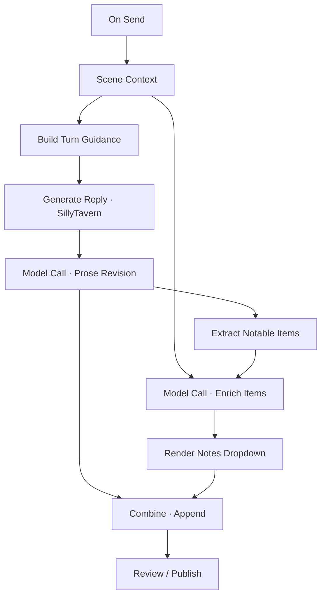
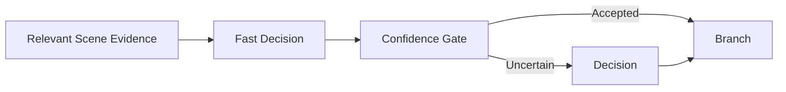
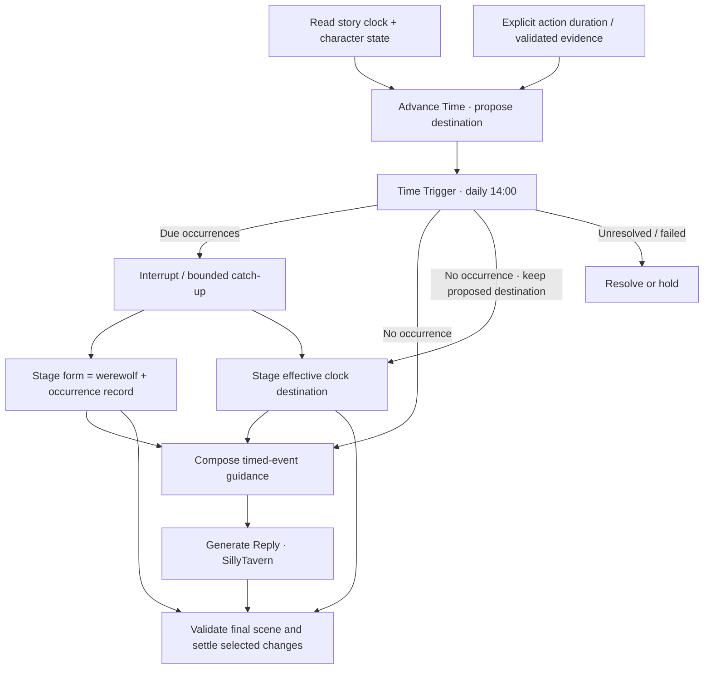

# Workflow Unification Summary

**Design record:** 2026-10-10  
**Status:** Detailed proposal consolidating the Lattice workflow discussion. This document describes the intended direction, existing limitations, recommended contracts, and choices still to be resolved. It does not describe shipped unified-workflow functionality or authorize an implementation by itself.  
**Companion:** [Expanded Nodes](expanded-nodes.md), which develops the node contracts, conditional behavior, provider integration, and story examples.

## 1. The change we are making

Lattice should let a player build one workflow around an entire story turn. That workflow can prepare guidance, let SillyTavern generate its normal reply, process the generated reply with other models and deterministic operations, collect useful information, and assemble the final presentation.

The player should not have to change graphs to move from preparation to processing. They should not have to treat the main generation as an invisible operation occurring between two separately managed workflow documents. A single graph should express the dependencies and carry the relevant artifacts across that boundary.

The motivating example is:

> Read the scene, build guidance, generate a reply through SillyTavern, revise the prose with another model, extract the notable items in the scene, enrich those items using scene context, and append a collapsible notes section to the revised reply.

The same system must also support conditional character direction, memories triggered by specific items, per-use random effects, timed curses, and persistent progression. These require reliable event detection, actor and item identities, conditional execution, reusable intermediate results, and explicit control over when consequences become part of the story. XP and relationship scores are examples of what players can build from those structures; they do not each require a dedicated node.

The central change is therefore **one workflow with several execution stages**. “Pre” and “post” remain useful descriptions of timing, but stop being mutually exclusive root graph types that the player must coordinate.

### Decisions and proposal boundaries

| Topic | Direction established in the discussion | Detail that still needs a specification |
| --- | --- | --- |
| Workflow ownership | One workflow can cover guidance, ST generation, and processing of its reply. | Exact graph schema, persistence format, and conversion policy. |
| Main generation | Preserve SillyTavern's normal generation and prompt assembly. Make its place in the graph visible. | The host integration seam and which generation modes are supported first. |
| Phase separation | Pre/post become stages and optional organizational labels within a workflow. | Whether the initial runtime permits one native generation boundary or several. |
| Chained processing | A generated or revised reply can feed later processors without an intermediate Apply. | Draft revision, transformation, merge, and validation contracts. |
| Conditional execution | A branch can run only when the relevant event or condition occurs. | Activation defaults, unresolved routes, and conflict handling. |
| Model selection | Different model nodes can use different connections. | Provider capability records, storage details, and fallback policy. |
| Decision names | Use **Decision** and **Fast Decision**. | Detailed response schemas and UI controls. |
| Fast decisions | Fast Decision uses a typed Jev-compatible API, including hosted Jev and self-hosted Laya. | Supported endpoint options, calibration requirements, and failure handling. |
| Broken wand | Each distinct actual use can select a real random effect; a selected special entry can invoke a separate author model. | Repeat policies, persistence details, and reroll UX. |
| Persistent files | A workflow can propose adding event records to a file, including the file it read earlier. | Storage adapters, update operations, version conflicts, and commit guarantees. |
| Formatting and schema | Record shape and serialization are distinct from how existing file contents are updated. | Format controls, supported encodings, schema versions, and missing-data behavior. |
| Manual recall | A configurable hotkey can arm memory recall for a reply, a generated swipe, or both. | Consumption, repetition, cancellation, and shortcut scope. |
| Story time | Track accepted in-story time and propose advances; calculate crossed schedules deterministically. | Initial clock, calendar, evidence/estimate policy, interruption, catch-up, and canon correction. |
| Scheduled events | Support fixed-time occurrences, recurring intervals, one-time delays, and cooldowns. | Which are trigger modes or separate operations, anchors, repeat identities, and bounded processing. |
| Reusable progression | Build XP and relationship recipes from event records, authored rules, state updates, bounds, and thresholds. Prefer existing nodes or added modes where sufficient. | Gaps in current State modes, dynamic numeric reducers, pacing ledgers, and threshold outputs. |
| Publication | The workflow must identify a final output and settlement point. | Process an already-published ST reply, or introduce staged single publication. |

The ten additional story flows are illustrative uses of this architecture. They are not ten separately approved implementation commitments. Proposed node names in either document are working product names except where the discussion explicitly settled the name.

### Target player experience in Story-2

For the original Story-2 chat on `default-user`, the intended experience is to open a complete example, choose the connections for its auxiliary model nodes, inspect its guidance and processing stages, and bind that workflow to ordinary Send. The binding and source authority must remain scoped to the intended chat/user context.

After enabling the workflow, the player sends their next story action normally. Preparation produces the guidance; ST generates with its usual configuration; the workflow resumes its prose and notes processing. The player inspects or accepts the assembled result according to the workflow's final policy. They do not open a companion Post graph to continue the same turn.

Opening or importing an example should not itself assign it to Send or enable requests. Previewing a trigger against existing text should explain what would activate without silently creating a new canonical event. These are proposed interaction requirements for the unified system; the current operator guides still describe the available Pre/Post controls.

## 2. What the current separation actually does

The current native workflow format supports `native-pre` and `native-post`. Those values are enforced by contracts, validation, operation availability, and subgraph definitions. The separation is deeper than a pair of menu labels.

A currently assigned Pre workflow can run automatically before ordinary ST generation when Lattice is armed. It produces bounded guidance through the host's extension-prompt mechanism. SillyTavern then assembles and submits its normal prompt. Lattice does not currently own the complete prompt or replace that assembly process.

A currently assigned Post workflow is run explicitly against a completed, text-only assistant reply. Its repair path creates a candidate and an opaque review handle. Apply preserves the original through a new swipe. This is not currently an automatically resumed continuation of the Pre workflow.

It is possible to assign both a Pre graph and a Post graph at the same time. The assigned graph IDs are separate from the graph currently open in the editor. Opening a Post graph does not, by itself, remove the Pre assignment. The limitation is that those assignments do not form one executable, continuous graph.

Other constraints make the proposed example difficult today:

- Guidance and Apply Reply are terminal operations without continuation outputs.
- A candidate revision cannot simply become another repair node's Draft input.
- Repair validation is tied to the original reply identity and original text.
- Text extraction from a Draft is not a general operation in the present catalog.
- Compose works with Text/Data and guidance; it does not provide a complete chain of Draft revisions.
- The host's current completion and message events invalidate run authority rather than resume an owned generation boundary.
- Memory Commit is a separate host side effect. A successful root Post run may commit memory independently of the user applying a reply candidate.

The current Introspection **State** node already supplies useful foundations with zero model calls: Value reads or proposes bounded numeric state, Track counts distinct settled event IDs, and Curve advances a recovery curve in configured steps. Those steps are not elapsed story hours. These existing modes must be assessed before expanding the catalog. Weighted event rewards, dynamic deltas, directed pair state, persistent pacing budgets, and clock-based decay need explicit contracts; their presence in a recipe is not evidence that current modes already support them.

This summary proposes changing those boundaries while retaining useful existing protections: typed ports, source identity, bounded execution, credential separation, root authority, inspectable recordings, reusable subgraphs, and preservation of the original reply.

Relevant current implementation areas include [workflow contracts](../../src/workflow/contracts.js), [graph validation](../../src/workflow/graph-validation.js), [operation catalog](../../src/workflow/catalog.js), [runtime](../../src/workflow/runtime.js), [host adapter](../../src/workflow/host.js), and [repair handling](../../src/workflow/repair.js). These references explain the starting point; they are not evidence that the proposed design has been implemented.

## 3. The unified graph model

### One root workflow, explicit dependencies

A root workflow describes a complete process. Ordinary data wires carry artifacts between operations. Control and event semantics determine which operations are eligible to run and when. A node's location on the canvas does not determine its execution stage.

A visible **Generate Reply · SillyTavern** node marks the main generation boundary. Before that boundary, upstream operations can prepare guidance. After it, downstream operations can consume the generated Draft. Independent preparation branches can join before generation; independent processing branches can join before publication.

This is a design diagram, not an importable Lattice package. Its important dependencies are precise: enrichment receives extracted items and scene context; the final append receives the revised prose and rendered notes; the final output contains both. Extracting items does not replace the prose artifact.

### Pre and post as derived timing

The runtime can explain a node's timing from its dependencies:

- **Before generation:** work needed to supply the selected generation boundary, such as cast resolution, item-use checks, memory recall, and guidance composition.
- **Generation:** the native ST operation and the lifecycle of its owned request.
- **After generation:** work consuming the completed Draft or a later revision, such as prose editing, scene extraction, enrichment, and final rendering.
- **Settlement:** review, publication, and accepted state changes.

These labels help users understand a workflow. They should not restore the old restriction that every node in a root document belongs to one phase.

A reusable subgraph can still organize a “Before generation” or “After generation” process. It can also represent a provider-independent item effect, a character contribution, a structured extraction, or a notes renderer. Organization and reuse remain useful; switching between separate root graphs should not be required for a complete turn.

### A generation boundary is a host operation

The native ST node is not an ordinary auxiliary model call with an ST-shaped label. It represents normal SillyTavern generation, including the host's configured connection, character prompt, chat history, lorebooks, and participating extensions.

Lattice provides its selected guidance through an approved host mechanism. The native operation returns a correlated generated Draft once ST has completed the relevant reply. Downstream processors can then use their own model connections.

The first implementation can be restricted to one native generation boundary per ordinary Send workflow. That is a proposed simplification, not a settled limit. Multiple native generations, loops around native generation, continuation, group-chat turns, alternate swipes, and other generation modes need separate lifecycle rules before being exposed as unrestricted graph behavior.

## 4. Artifacts that remain useful throughout the turn

Unification requires composable artifacts, not just a terminal prompt string and a terminal reply patch.

| Artifact or record | Purpose | Contract needed for unification |
| --- | --- | --- |
| Scene Context | Chat, scene, actor, and other selected context used for a decision or model call. | Identify the source scope, revision, visibility, and point in the turn. |
| Text | Prompt fragments, literal text, rendered notes, and extracted prose. | Carry provenance where text derives from a Draft or private source. |
| Guidance | Bounded direction for native generation. | Remain inspectable and feed the generation boundary rather than ending the entire workflow. |
| Draft | The generated reply and successive proposed revisions. | Preserve original source identity, revision ancestry, and transformation history. |
| Data | Validated structured results such as actors, items, decisions, effects, and receipts. | Use explicit schemas or discriminated payloads rather than unbounded assumed shapes. |
| Event | A particular mention, use, transfer, entrance, or other occurrence. | Preserve a stable event identity separate from execution attempts. |
| Story clock and advance proposal | The accepted story timestamp, starting revision, proposed destination, and evidence or duration rule. | Separate story time from wall time, retain uncertainty, and replay an alternative from its pre-turn snapshot. |
| Scheduled occurrence | A specific daily or interval event crossed by a proposed advance. | Carry schedule identity/revision, due timestamp, and consumption status independently of run attempts. |
| State update and progression receipt | General numeric changes, accepted event references, bounds, budgets, and crossed milestones. | Preserve old/proposed values, authored rules, scope, and duplicate/conflict outcomes without treating model scores as game rules. |
| Pending state change | A proposed memory, inventory change, effect outcome, or campaign update. | Remain staged until the chosen settlement policy accepts it. |
| File reference and snapshot | The storage target read by the graph, its format, contents, and revision. | Preserve target identity for writing to the same file and detect intervening edits. |
| Proposed file update | A schema-checked mutation and projected contents before persistence. | Support inspection, counting, further composition, and acceptance without an early canonical write. |
| Final reply candidate | The assembled prose and any player-visible supplementary sections. | Carry the authority and source checks required for publication. |

This table does not require introducing a new top-level artifact type for every row. Some records can use the existing Data artifact with a validated discriminator. The implementation should add distinct types where they materially improve validation or authoring.

### Draft revisions and extraction

Suppose the native reply is revision 0. A prose model produces revision 1. A continuity pass produces revision 2. An append operation produces revision 3 with a notes section. Each remains a candidate derived from the same owned source, with an inspectable parent chain.

The next processor must be able to consume revision 1 or 2 directly. It must not require applying that revision to the chat and then reading it back as a new source. This keeps the process reviewable and avoids intermediate chat mutations merely to connect nodes.

An Extract Text operation can expose a revision's prose as Text for processors that need it. Structured extraction can produce Data alongside the Draft. Converting to Text should not accidentally destroy the information needed to validate the final candidate; the workflow should keep the Draft lineage or an explicit reference to it.

Appending notes should create a new assembled candidate, preserving the prior prose and recording the appended section. Existing Combine can gain an Append mode, or a dedicated Append operation can provide the same contract. The settled requirement is the behavior, not the number of catalog entries.

### Context at a particular point

“Scene Context” cannot mean an unspecified mixture of everything known before and after generation. A decision needs to know whether it is evaluating the player's current message, the last accepted scene state, the completed ST Draft, or a chosen revision.

The recommended contract is to freeze the relevant input snapshot for a run or event and identify it in recordings. A later operation can explicitly request a refreshed or derived scene state when necessary. Historical mentions, private memories, and proposed changes must not silently become new accepted events merely because a later model reads them.

The exact lifetime of a scene snapshot across generation, user edits, and regeneration remains an implementation decision. The UI should show enough source information that users can understand which version a node used.

## 5. Execution across the native generation boundary

### A resumable run

The current runtime largely resolves upstream closures and executes a bounded run. A unified runtime needs a run that can pause at an external host operation and resume when the owned result arrives.

The conceptual lifecycle is:

1. Capture the root workflow revision, selected source context, chat/user scope, connection bindings, and a run identity.
2. Evaluate eligible preparation nodes and conditional branches.
3. Validate and install the guidance for the owned native generation.
4. Reach the ST generation boundary and wait for that specific generation.
5. Correlate its completion with the pending run and capture its generated Draft.
6. Resume downstream processing, conditional branches, and joins.
7. Assemble the final candidate and any proposed state changes.
8. Settle according to the chosen review and publication policy.

This does not require the interceptor to recursively invoke ordinary ST generation from inside itself. A viable host design can rendezvous with the generation already initiated by Send: finish preparation, release normal ST generation, and resume the registered continuation when the matching result completes. The exact supported host mechanism must be verified before implementation.

### Correlation and invalidation

“The next assistant message” is not sufficient correlation. The pending run should identify the owning chat, user/profile scope, generation attempt, relevant source message, and eventual reply or swipe identity to the extent the host exposes them.

The current host invalidates authority on generation and message lifecycle events. In a unified system, an expected completion belonging to the run becomes a continuation event. An unrelated message, chat change, source edit, conflicting generation, or stale reply must still prevent unsafe continuation or publication.

The runtime also needs a policy for editing a graph during a run. A recommended approach is to execute a frozen graph revision while allowing the editor to create later revisions. Whether edits cancel the active run or merely affect future runs is open; they must never silently alter a request already underway.

### Branches and joins

Conditional branches introduce more states than “value exists” and “value missing.” A useful run trace distinguishes:

- pending or waiting;
- running;
- completed;
- skipped because its condition did not activate;
- unresolved because available evidence did not support a decision;
- failed;
- cancelled;
- awaiting authored review.

A Join must understand these states. It must not wait forever for a deliberately skipped optional branch. It must not treat a provider failure as a false condition. It must not silently discard a required unresolved result.

For optional prose processing, a skipped branch can explicitly pass through the incoming Draft. For collection workflows, no matching events can produce an explicit empty collection. These are intentional contracts, not guesses based on absent output pins.

Independent actor or item enrichments may run concurrently when they use the same frozen scene snapshot and have no shared mutable effect. A later merge resolves their outputs. Two dependent questions, or two operations that alter the same state, require ordered execution or an explicit conflict rule. General concurrent state merging remains an open design area.

### Bounds, stopping, and retries

Execution should retain request limits and add appropriate limits for iterations, event counts, retries, generated data size, and fan-out. A For Each operation must have a bounded input collection. Unlimited recursive event activation should not be an accidental consequence of connecting nodes.

Stop cancels eligible requests and prevents subsequent publication or state settlement. A failed postprocessor should expose the generated Draft and the failure so the player can inspect the work already done. Recovery might retry a failed operation, retain the base reply, or route to a review gate; the exact defaults are open.

Retrying a model request is distinct from creating a new story event. A retry must not draw a second wand effect, create the same memory twice, debit inventory twice, or settle the same callback twice. Successful event-bound results can be reused within the valid run; source changes or an explicitly new generation may create a different event and require reevaluation.

### Clock and state proposals across a turn

An in-story clock is persisted state, not a count of chat messages or a real-time background alarm. The run captures the accepted starting timestamp and version, proposes advances, and calculates due occurrences from that proposal. A clock change, consumed occurrence, and consequent character-state change remain pending until the selected scene is accepted. Coordinating their settlement follows the same publication and partial-failure choices as other state updates; this requirement does not establish an atomic transaction across all stores.

Multiple advances within one run use their ordered projected clock values. A regenerated alternative instead begins from the original pre-turn clock snapshot. Reading the most recent accepted end time as its starting point would incorrectly advance the story a second time. Selecting or replacing already accepted canon needs a separate reconciliation policy for clock values, occurrence ledgers, and dependent state, just as it does for sword captures and memories.

The scheduler should process dependent timed events in chronological order, with an authored limit on catch-up work. Parallel evaluation is appropriate only where events do not depend on one another's state. A transformation at 14:00 and a later reversion cannot safely be treated as independent unordered writes to the same field. Retry should reuse each due occurrence's identity and resolved effect instead of consuming it again.

## 6. Triggers and conditionals in one workflow

A **trigger** identifies an event that can start a workflow or activate a branch. A **condition** evaluates available input and selects a path. They can work together, but they serve different purposes.

Examples of triggers include On Send, a manual Run, completion of the owned native Draft, an item mention in a watched message, an actual item use, or a confirmed scene transition. Examples of conditions include “Mira is currently in the scene,” “this event refers to broken-wand-01,” or “the resolved holder is Mara.”

A reusable event record should include its kind, stable ID, watched source and revision, matching passage, actor and item IDs where resolved, and evidence. The holder or actor should be resolved at the relevant point in the event, rather than guessed from whichever character most recently spoke.

### Watching an explicit source

The author should choose what is watched:

- the new player message;
- the completed ST Draft;
- a particular revision's output;
- a confirmed scene-state transition;
- another explicit event stream.

The current scene history can help interpret a new action. It should not generate a new item-use event every time the workflow rereads the history. Text generated by a memory reaction or wand effect should not trigger its own origin again by default.

### Deterministic checks and semantic judgments

Exact item IDs, known aliases, numeric comparisons, list membership, and stored-state lookups can use deterministic operations. All/Any/None can combine conditions. Branch can route a result to Yes, No, or Unresolved when its input contract supports that distinction.

Semantic judgments belong in visible Decision or Fast Decision nodes. They can determine whether “raises the wand and unleashes a spell” is an actual use, whether a character has entered the scene, or whether two descriptions express the same effect. The model result should include usable evidence and validated output; uncertainty should have an explicit path.

An API timeout or malformed response is an execution failure. It is not evidence that the character is absent or the wand was unused.

### Activation policies

Useful proposed policies include every relevant turn, once per turn, each distinct occurrence, each distinct action, when a condition becomes true, and once until reset. They should be visible in node Details and recordings.

There is no single correct default for every trigger. A memory associated with a compass may reasonably activate once per turn. Two distinct casts of the broken wand should produce two distinct random selections. A character entering the scene can activate a one-time entrance contribution while their ordinary character direction applies on subsequent turns when they remain present.

The Expanded Nodes document develops these policies and the distinction between event identity, execution attempt, and accepted story state.

### Manual arming and automatic recall

A proposed Hotkey Arm capability lets the player select a shortcut that prepares a recall activation for a future matching generation. It does not need to generate a reply immediately. The arm state identifies the workflow, chat/profile scope, chosen memory set, eligible generation types, and remaining uses. It should be visible and cancellable.

Generation targets and consumption rules should be separate controls. Targets can include ordinary replies, newly generated swipes, or both. Consumption can mean the next matching generation, one use of each selected type, or repeated use until disarmed. Thus “the next reply or swipe” differs from “one reply and one swipe.” Selecting an existing swipe is also a different event from generating an alternative.

Keyword, character, and event triggers can activate the same retrieval subgraph automatically. When manual and automatic activation target the same generation, an identity-aware join can deduplicate the recall instead of injecting it twice. Relevance filters select actor, partner, tags, scene, and bounded amounts of memory. Actor-private reflections route to the corresponding actor's context or permitted contribution process rather than automatically entering public notes.

With no eligible arm or automatic trigger for a generation, the optional recall path completes as skipped and ordinary generation continues. Character Direction checks each actor's presence at the intended stage; reading an absent actor's file does not introduce them into the scene. A present actor can still recall their own memories of an absent partner.

Timing remains causal. A trigger in the new player message can supply guidance before the current generation. A trigger first detected in the completed ST reply can affect downstream revision or arm the next generation; it cannot retroactively alter the prompt that produced that reply. The point at which an arm is consumed, and what happens on failure, cancellation, chat changes, or restart, remain open design decisions.

### Story time, fixed schedules, and intervals

The proposed **Story Clock** reads a persisted story timestamp such as Day 12, 13:40. **Advance Time** proposes a duration or destination from an explicit player action, an authored action-duration rule, or validated temporal evidence in the story. These are working operation names; the detailed specification should decide whether they are State/trigger modes or dedicated operations. An initial day/time must be supplied or deliberately initialized. A reply does not automatically equal a minute or an hour.

Exact evidence such as “eight hours passed” can establish a duration. “Later” or “a long conversation” cannot establish an exact advance without an authored estimation policy. If a model estimates an unknown duration, the output and resulting clock must carry that uncertainty. A semantic Decision can interpret temporal evidence; a typed Fast Decision can confirm a bounded question about it. Neither needs to answer “have eight hours passed?” when numeric timestamps already provide the answer, and neither can recover absent elapsed-time evidence merely by being asked.

**Time Trigger** can express midnight or a daily 14:00 curse. The relevant boundary is `previousTime < dueTime <= proposedTime`. Advancing from 13:40 to 15:10 therefore crosses 14:00 even though no message happens exactly at that time. A due occurrence is keyed by schedule identity/revision and due timestamp; re-reading the scene, retrying a save, or rerunning a preview does not create another occurrence.

The player needs an explicit policy for a long advance:

- **Interrupt:** stop at the next due event, apply its proposed consequence, and narrate that interruption. The uncompleted action duration remains an explicit continuation choice; it is not silently discarded or completed offscreen.
- **Catch up:** enumerate bounded due occurrences in time order and apply or summarize their effects through the destination. A multi-day skip may cross several midnights or daily curses.
- **Hold for resolution:** use this when an unknown duration, excessive catch-up count, or dependent event prevents a reliable result. An unresolved time source is different from a valid advance that crosses no event.

An **Interval** capability expresses every eight elapsed story hours from an anchor. With Day 1, 06:00 as its anchor, occurrences fall at 14:00, 22:00, then Day 2, 06:00. Handling the 14:00 occurrence at 15:00 does not move the next occurrence to 23:00. A one-time delay schedules a single event eight hours after its initiating event. A cooldown makes a later event ineligible until a duration has passed; it does not itself create an event every eight hours. These may be modes of reusable scheduling/condition operations rather than separate shelf nodes.

Clock arithmetic needs a specified calendar. A simple proposal uses a 24-hour story day and a campaign epoch, while custom calendars, local time conventions, uncertainty, rewind, and rebase remain open. Real-time timers would use a different clock source and lifecycle. They are not implied by these in-story examples or implemented by repeatedly calling a model.

### Reusable event-driven state and thresholds

The progression proposal is a set of reusable capabilities: identify a meaningful event; resolve an authored rule; calculate its numeric or categorical effect; enforce duplicate handling, bounds, caps, and cooldowns; inspect crossed thresholds; stage the proposed state and ledger. XP, soul counts, reputation, hunger, temporary desire, and relationship attraction can share those contracts.

Use the existing State Value/Track/Curve and Compose where their contracts suffice. General collection mutation, Condition/Compare, rule lookup, and multi-threshold resolution are proposed reusable capabilities rather than current catalog features. Add modes to existing nodes when that gives a clear operation; introduce a new operation only for a demonstrated gap that existing contracts cannot express clearly. “XP” belongs in recipe names, example presets, and field labels; it is not a proposed dedicated node.

Models can classify evidence or extract a relevant event. Authored rules determine rewards, penalties, and pacing. A model-confirmed quest completion does not authorize the model to invent a quest identifier, award arbitrary XP, or choose a new absolute relationship score. Event records retain identity, source evidence, actor/item scope, story time where established, and rule identity. Idempotency is based on the game event, not just the workflow attempt.

For one-time rewards, a quest ID can define award uniqueness. For repeatable objectives, the quest and completion-instance IDs must both be retained. Relationship budgets need persistent scene and story-day identities; counting each new message as a fresh scene would defeat an authored per-scene cap. Reading a memory or rendering an existing statistic is not a new progression event.

## 7. Models and decision providers

### Different connections within the same graph

The native ST boundary uses the host's normal generation connection. A prose editor, an item-detail writer, a memory author, and a wild-effect author can each use a different configured connection. The graph makes these choices explicit at the corresponding nodes.

Connection support is a capability contract. It should not imply that every model or endpoint automatically supports every node. A text-generation connection can support an ordinary Model Call or Decision. Fast Decision requires a compatible typed decision endpoint and adapter.

### Decision and Fast Decision

**Decision** uses a connected general model to answer a bounded question or set of questions, followed by structured-output validation. It is useful for nuanced interpretation, adjudication, and fallback. Its outputs should be usable by Branch and other deterministic operations.

**Fast Decision** targets the typed Jev-compatible API, with hosted Jev or a compatible self-hosted Laya connection. The proposed modes include Yes/No, Choice, and Score. The adapter must preserve the documented meaning of probabilities, scores, and confidence for each question mode rather than flattening them into an invented universal certainty score. API compatibility does not establish equivalent calibration across models.

The exact accepted product names are Decision and Fast Decision. No “Standard Decision” category is needed.

A useful explicit flow is:

The gate's threshold is a proposed authored setting that must be evaluated on the actual task. A chat model's self-reported confidence is not interchangeable with a classifier's calibrated probability. A provider failure needs a failure route or explicit fallback policy rather than entering the uncertainty path by assumption.

An optional Auto setting could select among the user's configured compatible fast connections. It should not silently turn every Decision into a Jev call, silently install Laya, or change providers merely because a decision sounds simple. The dedicated Fast Decision node makes provider intent, cost, and failure behavior inspectable.

### Adapter requirements

The current connection layer primarily expects text completion results. Fast Decision needs native typed request and response handling rather than reading a typed API response as `text`.

Provider configuration should record endpoint compatibility, model choice where applicable, authentication references, supported question modes, limits, and response semantics. Credentials stay in connection/host configuration, not portable graph data. Hosted Jev and self-hosted Laya must be distinguished in connection labels and traces.

Independent questions about the same frozen state may be batched in a Decision Batch proposal. Dependent questions require separate stages: for example, first resolve the current holder, then ask what that particular character recalls. Batching should reduce overhead without pretending the second question can use a result that does not yet exist.

The official Jev documentation describes its typed state/question interface, and Laya's publisher describes a compatible self-hosted service. Laya's model card also describes limits that make workload-specific evaluation necessary. These sources support a potential integration; they do not establish guaranteed accuracy or latency for Lattice's roleplay tasks. See the source list at the end of this document.

## 8. Publication is the major integration choice

One graph can automatically span Pre and Post work under two different host designs. They have different user-visible behavior and different interactions with other ST extensions.

### Option A: Process the already-published native reply

ST generates, displays, and saves its ordinary reply. The unified workflow then consumes that completed reply and processes it automatically. The final assembled candidate can be applied through a preserved-original new swipe.

This is conceptually close to the existing post-repair authority model. It still solves graph switching and manual continuation: one workflow owns both sides. However, the player may see the base reply before the revised reply. Other extensions may already have consumed the original message. Applying a later revision cannot be assumed to rerun every other extension's extraction or state changes.

This option also needs a policy for failure after ST has published. The workflow can preserve the base reply and expose a failed processing stage, but it must clearly show which version is accepted by the chat and which changes remain pending.

### Option B: Hold the native reply until final publication

ST generates into a working Draft or a deliberately staged display. The workflow processes it, assembles the final candidate, and publishes once at its settlement point.

This produces a cleaner final-output experience and can align state changes with the final accepted reply. It requires a new or verified ST integration seam: the current pre interceptor and Apply mechanism do not establish an unpublished native Draft contract.

Streaming, host save behavior, cancellation, extension event ordering, token accounting, and ownership of the provisional reply must all be specified. Merely hiding text in the UI would not establish correct single publication.

### Decision to make before implementation

Neither publication architecture is settled by the discussion. The summary must not claim that unified execution automatically supplies staged single publication.

Similarly, the final review policy remains open. A workflow can visibly include an authored review gate; ordinary deterministic flows may be candidates for automatic final publication. Which actions require review, which are author-configurable, and how those policies interact with ST's existing message lifecycle need a concrete specification.

### Settlement and state changes

New memories, inventory debits, stored random outcomes, faction updates, and campaign-thread changes should have pending versus accepted status. A recommended unified design collects these effects and settles them with the selected final reply, using stable identities to avoid duplicate writes.

That is a change from the current independent Memory Commit behavior. It should be explicit rather than assumed from a renamed node.

The host currently does not provide a durable-save acknowledgement through the persistence wrapper. A unified implementation should report what it knows: an in-memory or local write occurred, a host save was requested, or durable completion was actually acknowledged. “Commit” must not make an unsupported durability promise.

Cross-store atomic settlement is also an open issue. If reply publication succeeds and a state save fails, the runtime needs a visible partial-settlement record and a bounded recovery path. It should not replay all model calls or repeat a random draw merely to retry persistence.

### File updates: record shape, mutation, and persistence

The new file-writing proposal adds three distinct responsibilities. **Format** defines field mapping, record schema, validation, and serialization. **Update Collection**, when exposed as a standalone operation, combines incoming records with an existing document to produce a proposed update. **Write to File** persists the selected mutation at its configured settlement point. Simple writers can offer built-in append/upsert behavior without requiring a separate Update Collection node.

These responsibilities avoid making “save this text as JSON” carry several hidden meanings. A serializer can encode structured values as JSON, JSON Lines, CSV, Markdown, or plain text where supported. Turning free prose into named fields first requires an explicit mapping or structured extraction step. A filename extension does not establish a schema or recover missing information.

| Proposed update operation | Intended behavior |
| --- | --- |
| Append text | Add text using the selected separator or section template. |
| Add entries | Add records to a selected collection, such as `/souls` or `/memories`. |
| Add unique entries | Add new record identities; an identical duplicate is a no-op and conflicting content is reported. |
| Upsert by key | Insert a new record or deliberately update the existing record with that key. |
| Update fields | Change selected fields while preserving other content. |
| Replace contents | Save an explicitly authored replacement document. |

For ordinary JSON, append is a semantic change to an array or object collection followed by serialization of the valid resulting document. Raw concatenation of serialized objects is not the same operation. JSON Lines can support literal record append. CSV headers, escaping, Markdown section identities, and other format-specific rules need explicit supported serializer contracts.

The graph should pass the file reference captured by Read File into the writer to identify the same target. That reference also identifies the source revision. Before committing, the writer checks whether another process changed the file. A conflict should hold or take an explicit rebase path that preserves the newer data; it should not silently save a stale snapshot over intervening changes.

Current File Input imports a saved content snapshot; it does not reread a target during execution or provide write-back authority. The proposed Read File/storage adapter must supply the retained target reference needed for a live read/update process.

Rebasing affects dependent story output as well as file contents. If a newer ledger changes the projected soul total or already contains the milestone, recompute the threshold and revalidate the level-up contribution before publication. A conflict discovered after the reply is published is a partial-settlement problem requiring an explicit repair or review policy; silently rebasing only the file can leave obsolete narration in the accepted story.

Writer Details should expose target, operation, collection path, schema, identity key, duplicate/conflict behavior, missing-file/path behavior, and commit timing. A provided document template can establish a missing file or collection; silently guessing an arbitrary layout is not a reliable contract.

For canonical story records, the recommended default is a staged update accepted with the final selected narrative. Preview shows before/after contents, new entries, duplicates skipped, changed fields, and pending versus persisted status. A prepared update is applied once; passing it to a writer must not run its append operation a second time.

Actual storage support remains to be specified. A file means a target supported by a configured host or storage adapter; this proposal does not establish arbitrary operating-system file access. Atomic replacement of one file, coordinated writes to multiple files, and durable acknowledgement are separate capabilities that must be reported truthfully.

### Canonical event files and alternative replies

Stable event IDs let a sword ledger or memory collection survive retries without duplicated history. The final watched story-body revision supplies the evidence, and acceptance determines which proposed events become canonical. A generated receipt or recalled scene does not create a new event merely because it repeats the original description.

An unselected alternative contributes no accepted event. Changing an already accepted swipe is more complex: the implementation needs an explicit policy for superseding, correcting, or reversing its earlier records. An append-oriented ledger can retain a correction record while its derived view counts only active canonical events. That is a proposed approach, not a settled rule for all storage formats.

Two actor files may be updated from one shared scene event. If only one write succeeds, the run should identify the successful and pending records and retry the missing write using the same identity. It must not claim a multi-file transaction unless the backend actually provides one. Reply publication and file persistence may likewise settle partially under the chosen ST integration architecture.

## 9. How the editor and player workflow change

### One workflow selection and one Send binding

The Workflows menu continues to select documents for editing. A separate explicit control selects which complete workflow participates in ordinary Send. Editing another workflow must not silently change that binding.

The existing “Assign pre phase” and “Assign post phase” controls can become a single **Use this workflow for Send** action or equivalent binding control. The existing Arm control can become **Enable on Send** or another label that clearly means the whole configured process. These are recommended UI directions, not final copy decisions.

Manual Run starts the configured root process. A standalone revision tool can still run manually from a Reply Snapshot source. Run to Here remains useful for inspecting preparation or processing, but crossing a real generation boundary must be visible as an operation with host effects and possible cost.

### Canvas and shelf

The canvas shows the native generation node between preparation and processing. Optional stage labels, comments, and groups help organize the graph. Their appearance should be derived from execution dependencies or explicitly described as visual organization.

The shelf should offer nodes based on typed inputs, scope, and capability requirements rather than rejecting a node because the entire document is labeled Pre or Post. Root-only source and publication authority still matter. A reusable subgraph cannot gain permission to publish a chat reply merely by displaying a Publish node inside it.

A unified starter could show On Send → Generate Reply · SillyTavern → Review/Publish, with places to insert guidance and processing. More elaborate starters can demonstrate optional branches. The current New workflow UI does not expose a phase picker; this is a change to the resulting scaffold and contracts, not a claim that an existing visible phase picker must be removed.

### Details and preview

Details should make the choices that affect behavior legible:

- what source a trigger watches;
- what identities, aliases, or semantic criteria it matches;
- which actor or item a result belongs to;
- when it activates and whether uncertainty has a route;
- which connection/model the node uses;
- which validated schema or output contract it produces;
- whether it proposes a state change or settles one;
- which file collection it updates, how it handles existing records, and which source revision it expects;
- which clock a schedule uses, its anchor/due time, and its interrupt or catch-up policy;
- which authored rule supplies a state change, its event identity, bounds, caps, cooldown, and threshold behavior;
- how it participates in the final reply.

Preview should let the player inspect the native Draft, every material revision, extracted Data, final rendered sections, and assembled candidate. It should show the event evidence and source versions used for decisions. Private actor knowledge can be available in an appropriate private inspection context without appearing in player-facing notes.

The existing selection-following and pinned output previews remain useful. Final publication controls should operate on the final assembled candidate with its valid authority, rather than appear on unrelated intermediate text.

File-writing previews should expose the proposed changes before acceptance, including duplicate no-ops and version conflicts. A shortcut control should show its target types and use policy, with an indicator such as “Recall armed: Mira/Elias · next generated swipe.” Canonical acceptance, staged writes, successful writes, and pending repairs should be distinguishable in the run trace.

Clock previews should show the accepted starting time, proposed destination, exact or estimated evidence, crossed occurrences, interruption point, and remaining action duration. A valid no-due-event result is an empty occurrence collection; an unknown clock or duration shows an unresolved result. State previews should show each old/proposed value, eligible and rejected events, matched rule, cap/cooldown calculation, crossed milestones, and persistence status. Directed relationship previews identify whose perspective each value represents and keep private state within the authored visibility policy.

Recipe presets can configure existing node modes and field mappings without adding separate XP, reputation, or lust nodes to the shelf. A player's graph should make the underlying rules inspectable; changing the reward table or pacing settings should not require replacing the root workflow.

### Run status

The run meter and Details can show Preparing, Generating in ST, Processing reply, Awaiting review, Complete, Failed, or Cancelled. Individual node states show whether a branch activated, skipped, or remained unresolved.

Requests, timing, provider selection, cache reuse, and conditional skip reasons should be attributable to their nodes. A user should be able to see that the ordinary story model ran once, the prose model ran once, and a character branch made no call because that character was absent.

Cost and request estimates should account for eligible branches where possible. A maximum bound and an actual request count serve different purposes; the UI should not imply that every optional node will run every turn.

### Examples become complete recipes

Examples that currently have separate phase members should become understandable end-to-end recipes where appropriate. The player can open one graph, follow the generation boundary, inspect both halves, and bind that complete workflow to Send.

Reusable components can remain separately packaged as subgraphs. They should not require companion root graphs merely to accomplish one ordinary pipeline. The examples should be installed or opened without silently enabling paid calls or assigning a Send workflow.

## 10. Key story scenarios and persistent recall

### Character-specific system direction

Resolve the active scene cast. If the selected character is present, call a model with a system prompt scoped to that character and context limited to what that character may know or perceive. Its output supplies the character's dialogue, observable action, or another clearly actor-owned contribution. Merge it into the scene while preserving shared events and other characters' contributions.

A shared ST system prompt cannot literally be restricted to one character simply by calling it character-specific. The separate call and controlled merge provide the actual boundary. A name mention, recollection, quoted speech, or off-screen discussion does not establish presence.

Example: Mira's separate system prompt tells her to conceal fear behind dry practical advice. When she is in the scene, the branch can contribute a lantern quip and a practical action. When she is absent, it skips without making a model call.

### Item mention causing a holder's memory

Watch the selected new text for a specific item or its aliases. Resolve the active holder at that point. Feed the supplied memory prompt and that holder's relevant context to a separate model. Incorporate the resulting reaction or memory in a controlled way, and stage any new persistent memory.

The person who mentions the item is not necessarily its holder. If Elias mentions a silver compass while Mara holds it, the memory applies to Mara. If the holder is unknown or disputed, the workflow takes an unresolved path rather than inventing an owner.

Recall existing memory, create a new memory, and recall-or-create are proposed modes. A memory created by the branch should not recursively trigger the same item mention. Private memory content should not automatically be appended to player-visible notes.

### Broken wand with library and generated effects

Detect each actual use of the particular broken wand, resolve its actor and event identity, and select an effect using a real random operation over a JSON or plain-text library. If the selected entry is a generation marker, a separate model authors a new effect under scene and novelty constraints.

Fixed library entries bypass the effect-authoring Model Call. Only the designated generation entry activates that call; both paths converge on a resolved effect before narration in the pre-generation recipe.

Validate and resolve the selected effect, store it as a pending outcome bound to that cast, then use it in guidance or downstream revision according to the watched stage. Render an appropriate effect receipt for the final reply if desired. Settle consequences once.

Talking about the wand is not using it. A retry of the effect-author call is not a second cast. A generated effect is not silently added to the original library. “Not in the library” can be checked for exact duplicates and assessed semantically, but a model judgment cannot guarantee mathematical novelty.

The companion document contains the full graph, sample inputs, generated effect schema, failure routes, and retry semantics.

### Soul-stealing sword: an event ledger and a level threshold

Read the sword's JSON ledger and retain its file reference. Inspect the selected story-body Draft for actual kills attributable to the exact sword and victims, then validate whether those events capture souls under the authored rules. Format each eligible capture as a record with a stable event ID, weapon/victim identity, captured amount, scene/source references, and summary.

Update Collection adds unique records to `/souls` in a projected document. Count reads the old and proposed collections before any canonical write. If one entry always represents one soul, count entries; otherwise sum `soulsCaptured`. The threshold condition is `before < 100 && after >= 100`, with a separately identified milestone preventing a repeated level-up.

When 99 becomes 100, the same workflow can add the milestone and sword-level change to its proposed ledger and generate or render the transformation in this reply. The writer then stages the completed update to the same file for settlement with the final narrative. Keeping souls and milestones in one composed file update avoids intentionally saving the count first and noticing the upgrade only on another turn.

No new capture produces an unchanged projection and no new milestone. Two distinct captures produce two entries; a duplicate event produces none. Threats, recollections, quoted stories, and ordinary mentions do not qualify as new kills. Unresolved attribution or invalid records require resolution instead of increasing the count.

If an imported ledger already exceeds a threshold without its milestone, catch-up behavior needs an authored policy. Canon replacement may also reduce the active count; whether that reverses a previously accepted sword level is a separate game rule, not an automatic consequence of file append.

### Paired memorable moments: shared facts, separate reflections

Watch the chosen story body and establish both characters' participation at the event. Fast Decision and its acceptance gate confirm whether an actual kiss occurred. Structured extraction identifies the event, participants, evidence, and stable identity. A recollection or hypothetical kiss is a different category and does not activate this recipe by default.

Two separate Character Reflection calls receive the shared event and their respective permitted context. Each returns that actor's introspective response. Format creates two records linked by the same scene-event ID but keyed separately by event and actor. Write to File stages unique entries in each actor's `/memories` collection.

The record distinguishes shared scene facts, private reflection, and reflection origin: source-provided, inferred, or model-authored. An authorship setting determines whether inner feelings may be invented, especially for a player-controlled character. Acceptance can establish authored private canon where permitted; a fluent interpretation alone does not establish an observed fact.

With no qualifying event, the branch returns an empty pending-write collection and the reply continues normally. Semantic uncertainty can route to Decision or review; transport or validation errors remain execution failures. If later prose revision changes the event, the pending memories need revalidation against the final selected body before settlement.

The two records can later be selected manually or through keyword, character, and event triggers. Each actor's private material feeds that actor's memory context or Character Direction. Observable contributions can then enter shared guidance or a scene merge, while public notes disclose only the authored visible information.

### Hotkey recall: reuse remembered scenes in a later generation

A player can arm a selected memory set for the next reply, a newly generated swipe, or both according to independent target and use settings. At a matching generation, the workflow reads the selected files, filters relevant records by actor/partner/tags or explicit selection, bounds the context, and routes it to the intended model inputs.

For example, “Recall armed: Mira/Elias · next generated swipe” can prepare a new alternative informed by their harbor memory. A keyword in a new player message can activate the same subgraph automatically. An event detected after ST generation can instead enrich the current revision or arm recall for the next generation.

Manual and automatic activations should share identity-aware deduplication. Consumption on start versus successful acceptance, pending arms after cancellation, repeated modes, file snapshot timing, and shortcut conflicts remain open. None of those controls should change the root workflow merely to switch between preparation and processing.

### Timed curse: midnight, daily 14:00, or every eight hours

Read the story clock and the cursed character's accepted state. A known action duration proposes a destination. The schedule emits each crossed occurrence; an empty result follows the ordinary guidance/generation path. An interrupt policy can stop a journey at 14:00, stage `form = werewolf`, and compose guidance requiring the interruption in the next native ST reply.

The graph is illustrative. Its settlement receives the effective clock destination and any optional state changes; the no-occurrence branch supplies an explicit empty change collection rather than leaving a required join waiting. Interruption stages the event time, whereas completed catch-up or an advance without a due event stages the destination. Initialization and temporal-evidence failures also take a resolution/failure path before ST generation. The clock advance still needs settlement when no curse occurs.

Set a named state rather than toggling a boolean. If the person is already a werewolf, another occurrence does not automatically turn them human. Reversion is a separate authored schedule or rule. A character can transform offscreen if the workflow has explicit authority over that character's world state; a public scene contribution still respects actor presence and visibility. The recipe cannot gain arbitrary actor-store authority through an actor ID emitted by a model.

If elapsed time is discovered only in the generated reply, the schedule runs after generation. Enforcing the curse in that same accepted reply then requires revising any conflicting prose and validating it before acceptance. The post-generation result cannot retroactively supply the already completed native generation. Under the compatible-publication architecture, the initial visible ST reply may therefore need a revised swipe; the proposed workflow cannot promise that players never see the conflicting base text.

The same recipe can use midnight or an anchored eight-hour interval. The rule's recurrence and the transformation's duration are independent. Long skips, retry, cancellation, and replacement of accepted canon must preserve occurrence identity and the appropriate pre-turn clock snapshot.

### Player XP: a general progression recipe

Extract and confirm events from the selected story body, then match them to an authored reward table. For example, restoring the beacon awards 100 XP once for that quest, and discovering the hidden observatory awards 20 XP once for that location. An unknown event or uncertain completion produces no accepted award until it is resolved; classifier failures are not treated as a negative answer.

Read the player's state and award ledger. A reusable state update applies the matched deltas only to eligible new event identities and produces old/proposed totals. Combine the awards, XP total, derived level, and milestone identities into one projected document where practical, then stage the update through the retained storage reference. Format defines that document's schema; it does not choose rewards. This can use State extensions and deterministic lookup/condition modes rather than an XP node.

With cumulative level thresholds `[0, 100, 300, 600]`, 80 → 650 XP reaches level 4 and crosses the level-2, level-3, and level-4 milestones. Checking only the next threshold would miss two results. A simple single threshold can use Condition/Compare; a reusable threshold resolver can return all crossings in order when needed. Whether a level is always derived from current XP or becomes an irreversible accepted upgrade is an authored game rule.

An optional receipt can say “+20 XP · 115 total · Level 2.” The event ledger, new total, and receipt refer to the same proposed update. Retry, history re-read, and unselected alternatives do not award it again. A concurrent state revision requires recalculating awards, total, level, and any dependent narration before publication. If publication already occurred, the existing partial-settlement repair policy applies.

### Slow-burn relationship attraction and temporary desire

Treat relationship state as directed and actor-scoped: Mira's attraction toward Elias can be 18 while Elias's attraction toward Mira is 31. A shared kiss need not cause equal changes or even positive changes for both. Observable events, private source-provided feelings, inferred reactions, and model-authored introspection keep the distinctions established by the paired-memory recipe.

Extract meaningful relationship events from the chosen story-body revision, and use Fast Decision or Decision to check eligibility where semantic judgment is needed. Keep actor IDs, direction, event identity, evidence, scene identity, and established story time alongside the decision. An accepted No yields an empty change collection; uncertainty may use an explicit fallback or review route. Models do not output an unrestricted replacement such as “lust is now 75.”

Authored per-character rules determine small deltas. One illustrative slow-burn configuration awards +1 for an eligible meaningful interaction or +2 for a strongly supported romantic moment, with a maximum positive gain of +2 per stable scene and +4 per story day, bounded to 0–100. These are example pacing settings, not claims about psychology. Attribute each event to its established timestamp/day or an explicit authored attribution rule; an unknown day requires resolution when the cap depends on it. A scene spanning midnight must not assign every event to its ending day. Apply ordered events against projected budgets, including earlier eligible events in the same run. Negative changes, cap scope, and event priorities need separate authored rules. Cooldowns and diminishing returns can stop repeated compliments from producing unlimited gains.

Persistent attraction can be separate from temporary desire or lust intensity. A clock-based decay rule may reduce the temporary value as story time passes, while baseline attraction need not decay. Repeated chat messages without an established duration should not simulate elapsed hours. Existing State Curve could inspire a recovery mode, but its current step-based contract must not be silently reinterpreted as time.

Map ranges to gradual portrayal guidance, such as restrained awareness or more visible tension. A threshold permits an authored style of portrayal; it does not compel a kiss or establish willingness, trust, or permission to act. Actor-private guidance must reach the appropriate character context, and a stored pair value does not bring an absent character into the scene.

Stage the updated directed values, accepted event ledger, scene/day budgets, and any decay timestamp with the selected scene. A reread memory, a displayed score, or guidance describing existing attraction does not award another event. If concurrent state or clock changes alter the available budget or portrayal band, recalculate those results and validate the dependent prose before acceptance. Storage choices and multi-file partial failures follow the existing file contracts.

## 11. Additional flows enabled by the same architecture

| Player goal | Example flow | Output that makes the result useful |
| --- | --- | --- |
| Real dice with narrative consequences | Classify the check → freeze stakes and difficulty → roll → calculate result → guidance → ST → prose pass. | A collapsible roll receipt showing the committed stakes and result. |
| Ensemble scene | Resolve cast → assign scoped knowledge → ST → actor-specific contributions → reconcile shared events. | An intercut scene whose characters do not acquire each other's private knowledge. |
| Mystery evidence board | ST scene → extract observations and claims → attach provenance → derive hypotheses → check contradictions → filter spoilers. | Separate observed facts, witness claims, and possibilities. |
| Downtime world changes | Accepted world state → bounded faction simulations → resolve conflicts → arrival guidance → ST → discoverable changes. | A return-to-town scene and accepted world updates, with hidden agreements kept private. |
| Exploration map | Known map → exploration guidance → ST → extract landmarks/exits → spatial validation → merge. | Updated location cards with confirmed and suspected links distinguished. |
| Solvable puzzle | Define constraints → build mechanism and solution → validate solvability → ST presentation → graded hints → validate answer. | A player-facing puzzle with hidden solution and appropriate hints. |
| Alternate takes | ST generation → freeze shared events → parallel tone revisions → check event equivalence → choose one → publish. | Several readable versions; only the selected version affects memory or canon. |
| Crafting experiment | Recipe and inventory → calculate costs/results → guidance → ST → specialist details → settle once. | An experiment card and accurate accepted inventory changes. |
| Story through documents | Scene context → artifact formats → ST → notices, letters, tickets, or messages → chronology and knowledge checks. | A coherent document bundle whose intentional witness contradictions remain claims. |
| Campaign callback | Stored threads → relevance match → callback guidance → ST → continuity/knowledge validation → thread update. | A callback tied to a prior event, with offered and fulfilled obligations distinguished. |

These recipes share the same lifecycle and artifact rules. Specialized map renderers, puzzle validators, or simulation adapters can be optional extensions; the unified workflow does not require every specialized tool to become a core node.

## 12. Reusable subgraphs, validation, and compatibility

### Subgraphs describe interfaces and capabilities

The existing named endpoints, portals, pinned definitions, and qualified graph tabs remain valuable. A unified subgraph should declare its required inputs, produced outputs, and capabilities instead of inheriting a whole-document phase restriction.

For example, an Enrich Items subgraph takes item Data and Scene Context, uses a configured model, and returns enriched Data. A Wand Effect subgraph takes a use event and effect library, returning a resolved effect and pending consequence. A Notes Renderer takes player-visible Data and returns rendered Text.

Some capabilities remain root-controlled. Reading a host source, initiating native generation, publishing a reply, or settling persistent state requires explicit authority. Importing a subgraph cannot grant it that authority automatically.

### Validation changes

Validation should answer questions such as:

- Are the connected artifact types compatible?
- Is a required source available at this point in execution?
- Does a node use a capability permitted in its current scope?
- Can a post-generation value reach a pre-generation input through an invalid dependency cycle?
- Does the graph have a valid root entry and final settlement path?
- Are branch and join requirements explicit, including skipped and unresolved paths?
- Are loops and request-producing operations bounded?
- Does a model binding satisfy the required provider contract?
- Can the final candidate be traced to a valid owned source?

These checks replace whole-graph phase matching where appropriate. They do not justify weakening package admission, credential stripping, source freshness, or readonly/pinned-library controls.

### Existing current graphs and retired systems

If conversion is provided, it should concern the current native workflow formats only. The earlier removal of retired SillyCanvas/legacy execution systems remains a separate design decision. Unification is not a reason to restore retired prompt-replacement nodes or the old Jev subsystem.

A current Pre recipe could become preparation followed by the native generation boundary and final output. A current Post recipe could remain a manual Reply Snapshot tool or be inserted after generation in a complete workflow. Combining a user's current assigned pair would need to preserve settings, connection bindings, subgraph definitions, and source contracts rather than simply concatenate node arrays.

Whether to provide an automatic converter, a guided import, or only updated examples is open. Any package/runtime version change must make unsupported formats visible and avoid silent mutation of stored workflows. The existing native-only design record should be reconciled explicitly with the chosen current-format conversion policy.

## 13. Work needed to make this real

The discussion identifies several coupled implementation areas. This is a map of the design work, not a separately approved execution plan.

1. **Unified contracts and validation:** define the root workflow, capabilities, stage dependencies, source contracts, typed decisions, and revision artifacts.
2. **Resumable scheduling:** add owned generation boundaries, branch states, joins, bounded iteration, cancellation, and event/attempt identities.
3. **ST host integration:** verify normal generation rendezvous, completion correlation, source capture, supported modes, and the publication architecture.
4. **Composable processing:** support successive Draft revisions, extraction, structured processing, rendered append sections, and final candidate lineage.
5. **State and file settlement:** stage memories, schema-aware file mutations, and other changes; define acceptance, version conflicts, idempotency, partial failure recovery, and truthful persistence reporting.
6. **Decision adapters:** integrate typed Jev/Laya requests, capability-bound connections, response validation, confidence semantics, explicit fallback, and traces.
7. **Editor and examples:** replace phase assignment with complete-workflow binding, expose the native boundary, update Details/Preview/run states, and provide unified recipes.
8. **Retrieval activation:** define manual hotkey arming, generation targets/use policies, automatic trigger joins, bounded memory selection, and actor-scoped injection.
9. **Story-time scheduling:** define clock initialization, duration evidence, calendar math, fixed and interval occurrences, interruption/catch-up, replay snapshots, and time/canon reconciliation.
10. **Reusable state progression:** assess existing State modes first; specify only the missing event reducers, rule lookups, persistent caps/cooldowns, directed scope, time-based decay, and threshold outputs. Demonstrate XP and slow-burn relationship recipes without dedicated domain nodes.

These areas should be designed together before relying on a UI-only change. In particular, publication, state settlement, and completion correlation determine whether the promised experience is actually correct.

## 14. Acceptance scenarios for the design

The eventual implementation should demonstrate behavior that a player can verify:

- One ordinary Send runs preparation, one owned ST generation, and the configured downstream processing without changing root graphs.
- The player's selected editor graph and the workflow bound to Send remain independent and clearly identified.
- A prose revision feeds another processor without being applied to chat first.
- Item extraction and enrichment produce the final notes section while preserving revised prose.
- An absent character's scoped system-prompt branch makes no request; a present character's contribution stays within its scope.
- An item mentioned by one actor can trigger a memory for its resolved current holder.
- Two actual wand uses create two events and two random selections; mentioning a prior cast creates none.
- A selected wild-surge entry invokes its separate model, validates the result, and holds on failure without silently changing the draw.
- Retrying a failed request or save does not repeat accepted state changes.
- Skipped optional branches do not deadlock joins; unresolved and failed branches remain distinguishable.
- Other chats, stale swipes, or unrelated assistant messages cannot satisfy the owned generation boundary.
- Stop and regeneration have visible, specified effects on pending outcomes and publication authority.
- Jev and Laya selections are explicit, validated, and attributable in recordings; general Decision remains usable with an appropriate text-model connection.
- Private actor knowledge, hidden solutions, and undiscovered world changes do not leak through supplementary reply sections.
- Final publication and persistence reporting match the selected integration architecture.
- A file read earlier in a graph can receive a schema-aware update through its retained reference without losing unrelated entries or fields.
- Format rejects invalid record shape; JSON collection append produces a valid resulting document and distinct duplicate/conflict outcomes.
- A sword's projected total crossing 100 produces one milestone in the same turn; retries and alternative drafts do not add canonical souls twice.
- A qualifying kiss creates two actor-scoped records linked to one event, while no event produces an empty pending-write collection.
- A partial two-file write reports each outcome and retries only the missing record without regenerating accepted reflections.
- A hotkey targets replies, generated swipes, or both using the chosen consumption policy; selecting an existing swipe is handled separately.
- Recall discovered before generation can affect that generation; recall triggered by its completed reply follows a post-generation or next-generation route.
- A 13:40 → 15:10 advance crosses a daily 14:00 curse; no exact-time chat message or model call is required to detect the boundary.
- An interrupt policy stops at the due event and exposes remaining action time; bounded catch-up preserves the order of multiple due events.
- An eight-hour interval retains its anchor and cadence when processed late; a cooldown or one-time delay retains its distinct behavior.
- Unknown temporal evidence remains unresolved or explicitly estimated; it does not silently advance a precise clock.
- Regeneration starts from the pre-turn clock, and retry does not consume the same scheduled occurrence twice.
- One-time quest awards deduplicate by quest identity, while separate instances of a repeatable objective can award separately.
- An XP total of 80 → 650 crosses all three cumulative milestones above the starting value, using authored rewards and general operations.
- Directed relationship updates can differ for the two characters, respect persistent scene/day caps, and keep temporary desire separate from enduring attraction.
- Rendering a score, recalling an event, or supplying portrayal guidance does not create a new reward or relationship event.
- Time, progression, and dependent narration are recalculated together when a conflict changes the proposed outcome; partial settlement remains visible when full coordination is unavailable.

These are behavioral acceptance targets. They do not prescribe tests that merely repeat implementation details.

## 15. Open decisions that the documents deliberately preserve

| Question | Why it matters |
| --- | --- |
| Compatible continuation or staged single publication? | Determines display timing, host events, other extensions' observations, and settlement. |
| Which final operations require review? | Determines whether an ordinary Send pauses and which actions can finish automatically. |
| One native generation boundary initially, or several? | Determines lifecycle complexity, loop rules, and request bounds. |
| Which ST generation modes are supported first? | Normal reply, continuation, regeneration, swipe, and group chat have different ownership rules. |
| How long is a source snapshot authoritative? | Determines invalidation after edits, transfers, regeneration, and actor-state changes. |
| What happens to pending effects on cancellation or rejection? | Prevents abandoned drafts from modifying accepted story state. |
| How are partial settlement and concurrent state conflicts recovered? | Prevents duplicate or contradictory memory, inventory, and world updates. |
| What are default activation and repeat policies? | Avoids confusing differences between mentions, actions, scene transitions, and retries. |
| What constitutes an acceptable Fast Decision threshold? | Requires task-specific evaluation rather than treating all confidence values alike. |
| How are connection capabilities and explicit fallback stored? | Affects portability, credentials, model selection, and reproducibility. |
| How are current native graphs/packages converted? | Affects users' existing recipes without reviving retired execution systems. |
| Which specialized example tools ship in core? | Keeps the architecture separate from the scope of optional maps, puzzles, and simulations. |
| Which storage adapters and formats are supported? | Determines accessible targets, schema-aware mutation, atomicity, and durable acknowledgement. |
| How are missing files/collections and schema changes handled? | Keeps append predictable and avoids guessing incompatible layouts. |
| How are prepared updates rebased after a file revision conflict? | Preserves external edits without duplicating or losing canonical events. |
| How does replacing accepted canon affect file records and milestones? | Determines active soul counts, corrected memories, and whether game upgrades can reverse. |
| When is a recall arm consumed and what survives cancellation? | Distinguishes one-shot, one-per-type, and repeated recall across replies and swipes. |
| What permits model-authored inner feelings? | Separates actor-private authored canon from source facts and interpretation. |
| Which additions are modes of existing State/trigger operations? | Keeps common event, lookup, reducer, and threshold behavior reusable without dedicated XP or lust nodes. |
| What initializes story time, and which calendars are supported? | Gives fixed schedules and elapsed intervals an explicit numerical basis. |
| How are vague durations and model estimates represented? | Prevents uncertain prose evidence from becoming an unexplained precise timestamp. |
| What are interrupt, remainder, and bounded catch-up defaults? | Determines how journeys, sleep, and long skips interact with scheduled story events. |
| How do rewind and accepted-canon replacement affect schedules and progression? | Prevents double advancement or contradictory event, award, and pacing ledgers. |
| What defines a stable scene and a story-day pacing budget? | Prevents per-scene/per-day limits from resetting on every message or rerun. |
| How are directed values, decay, and portrayal bands authored? | Separates character perspective, lasting attraction, temporary desire, and action eligibility. |

## 16. Sources and companion material

- [Expanded Nodes](expanded-nodes.md): detailed proposed node contracts, conditional semantics, character/item recipes, the broken-wand graph, persistent sword and relationship ledgers, hotkey/automatic recall, story clocks/schedules, reusable XP and relationship progression, and ten additional flows.
- [Current node reference](../node-reference.md): implemented catalog, distinct from these proposals.
- [Current model connections and host integration](../native-workflows.md): present Pre/Post behavior and connection configuration.
- [Native-only design record](../superpowers/specs/2026-10-09-lattice-native-only-design.md): existing architectural constraints and retired-system removal.
- [TypeSafe/Jev introduction](https://docs.typesafe.ai/introduction) and [quick start](https://docs.typesafe.ai/introduction/quickstart): official typed request interface and hosted API setup, checked 2026-10-09.
- [Laya model card](https://huggingface.co/convaiinnovations/laya), especially [compatible self-hosting](https://huggingface.co/convaiinnovations/laya#self-hosting-jev-compatible-http-server) and [stated limits](https://huggingface.co/convaiinnovations/laya#honest-limits): publisher documentation for the proposed self-hosted integration, checked 2026-10-09.

Provider facts above come from these primary sources. The workflow architecture, node contracts, defaults, and examples are Lattice design proposals developed in the discussion.
