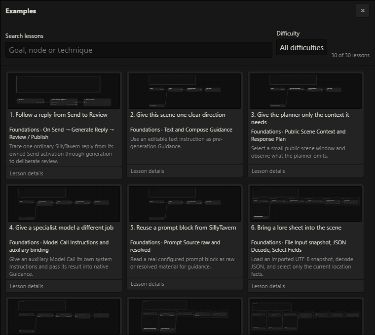

# Thirty example workflows

[Documentation](README.md) · [Unified setup](unified-workflows.md) · [Node reference](node-reference.md)

**File → Open examples…** supplies 30 independent lessons. Search by goal or node technique, filter difficulty, and open lesson details for requirements, steps, checkpoints, experiments, cases and call budgets. Opening creates an independent editable copy as the active document after guarding modified work. It makes no model request and does not change **Enable Lattice**. Descriptions, comments and named nodes retain teaching instructions after import/export. Portable roots live in [examples/remastered](../examples/remastered/).

Every lesson has its own On Send → Generate Reply → Review / Publish lifecycle. Earlier lessons are useful preparation, not installation dependencies. Foundations covers 1–8, Composition 9–17, Advanced 18–26 and Capstone 27–30.

## Set up a safe copy

1. Use a disposable chat and select the actual native reply character. Adapt demonstration actor IDs, item IDs, aliases and instructions deliberately. Canonical actor IDs normally use `character:<avatar filename>`.
2. Read the lesson requirements and call budget. Inspect its named checkpoints in Preview; independent copies retain aliases while internal IDs change.
3. Bind every ordinary model node to **Active SillyTavern model** or a local Connection profile. The main reply uses SillyTavern's normal connection. Model Call's **Instructions** is its system message; Prompt Source supplies material. Character Direction uses its own literal `systemPrompt`. Its optional Data input supplies projected State or file values; public data or data from that exact same actor grant stays within the actor request.
4. Configure **For Each → Helper model bindings** separately. Pure helpers need no model; model-backed helpers make bounded requests per item.
5. Authorize live logical document targets in **Tools → Workflow Data…**, in the selected user/chat/actor scope, and initialize the shapes named by the lesson. These are not arbitrary OS paths. File Input imports a UTF-8 snapshot; it does not authorize a live file.
6. Resolve validation/binding issues, keep the configured document open, and select **Enable Lattice**. Send normally in SillyTavern. Manual inspection does not start another native reply or queue recall.
7. Compare the proposed body and staged effects at Review / Publish. Apply preserves the native original as a swipe and settles this reviewed result's authorized effects. Reject leaves accepted-policy effects unapplied.

Auxiliary calls are additional to native generation. The lesson budget includes authored branches and finite helper iteration; enabling fallback or enlarging limits can change it. Preview and retries can spend provider tokens. Local connection IDs/credentials are not portable permissions.

## Choose a lesson

| # | Independent goal | Dominant technique and visible check |
| --- | --- | --- |
| 1 | Follow a reply from Send to Review | Owned native Draft reaches Review; zero auxiliary calls. |
| 2 | Give this scene one clear direction | Text → Compose Guidance reaches the native prompt. |
| 3 | Give the planner only the context it needs | Public Scene Context → Response Plan, with omissions. |
| 4 | Give a specialist model a different job | Separate Model Call Instructions, material and binding. |
| 5 | Reuse a prompt block from SillyTavern | Compare Prompt Source raw and resolved text. |
| 6 | Bring a lore sheet into the scene | Decode a File Input snapshot and select JSON fields. |
| 7 | Let a second model polish the narration | Compare narration revision and protected literals. |
| 8 | Add an Observed Items dropdown | Reply Snapshot → Extract → Render Notes → Append. |
| 9 | Show a travel card only when there is a destination | Condition → Branch → Join preserves a skipped Draft. |
| 10 | Decide whether this scene needs a recap | Keyed Decision answers, including unresolved. |
| 11 | Detect a promise with Decision | Nullable accepted answer with explicit Branch routes. |
| 12 | Plan, write, polish, and annotate one reply | Grouped planning, revision, extraction and enrichment. |
| 13 | Build one reusable item-card processor | Exact pinned pure helper reused with parameters. |
| 14 | Give every clue its own explanation | Bounded For Each model helper and ordered results. |
| 15 | Keep useful context within a budget | Context Join, Smart Compactor and protected omissions. |
| 16 | Consult the current campaign notebook | Authorized live Read File contrasted with snapshot. |
| 17 | Record only the scene you accept | Format → Project Document → staged Write to File. |
| 18 | Let existing memories shape the next reply | Memory Read/Recall, Reflect/Express and scoped Character Direction. |
| 19 | Turn narrated actions into confirmed events | Exact Draft evidence → Normalize → Confirm Events. |
| 20 | React when an item is actually used | Actual Player source, ordered events and Current Holder. |
| 21 | Give one present character their own direction | Genuine Scene Presence and selected actor direction. |
| 22 | Let an item remind its actual holder | Mention, confirmed ownership and private Prompted Memory. |
| 23 | Advance the story clock when the scene is accepted | Explicit Advance Time and accepted Clock Commit. |
| 24 | Make curses and routines happen on schedule | Midnight, 14:00 and anchored 480-minute crossings. |
| 25 | Award experience from confirmed progress | Generic State rules, thresholds and identity ledger. |
| 26 | Recall a memory with a hotkey or a story trigger | Authorized record ancestry and explicit queue policy. |
| 27 | The broken wand: stable randomness with a wild branch | Confirmed use/holder, saved draw, novelty and Outcome Commit. |
| 28 | The soul-stealing sword: an event ledger and a threshold | Unique confirmed kills, 99→100 and conditional revision. |
| 29 | One kiss, two private perspectives | Shared evidence, separate private reflections/receipts. |
| 30 | A relationship that changes slowly over weeks | Directional State, caps/cooldowns and story-minute decay. |

## Sources, fixtures and acceptance

Each input has a teaching home: On Send/Generate Reply in 1, Text in 2, public Scene Context in 3, Prompt Source in 5, File Input in 6, Reply Snapshot in 8, authorized Read File in 16, native Memory in 18, Draft Event Source in 19, Player Event Source in 20, Story Clock in 23 and actor-scoped Actor Context in 29. Imported JSON cannot manufacture native Draft ownership, confirmed events, private grants, document references or clock settlement authority.

The [disposable fixture files](../examples/remastered/fixtures/) supply the required demonstration shapes. Initialize the named document shapes in a test chat. Format validates/serializes; prose needs Extract to become records. Retain the genuine Read File reference for same-target projections. File, memory, clock and outcome proposals remain pending until their configured acceptance path settles. Multiple files have separate receipts, with no atomic promise; inspect partial failures before using supported retry/reconciliation.

Events require closed actor/item identities and exact unchanged evidence. Mentioned, proposed, negated, hypothetical or remembered actions do not become confirmed occurrences. Current Holder needs explicit prior ownership and confirmed ordered events. Consumed event identities must not award progression or reroll randomness again. The sword ledger grants one soul per canonical victim; repeating that victim with different source evidence deliberately holds as `IDENTITY_CONFLICT` for reconciliation, preserving the accepted ledger.

Seed time with the **Story clock template** in an authorized JSON target. Forward integer story minutes differ from wall clock and message count. Midnight is 0, 14:00 is 840, and eight hours is 480 minutes with an explicit origin. Interrupt retains remainder; finite catch-up can hold at its limit. Accepted Clock Commit consumes genuine projected due IDs.

Private portrayal, Recall dispatch and paired reflections require genuine participation and scoped authorization. Selected-actor private file reads in lessons 26 and 30 use the selected actor’s own authority; those reads do not require a presence grant. Actor Context is separate per actor. Only the selected native actor receives permitted private native Guidance. Shared kiss evidence and model-authored reflection remain labeled separately; private material never becomes public notes. Lesson 29 deliberately holds missing kiss evidence with no Review handle or private reflection writes; its required shared-evidence barrier is explicit. Rejected and unresolved confidence skip reflection while preserving the ordinary reviewed Draft; an unresolved metric remains explicit rather than accepted. Both actors must be genuinely present before either reflection; absence skips both private legs and unresolved participation holds. Each actor's reflection permission defaults to false and must be configured separately. Relationship rules feed bounded projected values into Character Direction's Data input. Its exact live output can guide only the selected native actor; generic Model Call → Compose does not authorize private native Guidance. An absent actor receives no private portrayal call, while accepted elapsed-time decay may still update that selected actor’s authorized state without inventing an interaction. These rules influence NPC portrayal, while player choices remain explicit.

Lesson 18 reads genuine native actor state and episodes, then gives its private Reflect/Express result to Character Direction through Data. Its post-stage Internalize uses the exact settled native events; each accepted proposal receives its own transaction key. Retained memory remains tied to the exact accepted native revision. Later text edits, selected-swipe changes, deletion or revoked visibility invalidate that evidence; a changed narrative needs new extraction rather than an old swipe fallback. Lesson 22's Prompted Memory recalls existing episodes from the selected actor's native memory store. The separate `rowan-item-memories` Workflow Data target is an output ledger: initializing it to `[]` supplies no native recall episode. Default recall never invents history; opt-in creation needs explicit permission and remains a pending proposal.

For Recall, use **Queue recall** from the node context menu, **Details → Memory recall**, **Node → Memory recall**, or the configured shortcut. Matching Recall and Recall Shortcut cards show green queued or amber pending badges; click a badge to inspect its policy. Previewing Recall Shortcut does not queue it. Native Recall serves the selected actor; accepted consumption needs the exact reviewed result. See the [Recall lifecycle](unified-workflows.md#queue-memories-manually-or-recall-them-automatically).

Saved native-unified workflows and earlier unified example IDs remain supported. The visible picker contains the new 30 lessons. Retired native-pre/native-post roots are preserved in a cold recovery archive and cannot execute, open as current documents, or import into current workflows. **File → Export archived workflows…** downloads that archive without requests or conversion; use the [rebuilding steps](unified-workflows.md#move-an-existing-prepost-setup) to recover a useful process in a new unified graph. Reconfigure local connections and document authorization after importing.
