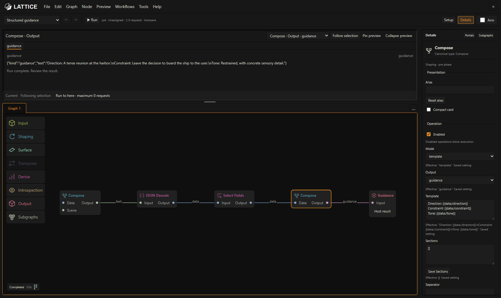
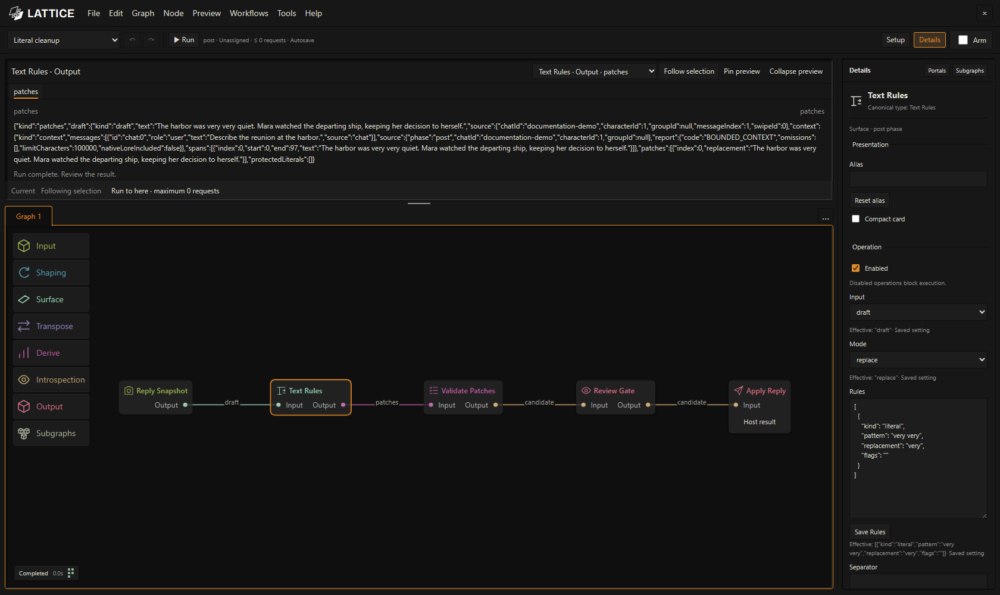

# LATTICE quick start

[Documentation](README.md) · [Unified workflows](unified-workflows.md) · [Operator's manual](operators-manual.md) · [Node reference](node-reference.md)

Start with one unified graph around ordinary SillyTavern generation. Then explore two zero-auxiliary-call legacy tools for structured guidance and literal cleanup.

## Open the workspace

Install from `https://github.com/MentallyQuill/Lattice` in SillyTavern's **Extensions → Install extension**, leaving the branch field blank. Reload, then open the LATTICE logo on the left of the chat bar or type `/lattice`.

Fresh launch opens **Unified story workflow**, with Lattice disabled. Existing installations restore their recovery draft; older saved workflows are available through **File → Recover previous workflows**. Use **File → Open examples…** for an independent copy or a different example. Opening and importing make no provider request and do not change **Enable Lattice**.

Use **File → Save workflow** or **Save As…** to save the editable document to disk. Browsers without direct file access offer **Download JSON…** instead. A recovery draft retains committed work across reloads; it does not save the file on disk. **Open Recent** reopens previously accessed files in supported browsers. See [save, import, and share](operators-manual.md#save-import-and-share) for modified-document prompts and recovery.

The default **Ember** theme follows SillyTavern's panel, text, control and quote colors, with a neutral canvas and translucent node fills. **Tools → Theme and colours** offers eight themes: Ember, Lattice, Ash, Graphite, Slate, Obsidian, Harbor and Signal. Choose one or customize its colors and look.

**Harbor** uses blue and amber, while **Signal** uses high contrast grayscale. Both identify connection types with labels, distinct pin shapes and wire patterns. Their visible picker legend explains the cues; example thumbnails use the same shapes and patterns.

## Run your first unified workflow

The starter is **On Send → Generate Reply · SillyTavern → Review / Publish**. It makes no auxiliary model requests; the normal native reply still uses your SillyTavern connection.

1. Open the story and select its native character in SillyTavern. For the Story-2 example, use default-user and the Story-2 chat.
2. Keep the starter open, then select **Enable Lattice**.
3. Send a player message in SillyTavern normally. The starter waits for that generation’s completed Draft and records its review result.
4. Select **Review / Publish · Host result** in Preview. Inspect the original and candidate; Apply preserves the original as a swipe and publishes the chosen result, while Reject leaves it alone. The unchanged starter is useful for learning the review path.
5. Open a unified example from **File → Open examples…** to add preparation, prose editing or notes. Configure every model node and For Each helper role in Details before sending. Authorize document targets in **Tools → Workflow Data…** when the example needs them.

A full unified Run requires the native generation owned by Send. **Run to here** previews supported dependencies without accepting effects. See the [practical unified guide](unified-workflows.md) for one-graph model chains, Fast Decision, Recall, clocks and file writes.

## Build and inspect a legacy brief

Open **Build a brief from JSON** in the example picker, or [Structured guidance](../workflows/structured-guidance.json) with **File → Open workflow…**. This legacy pre example is:

```text
Compose (JSON source) → JSON Decode → Select Fields → Compose (Guidance) → Guidance
```

1. Click **Run**. Select each node to see its recorded result in Preview.
2. Select the first **Compose**. In **Sections**, change the JSON's `direction` and `constraint` strings. Keep the JSON valid, then click **Save Sections**.
3. Run again. Select the second **Compose** and inspect the Guidance artifact.
4. Experiment with another field, such as `tone`: add it to the source JSON, add a mapping in Select Fields, and add `Tone: {{data:/tone}}` to the final template.



*The captured example adds tone and uses synthetic harbor-scene material. The supplied starter begins with direction and constraint.*

This example needs no connection profile or existing reply. A manual run previews the brief. To use it with normal sends, keep this Pre document open and select **Enable Lattice**. Send executes the open Pre workflow and installs its optional guidance for that generation.

## Propose an exact legacy reply edit

Open [Literal cleanup](../workflows/literal-cleanup.json) with **File → Open workflow…** and wait for a completed text-only assistant reply. Its rule changes `very very` to `very`; a reply without that phrase proposes no change.

1. Select **Text Rules**. Inspect Draft input, replace mode, and the Rules JSON.
2. If needed, change the literal pattern/replacement to text in your latest reply, then click **Save Rules**.
3. Click **Run**.
4. Select **Apply Reply · Host result** in Preview output.
5. Read `original`, revised `text`, and changes in its candidate artifact. Choose **Apply reviewed candidate** or **Reject candidate**.



*Text Rules proposes Patches. The downstream stages validate and expose a reviewed root result; they do not automatically edit the reply.*

Apply rechecks the source and creates a new swipe preserving the original. Editing the source or switching chat/swipe may invalidate the candidate. See [reply review and persistence limits](native-workflows.md#review-a-reply-repair).

## Explore the toolset

Unified examples keep their preparation and response branches in one editable graph. Legacy examples below remain useful as explicit tools and material for adapting a copy. There is no automatic pre/post converter.

| Example | Phase | Maximum auxiliary calls |
| --- | --- | ---: |
| [Structured guidance](../workflows/structured-guidance.json) | Pre | 0 |
| [Literal cleanup](../workflows/literal-cleanup.json) | Post | 0 |
| [Scene guidance](../workflows/native-guidance.json) | Pre | 2 |
| [Reviewed AI De-slop](../workflows/reviewed-de-slop.json) | Post | 1 |

For model-backed examples, select each model-calling node and choose its **Connection profile** in Details. The profile supplies the model by default; choose a model override when needed. Manual runs can spend tokens, and Send does not reuse a manual guidance result.

Next, read the [operator's manual](operators-manual.md) to discover nodes, connect pins, open subgraph tabs, customize instances, and inspect recorded outputs. Use the [node reference](node-reference.md) to design a process beyond the starter examples.
