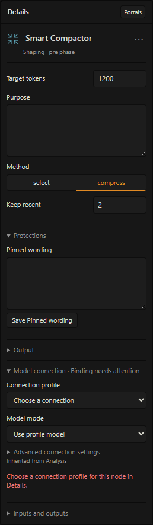
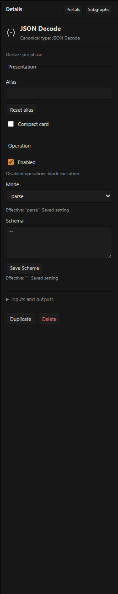
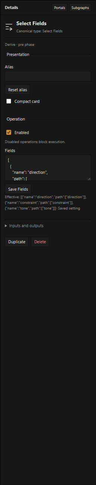

# LATTICE node reference

[Documentation](README.md) · [Unified workflows](unified-workflows.md) · [Operator's manual](operators-manual.md) · [Model setup](native-workflows.md)

This reference covers the registered reusable operations, their implemented modes, and the structural nodes used by subgraphs. A starter is a complete workflow built from operations; a subgraph is a reusable process with its own interface. Neither is an extra model engine.

## Read the graph's types

| Artifact | Carries |
| --- | --- |
| Context | Selected messages, source identities, and context/preservation reports |
| Draft | Frozen reply text, source identity, and any selected spans/findings |
| Text | Plain text for deterministic transformation or assembly |
| Data | JSON-compatible structured values |
| Guidance | Optional writing direction ready for a bounded host output |
| Patches | Proposed replacements tied to a frozen Draft |
| Candidate | Validated revised text together with the original and review information |

A **Unified** graph contains Preparation and Response stages around one owned Generate Reply boundary. Configure both-stage nodes in the intended stage and wire their dependencies explicitly. Legacy **Before reply (Pre)** graphs still prepare guidance before normal Send; legacy **After reply (Post)** graphs remain manual completed-reply tools. A stage does not turn ordinary Text into a reply Draft. Reply sources and host outputs enforce their own phase and context requirements. An input accepts one connection and an output can feed multiple consumers. There is no implicit conversion between Text, Data, Context, and Draft.

Model calls below are maximum auxiliary calls **per execution of that operation**. A subgraph's total depends on its expanded body and how many instances run. Deterministic operations require no model profile. Stage/type validation and model bindings may block a full workflow before execution. A skipped path is distinct from an unresolved path; native sources, publication and other root-only operations retain their authority requirements.

## Operation index

| Family | Operation | Phase | Artifact flow | Calls |
| --- | --- | --- | --- | ---: |
| Input | [Text](#text) | Both | Literal → Text | 0 |
| Input | [File Input](#file-input) | Both | Imported snapshot → Text | 0 |
| Input | [Prompt Source](#prompt-source) | Both; root only | Configured host block → Text | 0 |
| Input | [Scene Context](#scene-context) | Pre | Source → Context | 0 |
| Input | [Reply Snapshot](#reply-snapshot) | Post | Source → Draft | 0 |
| Shaping | [Smart Compactor](#smart-compactor) | Pre | Context → Context | 0–1 |
| Shaping | [Context Join](#context-join) | Pre | Context × 2–16 → Context | 0 |
| Shaping | [Response Plan](#response-plan) | Pre | Context → Guidance | 1 |
| Shaping | [Compose](#compose) | Both | Optional Data/Text sections → Text or Guidance | 0 |
| Shaping | [Reroute](#reroute) | Both | Same artifact in and out | 0 |
| Surface | [Text Rules](#text-rules) | Both; Draft in Post | Text → Text, or Draft → Patches | 0 |
| Surface | [Repair](#repair) | Post | Draft → Patches | 0–1 |
| Transpose | [Style Transfer](#style-transfer) | Both; Draft in Post | Text/Draft + Text/Data reference; optional Context → Text/Patches | 0–1 |
| Transpose | [Format Transfer](#format-transfer) | Both; Draft in Post | Text/Draft + Text/Data reference; optional Context → Text/Patches | 0–1 |
| Transpose | [Terminology Map](#terminology-map) | Both; Draft in Post | Text/Draft + Data glossary → Text/Patches | 0 |
| Introspection | [Reflect](#reflect) | Both | Context + optional State/Episodes Data → Reflection Data | 1 |
| Introspection | [Internalize](#internalize) | Both | State + Events Data → State proposal Data | 1 |
| Introspection | [Express](#express) | Both | Reflection Data + optional evidence → Guidance or Text | 0–1 |
| Introspection | [Context](#context) | Both | Context inputs → Context | 0–1 |
| Introspection | [Memory](#memory) | Both; Commit Post | Scoped source → Data; Proposal Data → Host result | 0 |
| Introspection | [State](#state) | Both | State + optional Events Data → Snapshot/proposal Data | 0 |
| Derive | [Pattern Scan](#pattern-scan) | Post | Draft → Draft with findings/spans | 0 |
| Derive | [JSON Decode](#json-decode) | Both | Text → Data, or Data → Data | 0 |
| Derive | [Select Fields](#select-fields) | Both | Data → Data | 0 |
| Derive | [Validate Patches](#validate-patches) | Post | Patches → Candidate | 0 |
| Output | [Guidance](#guidance) | Pre | Guidance → Host result | 0 |
| Output | [Review Gate](#review-gate) | Post | Candidate → Candidate requiring review | 0 |
| Output | [Apply Reply](#apply-reply) | Post | Candidate → Host result | 0 |
| Input | [On Send](#on-send) | Preparation; unified root | Native activation → Data | 0 |
| Input | [Player Event Source](#player-event-source) | Preparation; unified root | Actual player turn → Data | 0 |
| Input | [Generate Reply · SillyTavern](#unified-lifecycle) | Native boundary; unified root | Activation + optional Guidance → Draft/metadata | 0 auxiliary |
| Output | [Review / Publish](#unified-lifecycle) | Response; unified root | Final Draft → reviewed Host result | 0 |
| Shaping | [Model Call](#model-call) | Both | Text + optional Context/Data → Text/Data | 1 |
| Surface | [Revise Draft](#revise-draft) | Response | Draft + optional Context/Data → Draft | 1 |
| Derive | [Extract](#extract) | Both | Draft/Text + optional Context → records Data | 0–1 |
| Shaping | [Enrich](#enrich) | Both | Data + optional Context → Data | 1 |
| Derive | [Draft Text](#draft-text) | Response | Draft → body/assembled Text | 0 |
| Surface | [Render Notes](#render-notes) | Both | Public Data → disclosure/plain Text | 0 |
| Surface | [Append / Combine](#append-and-combine) | Response | Draft + optional section Text → Draft | 0 |
| Derive | [Decision](#decision) | Both | Data/Text → typed judgment Data | 1 |
| Derive | [Fast Decision](#fast-decision) | Both | Data/Text → typed provider Data | 1–2 |
| Shaping | [Confidence Gate](#confidence-gate) | Both | Data → accepted/rejected/unresolved Data | 0 |
| Shaping | [Condition](#condition) | Both | Data → explicit comparison Data | 0 |
| Shaping | [Branch](#branch) | Both | Artifact + decision → yes/no/unresolved artifact | 0 |
| Shaping | [Join / Collect](#join-and-collect) | Both | Declared typed inputs → selected artifact/array Data | 0 |
| Shaping | [For Each](#for-each) | Both | Array + optional state → bounded helper results/state | Bounded |
| Events | [Draft Event Source](#draft-event-source) | Response | Owned Draft + scope → source Data | 0 |
| Events | [Event Normalize](#event-normalize) | Both | Source/entities/candidates or confirmed events/clock → Data | 0 |
| Events | [Item Mention Trigger](#item-mention-trigger) | Both | Source/entities + optional state → mentions/state | 0 |
| Events | [Item Use Trigger](#item-use-trigger) | Both | Source/entities + candidate or extraction → occurrences | 0–1 |
| Events | [Confirm Events](#confirm-events) | Both | Occurrences + judgments → confirmed occurrences | 0 |
| Events | [Current Holder](#current-holder) | Both | Ordered events + holders → attributed events/holders | 0 |
| Events | [Scene Presence](#scene-presence) | Both | Checked cast → one actor participation | 0 |
| Events | [Actor Context](#actor-context) | Both; root | Exact presence → authorized private Context | 0 |
| Events | [Character Direction](#character-direction) | Both | Exact presence → private Guidance | 0–1 |
| Events | [Prompted Memory](#prompted-memory) | Both | Presence + actual holder event → private proposal | 0–1 |
| Input | [Read File](#read-file) | Both; root | Authorized target + optional presence → Text/document/reference | 0 |
| Shaping | [Format](#format) | Both | Records/raw JSON → checked Data/serialized Text | 0 |
| Shaping | [Project Document](#project-document) | Both | Serialized source + mutation → projected Text/Data/receipt | 0 |
| Output | [Write to File](#write-to-file) | Response/Post; root | Live reference + mutation → staged projection/receipt | 0 |
| Collections | [Collection](#collection) | Both | Data + optional Other/Match → derived Data | 0 |
| Randomness | [Effect Library](#effect-library) | Both | Data/JSON/plain Text → checked library | 0 |
| Randomness | [Random Pick](#random-pick) | Both | Confirmed events + library/saved → stable selections | 0 |
| Randomness | [Saved Outcome](#saved-outcome) | Both | Event + ledger → retained outcome | 0 |
| Randomness | [Effect Author](#effect-author) | Both | Generated selection + optional Data → proposed effect | 1 |
| Randomness | [Stage Outcome](#stage-outcome) | Both | Outcome + explicit novelty → resolved outcome | 0 |
| Output | [Outcome Commit](#outcome-commit) | Response; root | Resolved outcomes → staging receipt | 0 |
| Input | [Story Clock](#story-clock) | Both; root | Accepted target → clock Data | 0 |
| Shaping | [Advance Time](#advance-time) | Both | Clock + proposal/schedules → clock/events/remainder/report | 0 |
| Derive | [Time Trigger](#time-trigger) | Both | Previous/destination clocks → due events/report | 0 |
| Output | [Clock Commit](#clock-commit) | Response; root | Retained time projection → staged receipt | 0 |
| Recall | [Recall](#recall) | Both; root | Authorized records/presence/trigger → private Guidance/report | 0 |
| Recall | [Hotkey Arm](#hotkey-arm) | Both; root | Configured policy → descriptive arm proposal | 0 |

Open a shelf family to choose a node directly. Each operation appears once; choose modes and artifact kinds in **Details**. The **Subgraphs** family has Input/Output interface nodes and saved definitions. Interface nodes are available inside editable subgraphs. Right-click a wrapper to save it and right-click a saved shelf entry to delete it. **Transpose** contains Style Transfer, Format Transfer and Terminology Map; see [the reference library guide](lattice-reference-library.md). **Introspection** contains its original modes plus generic State progression/time-decay selected in Details; their named pins and controls change with the selected mode.

## Input

### Text

Supply literal multiline text, notes, custom instructions, or a reference passage. It has no inputs, makes no model request, and preserves the text without macro expansion. Edit **Text** in Details. Empty text is valid; the limit is 100,000 UTF-16 units. Text works in either phase and inside reusable subgraphs.

**Connect:** Text → Compose section, Style Transfer Reference, or JSON Decode.

### File Input

Choose a UTF-8 text file in Details. The filename and imported contents are saved with the node and included in portable workflows; execution uses that snapshot. Choose **Replace file** to refresh it explicitly. An empty imported file is valid, while an unloaded node fails visibly. File selection rejects invalid UTF-8, more than 400,000 bytes, or more than 100,000 UTF-16 units without replacing the previous snapshot. It works in either phase and inside reusable subgraphs.

**Connect:** File Input → JSON Decode → Select Fields → Compose. JSON is parsed by JSON Decode; this picker does not import a workflow package.

### Prompt Source

Read a configured host prompt block as Text. **Source → System** selects the enabled system template with supported host character/chat override rules. **Source → Prompt entry** selects a configured Prompt Manager entry by stable **Prompt ID**. Known disabled or inactive entries fail; if the host exposes no activation order, the snapshot reports its enabled state as unknown. This is the configured block, not the final assembled generation prompt.

**Form → Raw** preserves any bounded template. **Resolved** expands pure host name and formatting macros such as `{{char}}`, `{{user}}`, and `{{newline}}`. It rejects custom, state-changing, character-field, lore, random/time, angle-token macros, and literal brace fragments. Use Raw for structured templates with braces or broader macro syntax. Missing, disabled, unsupported, or oversized sources fail visibly. Prompt sources are frozen before execution and checked again before host settlement. Both phases are supported, at the root only; pass their Text into a reusable subgraph through a boundary. Exports retain selectors, not captured prompt text.

**Connect:** Prompt Source → Compose section, Text Rules, or Style Transfer Reference. Reading a prompt does not publish or replace it; Compose → Guidance supplies generation guidance.

### Scene Context

Read a bounded window of recent conversation and selected character fields available from SillyTavern. It produces a Context artifact with source identifiers and an omission report. It does not perform a fresh lore scan or reproduce the final assembled host prompt.

**Controls:** `recentMessages` (default 12), `includeCharacter` (default true), **Context visibility** (`actor` by default, or `public`). Public mode filters restricted messages/card material before budgeting and reports omissions. Use it for general observable-narrative model requests. The actor-perspective default is not a private actor grant; Actor Context provides that authorized private input.

**Connect:** Scene Context → Smart Compactor → Response Plan. Multiple Scene Context nodes can feed separate Context Join inputs.

### Reply Snapshot

Freeze the latest completed text-only assistant reply and its chat/message/swipe identity. That identity follows the Draft through proposed changes and is checked again before application.

**Controls:** no operation settings; the source is selected by the supported host reply contract.

**Connect:** Reply Snapshot → Text Rules for deterministic cleanup, or Reply Snapshot → Pattern Scan → Repair for model-assisted repair. An older, unfinished, tool/intermediate, or media reply is not a supported repair target.

## Shaping

### Smart Compactor

Fit a Context artifact to a target while retaining protected material. **Select** removes older flexible messages without a model. **Compress** may request one summary when needed and marks that summary as derived material. Inspection retains the original context and preservation report.

| Control | Meaning | Default |
| --- | --- | --- |
| `targetTokens` | Budget for the resulting context artifact | 1,200 |
| `purpose` | Purpose for context preparation | Empty |
| `method` | `select` or `compress` | `select` |
| `keepRecent` | Recent messages kept verbatim | 2 |
| `pins` | Case-sensitive literal strings whose containing messages stay verbatim | Empty |
| `maxTokens` | Completion cap for a compression request | 1,024 |



**Connect:** Scene Context → Smart Compactor → Response Plan. Missing protected literals or protected material exceeding the target produce an error; they are not silently removed. Compress uses the **Analysis** role by default.

### Context Join

Combine 2–16 Context inputs in declared slot order. Each required slot has a stable ID and visible label. Identical duplicate message IDs are deduplicated; conflicting material for the same identity fails. A report identifies retained and deduplicated material. Reintroducing material excluded by a compacted branch is reported.

**Controls:** **Inputs**, a JSON array such as:

```json
[
  { "id": "context-1", "label": "Selected context" },
  { "id": "context-2", "label": "Recent context" }
]
```

Changing slot IDs/order changes the operation; label changes are presentation. Its Inputs configuration is not an exposable subgraph parameter.

**Connect:** two Scene Context branches → Context Join → Response Plan. Connect every declared input. Review warnings if one branch brings back context another branch removed.

### Response Plan

Ask a bound model for optional direction, actor intentions, constraints, and possible next beats. The result is Guidance. Suggested events are proposals, not established story facts.

**Controls:** `instructions`, `maxTokens` (default 768), plus **Analysis** role and connection/model overrides. One auxiliary request.

**Connect:** prepared Context → Response Plan → Guidance. Set instructions to preserve the decisions you want the user to make. The completion cap and the downstream guidance budget are separate controls.

### Compose

Build text from named sections or a template. Compose can also produce Guidance directly, making structured writing briefs possible without a model call.

| Control | Meaning |
| --- | --- |
| Mode | `join` concatenates sections; `template` resolves explicit placeholders |
| Output | `text` or `guidance` |
| Template | Text with `{{section:Name}}` and `{{data:/path}}` placeholders |
| Sections | JSON records with unique identifier names and fallback text |
| Separator | Text placed between joined sections; default is a blank line |

Each section creates a named Text input, whose connected value overrides its fallback. The optional **Data** input supplies JSON pointer values to the template. A Compose node with literal sections can be a source with no incoming connection.

```text
Direction: {{data:/direction}}
Constraint: {{data:/constraint}}
Tone: {{data:/tone}}
```


**Connect:** Select Fields → Compose's Data pin → Guidance. Use `{{{{` to emit a literal `{{`. Missing sections/paths and invalid placeholders fail rather than producing incomplete guidance. These are Compose placeholders, not arbitrary scripting or host macro evaluation.

### Reroute

Carry one artifact unchanged through a compact routing point. Double-click a direct wire to insert a typed Reroute.

**Controls:** **Artifact kind** in Details selects Context, Draft, Patches, Candidate, Guidance, Text or Data. New shelf nodes default to Text; inserting one on a wire adopts the connection's kind. Its phase and kind must match the connection. A kind edit that would invalidate an existing wire is rejected without changing the node or its wires. It makes no model call and does not transform data.

**Connect:** place between compatible pins to organize a long connection or an output with several consumers. A portal is the separate option for replacing a visible wire with a named reference.

## Surface

### Text Rules

Apply a sequence of literal or regex rules. Text input can use **replace** or **extract** mode and produces Text. Draft input supports **replace** in the Post phase and produces Patches tied to the source reply for later validation and review.

**Controls:** Input (`text`/`draft`), Mode (`replace`/`extract`), Rules JSON, Separator for extracted results. Up to 64 rules; regex execution is bounded in a worker.

Draft mode also exposes Scope (`authorized` by default, or explicit `whole`/`narration`/`dialogue`) and Protected literals. Raw snapshots need an explicit construction scope; existing permissions, including an empty span set, can only narrow. Choose Input → Draft and an appropriate Scope in Details; the existing literal starter explicitly selects whole.

```json
[
  {
    "kind": "literal",
    "pattern": "very very",
    "replacement": "very",
    "flags": ""
  }
]
```

Rule kinds are `literal` and `regex`. Literal flags support `i`, `u`; regex flags support `i`, `m`, `s`, `u`, with no duplicate flags. Save Rules commits the validated configuration. Draft transformation proposes patches; it does not edit the chat directly.


**Connect:** Reply Snapshot → Text Rules → Validate Patches → Review Gate → Apply Reply. For text extraction, use a Text-producing Compose upstream and another Compose section downstream.

### Repair

Use a model to propose JSON patches for the selected spans in a scanned Draft. **repair** makes up to one request through the **Prose** role. **scan** makes zero repair requests.

**Controls:** `mode`, `strength` (default `light`), `instructions`, `maxTokens` (default 2,048), `protectedLiterals`, and model bindings. Strength is an instruction, not a measured preservation guarantee.

**Connect:** Pattern Scan → Repair → Validate Patches. The requested result is a raw patches JSON object. Malformed or unacceptable output fails without a whole-reply fallback or implicit retry.

**Cleanup modes:** Choose Inspect, Contextual Cleanup or Strict Avoidance in Details. Inspect returns unchanged Patches plus literal findings without a model. Contextual Cleanup and Strict Avoidance use at most one raw-prose Prose request with the complete selected policy. Categories, scope and protected wording are independent controls; choose the intended scope separately. Optional Context supports contextual policies. Exact source permissions are checked before proposal; semantic preservation still requires review. See [the reference library guide](lattice-reference-library.md).

## Transpose

New nodes use **Input type → Text**, accepting Text and returning Text in either graph phase or a reusable subgraph. Choose **Input type → Draft** in Post to accept a frozen reply Draft and return source-bound Patches. Saved nodes that omit Input type retain Draft → Patches behavior. Changing Input type or Reference changes the pins; incompatible connected edits are rejected until you disconnect or replace the affected wires.

Text output can feed a Compose section or another Text tool. Draft output follows Validate Patches → Review Gate → explicit Apply Reply. References guide expression and structure; they do not supply new story facts or reply-application authority.

### Style Transfer

Transfer narration, character voice, rhythm or register from Text or Data reference material to Text or permitted Draft windows. Required inputs are Input and Reference; optional Context can supply relevant background. Text input returns Text; Draft input returns Patches. It makes at most one Prose request. Choose **Mode → Character voice** and **Scope → Dialogue** separately; changing Mode preserves the current Scope.

Controls include Input type, Reference (`text`/`data`), Mode, Scope, Strength, Instructions, Output tokens and Protected literals. Default scope is narration. Mode, Scope, Strength and Protected literals are independent controls. Connect Compose Text as the input or reference, or Compose → JSON Decode for a Data reference. For Draft edits, use the validation/review/apply path above.

### Format Transfer

Reorganize Text or permitted Draft material using a Text example or Data template. Text input returns Text; Draft input returns Patches, with at most one Prose request. Optional Context supplies background. Data may include `requiredContent`, exact strings that must already exist in the input text. Missing required content fails before a request. Controls match Style Transfer except its style mode; reference material cannot authorize new story facts.

### Terminology Map

Apply a Data glossary to Text or permitted Draft text without a model. Data is `{"entries":[{"from":"Captain","to":"Commander"}]}`. Controls are Input type, Scope, Protected literals, Case sensitive and Match (`word` or `phrase`). Unicode boundaries preserve offsets; replacements are simultaneous and never cascade. Text input returns Text; Draft input returns Patches for the same validation/review/apply flow.

## Introspection

Add one of the six canonical nodes from the Introspection family, then choose its **Mode** in Details. Character/Recall/Scene, for example, are modes of Reflect rather than separate shelf nodes. Existing saved modes remain intact.

Introspection Data uses scoped versioned records with evidence references. Plain JSON Data from JSON Decode is not an actor-state, reflection or events record. A proposal does not change memory until a root Memory Commit settles. Modes preserve observation, interpretation and possibility labels; supplied evidence cannot decide the player's actions or private state.

### Reflect

Use one **Analysis** request to appraise supplied evidence. **Character** considers beliefs, goals, relationships and conflicts; **Recall** connects supplied episodes to present evidence; **Scene** considers conditions, opportunities, pressures and attention. Output is Reflection Data, a candidate assessment.

**Pins:** required `context` (Context); optional `state` and `episodes` (Data); `out` (Data). An unwired State pin uses the active actor's empty scoped state for the assessment; wire Memory Read State to include stored state.

**Controls:** Mode, Output tokens (`maxTokens`, default 2,048), Instructions. Recall cannot invent an episode ID absent from the supplied records.

**Connect:** Scene Context → Context Focus → Reflect Character → Express Behavior. Memory Read State can feed Reflect's `state` pin. The [Reflect and express starter](../examples/introspection/native/reflect-and-express.json) ends in Guidance.

### Internalize

Use one **Analysis** request to propose actor updates from settled events. **Experience** extracts supported experience updates; **Pattern** interprets supported recurrence; **Recovery** considers temporary conditions while retaining guarded beliefs and unresolved consequences. Enduring traits cannot be rewritten.

**Pins:** required `state` and `events` (Data), `out` (state-proposal Data). Both input records must match scope, store and prior version.

**Controls:** Mode, Output tokens (`maxTokens`, default 2,048), Instructions. Changed items require exact references to supplied settled events.

**Connect:** Memory Read State + Memory Read Events → Internalize Experience → Memory Commit in a Post root graph. Inspect the proposal with Run to here; a full root Run with Commit may write it.

### Express

**Behavior** and **Attention** render the reflection's corresponding hints as Guidance without a model. **Inner Voice** uses at most one **Prose** request to produce fictional Text. Inner Voice is authored characterization, not access to private model reasoning.

**Pins:** required `assessment` (Reflection Data); optional `state`, `events`, `episodes` (Data) and `context` (Context). `out` is Guidance for Behavior/Attention and Text for Inner Voice. Supporting records must match the assessment's identity and evidence.

**Controls:** Mode, Output tokens (`maxTokens`, default 2,048), Instructions. Output tokens applies to Inner Voice's request; deterministic modes do not resolve a model.

**Connect:** Reflect → Express Behavior → Guidance. Express Inner Voice can feed a Compose Text section. Changing mode changes the output type, so review incompatible connections.

### Context

**Assemble** joins ordered Context inputs and rejects conflicting duplicate identities. **Perspective** retains only messages whose explicit `visibleTo` array includes the chosen Actor ID; unmarked messages are omitted. The default Actor ID `character` resolves to the active host actor. Visibility applies to the returned artifact; independently assembled prompts may contain other material. **Focus** selects or compresses Context using the same protected-material contract as Smart Compactor.

**Pins:** Assemble has required `in1`…`inN` (Context), with Inputs (`inputCount`) from 2 to 16. Perspective and Focus have required `context` (Context). All modes produce Context on `out`.

**Controls:** Assemble: Inputs. Perspective: Actor ID. Focus: Method (`select`/`compress`), Target tokens (default 1,200), Output tokens (default 1,024), Keep recent (default 2), Pins, Purpose. Selection makes zero requests; compression makes at most one **Analysis** request when needed.

**Connect:** Scene Context → Context Focus → Reflect, or Scene Context → Context Perspective → Reflect. The native host marks provided public chat and selected character material visible to its active actor, preserving explicit visibility exclusions. This identifies supplied material; it does not infer who witnessed an in-world event. Imported unmarked Context still requires explicit visibility for Perspective.

### Memory

**Read** returns the selected State, Events or Episodes view as Data. **Recall** finds bounded stored episodes using Query and Results (`limit`, default 8, range 1–64). **Commit** consumes a state proposal and is a Post terminal. All three modes require the root graph and use the active host chat/actor; group chats require a selected actor. Model output cannot choose a store or actor authority.

**Pins:** Read and Recall have no inputs and produce Data on `out`. Commit requires `proposal` (Data) and has **no output pin**. Its commit intent is recorded as a Host result for diagnostics.

**Controls:** Read: View (`state`/`events`/`episodes`). Recall: Query, Results. Commit: Commit key (`idempotencyKey`). The default `lattice-memory-commit` lets the native host derive a key from the graph, terminal and exact proposal. A custom key must identify one intended transaction; reusing it for changed content fails.

**Connect:** Memory Read State + Memory Read Events → State Track or Internalize → Memory Commit. One Memory Commit may appear in a Post root graph. In legacy post mode it settles after a successful full root Run; unified memory effects wait for the exact reviewed root acceptance. Settlement occurs after all selected branches succeed and checks fresh source revisions, actor/chat selection, cancellation and the store version before one compare-and-swap write. Public runner calls, previews, Run to here, dry-runs and failed runs never write. See [memory settlement and save status](native-workflows.md#actor-memory-and-state).

### State

State also supports **progression** and **time-decay**, alongside the original Value/Curve/Track modes. These are generic structures for authored numeric mechanics, not XP or relationship-specific nodes.

**Progression pins:** required state, rules and confirmed events Data; projected state on `out` and proposed receipt Data on `receipt`. A state contains unique named values and an identity ledger. Versioned rules address existing keys with add/set/clamp, explicit amount/bounds and identityFields; optional subject/object, scene/day caps, cooldowns, diminishing factors and zero-delta policy express pacing. Event Normalize progression supplies confirmed occurrence input; authored timestamps must agree with a wired effective clock. Repeated consumed identities do not advance values.

**Time-decay pins:** required state, rules and effective clock Data; the same proposed outputs. Authored decay rules identify target, baseline, unitsPerMinute, bounds and initialMinute, optionally matching subject/object. Elapsed story minutes move a temporary value toward baseline within bounds. Private state remains private. These pure modes do not read or commit Memory implicitly: persist an explicitly formatted canonical proposal through an authorized accepted path. See [generic progression](unified-workflows.md#generic-values-xp-souls-and-relationship-pacing).

Deterministically read or propose state with zero model calls. **Value** returns the state snapshot when Values is absent; configured Values propose numeric updates within Minimum/Maximum (defaults 0–1). **Curve** advances a bounded recovery curve toward Baseline through onset, peak, plateau, decline, aftermath and baseline. **Track** counts distinct settled event IDs; repeats do not advance it. These controls do not infer emotional truth.

**Pins:** optional `state` (Data), falling back to scoped Memory Read at the root. Track also requires `events` (Data). `out` is snapshot or state-proposal Data. Inside a subgraph, explicitly wire `state`; implicit Memory access is root-only.

**Controls:** Value: Values JSON object, Minimum, Maximum. For example `{"trust":0.35}`; arrays are invalid and fractional numeric bounds are supported. Curve: Curve ID, Steps (1–64), Decay (0–1, fractions allowed), Baseline (finite number), Phase durations JSON object, with positive integer durations (1–64) for `onset`, `peak`, `plateau`, `decline`, `aftermath`. Track: Track ID. Save object edits in Details before running.

**Connect:** Memory Read State + Memory Read Events → State Track → Memory Commit. The [Consequence clock starter](../examples/introspection/native/consequence-clock.json) makes zero model requests. State proposals never persist on their own.

## Derive

### Pattern Scan

Locate configured literal patterns, honor exemptions and protected wording, and attach findings/spans to the frozen Draft. Rules are personal editorial preferences.

**Controls:** `mode` (`literal`), `scope` (`whole`, `narration`, `dialogue`), `caseSensitive`, `rules`, `exemptions`, `protectedLiterals`.

**Connect:** Reply Snapshot → Pattern Scan → Repair. Dialogue means paired straight or curly double quotes. Single quotes and apostrophes are ordinary text; unmatched double quotes block narration/dialogue scanning with an issue.

### JSON Decode

Add **JSON Decode** from Derive, then choose **Mode → Parse** or **Check** in Details. **parse** converts raw JSON Text to Data. **check** receives Data and validates it. An optional Schema is entered as raw JSON text; blank means no schema. Markdown fences are not part of a raw JSON payload.

**Controls:** Mode (`parse`/`check`), Schema, **Save Schema**.



The supported schema subset includes `type`, `enum`, `const`, `properties`, `required`, boolean `additionalProperties`, `items`, array/string length limits, and numeric `minimum`/`maximum`, plus descriptive metadata. It is not a full JSON Schema implementation; unsupported keywords fail.

**Connect:** a Compose source containing JSON → JSON Decode → Select Fields. Parse errors and schema mismatches block downstream processing.

### Select Fields

Read paths from Data and emit a new Data object with chosen names. Use arrays of string keys and numeric array indices to address nested values.

**Controls:** Fields JSON, **Save Fields**. Up to 128 unique named mappings.

```json
[
  { "name": "direction", "path": ["direction"] },
  { "name": "tone", "path": ["style", "tone"], "required": false, "default": "restrained" }
]
```

Fields are required by default. A missing optional field is omitted unless a default is provided. The node selects structured values; it does not infer missing facts from prose.



**Connect:** JSON Decode → Select Fields → Compose's Data pin. Match Compose placeholders to the output field names.

### Validate Patches

Validate the proposed changes against the frozen source and build a Candidate. Reject malformed patches, unknown or duplicate span indices, blank replacements, changes outside selected spans, and removed protected wording. Unselected text is restored from the original.

**Controls:** no operation settings.

**Connect:** Text Rules or Repair → Validate Patches → Review Gate. Rejection retains the source reply; no automatic rewrite is attempted.

## Output

### Guidance

Expose a Guidance artifact as the workflow's host result and enforce its token budget.

**Controls:** `budgetTokens` (default 768).

**Connect:** Response Plan or Compose with Guidance output → Guidance. A manual Run records a preview. On an assigned, enabled pre workflow, Send installs the bounded guidance for that generation and clears it afterward.

### Review Gate

Pass a Candidate onward with an explicit review requirement. This is a stage of the graph; the user reviews the root result in Preview.

**Controls:** no operation settings.

**Connect:** Validate Patches → Review Gate → Apply Reply. A candidate passing this node does not mean the user has accepted it.

### Apply Reply

Expose the final Candidate as a root Host result. Running the node prepares the review action; it does not automatically write the reply.

**Controls:** no operation settings. After a full root Run, select **Apply Reply · Host result** in Preview and inspect the original/candidate before **Apply reviewed candidate** or **Reject candidate**.

**Connect:** Review Gate → Apply Reply. Apply checks source freshness and retains the original swipe. A target Run to here and intermediate node output cannot authorize application. See [reply review and persistence limits](native-workflows.md#review-a-reply-repair).

## Subgraph nodes

| Structural node | Purpose | Settings and behavior |
| --- | --- | --- |
| **Subgraph instance** | Use a pinned reusable definition as one node | Interface pins, exposed parameter overrides, role/node binding overrides; call bound comes from the expanded body |
| **Input boundary** | Bring an interface input into the body | Typed output corresponding to an exposed input |
| **Output boundary** | Return a body result through the interface | Typed input corresponding to an exposed output |

Boundary nodes belong to the subgraph interface. Click one to edit its name, type, and required setting in Details. Add or delete boundaries like ordinary nodes; deleting a boundary also removes its attached parent and body connections. Pinned definitions open read-only. Right-click a wrapper and choose **Make editable copy** for private body edits. Use **Add to Subgraphs** to explicitly save a new shelf entry or update an existing one; placed copies keep their saved contents.

The supplied [Literal cleanup subgraph](../workflows/subgraphs/literal-cleanup.json) exposes Draft → Patches and a Rules parameter. Keep native sources and final application/review authority in the parent. Legacy Draft→Patches tools retain Validate Patches, Review Gate, and Apply Reply; a unified final Draft can end in Review / Publish. See [the manual's subgraph walkthrough](operators-manual.md#reuse-a-process-with-subgraphs).

## Unified lifecycle

These four nodes belong to a native-unified **root** workflow. They cannot be hidden inside an iteration helper or imported to manufacture a native generation owner.

### On Send

**Preparation; zero auxiliary calls.** Exposes the actual owned Send activation as Data. Connect `activation` to Generate Reply's required `activation`. It is not a timer, general event bus or model request. A full unified run needs one selected On Send and its matching native continuation.

### Player Event Source

**Preparation; zero calls.** Returns Data for the actual captured player turn: bounded text, scene/watch/source/revision identities. Repeated reads keep that turn's identity; a later identical message is distinct. Restricted player text is held. Connect to Item Mention Trigger, Item Use Trigger or a bounded interpretation model. No controls are required. Manual bounded inspection does not accept an event or save an outcome.

### Generate Reply · SillyTavern

**Native boundary; zero auxiliary calls.** Inputs: required activation Data and optional Guidance. Outputs: completed source-bound Draft and generation metadata Data. It uses SillyTavern's main connection, with **Guidance token budget** (default 768, range 1–8,192) for LATTICE's contribution. One boundary belongs in a unified root; an auxiliary model connection does not replace this owner. Native generation starts through ordinary Send. Its completed Draft is the source for response branches.

### Review / Publish

**Response terminal; zero calls.** Input: final Draft. Produces the root Candidate/Host result for Preview's explicit **Apply reviewed candidate** or **Reject candidate**. A full selected result and fresh native source are required. Apply creates a new swipe preserving the original and settles the chosen root's staged effects; this node does not automatically publish when it executes. See [acceptance and persistence](unified-workflows.md#keep-acceptance-and-saving-distinct).

## Model chains and reply assembly

### Model Call

**Both stages; one Prose request.** Required `prompt` Text; optional `context` Context and `data` Data; `out` is Text or Data according to Output. Controls: Instructions, Output, Output schema, Completion limit. Data output requires bounded raw JSON matching the supported schema when supplied. This is an independently bound auxiliary model, not the native generation boundary. Hidden/mixed inputs are refused; an actor-private request needs exact current same-actor grants.

### Revise Draft

**Response; one Prose request.** Required `draft`; optional Context and Data references; returns a source-bound revised Draft. Controls: Instructions, Editable scope (`authorized`, `whole`, `narration`, `dialogue`), Protected literals, Completion limit. Explicitly authorize the scope on an initial native Draft; later passes can only narrow its permissions. Changes preserve source identity for final review. Neither a Text result nor a copied source label supplies publication authority.

### Extract

**Both stages; zero calls in literal mode, one Prose request in model mode.** Source is Draft or Text according to **Source**; optional Context; output is record Data. Controls: Mode, Instructions, Record schema, Literal patterns, Completion limit. Patterns use unique IDs, literal text and labels. Draft extraction uses the narrative body rather than appended annotations. Model records are interpretations/proposals until the relevant validation and event-confirmation path accepts them.

### Enrich

**Both stages; one Prose request.** Required record Data and optional Context produce enriched record Data. Controls: Instructions and Completion limit. Use it to add bounded context to extracted items before public Render Notes, or within a same-actor private branch. It does not turn possibilities into canonical events or declassify private records.

### Draft Text

**Response; zero calls.** Required Draft produces Text. **Text view → body/assembled** chooses narrative body or the body plus annotations. The Text view does not retain Draft application authority; continue the original Draft separately when using text for comparisons or summaries.

### Render Notes

**Both stages; zero calls.** Required player-visible Data becomes Text. **Title** and **Presentation → html/text** control display. HTML produces a notes disclosure section suitable for Append. Private/hidden records cannot be rendered as public reply notes. Notes are presentation material, not canonical narrative evidence.

### Append and Combine

**Response; zero calls.** Required `draft`, optional `section` Text, `out` assembled Draft. Combine currently exposes **Mode → append**; Append supplies the same explicit section behavior. Controls: stable Section identity and Separator. Reusing a section identity replaces that section rather than accumulating duplicate notes. A skipped optional section leaves the body usable; privacy and source ownership remain attached. Connect Render Notes → section and the narrative Draft → draft, then Review / Publish.

## Decisions and control

### Decision

**Both stages; one text request through the Decision role.** State input is Data or Text; output is a strict Data decision record. Controls: State input, keyed Questions, Decision token limit. Questions use `noul`, `choice` or `score`; choices/rubrics are authored. Text noul answers have `accepted: true/false/null`, optional short evidence and self-reported confidence. Bind an ordinary local Connection profile. A null answer stays unresolved until an explicit downstream policy handles it.

### Fast Decision

**Both stages; one typed request, at most two when explicit fallback is enabled.** Uses the same State and Questions contract, plus **Fast connection**, **Allow Decision fallback**, supported **Fallback on errors** and a separate **Fallback text connection**. Configure Jev/Laya/compatible endpoints in **Tools → Fast connections…**. Typed noul answers expose a probability in `answers.<id>.noul`; choice/score answers expose checked alternatives, distributions and confidence. No implicit probability-to-boolean threshold is applied. Fallback returns ordinary Decision answers, not invented typed probabilities. See [setup and gates](unified-workflows.md#decision-fast-decision-and-confidence).

### Confidence Gate

**Both stages; zero calls.** Data input, mutually exclusive `accepted`, `rejected`, `unresolved` Data outputs. Controls: Metric path (array of keys), acceptance minimum, rejection maximum and higher/lower direction. Thresholds must not overlap. Missing/nonfinite metrics and the middle region route unresolved. Output wraps the original decision and explicit accepted result when resolved. It expresses policy rather than proof of an event.

### Condition

**Both stages; zero calls.** Compare a Data path with authored `equals`, `not-equals`, `exists`, `nonempty`, `greater-than`, `at-least` or `less-than`. Controls: Path, Operator, Value. Output Data carries `accepted`, actual value and operator. Missing comparison data is unresolved except for the explicit exists test. Ordered comparisons require finite numbers.

### Branch

**Both stages; zero calls.** Required typed artifact and condition Data; mutually exclusive same-kind `yes`, `no`, `unresolved` outputs. **Artifact kind** selects its pins. Reads a boolean or explicit `accepted`; it does not guess from a score or nonempty object. Unselected outputs are skipped, distinct from unresolved.

### Join and Collect

**Both stages; zero calls.** Declare 1–16 unique typed input slots with explicit required flags. Join returns the first/last available artifact according to Selection; Collect returns a Data array of the completed contributions in declared order. Optional skipped slots can be omitted. An unresolved input or skipped required contribution holds the output. Connect both alternative branches to a Join with suitable optionality when you want one surviving Draft.

### For Each

**Both stages; bounded helper calls.** Required array Data and, in **projected-state** mode, required explicit state Data. Outputs: result array Data and projected state Data. Controls: exact pinned Helper, Limit (1–128), Request bound per iteration (0–16), Mode (`map`/`projected-state`). The total bound is their product; nested helpers share the run's finite budget and bounded nesting.

Choose an existing pinned Data item/result helper in **Configure node**. **Details → Helper model bindings** offers the actual helper's text role selectors, selected-profile model default and custom model overrides, including recursive roles. Explicit nested/primitive choices win over an outer role override and are reported. Root-only host authority operations are not iteration helper bodies. The collection is processed in deterministic order; over-limit or invalid helper paths hold before partial effects. Imported local profile IDs are omitted and must be selected locally. See [model binding behavior](unified-workflows.md#choose-a-different-model-for-each-job).

## Events and actors

### Draft Event Source

**Response; zero calls.** Required native/source-bound Draft and authored scope Data; output source Data includes current scene, actor/item identities, source revision and narrative text. Appended notes are excluded. Downstream provenance uses the exact source producer; arbitrary imported metadata cannot impersonate it.

### Event Normalize

**Both stages; zero calls.** **Candidates** mode takes source, entities and candidate Data and produces checked canonical occurrences with exact source quotes/positions and authored actor/item identities. **Progression** mode takes confirmed events and optional effective clock, producing generic State occurrence input. Controls: Mode, Event type and optional explicit Absolute minute. A clock timestamp and an authored minute must agree when both are supplied. Normalization does not confirm an interpretation.

### Item Mention Trigger

**Both stages; zero calls.** Inputs: source Data, entities Data, optional prior activation state. Outputs: mention occurrences and updated trigger state. Controls: Actor ID, Item ID, bounded literal Aliases, Watch, Activation (`per-occurrence`, `once-per-source`, `edge-once`), Case sensitive. Watch identifies player-message, draft, scene-context or accepted-event. Matching a word does not prove item use or a holder.

### Item Use Trigger

**Both stages; zero calls in Candidates mode or one eventExtract request in Extract mode.** Required source/entities Data; Candidates additionally requires candidate Data. Controls: Item ID, Mode, Watch, Instructions and Completion limit. Distinguishes proposed/negated/hypothetical use from actual candidate occurrences, retaining exact evidence. Follow it with a deliberate decision and Confirm Events before consequence rules.

### Confirm Events

**Both stages; zero calls.** Required event and decision Data; returns only confirmed actual accepted occurrences. **Mode → records/single-gate** selects a matched decision map or one explicit gate for a bounded single event. A true model flag cannot bypass source/evidence/identity checks. A compiled For Each confirmation helper can confirm an ordered batch; Collection flatten restores the result list without rewriting its canonical evidence.

### Current Holder

**Both stages; zero calls.** Required confirmed events and explicit holders Data; outputs ordered events attributed to their genuine holder plus updated holders. No controls. Transfers/loss/use follow the supplied event order; unknown/ambiguous ownership holds. This path supplies active-holder authority to Prompted Memory rather than trusting a model's invented holder label.

### Scene Presence

**Both stages; zero calls.** Required checked cast Data; **Actor ID** projects that actor's present/absent/unresolved participation with scene/source/revision/evidence. Native private access requires genuine source-derived quoted participation; a literal cast can be inspected but cannot acquire actor authority.

### Actor Context

**Both stages; root only; zero calls.** Required exact live presence Data, configured **Actor ID**, Context output. Provides that loaded actor's authorized card fields, filtered messages and memories with actor-private visibility. Absent skips; unresolved holds. Context and private file inputs for a model must belong to the same exact current actor grant. Separate actors require separate branches, not a mixed private prompt.

### Character Direction

**Both stages; one characterDirection request when present.** Required exact presence Data; output actor-private Guidance. Controls: Actor ID, separate System prompt, Completion limit. The actor's own authorized card/context/memories inform its request. Native Generate may use exact live output only for its currently selected actor. Absent actors make no request; another actor's private guidance cannot be relabeled as public.

### Prompted Memory

**Both stages; one promptedMemory request when authorized.** Required presence and genuine current-holder event Data. Controls: Actor ID, Mode (`recall`, `create`, `recall-or-create`), Prompt, Allow create and Completion limit. Reads only the authorized actor's existing memories; creation needs explicit permission and remains a proposed record. Route the output into a matching actor-private persistence leg when you want to record it. This node does not silently commit native memory.

## Documents and collections

### Read File

**Both stages; root only; zero calls.** Reads an authorized logical story target in the active user/chat, producing serialized `text`, parsed `document` Data and exact live `reference` Data. Controls: Authorized target, optional Schema/CSV columns, Actor scope (`selected`/`presence`) and Present actor identity. Presence scope adds required exact live presence Data for the configured actor. Selected scope uses the native actor and no authored actor ID. It is distinct from File Input's portable imported snapshot. Authorize targets in **Tools → Story documents…**; no arbitrary OS paths are exposed.

### Format

**Both stages; zero calls.** Required Data records or raw JSON Text according to Input. Outputs: validated `records` Data, serialized `text`, and format report Data. Controls: Serialization (`json`, `jsonl`, `csv`, `text`, `markdown`), JSON shape (`records`/`single`), preserve/select field mapping, Schema, CSV columns and separator policies. Single JSON shape requires one object. Mapping uses authored paths, not a model inference. Unsupported schemas/records fail before persistence. Prose needs an upstream extraction if it is to become reliable structured JSON.

### Project Document

**Both stages; zero calls; pure projection.** Required serialized `source` Text, plus `records` Data for collection mutations or `text` for append/replace. Outputs projected Text, Data and receipt. Controls: Document format and the Write to File mutation controls. Use it to preview a read-modify-write result, count the updated collection, or calculate a threshold. It has no live file reference or write authority, and its receipt remains proposed.

### Write to File

**Response/Post terminal; root only; zero calls.** Required exact Read File reference plus records Data or serialized Text according to Mutation; optional canonical evidence; outputs projected document and staging receipt. Presence actor scope adds required exact actor presence. Controls: Mutation (`append`, `add`, `add-unique`, `upsert`, `update-fields`, `replace`), Collection JSON Pointer, Missing collection (`error`/`create`), Identity field, Upsert merge/replace policy, Updated fields, Schema/CSV columns and separator policies.

Append is Text/Markdown concatenation; JSON uses structured collection mutation. JSON keyed modes need explicit identities; update-fields permits only named fields of existing records. JSON Lines and CSV support Add/Replace. Replace validates the complete destination content before staging. A copied or differently scoped reference cannot authorize a write. In a unified run, this terminal stages an effect for the exact reviewed root's Apply; target previews and failures do not write. Multi-target writes report confirmed partial results and unknown-save barriers honestly. See [document setup](unified-workflows.md#authorize-story-documents-and-preserve-their-structure).

### Collection

**Both stages; zero calls.** Data input; optional Other for merge or Match for a connected lookup/filter value; Data output. Controls: Mode, Collection path, Field path, comparison Value/Operator, Missing policy, Thresholds, Merge policy and Identity path.

| Mode | Result |
| --- | --- |
| **lookup** | One unambiguous matching record; multiple matches hold. |
| **filter** | Matching records with an explicit missing-field policy. |
| **count** | Number of selected records. |
| **sum** | Finite bounded sum of a declared numeric field. |
| **threshold** | Crossed authored thresholds from explicit `before` and `after` values. |
| **merge** | Ordered collections using keep-all or add-unique identities; conflicting same-ID content holds. |
| **rule-lookup** | Matching authored rules, using eventType by default. |
| **project** | Selected field from each record; missing fields hold, exclude or become null according to policy. |
| **flatten** | One array level flattened, retaining order, within the 1,024-entry bound. |

Paths are arrays of keys for structured values. The separate Write collection path uses JSON Pointer syntax. Collection operations calculate on explicit data; they do not infer missing inventory, truth, time or emotion.

## Randomness and effects

### Effect Library

**Both stages; zero calls.** Parse Data, raw JSON Text or a plain-text list according to Format. Controls: Library ID, Revision, Item ID and Mechanical policy (`narrative-only`/`require-mechanics`). Output is a checked library with stable effect identities, weights, eligibility and fixed/generated branches. Required-mechanics fixed entries must declare spell outcome, duration and consequence. A generated sentinel delegates invention to another node rather than containing an ordinary fixed effect.

### Random Pick

**Both stages; zero model calls.** Required confirmed actual events and checked library Data; optional saved outcomes; output selected outcomes. Controls: Reroll policy (`reuse`/`explicit`), explicit Reroll ID and Ledger ID. The native host owns the draw and stable event/library/item identity. Reuse retains an outcome on retries rather than rerolling the same action. An explicit reroll must be deliberately authored; mere mention or imagined use cannot trigger a real consequence.

### Saved Outcome

**Both stages; zero calls.** Required event and saved ledger Data; returns the matching checked saved outcome. It neither draws nor invents an outcome. Use it for replaying a settled action; absence of a saved result is not a random request.

### Effect Author

**Both stages; one effectAuthor request.** Required selected generated outcome and optional Data context; proposed outcome Data output. Controls: Instructions and Completion limit. Generates a bounded description, spell outcome, duration and consequence for the already selected wild branch. Actor/item/cast identity stays fixed; mechanical novelty needs a separate Decision/gate.

### Stage Outcome

**Both stages; zero calls.** Required outcome Data and optional novelty Data; returns a resolved fixed effect or a generated proposal only after explicit accepted novelty. Rejected/unresolved novelty holds rather than rerolling or calling another model implicitly. The outcome remains pending native acceptance.

### Outcome Commit

**Response terminal; root only; zero calls.** Required resolved outcomes Data, configured authorized JSON **Target ID**, staging receipt output. Joins the accepted root effect bundle. Preview/failed/rejected runs do not save it; accepted replay is idempotent. See the unified broken-wand example for actual player-use extraction, fixed/wild paths, one native generation and outcome persistence.

## Story time

### Story Clock

**Both stages; root only; zero calls.** No inputs; returns the accepted clock Data for **Accepted clock identity**, with optional expected Calendar identity. Authorize its JSON target and use Story documents' clock template. A valid native clock has an explicit calendar, nonnegative integer absolute minute, positive revision and day length. It tracks story time, not real time or message count.

### Advance Time

**Both stages; zero calls.** Required previous clock and explicit proposal Data; optional schedules and consumed occurrence IDs. Outputs projected `clock`, ordered `occurrences`, `remainder`, and retained `report`. Controls: Due-event policy (`interrupt`/`catch-up`), Authored schedules, Due event limit and Already settled IDs. Supply schedules either through controls or input, not both. Proposal is a forward duration or destination in integer minutes; vague time holds. Interrupt retains unprocessed duration after the earliest event; catch-up enumerates within the whole bound. An overflow holds the whole projection.

### Time Trigger

**Both stages; zero calls.** Required previous and projected destination clocks; optional consumed IDs; outputs due occurrences and report. Controls: Schedule identity/revision, expected clock/calendar, Mode (`daily`/`interval`/`delay`), Daily minute, Interval origin/minutes, one-time Due minute, simultaneous order, attributed Metadata, limit and consumed IDs. Midnight is daily minute `0`; 14:00 is `840`; eight hours is interval `480`. Occurrences preserve their exact due minute and schedule revision. Crossing a boundary is distinct from evaluating a static current clock.

### Clock Commit

**Response terminal; root only; zero calls.** Required genuine retained Advance Time report, optional additional checked due occurrences, receipt output. Stages accepted clock movement and consumed due IDs through the native host. Literal/copied reports cannot acquire write authority. The original clock version and source must still be fresh at acceptance. See [time and remainders](unified-workflows.md#story-time-midnight-1400-and-eight-hour-intervals).

## Recall

### Recall

**Both stages; root only; zero model calls.** Records and live presence Data feed actor-private Guidance, selected-record Data and report Data. Automatic keyword modes add source Data; event modes add genuine confirmed occurrences. Controls: Actor ID, Memory set ID, Target (`reply`/`swipe`/`both`), Activation (`armed`, `keyword`, `event`, `character`, or armed-or variants), filters for keywords/event types/partners/tags/record IDs, result/character/token budgets and Title.

Records must descend unchanged from the actual authorized File/Memory read. Imported labels, rewritten model records and invented defaults cannot authorize retrieval. Exact scene presence and event evidence are also required where used. Selection retains whole records; matching none skips, unresolved trigger evidence holds. Native Recall currently binds the selected native actor. The Guidance is private; it is not a public notes section. Wire it causally to Generate Reply for a preparation reminder, or to the appropriate authorized response model for response processing.

### Hotkey Arm

**Both stages; root only; zero calls.** Controls: Actor ID, matching Memory set ID, Target, Uses (`next-match`/`one-per-type`/`until-disarmed`), Consume on (`success`/`accepted`) and physical-key modifier object. Its output is a descriptive arm proposal. Merely running the node does not arm it. **Tools → Recall arms…** shows live scope, shortcut, eligibility and pending claims, with manual Arm/Disarm and a visible armed badge.

Shortcuts skip typing/composition/repeat, reject duplicates and are revoked for obsolete scopes/settings. Arms are ephemeral and are not exported. Accepted-policy uses survive Stop/failure/rejection; success-policy use is consumed by a complete successful workflow even if its candidate is later rejected. See [Recall setup and policies](unified-workflows.md#arm-memories-manually-or-recall-them-automatically).
