# LATTICE operator's manual

[Documentation](README.md) · [Unified workflows](unified-workflows.md) · [Quick start](lattice-workspace.md) · [Node reference](node-reference.md) · [Model setup and troubleshooting](native-workflows.md)

Lattice is a visual story workshop inside SillyTavern. This manual takes you from your first reviewed reply to building, inspecting, and reusing your own story systems. For concrete ideas—weighted wand effects, slow relationships, private perspectives, and story-time schedules—see [Story systems](story-systems.md).

A **node** performs one operation. A **wire** carries a typed result between nodes. A **workflow** connects the whole process around a SillyTavern reply. A **subgraph** packages a process behind named inputs and outputs so you can use it as one block.

This manual follows the **0.27.0 beta** interface. Screenshots and GIFs show the actual production editor with synthetic story material on a local demonstration host. Recorded diagnostic runs make zero auxiliary model calls; displayed model profiles are illustrative. Story workflows that use models need your real connections configured.

## Contents

- [Orient yourself](#orient-yourself)
- [Your first Send and review](#your-first-send-and-review)
- [Start from a working example](#start-from-a-working-example)
- [Discover and connect nodes](#discover-and-connect-nodes)
- [Navigate and edit the graph](#navigate-and-edit-the-graph)
- [Configure operations in Details](#configure-operations-in-details)
- [Run and inspect results](#run-and-inspect-results)
- [Review a proposed reply edit](#review-a-proposed-reply-edit)
- [Reuse a process with subgraphs](#reuse-a-process-with-subgraphs)
- [Organize connections with portals and reroutes](#organize-connections-with-portals-and-reroutes)
- [Save, import, and share](#save-import-and-share)
- [Develop your own writing system](#develop-your-own-writing-system)
- [Troubleshoot a workflow](#troubleshoot-a-workflow)
- [Keyboard and connection reference](#keyboard-and-connection-reference)

## Orient yourself


*Structured composition after a successful Run to here. The selected Compose receives Data and emits Guidance; the preview displays the recorded artifact.*

| Area | Use it for |
| --- | --- |
| Menu bar | File operations, editing, graph navigation, node discovery, memory recall, and tools |
| Workflow bar | Open document name and status, undo/redo, Stop while busy, Details, and Enable Lattice |
| Preview above the graph | Inspect a recorded output and its artifact tabs; pin it or follow selection |
| Graph tabs | Switch between Main (the root workflow) and opened subgraph bodies |
| Graph editor | Arrange nodes and connect typed input/output pins |
| Floating node shelf | Open a family and choose a node directly |
| Details on the right | Configure the selected node, its presentation, and any model binding |
| Run meter at bottom left | Open execution details and expanded subgraph stages |

The workflow bar reports the open document’s name, modified/saved status and request bound. Opening or editing a document does not change **Enable Lattice** or make a provider request. Send uses the open root document when Lattice is enabled.

Use **View → Theme and colours…** to choose Ember, Lattice, Ash, Graphite, Slate, Obsidian, Harbor or Signal, or customize the selected theme. Ember follows SillyTavern's panel, text, controls and quote accent. Harbor uses blue and amber; Signal uses high contrast grayscale. Both add pin shapes and wire patterns, with a visible type-cue legend in the picker.

**Enable Lattice** enables host integration for the open unified document. A unified workflow starts through ordinary SillyTavern **Send**, prepares guidance, and resumes from its owned completed reply. Supported **Run to here** paths preview dependencies without accepting effects; a full unified graph containing Generate Reply requires that owned native generation. Reviewed reply editing needs an explicit Apply action.

**Unified** keeps Preparation and Response stages in one graph around a single **Generate Reply · SillyTavern** boundary. Open the desired unified document, select **Enable Lattice**, then Send normally. Inspect **Review / Publish · Host result** in Preview and Apply to add a new swipe preserving the original and accept its staged effects. Opening a workflow makes it the active document without changing **Enable Lattice**.

Executable roots are unified. Retained shared tools have Preparation/Response stage requirements, and their intermediate outputs remain diagnostics. Text transformations can run in either stage; reply-specific sources and outputs still require their matching host context. The [unified guide](unified-workflows.md#apply-an-example-to-story-2) gives the actual Story-2/default-user setup.

## Your first Send and review

Install from the [repository instructions](../README.md#install-and-try-it), reload SillyTavern, then open Lattice with its chat-bar logo or `/lattice`.

1. Keep the fresh **Unified story workflow** open. Its three nodes are On Send, Generate Reply, and Review / Publish.
2. Select **Enable Lattice**. Confirm the selected character and chat are the story you want to use.
3. Send a player message in SillyTavern normally. Lattice follows the owned generation and records the completed result.
4. Select **Review / Publish**. Its **Host result** appears in Preview. With several available targets, choose the intended output; with one, the title identifies it directly.
5. Inspect the recorded reply, then choose **Apply reviewed reply** or **Reject reply**. Apply creates a new swipe preserving the original. The starter has no auxiliary model requests.

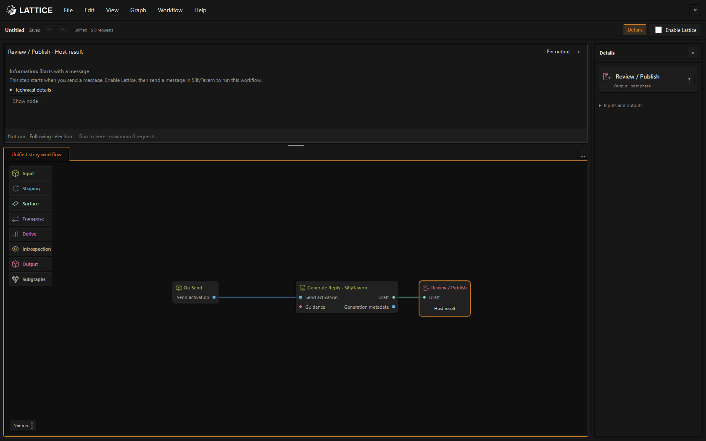

*The smallest complete workflow. Add preparation and response processing around this lifecycle.*

Opening or editing a workflow does not turn integration on or start a request. A complete unified generation begins with ordinary Send; Run to here is for supported diagnostic paths. Keep the active document open while using its integration.

| Menu | What you will find there |
| --- | --- |
| File | New, Open, examples, recovery, Save/Save As, import, export, and closing the workspace |
| Edit | Undo/redo, clipboard, duplication, deletion, and selection |
| View | Details, Preview, shelf visibility, camera controls, reset layout, and themes |
| Graph | Add node, selection Details, groups, subgraphs, comments, and portals |
| Workflow | Add system, enable integration, validation, review, run details, Workflow Data, and memory recall |
| Help | Workspace guide, node reference, keyboard shortcuts, and version information |

## Start from a working example

1. Open the LATTICE logo on the left of the chat bar or type `/lattice`.
2. Choose **File → Open examples…**, immediately below **Open workflow…**.
3. Choose **12 · Plan, write, polish, and annotate one reply**. The picker closes and its independent, editable copy becomes the current workflow.
4. Configure Revise Draft, Extract and Enrich in Details. Keep the document open, select **Enable Lattice**, and Send normally.
5. Select recorded nodes to inspect guidance, the owned Draft, revision and notes before applying Review / Publish.


*Choose a lesson to inspect its setup, checkpoints and call budget, then open its independent unified workflow.*

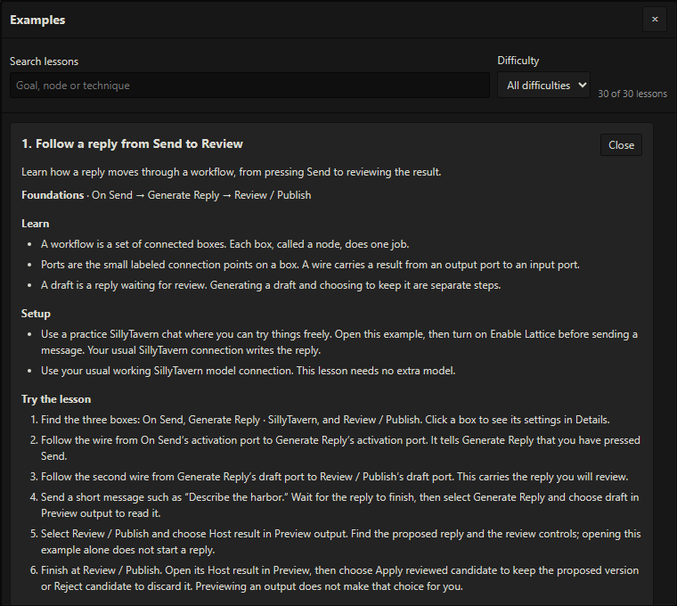

*Read Lesson details before opening an advanced graph. Start with lesson 1 for the lifecycle, lesson 2 for scene direction, or choose a story goal you recognize.*

The picker contains [30 numbered unified lessons](examples.md), with goal/technique search, difficulty filters and lesson details. Opening a tile creates a fresh copy every time. Each lesson keeps its preparation and response in one workflow. The copy replaces the active document after guarding modified work. Opening makes no provider request and preserves the **Enable Lattice** setting; earlier unified documents can be recovered through the File menu.

New ordinary text-model nodes select **Active SillyTavern model**, which follows your configured host connection and model. Inspect an ordinary model node’s grey profile bar or **Details → Connection profile**; choose a saved profile when that node needs a fixed connection. The connection’s model is the default; a node model override is optional. Imported unified recipes can have unassigned local connections, including For Each helper roles, so follow their setup instructions. Configure the open unified example before enabling Lattice and using Send. Run to here inspects supported outputs without acceptance. Pending Node Details text, model override mode/value, and boundary drafts survive browsing and returning to their qualified node; invalid JSON still requires correction before Save.

The [quick start](lattice-workspace.md) walks through the zero-auxiliary-call unified starter and diagnostic authoring. Choose a saved profile in each model node when it needs a fixed connection.

There are three useful scales of work:

| Scale | Example |
| --- | --- |
| Operation | Select Fields chooses the structured values a later stage needs |
| Workflow | JSON source → JSON Decode → Select Fields → Compose → Guidance |
| Reusable process | A Literal cleanup subgraph accepts Draft and returns Patches for its parent to review |

## Discover and connect nodes

The shelf groups tools into **Input, Shaping, Surface, Transpose, Derive, Introspection, Output, and Subgraphs**. Hover or click a family to see its nodes directly, then choose a node to add it. Transpose contains Style Transfer, Format Transfer and Terminology Map.


*Each family opens one node menu with operation names, icons and short codes. Phase-incompatible choices are disabled.*

### Search and drag from the shelf

Choose **Graph → Add node…**, type a name such as **Text Rules**, then drag its result onto empty canvas space. A floating label follows the pointer; releasing creates the node at the drop position. Escape or releasing outside the canvas cancels the placement.


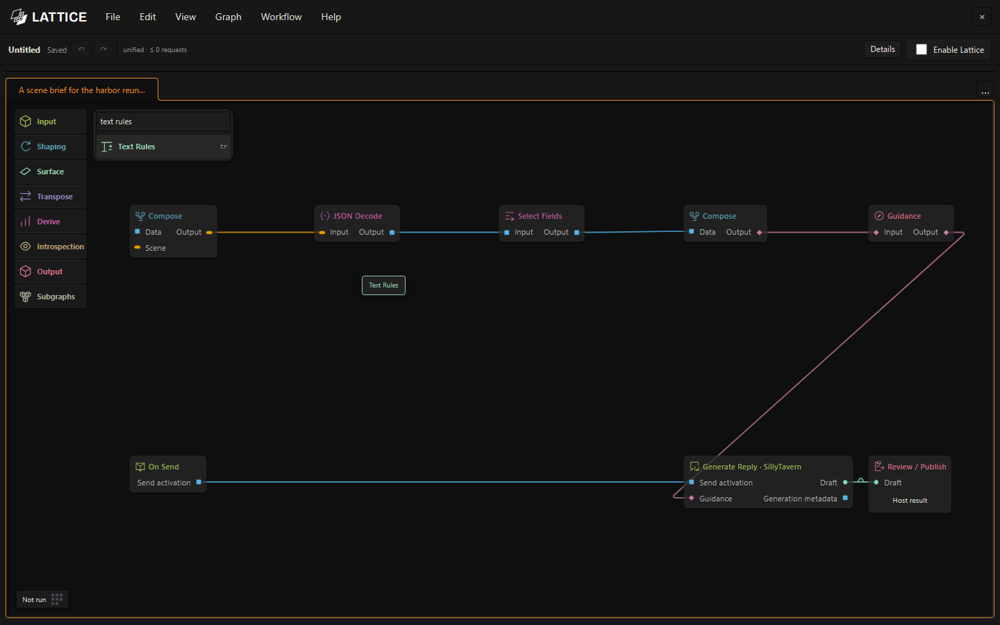

*Search uses the same canonical choices as the family menus.*

There is one entry per operation. Add **Reflect** once and choose Character, Recall or Scene in **Details → Mode**; add **JSON Decode** once and choose Parse or Check. Reroute's artifact kind and other operation variants also live in Details. The six Introspection nodes provide eighteen modes without eighteen shelf entries. The Subgraphs shelf lists the latest explicitly saved entry for each reusable tool; placed copies keep their saved contents.

Choose **Graph → Add node…**, double-click empty graph space, or right-click empty graph space to search. Search includes node names, purposes, aliases, and installed subgraphs. Click outside the search panel or press Escape to close it.


*Search lets you choose a specific operation without opening each family. Pin-origin searches can restrict choices to compatible artifacts.*

To make a connection, drag an **output pin on the right** onto a compatible **input pin on the left**. Alternatively, drag from a pin into empty graph space to create a connected node. Keep **Context sensitive** enabled to narrow the choices. If the new node has several compatible pins, select the intended pin.


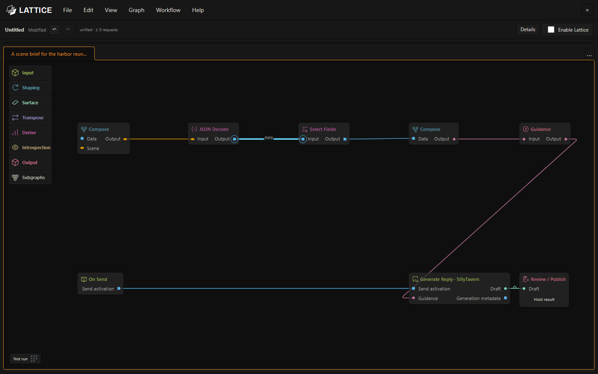

*Drag right-side output pins onto compatible left-side input pins. The example converts JSON Text into Data, then selects the useful fields.*

| Artifact | How to think about it |
| --- | --- |
| Context | Bounded story material with source identities |
| Text | Plain written content |
| Data | Structured values such as JSON fields, events, or state |
| Guidance | Instructions intended to influence generation, with scope/currentness checks |
| Draft | A reply tied to its source; suitable for revision |
| Patches | Proposed changes to a source-bound Draft |
| Candidate | A validated proposed result for diagnostic review |

Typed pins prevent accidental mismatches. A Text source containing JSON still needs JSON Decode before a Data consumer.

Each input accepts one binding; an output can feed several consumers. Colors and labels identify artifact kinds, and validation rejects incompatible connections. A Draft carries source identity for a revision; Text and Data serve different purposes. Use JSON Decode to convert JSON Text to Data, and Compose to turn selected Data into a brief.

In Harbor and Signal, **Context** is a filled circle, **Text** a ring, **Data** a square, **Guidance** a diamond, **Draft** a pentagon, **Findings** a triangle, **Patches** a hexagon and **Candidate** a plus. Text wires are solid, Data wires dashed and Guidance wires dotted; the other types use distinct patterns. Pin labels and wire type labels remain available, and example thumbnails use these same cues. Signal's matching selection, warning and error colors are intentional; custom text and background colors still receive contrast warnings.

### Branch and rejoin material


*An authored Context assembly graph. One branch selects broader context, another provides recent messages, and Context Join combines them before planning.*

Connections define dependency order; card positions are your visual organization. Context Join consumes its declared input slots in order, deduplicates identical source identities, and reports conflicts or reintroduced material. In this screenshot, the Response Plan has no Analysis binding yet, so its model-backed output is unavailable. The selected Context Join's **Run to here** has a zero-call bound.

## Navigate and edit the graph

Drag a card by its body to move it. Drag a rectangle on empty space to select intersecting cards, then move the selected set together. Middle-drag or Space + left-drag pans, including over cards. Wheel zoom stays anchored under the pointer. With the graph or a Node Guide example focused, press **[** to zoom out and **]** to zoom in around the camera's center. Brackets are ignored while typing or dragging.

Below 50% zoom, cards use an overview mode that hides small labels and extra controls and reduces shadows. Full detail returns at 60% zoom. Hover over a card, select it, or use Tab to focus it to reveal its details at any zoom. Card sizes and wire endpoints stay fixed; titles, ports, selection and execution indicators remain visible.

Use **View → Fit graph** or **Fit selection** to recover your position. Press **F** to fit and center the selected item or the combined selection in one action; with nothing selected, it fits the graph. F is ignored while typing or dragging. **View → Center selection** centers without changing zoom. Select/Pan is in Graph; zoom commands are in View. Keyboard shortcuts are listed at the end of this manual.

Choose **File → Rename workflow…**, or right-click a graph or subgraph tab and choose **Rename**, to edit its name directly in the tab. Enter or leaving the field commits the name; Escape cancels. A blank name keeps the existing name.

Use **Details** to show or hide the right panel. Drag its left-edge handle to adjust its width. Drag the divider between Preview and the graph to resize them; both handles also respond to arrow keys. **Collapse preview** provides more graph space. Reopening Preview restores the selected output.

Edits participate in undo/redo. Text fields keep normal browser editing shortcuts. JSON and line-list editors retain drafts until their **Save …** action validates them; the recovery draft does not commit unfinished editor text.

### Frame a section with a comment

Select the nodes you want to label, focus the graph, then press **C**, or use **Graph → Comment selection**. Set **Title**, **Notes**, and **Color** in Details. A comment organizes the canvas without becoming an execution step. **Move contents** controls whether dragging the frame moves its contained nodes. Resize the frame or use **Fit to contents**; Undo restores edits.

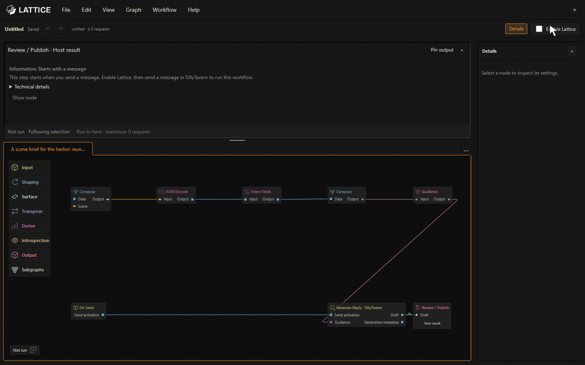

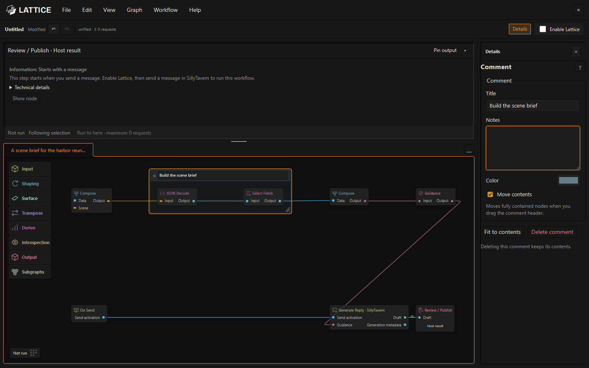

See [connections and comments](connection-comments.md) for group movement, frame sizing, and connection editing.

## Configure operations in Details

Select a node to edit its name and settings. The header retains its type, family and phase; secondary controls, model bindings, and ports expand when needed. Editing **Node name** gives it a local display name; restore the canonical name to clear that alias. **Compact card** reduces its visual footprint while retaining real pins. Use the node's right-click menu or **Shift+C** with its graph card focused. Presentation changes do not change execution.

Right-click a node for grouped editing, preview, organization, and presentation actions. **Rename** focuses its alias, **Compact card** toggles its presentation, and **Fit selection** frames the current selection. Right-clicking within a multiselection keeps that selection; right-clicking another item makes it the action target. Menu shortcuts appear beside their commands. Use Up/Down or Home/End to navigate, Enter to choose, Right/Left to enter or leave an output submenu, and Escape to dismiss the menu while keeping your selection.

Recall and Recall Shortcut nodes have contextual **Queue recall** and **Cancel recall** actions, including counted actions for a selection. Matching nodes share one request per memory set. A green recall-with-clock badge shows a queued request; amber shows a reservation or a result awaiting acceptance. Click the badge to open **Details → Memory recall**, where you can inspect its policy and matching nodes. **Workflow → Memory recall** provides selected/all-node commands and the grouped overview, including from a subgraph tab. Queues are runtime state: Queue and Cancel do not edit the document, add Undo entries, or start a generation. Automatic Recall keeps its authored conditions.

Operation controls follow the node's current mode. A disabled primitive retains its existing validation behavior. A subgraph wrapper instead offers **Run this system**: turning it off skips the whole system and its outputs. Optional consumers can omit those outputs; required inputs must retain legal connections. Duplicate and Delete remain in the secondary commands and right-click menu.

Text Rules, selected fields, Compose sections, Context Join slots, State values and phase durations use row editors. **Edit JSON** exposes the same draft for precise or unsupported shapes. Pattern Scan retains its distinct phrase-rule JSON editor. **Save …** validates the complete candidate; unfinished JSON remains a draft across node and graph switching. Inherited values are explained when they differ from the saved setting.

Nodes with one Text output have a bottom modifier tray. **Trim** and **Wrap** toggle quickly; the add menu also offers **Whitespace**, literal **Replace**, and **Unwrap fence**. Modifiers apply in order after the node produces its Text, before every downstream consumer. Each can be disabled, removed or reordered; disabling retains its settings. Settings save explicitly and all edits support graph undo. Active counts remain visible on full and compact cards. Typed Draft, Context, Data and host outputs keep their dedicated nodes.

After a run, Preview retains the modified output, raw source and modifier trace when recording limits permit. Changing modifiers can show a **Local modifier preview · recorded source** without another model request. This diagnostic uses the retained source and does not refresh the run or grant Apply authority; rerun the graph to update downstream outputs. Large or incomplete recordings cannot provide a local preview.

Mode, input/output type and other controls may change a node's pins. An edit that would make an existing wire incompatible is rejected without changing the node or its connections. Disconnect or replace the affected wire, then change the setting.

### Open a node guide

Select a node, then click **?** beside its name in Details. The guide explains what it does, how to wire it, and what each setting means. Expand **Example** to inspect a small graph in the current theme. **Add example to current tab** inserts a compatible example with one Undo step; check its bindings and any required setup before running it.

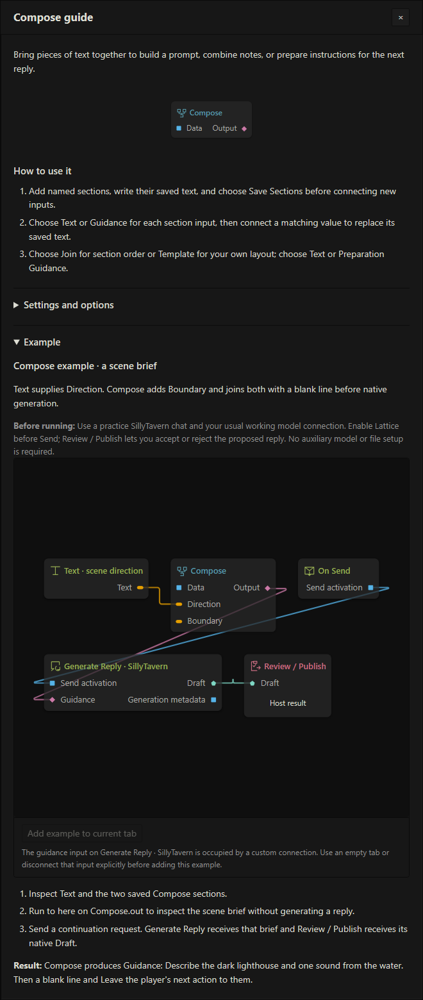

### Workflow Data defaults and shared sources

New **Story Clock**, **Read File** and **Outcome Commit** nodes are ready to connect without a separate document setup step. Story Clock selects **Chat clock**, starting on Day 1 at 00:00 with a 24-hour day. Read File selects empty plain-text **Chat notes**, suitable for the default Write to File append mode. Outcome Commit selects **Chat outcomes**, an empty JSON list. A unified run supplies only the referenced presets in its active user/chat. Saved sources and their content are retained.

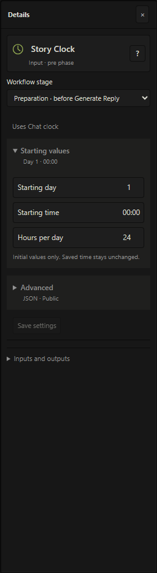

*Starting values initialize a new source. They do not reset the saved timeline.*

The node’s Details panel shows its current source and groups related settings together. **Starting values** exposes the clock’s starting day, time and hours per day. Read File and Outcome Commit expose **Initial content** and **Initial outcomes** instead. If an existing source’s initial values are not displayed, choose **Load initial values** before editing its template, then use **Save settings**. These settings change the initial template; they do not reset saved time or replace saved notes and outcomes.

Open **Advanced** to choose another compatible source or use **+** beside the source to create a named, separate one. **Format** offers JSON, JSON Lines, CSV, Plain text and Markdown for notes. Clock and outcomes sources keep their required JSON format; an existing saved document retains its stored format. **Visibility** uses Public, Hidden and Actor private buttons. Actor private reveals an actor ID field. Clock settings also include its initial Calendar and an optional Expected calendar check.

Nodes using the same clock source share its saved timeline. Prefer one Story Clock output connected to the nodes that need that time, and one final Clock Commit for that source in an accepted run. Choose a separate clock source for an independent timeline; separate clocks do not synchronize automatically. Time advances through explicit workflow proposals and accepted clock commits.

The default Chat clock is shared through Main and its static systems. Default Chat notes and Chat outcomes within a system resolve to separate stable sources for that workflow and instance path. Choose an explicit common target when sharing is intentional. Only active selected operations provision their defaults; a skipped system does not create its unused data. Keep one final clock writer for a shared timeline. Two staged writers for one target are rejected.

**Workflow → Configure → Workflow Data…** remains the place to manage custom logical targets. 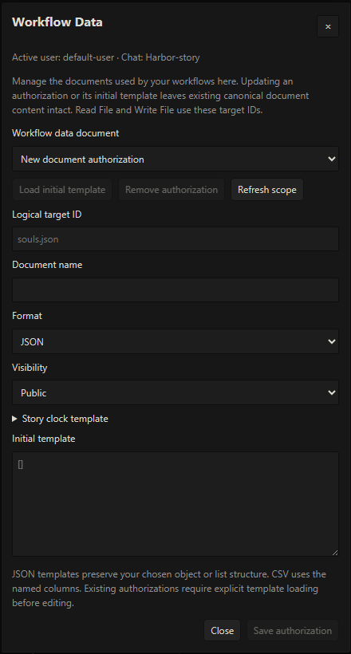

Imported examples that deliberately name custom targets still need an authorized compatible source; choose one in the node’s Advanced settings or manage the target through Workflow → Configure. Random Pick’s optional outcomes source can stay disabled when no saved outcomes are needed. Write to File uses the live reference from Read File, and Clock Commit uses the captured clock projection, so neither needs its own destination setup.

### Structured composition


*Inspect a deterministic composition before wiring its Guidance into native generation.*

Compose has join/template modes, Text/Guidance output, named sections, a separator, and template placeholders.

In **Sections**, each row has **Kind → Text / Guidance**, **Required input** and **Skipped source → Use fallback text / Omit section**. Use Guidance for original system Guidance outputs. Leave a section optional and select Omit section when an inactive system should contribute nothing. Unconnected optional sections still use their Text fallback; unresolved required inputs hold instead of silently using it. Join and template composition keep the section order; an omitted template section is empty.

**Token budget** is a cap on the whole rendered output, from 0 to 8192; 0 adds no Compose cap. Overflow holds without shortening the instructions. Generate Reply applies its final guidance budget too. Inspect the exact recorded result in Preview and its ordered contribution statuses before Send or Apply.

Original private Guidance keeps its actor/currentness checks after merging. Formatting private Text/Data or changing a visibility label does not make it authorized native guidance. The Structured guidance example connects Select Fields to Compose's **Data** pin.


*This template maps structured fields into a writing brief. Sections can also receive connected Text or original Guidance inputs.*

The screenshot's brief uses:

```text
Direction: {{data:/direction}}
Constraint: {{data:/constraint}}
Tone: {{data:/tone}}
```

The captured composition supplies direction, constraint, and tone. To extend it, add another field to a JSON source, map it in Select Fields, then add its placeholder to the final Compose. Missing paths produce an issue rather than incomplete output. See [Compose](node-reference.md#compose) and [Select Fields](node-reference.md#select-fields) for exact formats.

### Deterministic editorial rules


*Literal cleanup proposes `very very` → `very`. Save Rules validates the editor before the graph can use the change.*

Draft mode produces Patches for the reply-review pipeline. Text mode produces Text and can replace or extract material. Literal and regex rules make no model calls. A rule that has no match proposes no change.

### Reference transformations

New **Style Transfer**, **Format Transfer** and **Terminology Map** nodes use **Input type → Text** and return Text in either graph phase. Connect a Text source such as Compose, plus a reference: Text or Data for Style/Format Transfer, and a Data glossary for Terminology Map. Style/Format Transfer can also receive Context. They make at most one Prose request; Terminology Map makes none.

To edit a completed reply, choose **Input type → Draft** in the Response stage, connect a source-bound Draft, and route Patches through validation for candidate diagnostics. Publication requires a final owned Draft ending in Review / Publish. Saved Transpose nodes that omit Input type retain this Draft form. Mode, Scope, Strength and Protected literals are independent: for dialogue characterization, choose **Style Transfer → Mode → Character voice** and **Scope → Dialogue** separately. Changing Mode preserves the current Scope. See [Transpose](node-reference.md#transpose) for the full controls.

### Context and model controls


*This synthetic scene-guidance fixture separates context preparation from the planning request and the final guidance budget.*

Smart Compactor lets you choose selection or model-backed compression, a target context budget, recent messages to preserve, and exact protected literals. Response Plan has operation instructions and a completion cap.


*Model settings show the node's effective connection. Check Active SillyTavern model or choose a saved profile for a fixed connection before running a model-backed node.*

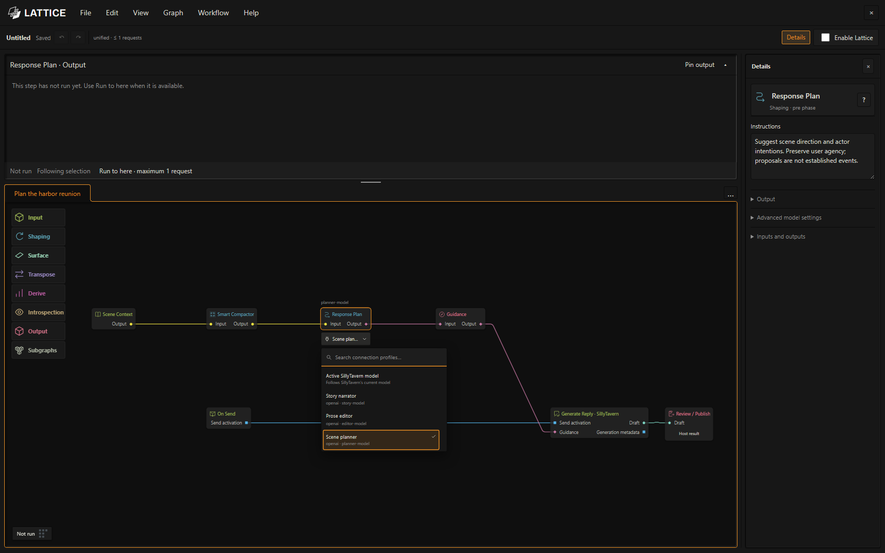

*Pick a fixed connection for a specific job, or follow the active SillyTavern model. These demonstration profile names are not bundled providers.*

Each ordinary text-model node has a grey connection bar below its card and small model-only text above. Open the bar to search current saved profiles by name, API label and model, or choose **Active SillyTavern model** to follow the host's current connection. New ordinary text-model nodes use the active option; existing bindings remain intact. The list keeps the active option first, accepts multiple case-insensitive keywords, scrolls independently of the canvas, and supports arrows, Enter and Escape. Click outside to close it. An unavailable saved profile stays visibly unavailable until you choose another connection. Select a node to change the same **Connection profile** in Details. The node uses that profile's default model; choose **Model mode → Override** to enter a different model identifier for that operation. Scene guidance's Smart Compactor and Response Plan can use different profiles and models. Inspect the effective value and any issue below the controls. This does not globally activate a different SillyTavern connection. Changing a profile affects that node only and supports Undo and Redo. A pinned subgraph occurrence stores its connection override on the owning workflow wrapper, leaving its shared definition and sibling occurrences intact; library inspection remains read-only. See [model connections and supported routes](native-workflows.md).

**For Each → Helper model bindings** configures the exact pinned helper’s ordinary text-model roles separately; explicit nested bindings retain precedence. **Fast Decision** instead uses its explicit typed connection in **its typed connection setup** and its node connection selector, with authored thresholds and opt-in fallback. The ordinary Active/Saved profile picker does not convert a chat model into a Jev/Laya typed endpoint.

After configuration, keep the unified document open and select **Enable Lattice**, then Send normally.

## Run and inspect results

Use ordinary SillyTavern **Send** with the configured unified document open and Lattice enabled. Supported **Run to here** previews execute only selected dependencies and remain diagnostic. The toolbar becomes **Stop** while busy. The bottom-left meter records completion or failure; click it for node-level details, including expanded stages within subgraphs.


*Request usage and node states belong to the actual run. A configured bound is the maximum, not evidence that a request occurred.*

An active node receives a bright ring. Failed nodes have a red ring and dimmed contents; blocked descendants and other nodes have distinct statuses. Stop cancels the active run; a late response cannot revive it.

### Read Preview

Select a node to inspect its recorded output. A single-output node shows its target directly in the Preview title; a selector appears only when there are multiple choices. Review / Publish exposes the root Host result. The artifact tabs show the sections recorded for that target, including input/output data where available. **Following selection** updates Preview as you explore. Click **Pin output** to hold the current output while inspecting another node; click **Pinned output** again to resume following.

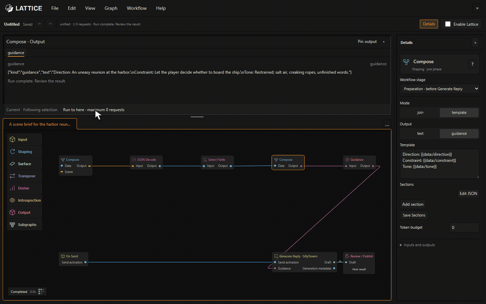

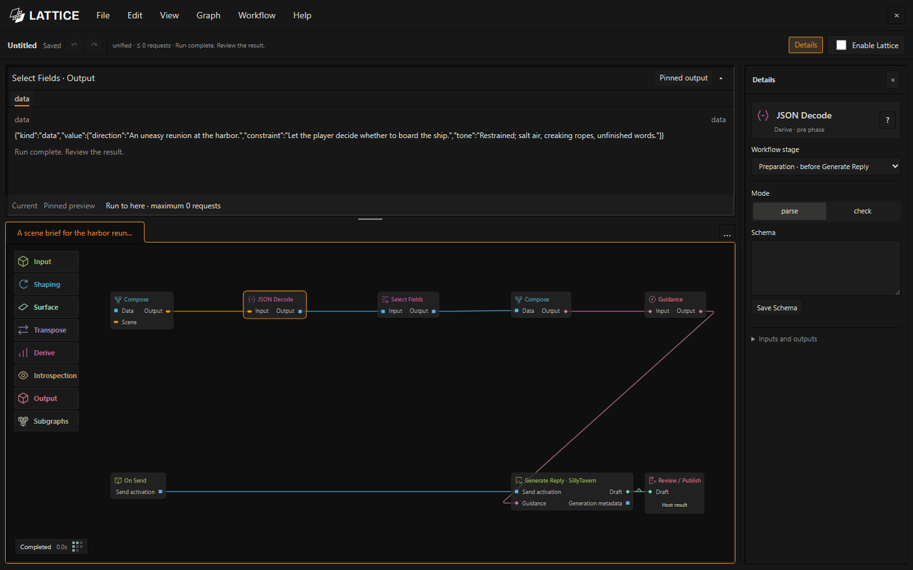

*Pinning separates what you inspect from what you configure.*

The node context menu also offers **Pin preview** and **Run to here** for available outputs. Nodes with several outputs open a submenu so you can choose the port explicitly. Pinning holds the chosen output target as selection changes; it does not freeze a recorded result. Library inspection has no runtime output actions.

Select a node and press **T**, or right-click it and choose **Target Node**, to keep its output in Preview while selecting other nodes. A small target icon marks its upper-right corner. Press **T** on another node to move the target, on the targeted node to clear it, or with nothing selected to clear the current target. With no selection and no target, T does nothing. **Follow selection** clears targeting; **Pin current output** switches to pinning. Targeting changes only the preview and does not run or edit the workflow.


*The recorded artifact contains the composed direction, constraint, and tone. Current indicates it belongs to the unchanged workflow.*

**Run to here** executes the chosen output's dependencies and displays their request bound. It is a diagnostic run. It does not publish guidance or authorize applying an intermediate revision.

Changing an operation setting or a connection cancels active work and makes previous results **Stale**. Camera movement, selection, aliases, compact cards, and tab changes preserve run validity. Stale results can be inspected but cannot supply a fresh Apply action. Large recordings may explicitly truncate or omit diagnostic entries; application uses the retained full candidate rather than the visible excerpt.

## Review a proposed reply edit

A unified workflow records **Review / Publish · Host result** after its owned native Send and response processing.

1. Configure the response processing and final Review / Publish Draft input.
2. Keep the configured unified document open, select **Enable Lattice**, and Send normally.
3. After completion, select **Review / Publish · Host result** in Preview.
4. Compare the original, candidate, notes, findings and changes.
5. Choose **Apply reviewed reply** or **Reject reply**.


*The root Review / Publish result owns application. Apply preserves the native original as a swipe and accepts only this result's staged effects.*

Text Rules, Validate Patches, Review Gate, Apply Reply and subgraph outputs retain useful intermediate diagnostics. Run to here never creates Apply authority. Source edits, chat/actor/swipe changes, starting generation or changing workflow semantics can invalidate a result; use a fresh owned Send.

Local application and durable saving are reported separately. A resolving host save wrapper does not positively acknowledge disk persistence. See [reply review limits](native-workflows.md#review-a-reply-repair).

A system's Read File, Write to File, Story Clock, Clock Commit and Outcome Commit use Main's current authorized sources. Main's Apply accepts their proposals with the chosen owned result. Preview, Run to here, Reject and Stop settle none. File/clock/outcome saves report separate receipts; publishing a reply and saving several targets are not one atomic disk transaction. Repeated Apply does not redraw or request models again.

Memory, State, Recall, Recall Shortcut, native sources and the complete native lifecycle can live inside static subgraphs. They use the enclosing workflow's live captures and acceptance rules. Recall queues distinguish each instance. For Each retains its restricted helper authority and requires an explicit State snapshot.

## Reuse a process with subgraphs

A subgraph packages operations behind named, typed inputs/outputs. Nested subgraphs let you compose a larger process without placing every primitive in the parent editor.

### Add a system to Main

Choose **Workflow → Add system…** to compose a saved reusable body into the unified root. The command targets Main even while you are viewing an instance tab. Save your own wrapper with **Add to Subgraphs** first if it is not yet on the shelf.

1. Choose **Saved system**. Bind each required typed input to a compatible source; optional inputs can remain **Unused**.
2. Adjust exposed **JSON override** settings if needed. Empty fields use the saved value.
3. For prompt influence, choose **Optional reply guidance → Guidance output** and **Main merge destination**. Use an existing Compose Guidance merge or **Create Compose Guidance → Generate Reply** when that generator input is empty. Occupied input pins are not replaced; choose a legal merge or free destination explicitly.
4. Bind other used outputs to explicit compatible destinations. A state-only body can participate through its staged terminals without prompt text.
5. Select **Preview connections**, inspect **Connection preview**, then **Add system**. Its editable body opens in a tab. One Undo removes the whole addition and its new connections.

Connections determine execution and reply influence. Select the wrapper and turn **Details → Run this system** off to skip the whole body, including its reads, models, default data and effects. A disabled system's optional Guidance contribution can be omitted. Required consumers keep their ordinary skipped-input behavior. Closing the body tab hides the view; it does not disable its wired system.

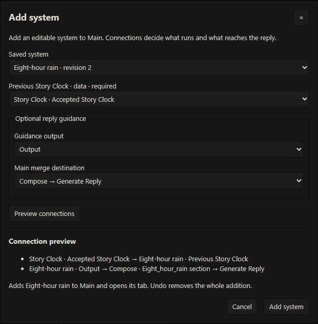

*Preview connections before adding the system. Required inputs need compatible sources.*

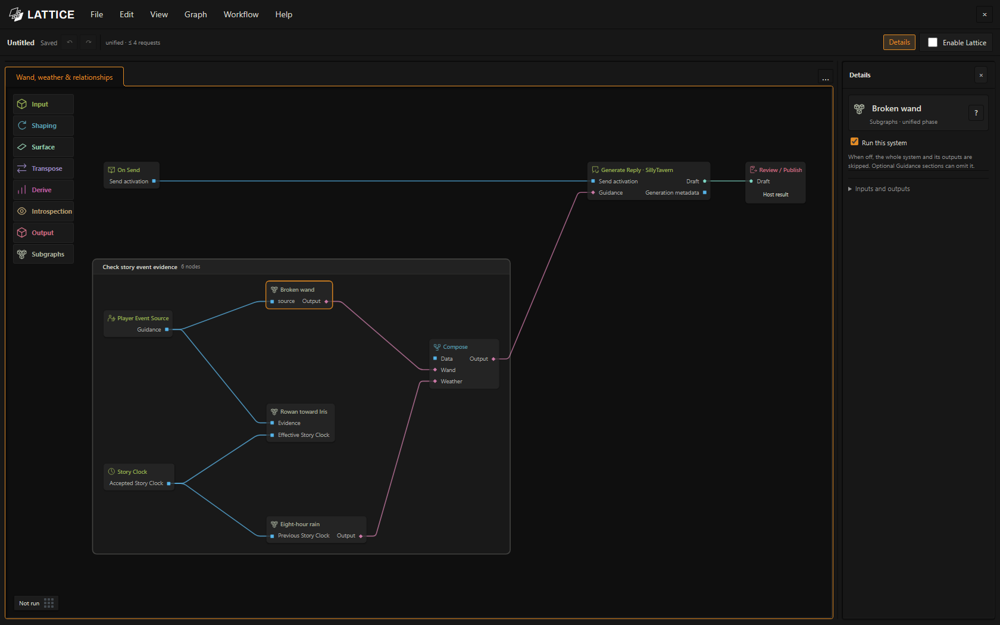

*Switch the wrapper off to skip its body. Closing a body tab only changes the view.*

### Place and open a reusable tool

Choose a saved definition from **Subgraphs → Library** to insert a copy into the current editable graph. The supplied [Literal cleanup subgraph JSON](../workflows/subgraphs/literal-cleanup.json) illustrates a Draft → Patches interface. Connect a compatible source-bound Draft and route its Patches into validation for diagnostic inspection.


*The wrapper exposes Draft → Patches. Validation and candidate inspection remain visible in the parent; publication requires Review / Publish.*

Double-click the wrapper to open its body in a graph tab. The first tab remains Main, the root workflow. Breadcrumbs show where you are; each instance keeps its own camera, selection, and presentation, even if several use the same definition.


*A pinned body opens read-only. You can inspect its ports, settings, and recorded execution without modifying the shared definition.*

Closing a tab hides that view. Use **Graph view actions** to reopen it. Switching tabs does not stop a root run, and Stop still controls the active root run.

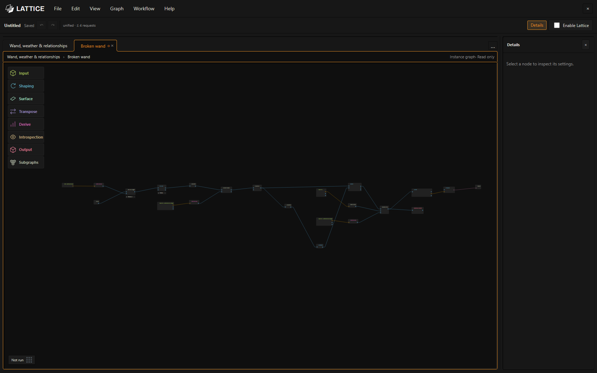

*The parent’s small wrapper can contain a substantial process. Follow the body’s typed boundaries back to Main; the supplied example’s setup is in [Combined editable systems](combined-system-example.md).*

### Edit one instance

Right-click the wrapper and choose **Make editable copy** to open a private editable body. The copy preserves this instance's configured settings and model overrides, and edits in its body take effect. Model fields inherited from the parent workflow remain inherited. Edit its operations and interface in that tab. Sibling instances keep their pinned contents. **Unpack subgraph** replaces one wrapper level with its body nodes while preserving settings, bindings, and parent connections.

### Create and manage definitions

To package your own sequence, select the desired nodes in an editable graph, right-click the selection, and choose **Create subgraph**. You can also right-click a group to package its members. The selected nodes move into a new editable graph tab, with typed input blocks on the left and output blocks on the right. Crossing connections are wired through those boundaries, and the parent graph receives a connected subgraph block in place of the selection. Shared inputs and output fanout are preserved. Creation is one undoable edit.


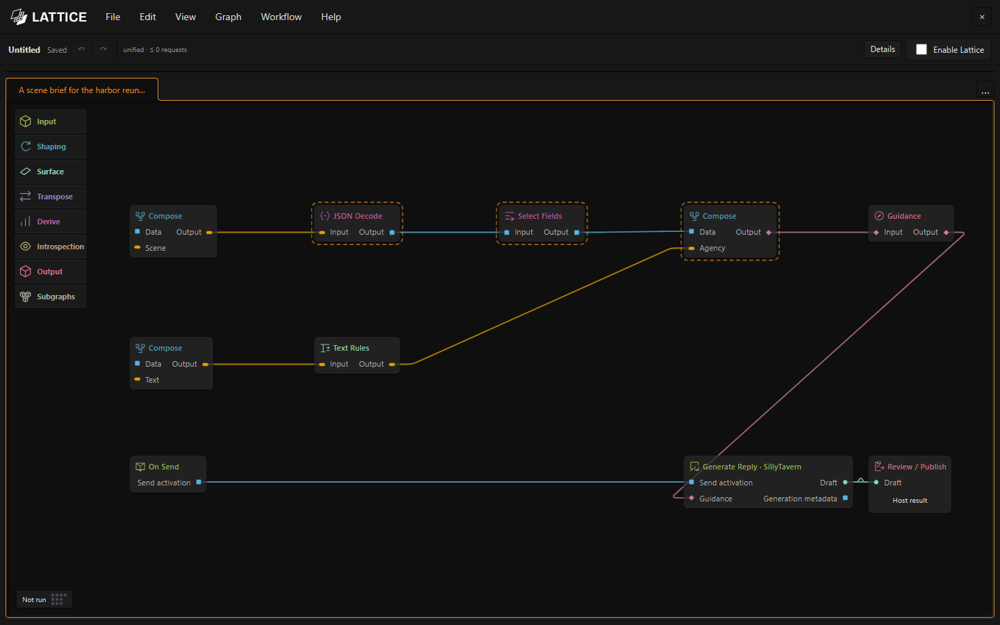

*Shift-click adds nodes to the selection. Any ordinary workflow node can be included.*

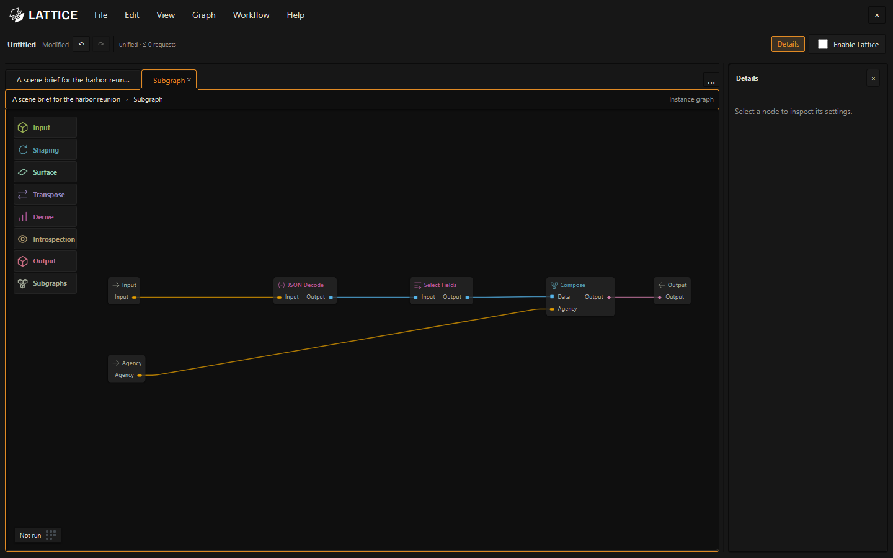

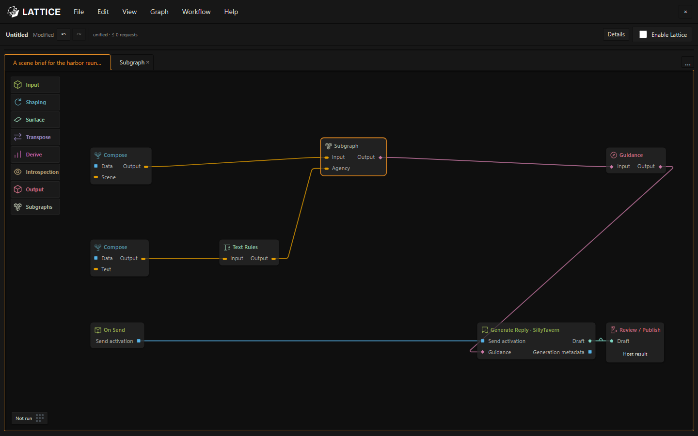

*The body opens in a tab; Main keeps its surrounding nodes and crossing connections.*

Click an input or output block to rename the port, change its artifact type, or mark it required in Details. Choose **Input** or **Output** from **Subgraphs → Interface** to add another boundary, then wire it to the interior nodes. These shelf choices are disabled outside an editable subgraph. New inputs are optional. Delete a boundary through the ordinary node Delete action; its pin and attached body and parent connections are removed together in one undoable edit. Disconnect incompatible connections before changing a port's type.


Select any ordinary workflow nodes, including sources, Memory, Recall, On Send, Generate Reply and Review / Publish, to create a subgraph. The enclosing workflow keeps its host permissions and one native generation. Existing boundary blocks remain in their containing subgraph.

Right-click a wrapper and choose **Add to Subgraphs** to save it for reuse. Name it and choose **Save new subgraph** or explicitly update an existing shelf entry. Editing a body does not automatically save it. Updates affect future insertions; existing placed copies keep their exact contents. Right-click a saved entry in the shelf to **Delete** it or **Open saved definition** for inspection. Deleting a shelf entry preserves placed copies. **Export subgraph** on a wrapper saves a portable JSON copy.


## Organize connections with portals and reroutes

**Reroute** is a compact typed node inserted by double-clicking a direct wire, or added from the Shaping family. Use it to lay out a connection or organize consumers of one output. New shelf nodes default to Text; choose **Artifact kind** in Details to change the type. If the new type would invalidate a connected wire, the edit is rejected atomically: the node and its wires keep their previous types until you resolve the connection.

**Portals** use named references to existing output pins. Open **Details → Portals** to manage a source, its consumers, labels, and visible-wire restoration. They preserve dependencies and artifact types. A portal cannot bypass a subgraph boundary: expose an input or output to cross that boundary.

Use aliases to describe the role of an operation in your process, such as “Scene brief,” while Details retains its canonical type. Compact cards, portals, reroutes, and subgraphs solve different readability problems; choose the smallest organization that keeps the process understandable.

## Save, import, and share

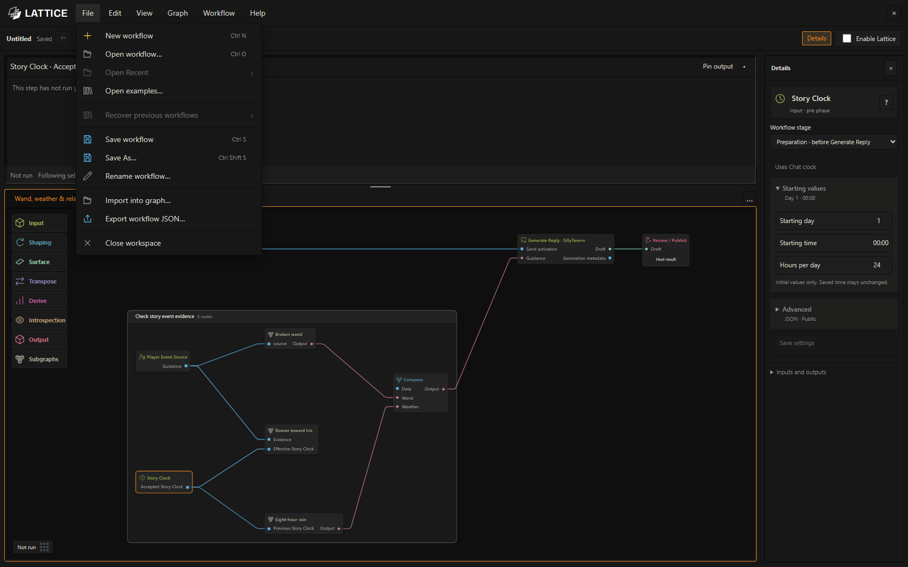

The open document is an editable draft. Committed edits and workspace views are retained as a recovery draft in SillyTavern settings; this does not save the workflow file on disk. Unfinished JSON editor text stays a draft until its **Save …** action validates it. File saving, enabling Lattice, and running a model are separate actions.

| Action | Result |
| --- | --- |
| File → New workflow | Guard modified work, then open an Untitled workflow |
| File → Open workflow… | Validate the chosen JSON file, guard modified work, then replace the active document |
| File → Open Recent | Reopen a previously accessed file; the browser may request permission again |
| File → Open examples… | Open an independent editable example copy |
| File → Recover previous workflows | Open a retained earlier unified workflow as an unsaved draft |
| File → Save workflow | Write the editable document to its current file, or choose a location on its first save |
| File → Save As… | Choose another file as the save destination where direct file access is supported; otherwise save an editable JSON copy |
| File → Import into graph… | Review an additive insertion into the active graph |
| File → Export workflow JSON… | Save a portable unified workflow copy with pinned definitions |
| File → Export archived workflows… | Save a recovery JSON copy of retired pre/post roots, original bindings and active selection |
| File → Close workspace | Close the editor while retaining the active recovery draft and workspace views |
| Wrapper → Export subgraph | Save a portable copy of an individual reusable definition |
| Wrapper → Add to Subgraphs; shelf entry → Delete | Save reusable definitions and remove shelf entries |

Before New, Open, Open Recent, opening an example, or recovery replaces modified work, Lattice offers a save choice, **Don't Save**, or **Cancel**. With direct file access, **Save** must complete successfully before the document is replaced. **Don't Save** continues without writing the current file, and **Cancel** keeps the current canvas. A cancelled picker or failed validation also preserves the current document. **Modified** tracks committed authoring edits; camera movement, tab navigation and runtime recall queues do not dirty the file.

Direct file saving and Open Recent require a browser with supported file access. **Save** checks whether the file changed outside Lattice and asks you to use **Save As** rather than overwrite those changes. A denied permission, cancelled picker or failed write leaves the draft open and modified. **Clear Recent** removes only the recent-file list; it does not delete files. The list is local to this browser and origin.

Other browsers offer **Save As…** to save a JSON copy through the browser. Lattice cannot confirm that the browser finished saving the file to disk, so the draft stays modified. Choosing **Save As…** in a replacement prompt gives the browser the JSON copy and keeps the current document open. To switch documents after saving, repeat the action and choose **Don't Save**.

An additive import requires matching stage contracts, assigns fresh node identities, and preserves internal connections and relative layout. Review role requirements, terminal changes, and request bounds before accepting the insertion. Import itself does not run or enable the workflow.

Save and Save As retain local connection bindings and supported workspace views in an editable `lattice-document` file; credentials and runtime queues are excluded. Export saves a portable `.workflow.json` copy for sharing and strips local saved-profile IDs. Recipients rebind fixed connections before running. **Active SillyTavern model** remains portable in nodes, roles and occurrence overrides, following the recipient’s configured host connection and model. Both file formats open through **File → Open workflow…** and carry pinned definitions.

Editable Save/Open retains the complete Main graph, definitions, overrides and open body tabs. Portable export retains composition and its pinned definition closure. Opening or closing tabs is navigation and does not change what executes. Unsupported versions, dangling connections, incompatible artifacts, or cycles produce validation issues.

Retired pre/post roots remain in a cold archive and cannot open as current documents, execute, or import into current workflows. **File → Export archived workflows…** saves a copy of their originals for recovery. Rebuild needed logic in a new unified graph with explicit stages; archive recovery makes no requests and performs no automatic conversion.

## Develop your own writing system

Start from the material and result you need, then choose the operations between them. Keep a deterministic stage when a literal rule, field mapping, or template can express the task; use a model stage when the process needs interpretation or new prose.

| Goal | Composition to explore | Inspect before trusting it |
| --- | --- | --- |
| Reusable scene brief | JSON source → JSON Decode → Select Fields → Compose → Guidance | Required fields, template output, final guidance budget |
| Protected context preparation | Scene Context → Smart Compactor → Response Plan → Guidance | Preservation report, pins, planned direction, call caps |
| Combined context branches | Context sources → optional selection → Context Join → Response Plan | Duplicate/conflicting identities and reintroduction reports |
| Deterministic editorial cleanup | Reply Snapshot → Text Rules → Validate Patches → Review Gate → Apply Reply diagnostics | Exact replacements and source freshness |
| Model-assisted editorial repair | Reply Snapshot → Pattern Scan → Repair → Validate Patches → Review Gate → Apply Reply diagnostics | Selected spans, protected wording, candidate and model trace |
| Shared editorial tool | Draft → cleanup subgraph → Patches, with review in the parent | Interface, editable body settings, pinned contents, parent review path |

These are processing patterns to author within a unified root. Preparation guidance reaches Generate Reply through a wire; candidate patch pipelines remain diagnostics. Publishing a result requires an owned final Draft and Review / Publish.

The current operations provide one owned native generation, auxiliary Model Call, bounded host context, text/data processing, planning, scoped actor memory, workflow data document mutations and reply review. Arbitrary tool execution, unrestricted filesystem access and image/audio workflows are not implied by the graph editor. Build with the [available node contracts](node-reference.md) and [unified workflow guide](unified-workflows.md).

## Troubleshoot a workflow

Choose **Workflow → Validate workflow** before running an unfamiliar composition. Read the plain-language issues and use **Show node** where offered. Expand **Technical details** when you need the diagnostic code.

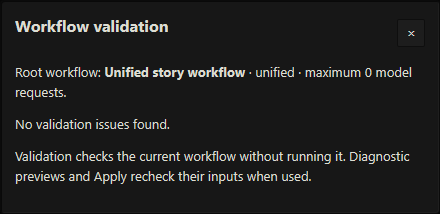

| What you see | What to check |
| --- | --- |
| No integration after Send | Enable Lattice, keep the intended unified document active, and check its validation report |
| Choose a connection | Select the model node and choose Active SillyTavern model or an available saved profile; inspect For Each helper bindings separately |
| Incompatible input or missing terminal | Check artifact types, stage requirements, required pins, and the final Review / Publish Draft connection |
| No recorded output | The step has not run, did not participate, or recording limits omitted it; select the intended target and inspect run details |
| Stale result or disabled Apply | Semantic edits or changed host context invalidated the result; use a fresh owned Send before applying |
| Missing Workflow Data | Authorize the named compatible target for the current user/chat/actor; imported target names are not automatic access grants |
| A skipped system contributes unwanted fallback text | Set the optional Compose section’s Skipped source to Omit section |
| Save failed or unconfirmed | Read the individual receipt in Preview; retry failed saves only where offered |
| Lost track of the graph or panels | Press F to fit, or choose View → Reset panel layout |
| A field edit did not reach the graph | Commit the field or use its Save action; unfinished JSON is still an editor draft |

For model/provider failures and host-save limits, use [Model setup and troubleshooting](native-workflows.md). For older installations, follow [migration and recovery](unified-workflows.md), keeping archived originals available.

## Keyboard and connection reference

| Gesture | Action |
| --- | --- |
| Empty-space drag | Rectangle-select intersecting cards |
| Shift-click / Shift-rectangle | Add to selection |
| Ctrl/Cmd-click | Toggle a card |
| Ctrl/Cmd-rectangle | Add to selection |
| Alt-click / Alt-rectangle | Remove from selection |
| Middle-drag / Space + left-drag | Pan |
| Wheel | Zoom around pointer |
| [ / ] | Zoom out / in around the center of the focused graph or Node Guide example; ignored while typing or dragging |
| Ctrl/Cmd+A | Select all cards |
| C | Comment the selected nodes or add a comment in an editable graph |
| F | Fit and center the selection, or fit the graph if nothing is selected; ignored while typing or dragging |
| Ctrl/Cmd+Z / Ctrl/Cmd+Shift+Z | Undo / redo graph edits |
| Ctrl/Cmd+C / X / V | Copy / cut / paste selection outside text editors |
| F2 on selected node | Rename its presentation alias |
| T | Target the selected node in Preview; press again to clear it, or select another node to move it; no selection clears the current target |
| Shift+C on focused graph card | Toggle Compact card |
| Click wire | Select a connection |
| Shift/Ctrl-click wire | Extend connection selection |
| Delete/Backspace | Immediately delete selected nodes or connections outside an editor; Undo restores them |
| Alt-click wire / pin | Disconnect the wire / pin's attached bindings |
| Ctrl-drag connected input | Move its binding to another compatible input |
| Ctrl-drag output | Move its consumers to another compatible output |
| Double-click direct wire | Insert a typed Reroute |
| Right-click pin | Break bindings or navigate to a connected source |
| Double-click subgraph | Open body in a graph tab |
| Escape | Cancel an unfinished gesture or chooser |

Invalid or cancelled binding moves preserve the existing connections. Text inputs, search, and editable content retain normal keyboard editing behavior.
