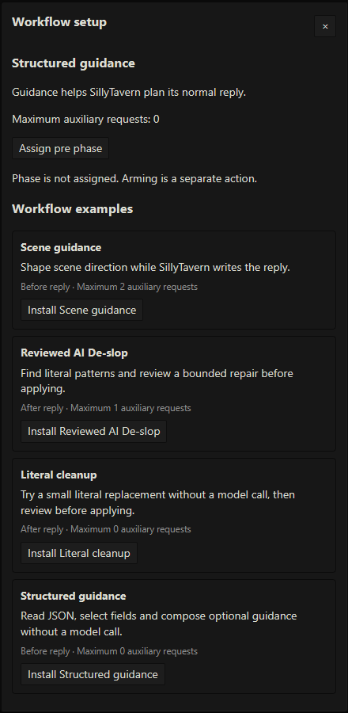
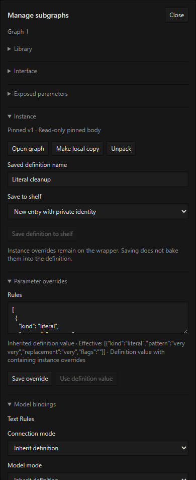
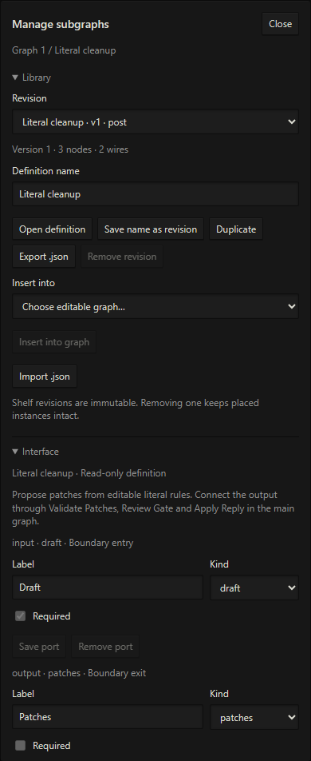

# LATTICE operator's manual

[Documentation](README.md) · [Quick start](lattice-workspace.md) · [Node reference](node-reference.md) · [Model setup and troubleshooting](native-workflows.md)

LATTICE is a workspace for designing writing processes as connected, inspectable systems. A workflow can prepare context, assemble structured direction, transform text, propose edits, and expose a reviewed result. Subgraphs let you turn a useful sequence into a reusable tool.

This manual follows the 0.21.0 interface. Screenshots use synthetic writing material on the local demonstration host. Completed demonstrations are deterministic and make zero model calls. Model planning screenshots show configuration before a model connection is bound.

## Contents

- [Orient yourself](#orient-yourself)
- [Start from a working example](#start-from-a-working-example)
- [Discover and connect nodes](#discover-and-connect-nodes)
- [Navigate and edit the graph](#navigate-and-edit-the-graph)
- [Configure operations in Details](#configure-operations-in-details)
- [Run and inspect results](#run-and-inspect-results)
- [Review a proposed reply edit](#review-a-proposed-reply-edit)
- [Reuse a process with subgraphs](#reuse-a-process-with-subgraphs)
- [Organize connections with portals and reroutes](#organize-connections-with-portals-and-reroutes)
- [Save, import, and share](#save-import-and-share)
- [Develop your own writing system](#develop-your-own-writing-system)
- [Keyboard and connection reference](#keyboard-and-connection-reference)

## Orient yourself


*Structured guidance after a successful Run. The selected Compose receives Data and emits Guidance; the preview displays the recorded artifact.*

| Area | Use it for |
| --- | --- |
| Menu bar | File operations, editing, graph navigation, node discovery, setup, and tools |
| Workflow bar | Choose the root workflow, undo/redo, Run/Stop, Setup, Details, and Arm |
| Preview above the graph | Inspect a recorded output and its artifact tabs; pin it or follow selection |
| Graph tabs | Switch between the root **Graph 1** and opened subgraph bodies |
| Graph editor | Arrange nodes and connect typed input/output pins |
| Floating node shelf | Discover operations by family and category |
| Details on the right | Configure the selected node, its presentation, and any model binding |
| Run meter at bottom left | Open execution details and expanded subgraph stages |

The workflow bar reports phase, assignment, request bound, and autosave. Selecting a graph or editing it does not arm it or make a provider request.

**Run** explicitly executes the root workflow. **Arm** enables configured host integration. A manual guidance run previews its result; a normal Send with assigned and armed guidance executes that workflow again. Reviewed reply editing needs its own explicit Apply action.

## Start from a working example

1. Open the LATTICE logo on the left of the chat bar or type `/lattice`.
2. Open **Setup**, or **Workflows → Workflow examples…**.
3. Install **Structured guidance** for a model-free graph without needing an existing reply.
4. Close setup and click **Run**.
5. Select nodes in turn to inspect the source Text, decoded Data, selected fields, and composed Guidance.



*Installing an example creates an editable workflow. Role binding, phase assignment, and arming are separate actions.*

The [quick start](lattice-workspace.md) walks through changing a brief and trying Literal cleanup. Scene guidance and Reviewed AI De-slop use auxiliary model operations; configure their **Analysis** or **Prose** roles before running them.

There are three useful scales of work:

| Scale | Example |
| --- | --- |
| Operation | Select Fields chooses the structured values a later stage needs |
| Workflow | JSON source → JSON Decode → Select Fields → Compose → Guidance |
| Reusable process | A Literal cleanup subgraph accepts Draft and returns Patches for its parent to review |

## Discover and connect nodes

The shelf groups tools into **Input, Shaping, Surface, Transpose, Derive, Output, and Subgraphs**. Hover or click a family, then a category, to see available nodes. Transpose is disabled because no operations in that family are supported yet.


*The shelf provides families, categories, operation names, and short codes. Phase-incompatible choices are disabled.*

Choose **Node → Add node…**, double-click empty graph space, or right-click empty graph space to search. Search includes node names, purposes, aliases, and installed subgraphs. Click outside the search panel or press Escape to close it.


*Search lets you choose a specific operation without opening each family. Pin-origin searches can restrict choices to compatible artifacts.*

To make a connection, drag an **output pin on the right** onto a compatible **input pin on the left**. Alternatively, drag from a pin into empty graph space to create a connected node. Keep **Context sensitive** enabled to narrow the choices. If the new node has several compatible pins, select the intended pin.

Each input accepts one binding; an output can feed several consumers. Colors and labels identify artifact kinds, and validation rejects incompatible connections. A Draft carries source identity for a revision; Text and Data serve different purposes. Use JSON Decode to convert JSON Text to Data, and Compose to turn selected Data into a brief.

### Branch and rejoin material


*An authored Context assembly graph. One branch selects broader context, another provides recent messages, and Context Join combines them before planning.*

Connections define dependency order; card positions are your visual organization. Context Join consumes its declared input slots in order, deduplicates identical source identities, and reports conflicts or reintroduced material. In this screenshot, the Response Plan has no Analysis binding yet, so the full Run is unavailable. The selected Context Join's **Run to here** has a zero-call bound.

## Navigate and edit the graph

Drag a card by its body to move it. Drag a rectangle on empty space to select intersecting cards, then move the selected set together. Middle-drag or Space + left-drag pans, including over cards. Wheel zoom stays anchored under the pointer.

Use **Graph → Fit to view** or **Fit selection** to recover your position. Select/Pan and zoom commands are also in the Graph menu. Keyboard shortcuts are listed at the end of this manual.

Use **Details** to show or hide the right panel. Drag its left-edge handle to adjust its width. Drag the divider between Preview and the graph to resize them; both handles also respond to arrow keys. **Collapse preview** provides more graph space. Reopening Preview restores the selected output.

Edits participate in undo/redo. Text fields keep normal browser editing shortcuts. JSON and line-list editors retain drafts until their **Save …** action validates them; autosave does not commit an unfinished editor draft.

## Configure operations in Details

Select a node to inspect its canonical type, family, phase, settings, and ports. **Alias** gives it a local display name; **Compact card** reduces its visual footprint while retaining real pins. Presentation changes do not change execution.

Operation controls depend on the node. An **Enabled** checkbox is not a bypass: a disabled operation blocks validation. Delete and Duplicate act on the selected operation where editing is allowed.

### Structured composition

Compose has join/template modes, Text/Guidance output, named sections, a separator, and template placeholders. The Structured guidance example connects Select Fields to Compose's **Data** pin.


*This template maps structured fields into a writing brief. Sections can also have their own connected Text inputs.*

The screenshot's brief uses:

```text
Direction: {{data:/direction}}
Constraint: {{data:/constraint}}
Tone: {{data:/tone}}
```

The original starter supplies direction and constraint. Add a tone field to its JSON source, map it in Select Fields, then add the tone placeholder to the final Compose. Missing paths produce an issue rather than incomplete output. See [Compose](node-reference.md#compose) and [Select Fields](node-reference.md#select-fields) for exact formats.

### Deterministic editorial rules


*Literal cleanup proposes `very very` → `very`. Save Rules validates the editor before the graph can use the change.*

Draft mode produces Patches for the reply-review pipeline. Text mode produces Text and can replace or extract material. Literal and regex rules make no model calls. A rule that has no match proposes no change.

### Context and model controls


*The Scene guidance starter separates context preparation from the planning request and the final guidance budget.*

Smart Compactor lets you choose selection or model-backed compression, a target context budget, recent messages to preserve, and exact protected literals. Response Plan has operation instructions and a completion cap.


*The model settings show role inheritance and effective connection information. The demonstration host has no bound Analysis profile, so setup is required before running.*

Bind role defaults in **Setup**. In Details, choose an explicit connection/model override for one operation when it needs a different route. Inspect the effective value and any issue shown below the control. This does not globally activate a different SillyTavern connection. See [model setup and supported routes](native-workflows.md).

## Run and inspect results

Click **Run** to execute the root. The toolbar becomes **Stop** while busy. The bottom-left meter records completion or failure; click it for node-level details, including expanded stages within subgraphs.


*Request usage and node states belong to the actual run. A configured bound is the maximum, not evidence that a request occurred.*

An active node receives a bright ring. Failed nodes have a red ring and dimmed contents; blocked descendants and other nodes have distinct statuses. Stop cancels the active run; a late response cannot revive it.

### Read Preview

Select a node and use **Preview output** to choose its output or the root Host result. The artifact tabs show the sections recorded for that target, including input/output data where available. **Follow selection** updates Preview as you explore; **Pin preview** holds an output while you inspect another node.


*The recorded artifact contains the composed direction, constraint, and tone. Current indicates it belongs to the unchanged workflow.*

**Run to here** executes the chosen output's dependencies and displays their request bound. It is a diagnostic run. It does not publish guidance or authorize applying an intermediate revision.

Changing an operation setting or a connection cancels active work and makes previous results **Stale**. Camera movement, selection, aliases, compact cards, and tab changes preserve run validity. Stale results can be inspected but cannot supply a fresh Apply action. Large recordings may explicitly truncate or omit diagnostic entries; application uses the retained full candidate rather than the visible excerpt.

## Review a proposed reply edit

1. Wait for the latest assistant reply to finish. The supported target is a completed text-only reply.
2. Run **Literal cleanup** or a configured **Reviewed AI De-slop** workflow.
3. In Preview, select **Apply Reply · Host result** after the full root Run.
4. Read the original, candidate, findings, and changes in the available artifact tabs.
5. Choose **Apply reviewed candidate** or **Reject candidate**.


*The candidate artifact contains both `original` and revised `text`. Selecting this root terminal exposes the review actions.*

Literal cleanup records a structured candidate with `original` and `text`; the AI repair example records separate original/candidate text tabs. Text Rules, Validate Patches, Review Gate, and subgraph outputs are useful intermediate diagnostics, but the root Host result owns application.

Apply rechecks the chat/message/swipe and source text, then creates a new swipe preserving the original. Switching source, editing the reply, starting generation, or changing workflow semantics can invalidate a candidate. Run again against the current source if Apply becomes unavailable.

Local application and durable saving are reported separately. The host save wrapper does not positively acknowledge persistence. Other extensions may already have processed the original reply; edit/swipe events do not prove their memory was re-extracted. See [reply review limits](native-workflows.md#review-a-reply-repair).

## Reuse a process with subgraphs

A subgraph packages operations behind named, typed inputs/outputs. You can expose selected operation settings as parameters and set instance overrides. Nested subgraphs let you compose a larger process without placing every primitive in the parent editor.

### Place and open a reusable tool

Import the supplied [Literal cleanup subgraph JSON](../workflows/subgraphs/literal-cleanup.json) through **Subgraphs → Library → Manage subgraphs… → Import .json**. Choose an editable destination and insert the definition. Connect its Draft input from Reply Snapshot and its Patches output into Validate Patches.


*The wrapper exposes Draft → Patches. Validation, Review Gate, and Apply Reply remain visible in the parent.*

Double-click the wrapper to open its body in a graph tab. **Graph 1** remains the root. Breadcrumbs show where you are; each instance keeps its own camera, selection, and presentation, even if several use the same definition.


*A pinned body opens read-only. You can inspect its ports, settings, and recorded execution without modifying the shared definition.*

Closing a tab hides that view. Use **Graph view actions** to reopen it. Switching tabs does not stop a root run, and the toolbar Run action still belongs to the root workflow.

### Expose settings and edit one instance

Select the wrapper in the parent and open **Details → Subgraphs**. The manager shows the definition's interface, exposed parameters, and instance settings. Use **Parameter overrides** to change an exposed Rules value for this wrapper and **Save override** to commit it. **Use definition value** removes the override.



*Wrapper overrides customize the process without changing its pinned body. Make local copy gives this instance private body-editing authority.*

Use **Make local copy** when you need to edit the body's operations or interface. Local copies preserve their parent instance and do not change sibling instances. **Unpack** replaces one wrapper level with its body nodes while preserving settings, bindings, and parent connections.

### Create and manage definitions

To package your own sequence, select the desired nodes in an editable graph, open **Details → Subgraphs**, enter a name under **Create subgraph**, and choose **Convert selection**. Validation determines whether the selected process can be represented through a supported interface. Inspect the resulting boundaries and connections.



*The library stores revisions. The Interface section describes the Draft input and Patches output of the selected definition.*

The manager supports definition import/export, duplication, interface and parameter editing where allowed, saving revisions, and explicit instance updates. Exposed parameters map to eligible operation controls; they are not arbitrary code. Imported definitions and existing instances retain pinned snapshots. Removing a shelf revision does not break placed instances.

For a revision update, choose the target revision, prepare its interface/parameter/binding mappings, inspect the result, then accept it. Existing instances do not silently adopt a changed library definition. Role and node binding overrides are also scoped to the instance where supported.

## Organize connections with portals and reroutes

**Reroute** is a compact typed node inserted by double-clicking a direct wire. Use it to lay out a connection or organize consumers of one output.

**Portals** use named references to existing output pins. Open **Details → Portals** to manage a source, its consumers, labels, and visible-wire restoration. They preserve dependencies and artifact types. A portal cannot bypass a subgraph boundary: expose an input or output to cross that boundary.

Use aliases to describe the role of an operation in your process, such as “Scene brief,” while Details retains its canonical type. Compact cards, portals, reroutes, and subgraphs solve different readability problems; choose the smallest organization that keeps the process understandable.

## Save, import, and share

Autosave persists committed workspace edits. It does not accept unsaved JSON drafts, assign a workflow phase, arm the extension, or call a model.

| Action | Result |
| --- | --- |
| Workflow selector / Open workflow | Switch to a saved root workflow |
| File → Import workflow | Open a workflow JSON as a separate graph |
| File → Import into graph… | Review an additive insertion into the current graph |
| File → Export workflow | Export a portable workflow package with pinned definitions |
| Subgraph manager → Import/Export .json | Share an individual reusable definition |
| Node → Subgraphs | Manage reusable definitions and insert their pinned instances |

An additive import requires matching phases, assigns fresh node identities, and preserves internal connections and relative layout. Review role requirements, terminal changes, and request bounds before accepting the insertion. Import itself does not run or arm the workflow.

Exports omit bound profile IDs and credentials. Recipients configure local model connections before running. Composed workflows carry their pinned definitions. Unsupported versions, dangling connections, incompatible artifacts, or cycles produce validation issues.

## Develop your own writing system

Start from the material and result you need, then choose the operations between them. Keep a deterministic stage when a literal rule, field mapping, or template can express the task; use a model stage when the process needs interpretation or new prose.

| Goal | Composition to explore | Inspect before trusting it |
| --- | --- | --- |
| Reusable scene brief | JSON source → JSON Decode → Select Fields → Compose → Guidance | Required fields, template output, final guidance budget |
| Protected context preparation | Scene Context → Smart Compactor → Response Plan → Guidance | Preservation report, pins, planned direction, call caps |
| Combined context branches | Context sources → optional selection → Context Join → Response Plan | Duplicate/conflicting identities and reintroduction reports |
| Deterministic editorial cleanup | Reply Snapshot → Text Rules → Validate Patches → Review Gate → Apply Reply | Exact replacements and source freshness |
| Model-assisted editorial repair | Reply Snapshot → Pattern Scan → Repair → Validate Patches → Review Gate → Apply Reply | Selected spans, protected wording, candidate and model trace |
| Shared editorial tool | Draft → cleanup subgraph → Patches, with review in the parent | Interface, exposed parameters, pinned revision, parent review path |

The first, fourth, and fifth compositions ship as starter examples; Scene guidance supplies the second. Context assembly and subgraph composition demonstrate how the same tools combine beyond those starters.

The current operations provide bounded host context, text/data processing, planning, and reply review. Do not assume arbitrary tool execution, general document import, persistent story-memory commits, image/audio workflows, or a free-form model generation node from the presence of a graph editor. Build with the [available node contracts](node-reference.md); new tools can extend that vocabulary in later releases.

## Keyboard and connection reference

| Gesture | Action |
| --- | --- |
| Empty-space drag | Rectangle-select intersecting cards |
| Shift-click / Shift-rectangle | Add to selection |
| Ctrl/Cmd-click | Toggle a card |
| Ctrl/Cmd-rectangle | Add to selection |
| Alt-click / Alt-rectangle | Remove from selection |
| Middle-drag / Space + left-drag | Pan |
| Wheel | Zoom around pointer |
| Ctrl/Cmd+A | Select all cards |
| Period | Fit selection, or graph if nothing is selected |
| Ctrl/Cmd+Z / Ctrl/Cmd+Shift+Z | Undo / redo graph edits |
| Ctrl/Cmd+C / X / V | Copy / cut / paste selection outside text editors |
| F2 on selected node | Rename its presentation alias |
| Click wire | Select a connection |
| Shift/Ctrl-click wire | Extend connection selection |
| Delete/Backspace | Immediately delete selected nodes or connections outside an editor; Undo restores them |
| Alt-click wire / pin | Disconnect the wire / pin's attached bindings |
| Ctrl-drag connected input | Move its binding to another compatible input |
| Ctrl-drag output | Move its consumers to another compatible output |
| Double-click direct wire | Insert a typed Reroute |
| Right-click pin | Break bindings or navigate to a connected source |
| Double-click subgraph | Open body in a graph tab |
| Escape | Cancel an unfinished gesture or chooser |

Invalid or cancelled binding moves preserve the existing connections. Text inputs, search, and editable content retain normal keyboard editing behavior.
