# LATTICE operator's manual

[Documentation](README.md) · [Unified workflows](unified-workflows.md) · [Quick start](lattice-workspace.md) · [Node reference](node-reference.md) · [Model setup and troubleshooting](native-workflows.md)

LATTICE is a workspace for designing writing processes as connected, inspectable systems. A workflow can prepare context, assemble structured direction, transform text, propose edits, and expose a reviewed result. Subgraphs let you turn a useful sequence into a reusable tool.

This manual follows the 0.26.0 interface. Screenshots use synthetic writing material on the local demonstration host. Completed demonstrations are deterministic and make zero model calls. Model planning screenshots show configuration before a model connection is bound.

## Contents

- [Orient yourself](#orient-yourself)
- [Start from a working example](#start-from-a-working-example)
- [Discover and connect nodes](#discover-and-connect-nodes)
- [Navigate and edit the graph](#navigate-and-edit-the-graph)
- [Configure operations in Details](#configure-operations-in-details)
- [Run and inspect results](#run-and-inspect-results)
- [Review a proposed reply edit](#review-a-proposed-reply-edit)
- [Reuse a process with subgraphs](#reuse-a-process-with-subgraphs)
- [Organize connections with portals and reroutes](#organize-connections-with-portals-and-reroutes)
- [Save, import, and share](#save-import-and-share)
- [Develop your own writing system](#develop-your-own-writing-system)
- [Keyboard and connection reference](#keyboard-and-connection-reference)

## Orient yourself


*Structured guidance after a successful Run. The selected Compose receives Data and emits Guidance; the preview displays the recorded artifact.*

| Area | Use it for |
| --- | --- |
| Menu bar | File operations, editing, graph navigation, node discovery, phase assignment, and tools |
| Workflow bar | Choose the root workflow, undo/redo, Run/Stop, Details, and Arm |
| Preview above the graph | Inspect a recorded output and its artifact tabs; pin it or follow selection |
| Graph tabs | Switch between the root **Graph 1** and opened subgraph bodies |
| Graph editor | Arrange nodes and connect typed input/output pins |
| Floating node shelf | Open a family and choose a node directly |
| Details on the right | Configure the selected node, its presentation, and any model binding |
| Run meter at bottom left | Open execution details and expanded subgraph stages |

The workflow bar reports phase, assignment, request bound, and autosave. Selecting a graph or editing it does not arm it or make a provider request.

Use **Tools → Theme and colours** to choose Ember, Lattice, Ash, Graphite, Slate, Obsidian, Harbor or Signal, or customize the selected theme. Ember follows SillyTavern's panel, text, controls and quote accent. Harbor uses blue and amber; Signal uses high contrast grayscale. Both add pin shapes and wire patterns, with a visible type-cue legend in the picker.

**Arm** enables the assigned host workflow. A unified workflow starts through ordinary SillyTavern **Send**, prepares guidance, and resumes from its owned completed reply. Supported **Run to here** paths preview dependencies without accepting effects; a full unified graph containing Generate Reply requires that owned native generation. Legacy tools retain manual **Run**: a guidance run previews its result, and a later assigned/armed Send executes that guidance again. Reviewed reply editing needs an explicit Apply action.

**Unified** keeps Preparation and Response stages in one graph around a single **Generate Reply · SillyTavern** boundary. Choose **Workflows → Assign unified workflow**, Arm, then Send normally. Inspect **Review / Publish · Host result** in Preview and Apply to add a new swipe preserving the original and accept its staged effects. Opening a workflow does not assign or arm it.

Legacy **Before reply (Pre)** graphs prepare guidance before normal Send; legacy **After reply (Post)** graphs work manually from a completed reply. Their assignments are labeled **Assign legacy pre phase** and **Assign legacy post phase**. Running a reply repair does not itself change the reply. Text transformations can run in either stage; reply-specific sources and outputs still require their matching host context. The [unified guide](unified-workflows.md#apply-an-example-to-story-2) gives the actual Story-2/default-user setup.

## Start from a working example

1. Open the LATTICE logo on the left of the chat bar or type `/lattice`.
2. Choose **File → Open examples…**, immediately below **Open workflow…**. **Workflows → Workflow examples…** opens the same picker.
3. Choose **Build a brief from JSON** (lesson 3). The picker closes and its independent, editable copy becomes the current workflow.
4. Click **Run**. This lesson needs no model connection or existing reply.
5. Select nodes in turn to inspect the source Text, decoded Data, selected fields, and composed Guidance.

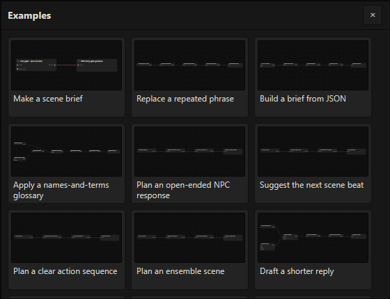

*Choose a named tile to open its native workflow immediately. Build a brief from JSON is the third lesson.*

The picker contains unified story workflows and legacy learning examples. Opening a tile creates a fresh copy every time. Unified examples keep their preparation and response in one workflow. Some legacy recipes include separate Pre/Post companions that validate and install together; select those from the **Workflow** selector. Existing workflows, assignments and enabled state are preserved. Opening does not run anything, assign a workflow, or arm the copies.

New ordinary text-model nodes and canonical legacy starters select **Active SillyTavern model**, which follows your configured host connection and model. Inspect an ordinary model node’s grey profile bar or **Details → Connection profile**; choose a saved profile when that node needs a fixed connection. The connection’s model is the default; a node model override is optional. Imported unified recipes can have unassigned local connections, including For Each helper roles, so follow their setup instructions. Configure a unified example before assigning/arming and using Send; inspect legacy tools with manual Run before enabling their host integration. Pending Node Details text, model override mode/value, and boundary drafts survive browsing and returning to their qualified node; invalid JSON still requires correction before Save.

The [quick start](lattice-workspace.md) walks through changing a brief and trying Literal cleanup. Scene guidance and Reviewed AI De-slop use auxiliary model operations; their canonical starters follow **Active SillyTavern model**, and each node can instead use a saved profile selected in its bar or Details.

There are three useful scales of work:

| Scale | Example |
| --- | --- |
| Operation | Select Fields chooses the structured values a later stage needs |
| Workflow | JSON source → JSON Decode → Select Fields → Compose → Guidance |
| Reusable process | A Literal cleanup subgraph accepts Draft and returns Patches for its parent to review |

## Discover and connect nodes

The shelf groups tools into **Input, Shaping, Surface, Transpose, Derive, Introspection, Output, and Subgraphs**. Hover or click a family to see its nodes directly, then choose a node to add it. Transpose contains Style Transfer, Format Transfer and Terminology Map.

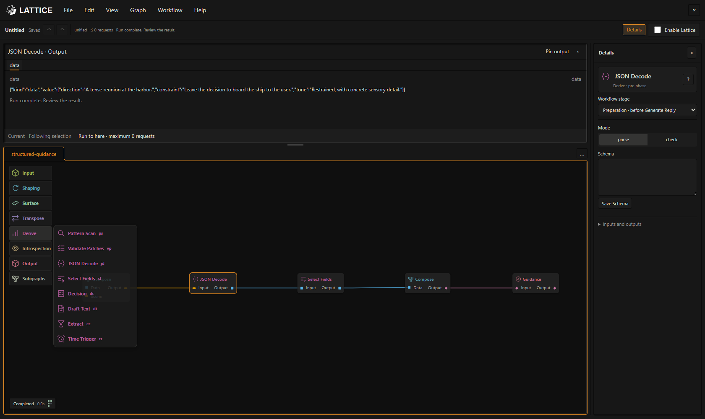

*Each family opens one node menu with operation names, icons and short codes. Phase-incompatible choices are disabled.*

There is one entry per operation. Add **Reflect** once and choose Character, Recall or Scene in **Details → Mode**; add **JSON Decode** once and choose Parse or Check. Reroute's artifact kind and other operation variants also live in Details. The six Introspection nodes provide eighteen modes without eighteen shelf entries. Each saved subgraph revision keeps its own menu entry.

Choose **Node → Add node…**, double-click empty graph space, or right-click empty graph space to search. Search includes node names, purposes, aliases, and installed subgraphs. Click outside the search panel or press Escape to close it.

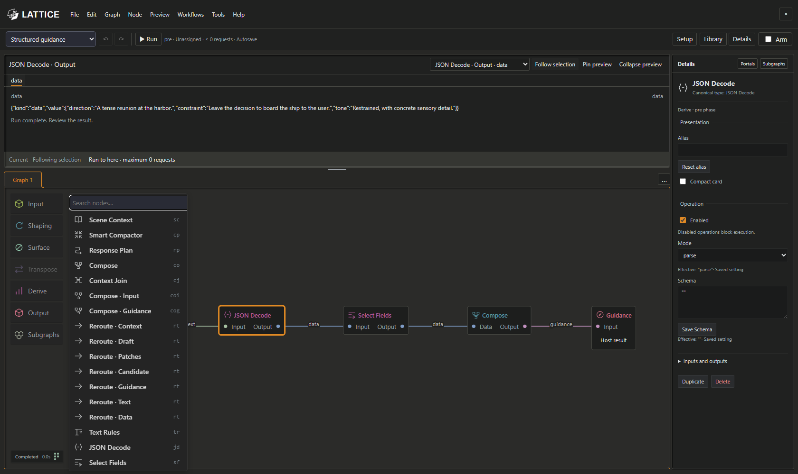

*Search lets you choose a specific operation without opening each family. Pin-origin searches can restrict choices to compatible artifacts.*

To make a connection, drag an **output pin on the right** onto a compatible **input pin on the left**. Alternatively, drag from a pin into empty graph space to create a connected node. Keep **Context sensitive** enabled to narrow the choices. If the new node has several compatible pins, select the intended pin.

Each input accepts one binding; an output can feed several consumers. Colors and labels identify artifact kinds, and validation rejects incompatible connections. A Draft carries source identity for a revision; Text and Data serve different purposes. Use JSON Decode to convert JSON Text to Data, and Compose to turn selected Data into a brief.

In Harbor and Signal, **Context** is a filled circle, **Text** a ring, **Data** a square, **Guidance** a diamond, **Draft** a pentagon, **Findings** a triangle, **Patches** a hexagon and **Candidate** a plus. Text wires are solid, Data wires dashed and Guidance wires dotted; the other types use distinct patterns. Pin labels and wire type labels remain available, and example thumbnails use these same cues. Signal's matching selection, warning and error colors are intentional; custom text and background colors still receive contrast warnings.

### Branch and rejoin material


*An authored Context assembly graph. One branch selects broader context, another provides recent messages, and Context Join combines them before planning.*

Connections define dependency order; card positions are your visual organization. Context Join consumes its declared input slots in order, deduplicates identical source identities, and reports conflicts or reintroduced material. In this screenshot, the Response Plan has no Analysis binding yet, so the full Run is unavailable. The selected Context Join's **Run to here** has a zero-call bound.

## Navigate and edit the graph

Drag a card by its body to move it. Drag a rectangle on empty space to select intersecting cards, then move the selected set together. Middle-drag or Space + left-drag pans, including over cards. Wheel zoom stays anchored under the pointer.

Below 50% zoom, cards use an overview mode that hides small labels and extra controls and reduces shadows. Full detail returns at 60% zoom. Hover over a card, select it, or use Tab to focus it to reveal its details at any zoom. Card sizes and wire endpoints stay fixed; titles, ports, selection and execution indicators remain visible.

Use **Graph → Fit to view** or **Fit selection** to recover your position. Press **F** to center the selected item or the combined selection; with nothing selected, it centers all nodes. F preserves the current zoom and is ignored while typing or dragging. Select/Pan and zoom commands are also in the Graph menu. Keyboard shortcuts are listed at the end of this manual.

Choose **Graph → Rename workflow**, or right-click a graph or subgraph tab and choose **Rename**, to edit its name directly in the tab. Enter or leaving the field commits the name; Escape cancels. A blank name keeps the existing name.

Use **Details** to show or hide the right panel. Drag its left-edge handle to adjust its width. Drag the divider between Preview and the graph to resize them; both handles also respond to arrow keys. **Collapse preview** provides more graph space. Reopening Preview restores the selected output.

Edits participate in undo/redo. Text fields keep normal browser editing shortcuts. JSON and line-list editors retain drafts until their **Save …** action validates them; autosave does not commit an unfinished editor draft.

## Configure operations in Details

Select a node to edit its name and settings. The header retains its type, family and phase; secondary controls, model bindings, and ports expand when needed. Editing **Node name** gives it a local display name; restore the canonical name to clear that alias. **Compact card** reduces its visual footprint while retaining real pins. Use the node's right-click menu or **Shift+C** with its graph card focused. Presentation changes do not change execution.

Right-click a node for grouped editing, preview, organization, and presentation actions. **Rename** focuses its alias, **Compact card** toggles its presentation, and **Fit selection** frames the current selection. Right-clicking within a multiselection keeps that selection; right-clicking another item makes it the action target. Menu shortcuts appear beside their commands. Use Up/Down or Home/End to navigate, Enter to choose, Right/Left to enter or leave an output submenu, and Escape to dismiss the menu while keeping your selection.

Operation controls follow the node's current mode. Disable remains in the graph menu: a disabled operation blocks validation; disconnecting an optional input can instead select its fallback. Required inputs must stay connected. Duplicate and Delete are in the node's secondary commands and right-click menu.

Text Rules, selected fields, Compose sections, Context Join slots, State values and phase durations use row editors. **Edit JSON** exposes the same draft for precise or unsupported shapes. Pattern Scan retains its distinct phrase-rule JSON editor. **Save …** validates the complete candidate; unfinished JSON remains a draft across node and graph switching. Inherited values are explained when they differ from the saved setting.

Nodes with one Text output have a bottom modifier tray. **Trim** and **Wrap** toggle quickly; the add menu also offers **Whitespace**, literal **Replace**, and **Unwrap fence**. Modifiers apply in order after the node produces its Text, before every downstream consumer. Each can be disabled, removed or reordered; disabling retains its settings. Settings save explicitly and all edits support graph undo. Active counts remain visible on full and compact cards. Typed Draft, Context, Data and host outputs keep their dedicated nodes.

After a run, Preview retains the modified output, raw source and modifier trace when recording limits permit. Changing modifiers can show a **Local modifier preview · recorded source** without another model request. This diagnostic uses the retained source and does not refresh the run or grant Apply authority; rerun the graph to update downstream outputs. Large or incomplete recordings cannot provide a local preview.

Mode, input/output type and other controls may change a node's pins. An edit that would make an existing wire incompatible is rejected without changing the node or its connections. Disconnect or replace the affected wire, then change the setting.

### Workflow Data defaults and shared sources

New **Story Clock**, **Read File** and **Outcome Commit** nodes are ready to connect without a separate document setup step. Story Clock selects **Chat clock**, starting on Day 1 at 00:00 with a 24-hour day. Read File selects empty plain-text **Chat notes**, suitable for the default Write to File append mode. Outcome Commit selects **Chat outcomes**, an empty JSON list. A unified run supplies only the referenced presets in its active user/chat. Saved sources and their content are retained.

The node’s Details panel shows its current source and groups related settings together. **Starting values** exposes the clock’s starting day, time and hours per day. Read File and Outcome Commit expose **Initial content** and **Initial outcomes** instead. If an existing source’s initial values are not displayed, choose **Load initial values** before editing its template, then use **Save settings**. These settings change the initial template; they do not reset saved time or replace saved notes and outcomes.

Open **Advanced** to choose another compatible source or use **+** beside the source to create a named, separate one. **Format** offers JSON, JSON Lines, CSV, Plain text and Markdown for notes. Clock and outcomes sources keep their required JSON format; an existing saved document retains its stored format. **Visibility** uses Public, Hidden and Actor private buttons. Actor private reveals an actor ID field. Clock settings also include its initial Calendar and an optional Expected calendar check.

Nodes using the same clock source share its saved timeline. Prefer one Story Clock output connected to the nodes that need that time, and one final Clock Commit for that source in an accepted run. Choose a separate clock source for an independent timeline; separate clocks do not synchronize automatically. Time advances through explicit workflow proposals and accepted clock commits.

**Tools → Workflow Data…** remains the place to manage custom logical targets. Imported examples that deliberately name custom targets still need an authorized compatible source; choose one in the node’s Advanced settings or manage the target through Tools. Random Pick’s optional outcomes source can stay disabled when no saved outcomes are needed. Write to File uses the live reference from Read File, and Clock Commit uses the captured clock projection, so neither needs its own destination setup.

### Structured composition

Compose has join/template modes, Text/Guidance output, named sections, a separator, and template placeholders. The Structured guidance example connects Select Fields to Compose's **Data** pin.

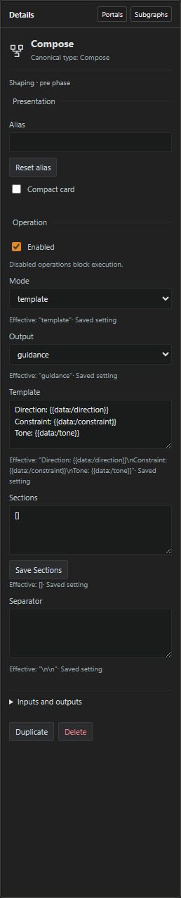

*This template maps structured fields into a writing brief. Sections can also have their own connected Text inputs.*

The screenshot's brief uses:

```text
Direction: {{data:/direction}}
Constraint: {{data:/constraint}}
Tone: {{data:/tone}}
```

The original starter supplies direction and constraint. Add a tone field to its JSON source, map it in Select Fields, then add the tone placeholder to the final Compose. Missing paths produce an issue rather than incomplete output. See [Compose](node-reference.md#compose) and [Select Fields](node-reference.md#select-fields) for exact formats.

### Deterministic editorial rules

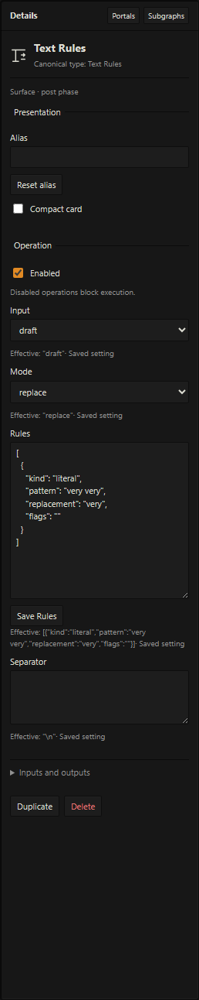

*Literal cleanup proposes `very very` → `very`. Save Rules validates the editor before the graph can use the change.*

Draft mode produces Patches for the reply-review pipeline. Text mode produces Text and can replace or extract material. Literal and regex rules make no model calls. A rule that has no match proposes no change.

### Reference transformations

New **Style Transfer**, **Format Transfer** and **Terminology Map** nodes use **Input type → Text** and return Text in either graph phase. Connect a Text source such as Compose, plus a reference: Text or Data for Style/Format Transfer, and a Data glossary for Terminology Map. Style/Format Transfer can also receive Context. They make at most one Prose request; Terminology Map makes none.

To edit a completed reply, choose **Input type → Draft** in an After reply graph, connect Reply Snapshot, and route the resulting Patches through Validate Patches → Review Gate → Apply Reply. Saved Transpose nodes that omit Input type retain this Draft form. Mode, Scope, Strength and Protected literals are independent: for dialogue characterization, choose **Style Transfer → Mode → Character voice** and **Scope → Dialogue** separately. Changing Mode preserves the current Scope. See [Transpose](node-reference.md#transpose) for the full controls.

### Context and model controls

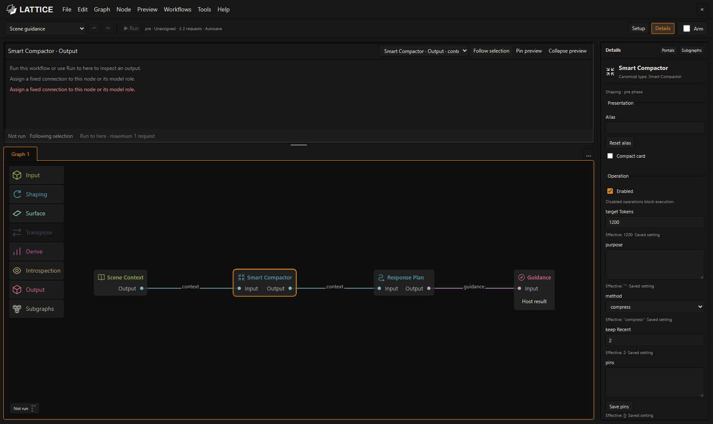

*The Scene guidance starter separates context preparation from the planning request and the final guidance budget.*

Smart Compactor lets you choose selection or model-backed compression, a target context budget, recent messages to preserve, and exact protected literals. Response Plan has operation instructions and a completion cap.

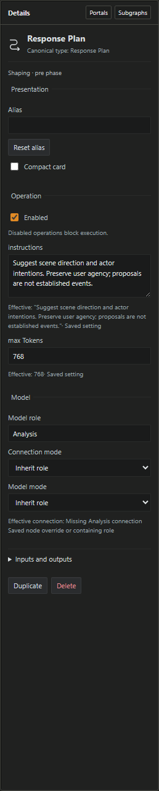

*Model settings show the node's effective connection. Check Active SillyTavern model or choose a saved profile for a fixed connection before running a model-backed node.*

Each ordinary text-model node has a grey connection bar below its card and small model-only text above. Open the bar to search current saved profiles by name, API label and model, or choose **Active SillyTavern model** to follow the host's current connection. New ordinary text-model nodes use the active option; existing bindings remain intact. The list keeps the active option first, accepts multiple case-insensitive keywords, scrolls independently of the canvas, and supports arrows, Enter and Escape. Click outside to close it. An unavailable saved profile stays visibly unavailable until you choose another connection. Select a node to change the same **Connection profile** in Details. The node uses that profile's default model; choose **Model mode → Override** to enter a different model identifier for that operation. Scene guidance's Smart Compactor and Response Plan can use different profiles and models. Inspect the effective value and any issue below the controls. This does not globally activate a different SillyTavern connection. Changing a profile affects that node only and supports Undo and Redo. A pinned subgraph occurrence stores its connection override on the owning workflow wrapper, leaving its shared definition and sibling occurrences intact; library inspection remains read-only. See [model connections and supported routes](native-workflows.md).

**For Each → Helper model bindings** configures the exact pinned helper’s ordinary text-model roles separately; explicit nested bindings retain precedence. **Fast Decision** instead uses its explicit typed connection in **Tools → Fast connections…** and its node connection selector, with authored thresholds and opt-in fallback. The ordinary Active/Saved profile picker does not convert a chat model into a Jev/Laya typed endpoint.

After configuration, choose **Workflows → Assign unified workflow** and Arm for a unified graph, then Send normally. Legacy graphs use **Assign legacy pre phase** or **Assign legacy post phase**. Arming remains a separate action.

## Run and inspect results

For a legacy/manual tool, click **Run** to execute the root. For a unified graph containing Generate Reply, use ordinary SillyTavern **Send** after assignment and arming; supported **Run to here** previews remain diagnostic. The toolbar becomes **Stop** while busy. The bottom-left meter records completion or failure; click it for node-level details, including expanded stages within subgraphs.

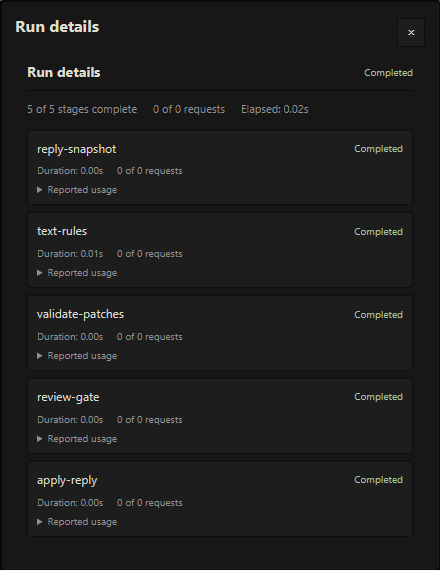

*Request usage and node states belong to the actual run. A configured bound is the maximum, not evidence that a request occurred.*

An active node receives a bright ring. Failed nodes have a red ring and dimmed contents; blocked descendants and other nodes have distinct statuses. Stop cancels the active run; a late response cannot revive it.

### Read Preview

Select a node and use **Preview output** to choose its output or the root Host result. The artifact tabs show the sections recorded for that target, including input/output data where available. **Follow selection** updates Preview as you explore; **Pin preview** holds an output while you inspect another node.

The node context menu also offers **Pin preview** and **Run to here** for available outputs. Nodes with several outputs open a submenu so you can choose the port explicitly. Pinning holds the chosen output target as selection changes; it does not freeze a recorded result. Library inspection has no runtime output actions.

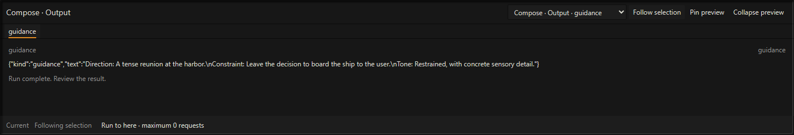

*The recorded artifact contains the composed direction, constraint, and tone. Current indicates it belongs to the unchanged workflow.*

**Run to here** executes the chosen output's dependencies and displays their request bound. It is a diagnostic run. It does not publish guidance or authorize applying an intermediate revision.

Changing an operation setting or a connection cancels active work and makes previous results **Stale**. Camera movement, selection, aliases, compact cards, and tab changes preserve run validity. Stale results can be inspected but cannot supply a fresh Apply action. Large recordings may explicitly truncate or omit diagnostic entries; application uses the retained full candidate rather than the visible excerpt.

## Review a proposed reply edit

A unified workflow records its final **Review / Publish · Host result** after the owned native Send and response processing. Select that root result in Preview, compare the original and candidate, and Apply or Reject. Apply preserves the original swipe and accepts only that result’s staged effects. The following steps cover the legacy manual repair tools.

1. Wait for the latest assistant reply to finish. The supported target is a completed text-only reply.
2. Run **Literal cleanup** or a configured **Reviewed AI De-slop** workflow.
3. In Preview, select **Apply Reply · Host result** after the full root Run.
4. Read the original, candidate, findings, and changes in the available artifact tabs.
5. Choose **Apply reviewed candidate** or **Reject candidate**.


*The candidate artifact contains both `original` and revised `text`. Selecting this root terminal exposes the review actions.*

Literal cleanup records a structured candidate with `original` and `text`; the AI repair example records separate original/candidate text tabs. Text Rules, Validate Patches, Review Gate, and subgraph outputs are useful intermediate diagnostics, but the root Host result owns application.

Apply rechecks the chat/message/swipe and source text, then creates a new swipe preserving the original. Switching source, editing the reply, starting generation, or changing workflow semantics can invalidate a candidate. Run again against the current source if Apply becomes unavailable.

Local application and durable saving are reported separately. The host save wrapper does not positively acknowledge persistence. Other extensions may already have processed the original reply; edit/swipe events do not prove their memory was re-extracted. See [reply review limits](native-workflows.md#review-a-reply-repair).

## Reuse a process with subgraphs

A subgraph packages operations behind named, typed inputs/outputs. Nested subgraphs let you compose a larger process without placing every primitive in the parent editor.

### Place and open a reusable tool

Choose a saved definition from **Subgraphs → Library** to insert a copy into the current editable graph. The supplied [Literal cleanup subgraph JSON](../workflows/subgraphs/literal-cleanup.json) illustrates a Draft → Patches interface. Connect its Draft input from Reply Snapshot and its Patches output into Validate Patches.

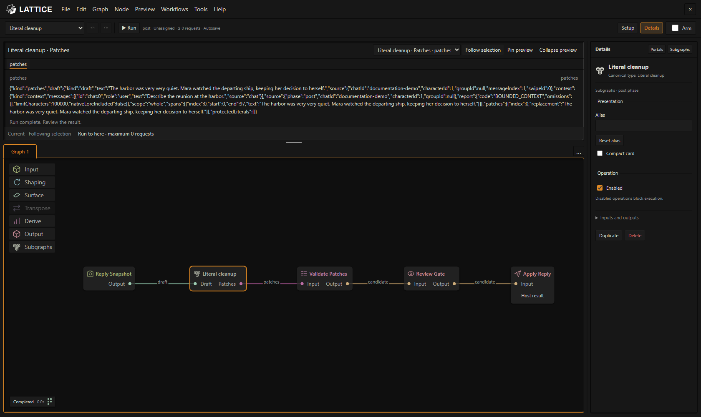

*The wrapper exposes Draft → Patches. Validation, Review Gate, and Apply Reply remain visible in the parent.*

Double-click the wrapper to open its body in a graph tab. **Graph 1** remains the root. Breadcrumbs show where you are; each instance keeps its own camera, selection, and presentation, even if several use the same definition.


*A pinned body opens read-only. You can inspect its ports, settings, and recorded execution without modifying the shared definition.*

Closing a tab hides that view. Use **Graph view actions** to reopen it. Switching tabs does not stop a root run, and the toolbar Run action still belongs to the root workflow.

### Edit one instance

Right-click the wrapper and choose **Make editable copy** to open a private editable body. The copy preserves this instance's configured settings and model overrides, and edits in its body take effect. Model fields inherited from the parent workflow remain inherited. Edit its operations and interface in that tab. Sibling instances keep their pinned contents. **Unpack subgraph** replaces one wrapper level with its body nodes while preserving settings, bindings, and parent connections.

### Create and manage definitions

To package your own sequence, select the desired nodes in an editable graph, right-click the selection, and choose **Create subgraph**. You can also right-click a group to package its members. The selected nodes move into a new editable graph tab, with typed input blocks on the left and output blocks on the right. Crossing connections are wired through those boundaries, and the parent graph receives a connected subgraph block in place of the selection. Shared inputs and output fanout are preserved. Creation is one undoable edit.

Click an input or output block to rename the port, change its artifact type, or mark it required in Details. Choose **Input** or **Output** from **Subgraphs → Interface** to add another boundary, then wire it to the interior nodes. These shelf choices are disabled outside an editable subgraph. New inputs are optional. Delete a boundary through the ordinary node Delete action; its pin and attached body and parent connections are removed together in one undoable edit. Disconnect incompatible connections before changing a port's type.

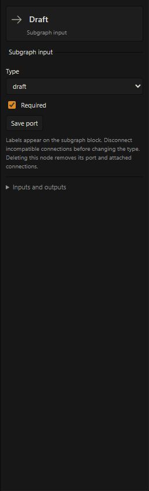

Workflow input/output operations such as Scene Context, Reply Snapshot, Guidance, and Apply Reply stay in the root graph. Select the processing nodes between them to create a subgraph. Existing boundary blocks remain in their containing subgraph.

Right-click a wrapper and choose **Add to Subgraphs** to save it for reuse. Name it and choose **Save new subgraph** or explicitly update an existing shelf entry. Editing a body does not automatically save it. Updates affect future insertions; existing placed copies keep their exact contents. Right-click a saved entry in the shelf to **Delete** it or **Open saved definition** for inspection. Deleting a shelf entry preserves placed copies. **Export subgraph** on a wrapper downloads its portable JSON package.

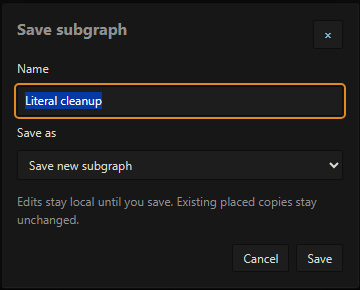

## Organize connections with portals and reroutes

**Reroute** is a compact typed node inserted by double-clicking a direct wire, or added from the Shaping family. Use it to lay out a connection or organize consumers of one output. New shelf nodes default to Text; choose **Artifact kind** in Details to change the type. If the new type would invalidate a connected wire, the edit is rejected atomically: the node and its wires keep their previous types until you resolve the connection.

**Portals** use named references to existing output pins. Open **Details → Portals** to manage a source, its consumers, labels, and visible-wire restoration. They preserve dependencies and artifact types. A portal cannot bypass a subgraph boundary: expose an input or output to cross that boundary.

Use aliases to describe the role of an operation in your process, such as “Scene brief,” while Details retains its canonical type. Compact cards, portals, reroutes, and subgraphs solve different readability problems; choose the smallest organization that keeps the process understandable.

## Save, import, and share

Autosave persists committed workspace edits. It does not accept unsaved JSON drafts, assign a workflow phase, arm the extension, or call a model.

| Action | Result |
| --- | --- |
| Workflow selector | Switch to a workflow already saved in Lattice |
| File → New workflow | Offer Save, Discard, or Cancel for unsaved changes, then open a separate blank Untitled workflow |
| File → Open workflow… | Choose a workflow JSON file in the system picker and open it as a separate graph |
| File → Save workflow | Request a save in SillyTavern, retaining local connections and workspace views |
| File → Import into graph… | Review an additive insertion into the current graph |
| File → Export workflow JSON… | Download a portable workflow package with pinned definitions |
| File → Close workspace | Close the editor while retaining committed workflows and workspace views |
| Wrapper → Export subgraph | Download an individual reusable definition |
| Wrapper → Add to Subgraphs; shelf entry → Delete | Save reusable definitions and remove shelf entries |

When the unsaved-changes prompt appears, **Save** downloads the current workflow JSON, **Discard** continues without downloading, and **Cancel** keeps the current canvas open. Save and Discard open the blank workflow while retaining the existing workflow and its edits in the workspace. Creating a workflow does not request a name; rename its tab when needed.

An additive import requires matching phases, assigns fresh node identities, and preserves internal connections and relative layout. Review role requirements, terminal changes, and request bounds before accepting the insertion. Import itself does not run or arm the workflow.

Save retains connection bindings in SillyTavern settings. Export downloads a `.workflow.json` sharing copy and strips local saved-profile IDs and credentials. Open these files with **File → Open workflow…**; recipients rebind exported fixed connections before running. **Active SillyTavern model** remains portable in nodes, roles and occurrence overrides, following the recipient's configured host connection and model. The browser controls where downloads are saved. Composed workflows carry their pinned definitions. Unsupported versions, dangling connections, incompatible artifacts, or cycles produce validation issues.

## Develop your own writing system

Start from the material and result you need, then choose the operations between them. Keep a deterministic stage when a literal rule, field mapping, or template can express the task; use a model stage when the process needs interpretation or new prose.

| Goal | Composition to explore | Inspect before trusting it |
| --- | --- | --- |
| Reusable scene brief | JSON source → JSON Decode → Select Fields → Compose → Guidance | Required fields, template output, final guidance budget |
| Protected context preparation | Scene Context → Smart Compactor → Response Plan → Guidance | Preservation report, pins, planned direction, call caps |
| Combined context branches | Context sources → optional selection → Context Join → Response Plan | Duplicate/conflicting identities and reintroduction reports |
| Deterministic editorial cleanup | Reply Snapshot → Text Rules → Validate Patches → Review Gate → Apply Reply | Exact replacements and source freshness |
| Model-assisted editorial repair | Reply Snapshot → Pattern Scan → Repair → Validate Patches → Review Gate → Apply Reply | Selected spans, protected wording, candidate and model trace |
| Shared editorial tool | Draft → cleanup subgraph → Patches, with review in the parent | Interface, editable body settings, pinned contents, parent review path |

The first, fourth, and fifth compositions ship as starter examples; Scene guidance supplies the second. Context assembly and subgraph composition demonstrate how the same tools combine beyond those starters.

The current operations provide one owned native generation, auxiliary Model Call, bounded host context, text/data processing, planning, scoped actor memory, workflow data document mutations and reply review. Arbitrary tool execution, unrestricted filesystem access and image/audio workflows are not implied by the graph editor. Build with the [available node contracts](node-reference.md) and [unified workflow guide](unified-workflows.md).

## Keyboard and connection reference

| Gesture | Action |
| --- | --- |
| Empty-space drag | Rectangle-select intersecting cards |
| Shift-click / Shift-rectangle | Add to selection |
| Ctrl/Cmd-click | Toggle a card |
| Ctrl/Cmd-rectangle | Add to selection |
| Alt-click / Alt-rectangle | Remove from selection |
| Middle-drag / Space + left-drag | Pan |
| Wheel | Zoom around pointer |
| Ctrl/Cmd+A | Select all cards |
| Period | Fit selection, or graph if nothing is selected |
| F | Center the selection, or all nodes if nothing is selected, without changing zoom; ignored while typing or dragging |
| Ctrl/Cmd+Z / Ctrl/Cmd+Shift+Z | Undo / redo graph edits |
| Ctrl/Cmd+C / X / V | Copy / cut / paste selection outside text editors |
| F2 on selected node | Rename its presentation alias |
| Shift+C on focused graph card | Toggle Compact card |
| Click wire | Select a connection |
| Shift/Ctrl-click wire | Extend connection selection |
| Delete/Backspace | Immediately delete selected nodes or connections outside an editor; Undo restores them |
| Alt-click wire / pin | Disconnect the wire / pin's attached bindings |
| Ctrl-drag connected input | Move its binding to another compatible input |
| Ctrl-drag output | Move its consumers to another compatible output |
| Double-click direct wire | Insert a typed Reroute |
| Right-click pin | Break bindings or navigate to a connected source |
| Double-click subgraph | Open body in a graph tab |
| Escape | Cancel an unfinished gesture or chooser |

Invalid or cancelled binding moves preserve the existing connections. Text inputs, search, and editable content retain normal keyboard editing behavior.
