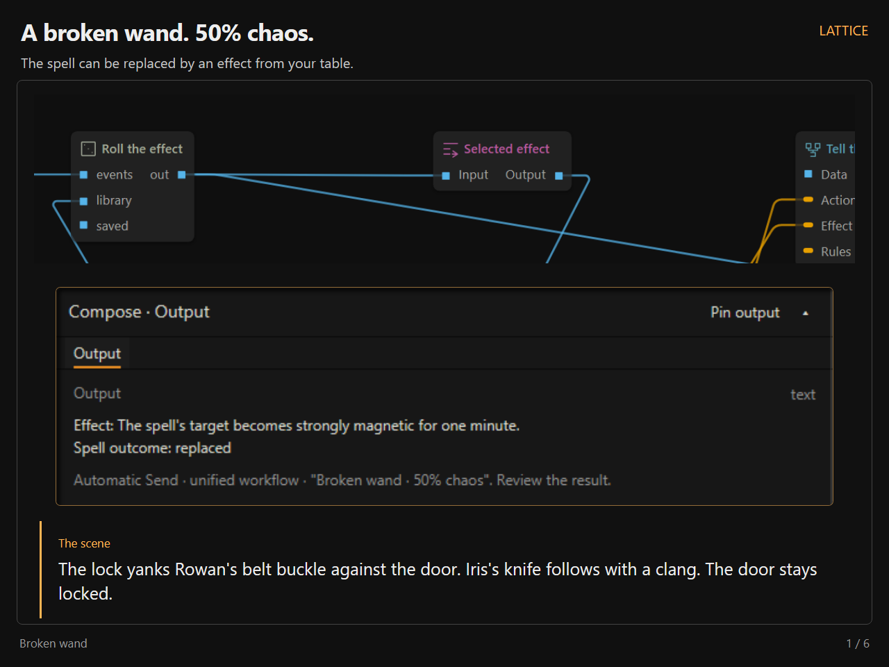
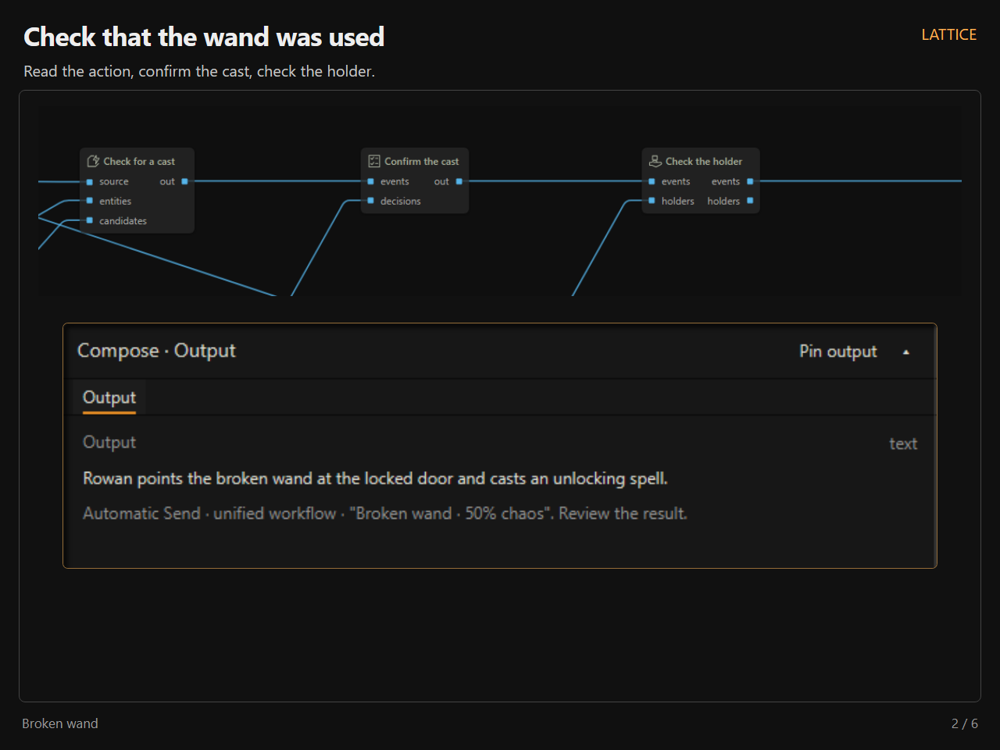
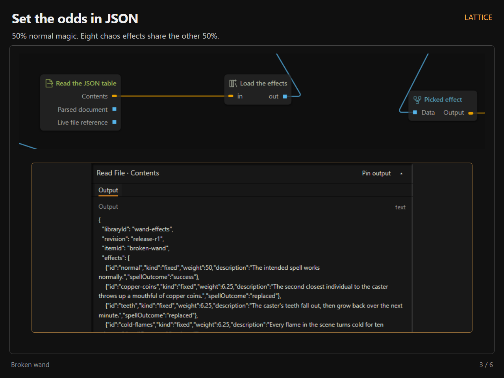
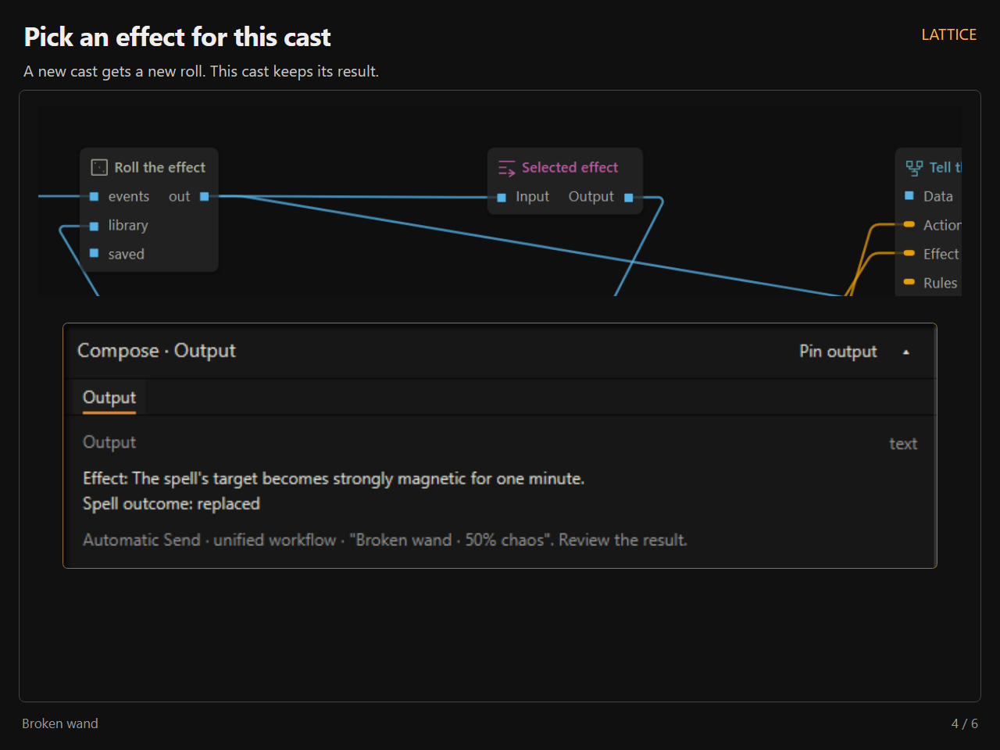
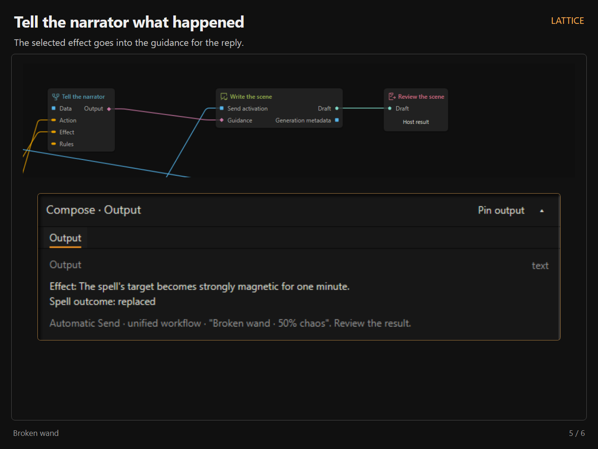
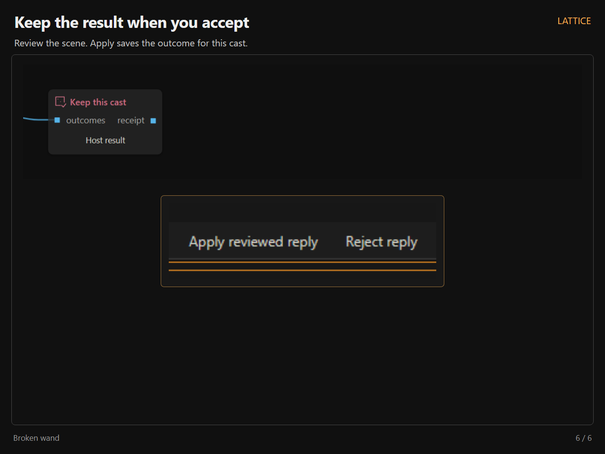

# Lattice release media

Six annotated PNGs, 1280 × 960, and a silent 35-second H.264 MP4 at 1280 × 960 / 30 fps.

[Download the editor walkthrough](https://raw.githubusercontent.com/MentallyQuill/Lattice/codex/release-media-2026-10-10/docs/release-media/2026-10-10/lattice-editor-walkthrough.mp4) · [Workflow](broken-wand-50-50.lattice.json) · [Effect table](wand-effects.json) · [Example holder](wand-holders.json)

## Images

Each image has its own direct link. Open an image to view or save the full PNG.

## Clip

- 0–8 seconds — Example Workflows: File → Open examples → load a shipped lesson.
- 8–17 seconds — Node Shelf: Search Text Rules and drag it onto the canvas.
- 17–24 seconds — Connecting Nodes: Connect two pairs of compatible pins.
- 24–35 seconds — Subgraphs: Shift-select three nodes, create a subgraph, and return to the connected parent.

Each section has a short label at the top of the screen, slower pointer movement, and pauses to show the result.

## Wand

The normal spell has weight 50. Eight fixed chaos effects have weight 6.25 each. Chaos replaces the spell. The downloadable workflow is a variation of shipped lesson 27; configure its actors, documents, and models before using it.

## Capture provenance

The editor, menus, mouse gestures, wires, extraction, typed boundaries, and recorded operation outputs are real production Lattice UI. The local host uses sample story data. For the screenshot run, candidate extraction and confirmation are supplied demo inputs, and the native reply is authored demo prose. Random Pick uses unmodified runtime randomness; normal results are rejected and subsequent separate casts are tried until a chaos result occurs. The table and probabilities are not altered for capture. No model provider is contacted. The final screenshot shows review and a staged outcome, before Apply.

Use the PNGs in numeric order. The direct links above can be shared independently.
