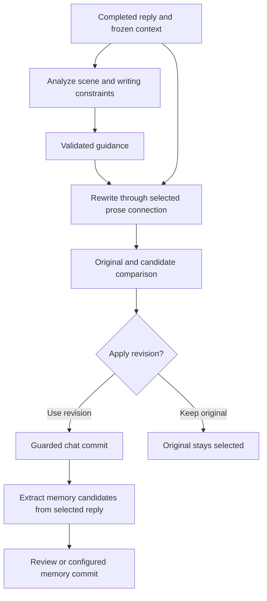

# ComfyTavern: approachability and workflow direction

Research date: October 7, 2026. Status: research and proposed product direction, not an approved implementation spec.

## Recommendation

Make the first useful workflow easy to discover, configure, and understand. Start with a supported starter library and a small setup surface for each workflow. Use the canvas to let people inspect and customize something that already works.

After reassessing development scope and extension compatibility, the recommendation is **a node-based pre- and post-processing workflow layer around SillyTavern's native generation**. Begin with supported examples and guided setup. SillyTavern should own preset assembly, character context, lore activation, extension injections, and the primary reply; ComfyTavern should own its auxiliary calls, guidance, and optional revision candidates.

The [complete prompt-conversion proposal](2026-10-07-comfytavern-prompt-converter.md) is retained as a deferred alternative. Its findings explain why full takeover carries substantial compatibility and maintenance work. Conversion should not be required to start using ComfyTavern.

The subsequent [Gaea workflow and library reference](2026-10-07-gaea-workflow-and-node-library-reference.md) records the user-selected one-word families in display order: **Input, Shaping, Surface, Transpose, Derive, Output**. Proposed contents include reusable examples and explicit phase boundaries; family order does not dictate execution order. It is reference research for coordination with the Svelte task, not an approved UI change.

The longer-term opportunity remains substantial: user-defined workflows spanning context preparation, reasoning, writing, revision, and memory updates. Recursion is the strongest local reference for those execution boundaries. Approachability should determine how that power reaches users and the order in which it is built.

The proposed product promise is: **Choose a workflow, connect your models, see what it does, and make it your own.**

## Intent and scope

The initial request was to investigate the renamed fork, compare how it operates with ComfyUI, and use Recursion, Saga, Recast, and installed memory extensions to identify richer node workflows. The subsequent clarification made approachability the leading priority: getting started is difficult, examples are scarce, and the library does not provide the supported workflow experience the user associates with ComfyUI.

Working assumption: the easiest initial success happens in an existing SillyTavern chat. A new user can use a ready-made workflow without learning graph construction; the same workflow remains editable on the canvas. This is a recommendation, not a settled choice between chat and standalone workbench use.

This research covers the checked-out ComfyTavern source, local Recursion and Saga source and documentation, installed default-user extension source, the scope of the separate UI Performance task, and current official ComfyUI documentation. It does not evaluate model output quality or run paid generations.

## Compatibility reassessment: preserve native assembly

The latest user concern is whether complete conversion turns ComfyTavern into a costly second prompt engine and undermines extension interoperability. That concern changes the recommended boundary. Full takeover can preserve integrations, but it makes ComfyTavern responsible for reproducing the host's assembly decisions and accommodating extension behavior across versions. Fixing Seed's individual omissions is much smaller than fulfilling that complete compatibility promise.

The local sources support host-owned assembly:

- Recursion's runtime architecture explicitly assigns prompt assembly and native generation to SillyTavern. Its host adapter installs and clears its own named prompt lanes through `setExtensionPrompt`; its post-processing commits are bound to a completed response identity.
- Installed Summaryception assembles summaries into its own extension-prompt key and updates it on generation start. It also schedules summary work after `MESSAGE_RECEIVED`.
- Installed VectFox injects retrieved chunks through `setExtensionPrompt`, with configurable position/depth, and has world-info integration and message-event listeners.
- [MemoryBooks' public README](https://github.com/aikohanasaki/SillyTavern-MemoryBooks) describes turning completed scenes or selected chat portions into editable lorebook records. MemoryBooks was not present in the inspected installed-extension directory, and its implementation was not audited here.
- Installed Recast listens for completed messages, routes them through its revision pipeline, and has compatibility checks around that listener.

These integrations rely on several host surfaces, not simply one system-role message. Keeping native assembly gives their lore and prompt contributions their normal path into the reply. It does not establish universal compatibility, especially when multiple extensions modify or summarize the same completed message.

| Product boundary | Development and maintenance implication | Recommendation |
| --- | --- | --- |
| Pre/post graph with native prompt assembly | Own stage execution, auxiliary requests, guidance installation, and guarded revisions; test lifecycle interactions | Primary direction |
| Limited prompt inspection and source references | Add understandable read-only context and optional imports into auxiliary prompts; define which sources are available at each phase | Incremental enhancement |
| Complete prompt conversion and takeover | Also reproduce macro/formatting/placement/budget rules, preserve provenance, and maintain host-version and extension behavior | Defer until a concrete unmet use case warrants it |

### Proposed lifecycle

```text
Read bounded context -> Analyze through selected connection -> Install guidance
    -> SillyTavern assembles its native prompt and generates the reply
    -> Optional critique/rewrite -> Compare -> Apply a verified candidate
```

The native-reply step is a handoff to one ordinary host generation. It should not independently request a second main reply. Pre-processing publishes only ComfyTavern's namespaced guidance, with explicit placement, depth, size, and lifetime. Cleanup clears its own keys on cancellation, failure, chat change, and completion as required by the run lifecycle. Host token budgeting should include the guidance; replacing the final assembled array or appending after budgeting is not the intended default path.

The inspected native generation interceptor runs before the current world-info scan. Early analysis can therefore use a bounded source snapshot, but must not claim to have consumed the exact lore/context ultimately selected for this send. Later context readers need their own supported timing contract; replaying scans and other extensions' calls is not a general solution. Guidance's participation in lore scanning should be an explicit policy.

Post-processing starts from a frozen completed reply and produces a candidate. Begin with manual execution and review, then add automatic application only where lifecycle behavior is verified. Before committing, recheck chat/message/swipe/source identity and prevent internal revision events from triggering another workflow.

Memory settlement remains a shared-system concern. A memory extension may extract from the original reply before a revision is accepted; emitting an edit event does not prove it repairs that extraction. Automatic post-processing needs tested integration policies for the installed memory and rewriting extensions. Avoid claiming that generic event ordering can make every extension wait for a final revision. ComfyTavern can provide a settlement event for cooperating adapters, but third-party adoption cannot be assumed.

A compatible default should add reasoning and writing capability without taking over external memory stores. Workflow-local state and memory can be explicit nodes; updating Saga canon, MemoryBooks lore, or VectFox storage requires a supported integration and reviewable write contract.

The converter itself could be deterministic and make zero model calls; its expense is mainly engineering and compatibility upkeep. Pre/post workflows have a smaller prompt-integration surface but add model calls when configured. Show the count, profiles, and limits in each starter so that users can choose the tradeoff.

## What is already here

GitHub resolves the fork to [MentallyQuill/ComfyTavern](https://github.com/MentallyQuill/ComfyTavern). Its published main revision and this checkout both begin at `dc5b6034ac7e202ecb40f33fb8d84d5dc6b8c475`, version 0.17.0. The manifest, README, UI brand, and exported format still use Silly Canvas naming at this revision.

| Capability | Evidence in this checkout | Product implication |
| --- | --- | --- |
| Import and export complete canvases as JSON | [UI file actions](../../src/ui.js), `onImportGraph` / `onExportGraph`; [graph serialization](../../src/state.js), `importGraph` / `exportGraph` | JSON loading is available today. The missing experience is a supported collection of useful files and help resolving their requirements. |
| Save prompts, blocks, and groups to a personal library | [library storage](../../src/library.js), `createPrompt` / `createPiece`; [clipboard format](../../src/clip.js) | Reuse exists, but the library is primarily material the user must create. |
| Seed a canvas from the current SillyTavern prompt order | [UI seed action](../../src/ui.js), `onSeedFromST`; [README](../../README.md) | A useful entry point, but deeper investigation confirms that it does not preserve full native assembly behavior. Faithful conversion needs source provenance and assembly parity checks. |
| Multiple models, connection profiles, parallel calls, routing, loops | [runtime](../../src/run.js), `askModel` / `run`; [graph compiler](../../src/compile.js) | Many valuable examples can be delivered using existing capabilities. |
| Memory, state, lorebooks, preview, and per-block test | [memory](../../src/memory.js), [state values](../../src/statevals.js), [compiler](../../src/compile.js), [README](../../README.md) | The product has useful teaching material already; it needs to package it into runnable examples. |

The exact exported envelope is `{ kind: 'prompt-canvas-graph', schema: 1, graph: ... }`; the download uses a `.canvas.json` filename. Import accepts that envelope or a graph object, creates a new graph identity, and supplies an Output block if missing. It does not currently perform a comprehensive dependency and compatibility preflight.

## Why a clean interface still feels difficult to start

The first default graph contains one Output block and no wires. The initial personal library has no prompts or saved workflows; `lib()` supplies only a “My prompts” folder. The prominent controls are graph editing actions, and the seed and import actions appear as toolbar icons. Empty-selection help teaches dragging, wiring, merge/append/prepend, ordering, and parallel calls before the user has seen a successful example.

There are useful prose recipes in the README. They explain how to construct workflows; they are not a bundled set that can be selected and run.

An imported workflow can depend on another user's connection profile IDs, lorebook names, prompt identifiers, or library content. For example, State stages can reference a library prompt by ID; `stageText()` returns an empty string when that referenced prompt is unavailable. A valid JSON file can therefore load while still requiring setup or losing meaningful behavior.

Prompt ordering also depends on node positions. `compile.js` sorts several input and emission paths by canvas coordinates. A beginner reorganizing a graph can change prompt order. For the current engine, starter instructions should make that relationship visible; an eventual workflow format should express semantic ordering explicitly.

These observations explain the learning burden. They are source-based findings, not results from a usability study.

## What to borrow from ComfyUI first

ComfyUI's [template browser](https://docs.comfy.org/interface/features/template) provides example workflows and checks for required model files when a template loads. The analogous ComfyTavern job is to resolve model roles, connection profiles, lorebooks, and optional extensions. The useful lesson is to make workflow requirements part of loading, rather than leave users to discover them during generation.

ComfyUI's [APP mode](https://docs.comfy.org/interface/app-mode) allows authors to expose selected inputs and outputs through a simpler interface. ComfyTavern can apply that idea to controls such as a reasoning connection, recent-message count, recap frequency, and style instructions. One workflow can have a setup view and a canvas view, backed by the same saved configuration.

Later, [typed connections](https://docs.comfy.org/custom-nodes/backend/datatypes), [subgraphs](https://docs.comfy.org/interface/features/subgraph), [partial execution](https://docs.comfy.org/interface/features/partial-execution), and [change-aware execution](https://docs.comfy.org/custom-nodes/backend/server_overview) can make more sophisticated workflows easier to build and debug. These are separate capabilities; they need not all arrive before a starter library.

## Three possible approaches

| Approach | Benefit | Tradeoff | Recommendation |
| --- | --- | --- | --- |
| Curated starter library with guided setup | Gives people useful workflows quickly and builds on existing nodes | Some advanced examples must wait for missing runtime capabilities | Start here. Add simple workflow controls as part of the same experience. |
| Canvas tutorial as the main entry | Teaches wiring directly and needs less workflow metadata | Requires learning the graph model before experiencing value | Use short, optional lessons attached to working examples. |
| Rebuild the workflow engine and editor together | Can support the broadest architecture immediately | Large scope; delays examples and combines runtime work with the separate rendering investigation | Let the rendering task define editor improvements; introduce runtime changes when concrete recipes require them. |

## Proposed first-use journey

1. Open ComfyTavern and choose **Start with a workflow**, **Import JSON**, or **Build your own**. Returning users go back to their saved work.
2. Browse examples by what they accomplish: **Think before replying**, **Manage context**, **Remember details**, **Track story state**, or **Route instructions**.
3. Open an example's details: purpose, a small flow preview, required setup, extra model calls, and what successful behavior looks like.
4. Choose **Use this workflow**. Create a personal copy and resolve only its actual requirements. A starter should work with the current chat model when appropriate; a separate profile is optional unless the workflow requires it.
5. Show a small setup panel containing the few meaningful controls the author selected. Each control edits the actual graph, so canvas and setup views stay consistent.
6. Preview the prompt without invoking Generate blocks. Explain which outputs are placeholders until a real run. A provider-backed test is a separately labeled action.
7. Enable the workflow for the chosen chat, show its active status, and send normally. Then show what ran, what was skipped, and where the result went.
8. Offer **Open canvas**, **Change settings**, and **Save a copy** from the result. A user can learn one modification at a time.

Loading an example or browsing a community file should not silently enable it. Enabling a configured workflow is a useful final step in the user's setup journey, not another hurdle on every message.

### Example setup surface

For **Think before replying**, the initial controls could be:

| Control | Initial behavior |
| --- | --- |
| Analysis connection | Current chat model; optionally choose a saved connection profile |
| Recent context | A modest, editable message window |
| Analysis instructions | A concise scene-guidance prompt with an editable text field |
| Reuse on swipe | An explained choice between reusing analysis and requesting fresh analysis |
| Output inspection | Show the authored guidance and the final assembled prompt |

The setup panel should explain the additional analysis call. It should not claim that the graph exposes a model's private reasoning. The artifact is requested guidance that the workflow can use and inspect.

## A small starter collection with clear support boundaries

Begin with two primary examples: a bounded pre-reply guidance pass and a manually reviewed post-reply prose pass. Each should have an importable file, short walkthrough, and example inputs/outputs. Expand the collection after their lifecycle and setup contracts hold. Keep the official starting collection free of third-party-extension requirements.

| Starter | What the user learns or gains | Extra model calls | Support status |
| --- | --- | --- | --- |
| **Think before replying** | A bounded scene-guidance pass feeds the native writer; optionally use a different model | Usually 1 per reply | Generate/profile routing exists; native guidance handoff is proposed |
| **Review prose after replying** | A selected profile creates a revision candidate for comparison and acceptance | Usually 1 per run; 2 with separate analysis | Proposed completed-response phase and guarded commit |
| **Inspect the native prompt** | See the assembled payload and clearly identified source information where available | 0 | Proposed read-only view; Seed is not a faithful native representation |
| **Track energy or tension** | A visible value selects auxiliary guidance | 0 for deterministic rules | State/activation wires exist; native guidance integration is proposed |
| **Keep workflow notes** | Refresh ComfyTavern-owned notes from accepted conversation context | 1 when scheduled | Existing memory primitives; settlement and review contract needs design |
| **Switch scene guidance** | Activate different guidance when configured terms match | 0 with word rules | Decider exists; native guidance handoff is proposed; matching is not semantic scene understanding |

A second tier can demonstrate parallel perspectives, generated lore saved into a selected lorebook, and bounded draft/critique loops. Introduce one new idea per example before combining them.

The seed example must be checked against actual supported host behavior. The current compiler warns that a native chat-history marker can send all messages, while the host ordinarily trims history to its budget. Do not advertise exact native-prompt equivalence without proving it.

**Post-process the completed reply**, **Review before replacing**, **Retrieve Saga-eligible lore**, and **Use a Recursion-compatible scene pipeline** should be marked as future examples until their lifecycle or adapter contracts exist. A Generate block running before the main reply is not a post-processing pipeline merely because its prompt asks for revision.

## Make workflow JSON portable and supportable

Retain a clear local JSON sharing path. ComfyTavern JSON will describe ComfyTavern nodes; arbitrary ComfyUI image workflows are not directly executable by the current extension.

For a richer workflow package, consider these additions around the graph:

| Package information | Why it matters |
| --- | --- |
| Stable workflow ID, author, version, title, description, tags | Search, updates, support, and attribution |
| Minimum compatible runtime and required node types | Explain incompatibility before attempting a run |
| Named model roles, such as Analysis and Writer | Bind to the recipient's profiles instead of exporting another user's profile IDs |
| Exposed controls with labels, defaults, bounds, and node-field targets | Generate the setup panel from the workflow itself |
| Required lorebooks and optional extension integrations | A load-time setup checklist with actionable missing requirements |
| Bundled reusable prompt content and nested workflow definitions | Avoid silently empty references to the author's personal library |
| Walkthrough, sample inputs, sample artifacts, expected behavior | Teach and diagnose without requiring a paid live experiment |
| Execution description and call ranges | Explain loops, conditional work, and additional requests without guessing dollar prices |

Imported workflows should receive structural validation before being persisted: supported format versions, known node types, valid wire endpoints and ports, acceptable field shapes, and supported loop limits. Unknown requirements should remain visible and prevent a misleading “ready” state. File loading does not authorize installing extensions or executing embedded code.

Keep user content and live chat state out of ordinary workflow exports. Allow a separately labeled demonstration fixture made from synthetic data. The initial importer should create a copy and leave existing canvases intact, as the current implementation already does.

For starters based on the user's preset, a useful creation path is: seed a complete base graph from the current prompt order, then add the example's small group of nodes and wires. The saved result should be a normal editable graph. This avoids requiring every downloadable example to guess another user's custom prompt identifiers.

## Evolve the library around workflows

The personal prompt library remains useful. Give complete workflows a prominent browsing surface with **Starter workflows**, **My workflows**, and **Imported workflows**. Keep reusable prompts and block groups easy to find while making it clear whether an item opens a complete workflow or inserts a component into the current one.

Each starter card should show its purpose, learning level, required connections, integration requirements, and tested version. Search should use descriptions and tags as well as names. A details page should contain a small graph overview, a successful example, and the limited controls needed to begin.

Start with a versioned catalog bundled with the extension. That supplies an offline collection and lets each release carry examples validated for that runtime. Copies belong to the user; updating a starter should not silently replace a customized copy. A later curated community catalog can use the same package contract. A full marketplace is unnecessary for proving the first-use experience.

## How Recursion informs the next expansion

Recursion's local checkout was inspected at `79b8af7d`; its separate **Improve Recursion reliability and UX** task is also active. Its current [runtime architecture](F:/git/Recursion/docs/architecture/RUNTIME_ARCHITECTURE.md) and [post-process contract](F:/git/Recursion/docs/architecture/POST_PROCESS_CARDS_RUNTIME.md) are useful references, with implementation evidence in its stage registry, scheduler, turn identity, and profile-writer modules.

The transferable lessons are:

- **Separate analysis from prose.** Structured scene evidence and guidance can come from a utility or reasoning model; a prose writer can use another connection. Each pass has a narrow input and output contract.
- **Preserve completed work.** A failed writer should not require repeating valid analysis. Recursion checkpoints stages and invalidates affected descendants when an input changes.
- **Bind work to its source.** Chat, message, selected swipe, source hashes, settings, and provider configuration determine whether reuse or a commit is still valid.
- **Apply revisions through a separate boundary.** Keep the original and candidate available; review, append a swipe, or replace through a guarded host action.
- **Recover structured output narrowly.** Validate accepted results, distinguish malformed output from transport or cancellation failures, and repair damaged siblings without replaying successful siblings.
- **Keep narrative judgment and runtime enforcement distinct.** Models can assess relevance or implications. Deterministic code checks identities, schemas, budgets, and whether a write is authorized by the current run.

Recursion is intentionally a scene-reasoning product, with its own fixed and authored card workflows. ComfyTavern should generalize these boundaries into user-composable steps rather than make every graph follow Recursion's catalog or settings model. Its scheduler is a reference, not a drop-in generic engine: it has product-specific contracts and dependencies.

### A future example that expresses the full goal



This is a proposed ComfyTavern recipe, not an existing supported graph. A user could begin with a few setup controls and open the nodes to add a critic, change connections, or reroute memory candidates. Schema checks alone cannot prove that a rewrite preserved events or character knowledge; comparison and review remain meaningful controls.

## What the other extensions contribute

| Reference | Observed pattern | Useful ComfyTavern direction |
| --- | --- | --- |
| [Recast](https://github.com/closuretxt/recast-post-processing), installed version 1.86 | Sequential revision passes, per-pass connection profiles and optional context, macros, diff review, manual or automatic execution | Completed-response input, independent pass prompts, candidate comparison, and explicit application |
| [Saga](https://github.com/MentallyQuill/Saga), local source `6c3cbcdc` | Context-aware lore selection, relevance tiers, reviewable lore changes, separate prompt lanes | Lore eligibility and relevance as distinct steps; preserve Saga's ownership of canon and context |
| Memory Loom, installed version 0.1.2 | Query sidecar, embedding retrieval, per-chat memory, pending review, consolidation, retrieval diagnostics | Separate query creation, search, selection, proposed memory updates, and commit |
| [Summaryception](https://github.com/Lodactio/Extension-Summaryception), installed version 5.5.4 | Layered summaries and recent verbatim turns | Configurable context assembly from summaries plus recent history; summary claims require quality evaluation |
| [VectFox](https://github.com/KritBlade/VectFox), installed version 3.6.8 | Structured event extraction, search planning, vector recall, and recent-event injection | Evidence records and multiple recall policies rather than one undifferentiated memory string |

Saga's retrieval audit explicitly records context-blocked entries separately from eligible entries that were not selected. That distinction is valuable: highly relevant information can still be wrong to reveal at the current timeline or knowledge boundary.

These are source and documentation observations, not certifications of their retrieval quality. Installed extensions and repository checkouts are separate copies. Cross-extension nodes will require a deliberately supported adapter API; no broad, stable interoperability contract was established by this research. Initially, existing host-provided prompt injections offer a lower-scope integration path, with clear ownership and duplication checks.

## Runtime foundations to introduce as examples need them

The current compiler produces a prompt; the native host generates the main reply afterward. `connect()` rejects outgoing wires from Output, and `onMessageReceived()` attaches the pre-generation artifacts rather than executing a post-response graph. That is the important boundary to expand for genuine Recast-like workflows.

Prioritize these capabilities when the starter collection graduates to richer recipes:

1. **Explicit lifecycle boundaries:** before generation, completed response, manual run, and memory settlement. Keep native story generation host-owned and prevent internal model calls or revision events from recursively triggering workflows.
2. **Named typed inputs and outputs:** messages, text, booleans, numbers, structured data, evidence lists, and response references. Convert data into prompt text through a deliberate assembly step.
3. **A node registry:** execution contracts and editor metadata supplied by a definition, with versioned node identities. Built-in nodes establish the interface before a third-party ecosystem.
4. **A source-bound run store:** visible stage state, accepted artifacts, bounded retries, dependency-aware invalidation, and request-local connection configuration. LLM reuse is an explicit policy; matching inputs do not make stochastic model generation deterministic.
5. **Reusable subgraphs:** named ports and exposed settings for a component such as Scene analysis or Recall relevant memory. Existing saved groups copy blocks; they do not supply that full interface contract.
6. **Explicit effects:** revision application, memory updates, and lorebook writes occur through identifiable commit steps. Current Memory saves happen at the end of prompt preparation, before the main reply exists; post-response memory needs a different settlement rule.

Keep workflow execution and the editor separate. The UI Performance task can choose a renderer and state approach while these contracts remain framework-independent. Before large workflow libraries arrive, address coordinate-dependent prompt ordering so visual rearrangement does not unexpectedly change behavior.

Later integrations could include a ComfyUI API workflow call returning an image or audio artifact, supported retrieval adapters, and tool calls. An image workflow can run in ComfyUI through its [queue and status API](https://docs.comfy.org/development/comfyui-server/comms_routes); ComfyTavern need not reproduce its Python inference nodes.

## Suggested delivery order

| Delivery | Concrete result | Evidence to require |
| --- | --- | --- |
| **1. First useful workflow** | A supported pre-reply guidance example, concise setup, preview, and native prompt handoff | A new user adds one useful pass without drawing wires; native preset/lore/extension contributions retain their assembly path; extra calls and guidance are visible |
| **2. Reliable sharing** | Package metadata, local JSON preflight, role binding, bundled dependencies, and workflow browsing | Export from one setup and import into another without unresolved private IDs or silently empty required content |
| **3. Complete reply lifecycle** | A reasoning-to-prose revision recipe, comparison, guarded application, and stage recovery | Failed, stopped, or stale work preserves the source; retry reuses compatible accepted analysis; repeat acceptance does not duplicate a commit |
| **4. Reusable ecosystem** | Typed subgraphs, node definitions, curated integrations, and eventually community distribution | Components expose understandable interfaces, declare requirements, and remain usable across supported releases |

Starter-library and sharing work can be scoped without a full runtime replacement. Native guidance installation and its lifecycle are required changes because the existing default path replaces the final prompt. Delivery 3 should become its own approved design and implementation plan, starting with manual review and explicit memory/rewrite compatibility policies. Delivery 4 should be informed by which examples people actually use and customize. Full prompt conversion is deferred.

## How to judge whether approachability improved

Use observable tasks rather than the size of the node catalog:

- Find an example that solves a stated goal without consulting the README.
- Configure it with one available model or the required profiles.
- Distinguish a prompt preview from a provider-backed test.
- Know which workflow is active for the current chat.
- Understand what each additional model call accomplishes.
- Change one exposed control and find the corresponding node.
- Import another person's workflow and resolve missing requirements before a send.
- Explain a skipped or failed step and recover without reconstructing the graph.

Record completion time, abandonment points, errors, and whether users can explain the result. A reasonable proposed target is a first useful starter within five minutes for someone with an already-working SillyTavern connection; validate that target with actual newcomers.

## Research limits and next design decision

This is a read-only architectural and product assessment plus this research document. No runtime implementation or ready-to-import starter pack was produced, and no provider quality, cost, or live integration claims were tested. The separate rendering task remains the source of UI performance measurements.

The updated recommendation is **host-owned prompt assembly + configurable pre/post workflows + guided setup and editable canvas**. This is a proposed boundary, pending design review. Develop the pre-reply guidance and manually reviewed post-reply examples first, then expand the collection once loading, setup, and lifecycle contracts hold. Retain the converter investigation as a deferred alternative and a record of Seed's limitations.
