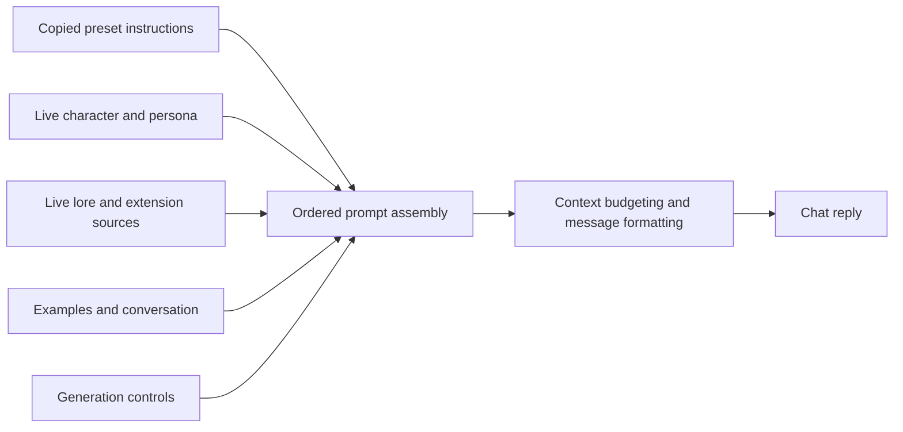

# Lattice: complete prompt conversion and ownership

Research date: October 7, 2026. Status: proposed architecture for discussion, not an approved implementation spec. Companion to [the approachability and workflow assessment](2026-10-07-lattice-approachability-and-workflows.md).

## Reassessment: defer complete takeover

The user subsequently raised development cost and ecosystem compatibility concerns. The revised recommendation is a **pre/post workflow layer that retains SillyTavern's native prompt assembly and primary generation**, detailed in the companion assessment's compatibility reassessment. Complete conversion is not the proposed onboarding requirement or near-term core feature.

The earlier proposal below is retained as a deferred alternative, together with the confirmed Seed limitations. Reproducing the complete host pipeline is a much larger obligation than importing instruction text for auxiliary analysis or inspecting a native prompt. This document does not establish that takeover is required to achieve flexible node workflows.

## Earlier recommendation (deferred)

Make **Convert my current SillyTavern setup** a primary onboarding path. It should produce an understandable, editable workflow that preserves the source prompt's behavior before users change it. Importing an existing preset JSON should provide the same entry point, followed by binding its live sources to the user's current chat.

Treat conversion as importing a prompt recipe, not rearranging a flat string into boxes. Keep both the source recipe and a resolved assembly trace, so the user can inspect what each component contributes and compare the complete result with SillyTavern.

After verification, offer **Use this workflow for this chat**. Lattice then owns the outgoing prompt, with live character, history, lore, and extension content supplied through explicit source nodes. SillyTavern continues to provide the chat and generation transport. Preserve the original preset as the source for comparison and recovery.

This recommendation follows the user's priorities: approachability, compatibility with existing prompts, complete decomposition, and prevention of duplicate or competing prompt injection. Editable copies of preset instructions are a proposed default; the user has not separately selected a synchronization policy for later preset edits.

## Why Seed is insufficient

The inspected fork is version 0.17.0 at `dc5b6034ac7e202ecb40f33fb8d84d5dc6b8c475`. The inspected SillyTavern checkout is `F:/SillyTavern/SillyTavern`, revision beginning `06bde939f`.

| Finding | Source | Consequence |
| --- | --- | --- |
| Seed creates an ST node for each Prompt Manager entry in the selected order, then connects every node directly to Output | [library.js](../../src/library.js), `stPrompts`, `graphFromCurrentOrder` | It reproduces a list, not the full assembly process. |
| The prompt listing retains position/depth but Seed does not transfer them to nodes; order, trigger, and override protection are omitted from the listing | [library.js](../../src/library.js) | Depth placement, generation conditions, and override behavior cannot survive this conversion. |
| Known extension marker resolution searches key substrings | [compile.js](../../src/compile.js), `markerContent` | `authorsNote` does not find the host's standard `2_floating_prompt` key. Arbitrary extension injections outside the preset list are not seeded. |
| Character fields and examples are read as text, history is reconstructed from raw chat, and prompt content is trimmed | [compile.js](../../src/compile.js), `resolveNode`, `historyMessages` | Native formatting, example-message structure, names policy, and exact text boundaries differ. |
| Final collection retains role/content/name for string messages | [compile.js](../../src/compile.js), `collect` | Tool messages and multimodal payloads need a richer contract. |
| Graph compilation warns about excess context rather than applying native history budgeting | [compile.js](../../src/compile.js), `compile` | A graph can send history the native assembler would omit. |
| Reading order depends on canvas coordinates | [compile.js](../../src/compile.js), `byY`, `collect` | Rearranging an imported graph can change the prompt. Layout should not silently alter the imported recipe. |

A synthetic, in-memory reproduction used the repository's [host mock](../../tests/mock.js), Seed, and compiler. It supplied `main`, a depth-1 prompt with priority and generation trigger, an Author's Note marker, and history, plus `2_floating_prompt` and a custom extension injection. Compilation succeeded, but emitted:

```text
MAIN, DEPTH, TURN_1, TURN_2, TURN_3
```

Assertions confirmed that the generated node lacked depth/priority/trigger rules, the prompt listing lacked the override guard, both extension texts were absent, and leading/trailing instruction whitespace was removed. The depth prompt appeared before all history rather than within it. This confirms specific omissions; it is not a live-host compatibility or model-quality test. No provider calls were made.

## Prompt ownership is broader than the system role

The current [entry point](../../index.js), `onChatCompletionPromptReady`, already empties `eventData.chat` and replaces it with compiled messages when a graph succeeds. It does not append the canvas to the native array. It also replaces the assembled text-completion string on that path.

However, missing graphs, compilation errors, an aborted build, or a busy build can leave the native prompt in place. Some node/model failures can produce a successful but partial plan. Quiet/background generations deliberately retain their own prompt. These behaviors matter when the product promises that an active workflow owns the prompt.

Use one visible selector for the current chat:

| Mode | Outgoing prompt | What the user sees |
| --- | --- | --- |
| **Use SillyTavern** | Native assembly | A conversion can be inspected without activating it. |
| **Use this workflow** | The workflow's complete assembled result | The active workflow name, its source nodes, and any required unresolved inputs. |

In workflow mode, include preset instructions only through their converted nodes. Include character, lore, history, and extension contributions only through their declared inputs. A source contribution should have a stable identity and one owning assembly path; an explicit repeat operation can intentionally reuse it. Consuming both an aggregate native prompt and its component nodes must be rejected or explicitly resolved; identical text alone is not evidence of duplication.

Avoid defining takeover as removing every message whose role is `system`. Character descriptions, persona, lore, Author's Note, and memory can also use that role, and presets can put instructions in user or assistant messages. Ownership must follow source identity and assembly, not a role filter.

For an active converted workflow, required-source failures should stop that chat send with an actionable explanation and an explicit **Use SillyTavern instead** recovery action. Silent fallback would violate the ownership promise. Optional sources can be explicitly optional; ordinary absence, budget exclusion, and failure need distinct states. Existing canvases should retain their behavior until deliberately migrated to the new contract.

The host exposes `stopGeneration`, and its earlier generation-interceptor API has an abort callback. A reliable cancellation point for late assembly failure still needs an integration test; a mutable prompt-ready event alone is not a demonstrated cancellation contract. This is a prerequisite for exclusive workflow mode.

Scope takeover to the intended chat generation. Background extension calls and workflow-internal requests need separate run identities and prompts. Changes from other extensions after Lattice's handoff must be integrated deliberately or reported as downstream changes. Event registration order alone does not establish exclusive ownership.

## Three conversion approaches

| Approach | Strength | Limitation |
| --- | --- | --- |
| Extend today's settings-based Seed | Smallest change; readable preset entries | Cannot reconstruct all assembled history, extension effects, formatting, or provenance. Useful as a repair, insufficient for the requested feature. |
| Capture the final native message array | Faithful record of one assembled turn at a specified boundary | Loses raw templates, dynamic rules, inactive components, and boundaries already merged by the host. Useful for comparison and snapshot nodes. |
| **Import the source recipe and capture assembly provenance** | Preserves editable instructions, dynamic sources, placement rules, and verification evidence | Requires a versioned host adapter and richer assembly contracts. Recommended foundation. |

Neither final text nor an LLM can reliably recover every original boundary, macro, filter, or conditional rule. A complete converter needs source access. Unknown content can be preserved as an opaque component while its internal structure remains unavailable.

## What must survive conversion

| Layer | Required representation |
| --- | --- |
| Preset recipe | Ordered identifiers, enabled state, raw content, role, generation trigger, depth, injection priority, override policy, and inactive entries |
| Character and persona | Live field bindings, formatting templates, main/jailbreak overrides, and `{{original}}` behavior |
| Lore and extension context | Source key/provider, resolved contribution, role, placement/depth, eligibility result where available, and ownership |
| Examples and history | Native message boundaries and names, selection and budget policy, tool-call/result groups, and structured media payloads |
| Generation controls | Normal/swipe/regenerate/continue/impersonate distinctions, applicable nudges, new-chat markers, assistant prefill, and empty-input handling |
| Assembly | Explicit order, grouping and separators, source-to-output spans, context and response reservations, and native message consolidation rules |
| Execution configuration | Compatible connection binding and required formatting options, separate from prompt text; host-owned transport and credentials |

An imported preset alone cannot contain the current character, chat, active lore, or other extensions' runtime output. The converter should create live source bindings for these, report missing dependencies, and validate in a real chat context. Wandlight, Celia, and Freaky Frankenstein are user-supplied target examples; their actual files have not been inspected or certified here.

## The graph users should receive

Start with a few collapsed, clearly named groups: **Instructions**, **Character and persona**, **Lore and memory**, **Examples and conversation**, and **Reply controls**. Users can expand a group to see all its components. A large preset should not arrive as hundreds of equally prominent boxes.



This is a conceptual view. Depth-injected components belong within the conversation assembly, not in a flat block before history. Individual controls and budget priorities need their real host sequence preserved; the diagram is not an instruction to budget everything in a single final truncation pass.

Each component should show its source and treatment: **Copied**, **Live**, or **Preserved native component**. Editing copied instructions changes the workflow. Live sources update with the chat. A preserved native component maintains content or behavior whose internals the adapter cannot yet expose; it should never appear fully decomposed.

For a long instruction entry, provide child fragments for explicit headings, XML-like sections, or selected text ranges. Preserve the exact original order, delimiters, and whitespace when those fragments recombine. Keep raw macros alongside their resolved values. Arbitrary prose has no guaranteed semantic boundary; optional model-assisted suggestions require review and should not underpin compatibility claims.

Resolve sources under native macro and filter rules, preserving the host's evaluation sequence, then reuse those captured results within the run. Do not perform fresh world-info scans or extension generations merely to render each node's preview. A single source-bound trace can serve the preview, comparison, and workflow assembly. Editable macros and changed inputs require an explicit new resolution, with host side effects considered by the adapter.

The existing graph can provide the editor shell, but its text-centric compiler is not sufficient for this contract. Introduce structured fragments/messages and explicit assembly operations, including interleaving at history depth. Store execution order separately from canvas position. Exact compatibility mode needs a path that preserves message metadata and avoids automatic trimming or separator insertion.

## A straightforward first-use flow

1. Choose **Convert current setup** or **Import a SillyTavern preset**. Offer starter workflows as another entry point.
2. See the detected preset and live sources. Conversion creates a draft workflow without changing prompt ownership.
3. Inspect a grouped graph and the assembled prompt side by side. A short report explains exact matches, differences, and components preserved without internal decomposition.
4. Choose **Use this workflow for this chat** after its required inputs and supported generation paths validate.
5. Change one component, such as prose instructions or lore placement, and see its contribution and effect on the assembled result.

Keep this flow visible on first use, but retain the ability to use the existing SillyTavern setup while investigating a conversion. Automatically stripping prompts before a usable workflow exists would make the initial hill climb steeper.

The bridge to advanced workflows is incremental: import a familiar preset, isolate its reasoning and prose instructions, then choose where they run. Splitting text does not automatically reproduce the preset's reasoning behavior. Sending a reasoning section to a separate model is a deliberate workflow change with a preview of the new calls and outputs.

## Verification and the host adapter

The inspected native `public/scripts/openai.js` assembles much more than Prompt Manager's list. `preparePromptsForChatCompletion` merges dynamic sources and overrides; `populateChatHistory` budgets history and handles tools/media; `populateDialogueExamples` creates example messages; depth injection combines source strings; and `squashSystemMessages` can merge adjacent system messages.

The final `CHAT_COMPLETION_PROMPT_READY` payload omits source identifiers. The native Prompt Manager retains a message collection, but its `setChatCompletion` stores a reference that later consolidation mutates. Its manager is also not exposed through the inspected `getContext` API. Simply reading its final collection is therefore insufficient for complete, stable provenance.

Prefer a host-supported hook that exposes prepared sources and assembly decisions before irreversible joins. If unavailable, use a deliberately versioned adapter to the inspected internals, with compatibility detection and constrained capabilities. Keep an upstream provenance-hook proposal as part of the investigation. A hook or adapter must capture without mutating the shared native collection; permanent broad monkey-patching is a poor foundation.

Measure two independent properties:

- **Output parity:** complete ordered message payloads match at a defined browser-side boundary, including roles, exact content, names, tool metadata, media structure, and relevant safe execution fields.
- **Decomposition coverage:** every included contribution and applicable recipe rule has an identified source and an editable or explicitly delegated representation. A perfect flat snapshot can have poor decomposition coverage.

Also retain excluded components and reasons where observable: disabled, not applicable to this generation, inactive, filtered, or omitted by budget. Do not invent a reason when the host provides only absence.

Compare from the same frozen turn inputs, source decisions, and macro resolutions. The inspected host consolidates system messages on real sends but not dry runs; preview-to-send comparison needs the same native formatting policy, not a whitespace-insensitive text diff. Do not claim identical output across different runs of random macros or other dynamic sources.

The comparison boundary is browser-side assembly or a whitelisted request envelope. Backend/provider serialization remains outside that claim. Full request objects may contain credentials and unrelated configuration; export only necessary safe fields. Personal chat snapshots should be optional and separate from reusable workflow exports.

A read-only capture from the last actual send or the next ordinary chat generation can provide evidence without adding a paid conversion call. A proposed native preview path needs validation for extension side effects before it can promise that property.

## Delivery order and acceptance

| Step | Deliverable | Acceptance evidence |
| --- | --- | --- |
| **1. Capture and explain** | Version-detected source inventory, saved resolved trace, grouped draft graph, parity and coverage report | Capture leaves the native prompt intact; every payload field survives; unsupported internals are visible. |
| **2. Faithful editable conversion** | Copied preset instructions, live bindings, explicit assembly/depth/conditions, exact fragment recombination | Unedited conversions match the native result across the supported fixture matrix. |
| **3. Exclusive chat activation** | Chat-level ownership, required-source checks, verified cancellation, explicit recovery, compatibility handling for other hooks | One final prompt owns the send; no duplicate source paths, accidental native fallback, double source execution, or double-billed internal calls. |
| **4. Share and extend** | Versioned workflow JSON, dependency preflight, profile-role binding, optional section splitting, bundled examples | Another installation can import, resolve requirements, and understand its supported behavior before activation. |

Begin with the native chat-completion path and state its supported host versions. Text-completion/instruct formatting requires its own adapter and fixture matrix; the current newline flattening is not equivalent. Tools/media can be preserved through native components before their internals become editable. Required unsupported behavior should limit activation rather than silently disappear.

The fixture matrix should cover main/jailbreak overrides and override protection, raw/resolved macros, disabled and generation-triggered entries, depth/priority/role collisions, extension filters, native Author's Note and summaries, lore activation, example/history budget precedence, character/group strategy, swipe/regenerate/continue, message consolidation, names, tool pairs, media, and failures/abort. These are proposed implementation acceptance checks, not a claim that such a converter has passed them.

This becomes the leading approachability feature: users can bring a setup they already understand into Lattice, then expand it. Recursion's source-bound checkpoints and invalidation are useful for the converter's trace and subsequent reasoning stages. Saga should retain ownership of its lore decisions, exposed through an adapter rather than duplicated retrieval. Recast-like revision passes remain a later completed-response workflow, not something prompt import alone provides.

## Decision still to review

The earlier proposed contract of full workflow prompt ownership is deferred. The current design review should instead establish native guidance installation, bounded pre-processing, completed-response review, and interoperability policies. If complete conversion is reconsidered later, its host/version/API matrix and the acceptable role of native opaque components still require a separate design. No runtime changes, named-preset conversions, or live-host parity certification were produced in this research.
