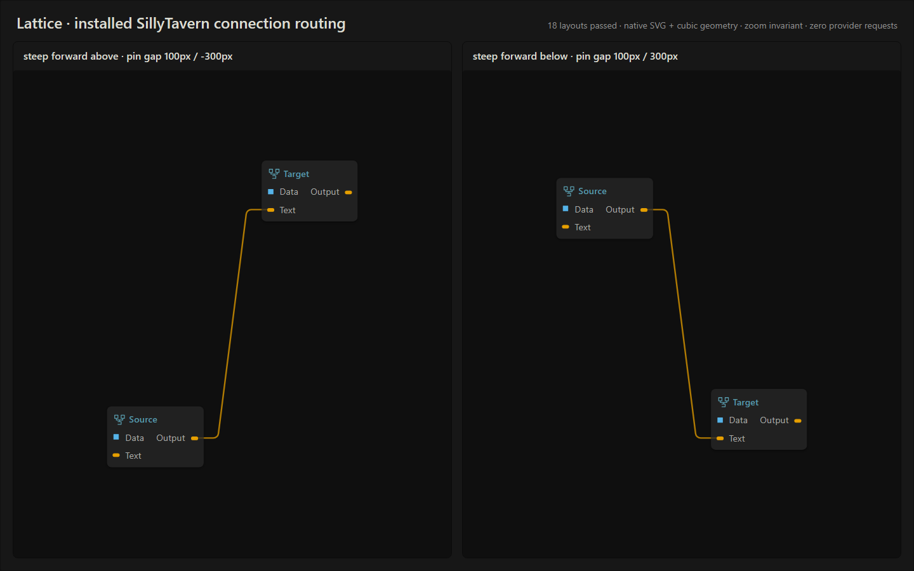

# Connection endpoint rounding verification

## Change

Fixed small backward hooks and S-shaped endpoint turns in settled connections.
The old cubic joined a diagonal ray through the horizontal neck end, with a
fixed horizontal control handle. Steep forward routes overshot the ray and
reversed internally even though adjacent SVG segments shared a tangent.

The new route rounds virtual corners beyond the 25 graph-pixel pin leads.
Each endpoint's circular-fillet handle follows its own turn angle. Opposite
pin sides limit their corner setbacks to half the horizontal space between
the necks, preventing reversed middles for narrow forward pin gaps. Exact
vertical neck alignment retains an imperceptible .001 graph-pixel setback
to avoid collapsed tangents. The literal straight middle, shallow level
returns, close-pin fallback, labels, and free-pointer previews are preserved.

## Regression evidence

- Before the fix: 24 existing route tests passed; both new regressions failed.
  The `(0,0 right) → (100,300 left)` source turn reversed its horizontal
  tangent and overshot the straight middle's angle.
- Review identified another failure at forward pin gaps 51–61 pixels. Added
  mirrored 51, 52, and 60 pixel fixtures; the horizontal-reversal test failed
  before the corner-space limit was added.
- The two regression tests now cover 28 layouts, both endpoint turns,
  above/below destinations, and both horizontal directions. They check
  horizontal monotonicity, tangent-angle rotation, curvature sign, compact
  turns, horizontal leads, and a literal straight middle.

## Automated checks

- `npm test`: **264/264 test files passed**.
- `npm test canvas connection`: **21/21 test files passed**, rerun after the
  final narrow-gap change.
- `node --test --test-isolation=none tests/connection-route.test.mjs tests/connection-drag-preview.test.mjs`:
  **28/28 tests passed**.
- Connection curves, native node connections, wire presentation, and artifact
  pin browser suites: **10/10 tests passed**.
- `node tools/check-assets.mjs`: **521 versioned local imports verified**.
- Whitespace checks passed for the changed routing and regression files.

## Installed SillyTavern

The installed extension is a separate checkout at
`F:\SillyTavern\SillyTavern\data\default-user\extensions\Lattice`.
Only `src/canvas/connection-route.js` was copied into it. The workspace and
installed file SHA-256 both equal:

`403E6DC39A6BA7D7F0D2F75E9BF22EAAB7FF048C24F2E2CDFB6A423DB7F2DBE0`

The reusable `tools/verify-connection-host.mjs` checks the installed renderer
inside the actual host at `http://127.0.0.1:8000`, using detached prepared
graphs. It waits for Lattice's theme boot and camera settling before checking
geometry.

- `node tools/verify-connection-host.mjs`: **18/18 layouts passed** in the real
  installed SillyTavern renderer, including 52 and 60 pixel forward pin gaps.
- Source and target pins matched wire endpoints with **0 pixel measured error**.
- The route and hit-path SVG data stayed identical at zooms **0.4, 0.73, 1.2**.
- Steep forward turns passed native SVG sampling and cubic derivative checks
  for horizontal monotonicity, tangent bounds, and curvature direction.
- Host settings, chat, and metadata snapshots stayed unchanged; **0 provider
  requests, 0 provider attempts, 0 persistence writes**.
- The test destroys all detached canvases and closes its isolated browser.

[Live result JSON](artifacts/connection-routing/sillytavern-routing-result.json)

