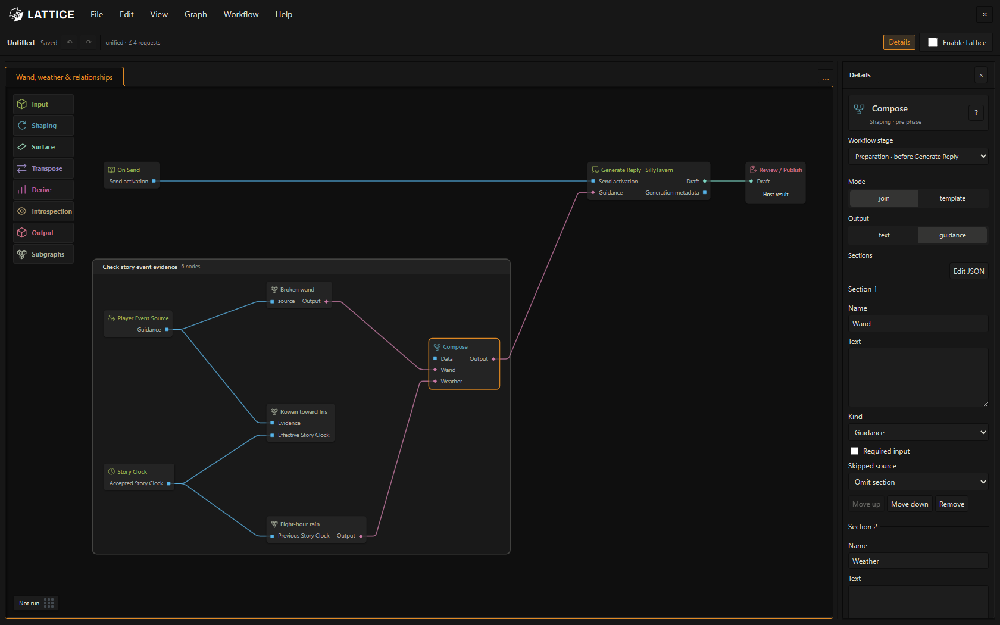

# Story systems you can build

[Lattice](../README.md) · [Operator’s manual](operators-manual.md) · [Example lessons](examples.md) · [Node reference](node-reference.md)

Combine rules you author with model interpretation and narration. Use models for understanding prose; use deterministic tools for an exact probability, counter, budget, or schedule. These are supported compositions you can build, rather than systems that activate automatically at installation.

## A wand with a 10% chaos chance

Imagine a broken wand that usually casts its intended spell but sometimes produces a strange, fixed effect. Author a weighted library:

| Effect | Weight | Share of this library |
| --- | ---: | ---: |
| The intended spell works | 90 | 90% |
| A cloud of butterflies replaces the spell | 4 | 4% |
| Frost coats nearby objects | 3 | 3% |
| Nearby shadows whisper for a moment | 3 | 3% |

The chaos entries add up to 10 out of 100. Weights are relative: changing the total changes the probabilities. Every entry is `kind: "fixed"`; selecting one requires no Effect Author request. This varies [lesson 27](../examples/remastered/27-the-broken-wand-stable-randomness-with-a-wild-branch.lattice.json), whose supplied library uses fixed blue sparks at weight 80 and a model-authored wild branch at weight 20.

1. Open lesson 27 as an independent copy and read its setup. Replace demonstration actor and item IDs with your story’s identities.
2. Authorize its holder, library, and outcome JSON targets in **Workflow → Configure → Workflow Data…**. For `wand-effects`, use the JSON below as initial content in a fresh target, or deliberately update an existing authorized library. Changing an initial template does not overwrite saved content. Set the **Effect Library** node’s **Revision** to `fixed-chaos-r1` as well, so its identity matches the JSON.
3. Bind action extraction and confirmation models. Keep the event confirmation and accepted-holder checks: a hypothetical use should not count as an actual cast.
4. Random Pick selects from the live library for that eligible event. This fixed-only library leaves the wild-effect branch unused. Configure that branch’s model bindings if validation requires them, or deliberately remove the unused branch.
5. Inspect the effect, narration, and proposed outcome. Apply the final reviewed reply to settle it. Reject does not accept it. While the pending draw is retained, rerunning the same event reuses it.

```json
{
  "libraryId": "wand-effects",
  "revision": "fixed-chaos-r1",
  "itemId": "broken-wand",
  "effects": [
    { "id": "normal", "kind": "fixed", "weight": 90, "description": "The intended spell works normally." },
    { "id": "butterflies", "kind": "fixed", "weight": 4, "description": "A cloud of harmless butterflies replaces the spell." },
    { "id": "frost", "kind": "fixed", "weight": 3, "description": "A brief magical frost coats nearby objects." },
    { "id": "whispers", "kind": "fixed", "weight": 3, "description": "Nearby shadows whisper for a moment, then fall silent." }
  ]
}
```

The initial draw uses runtime randomness. Lattice reuses a matching draw from its pending cache or accepted outcome ledger; event identity alone does not recreate a lost pending draw. Keep the library revision consistent with its contents; a new use is a new event. Extraction and confirmation are still model tasks in this lesson, so inspect their evidence before accepting the result. See [Random Pick](node-reference.md#random-pick) and [fixture setup](../examples/remastered/fixtures/README.md).

## A relationship that grows slowly

[Lesson 30](../examples/remastered/30-a-relationship-that-changes-slowly-over-weeks.lattice.json) gives Rowan’s feelings toward Iris separate trust, desire, tension, and excitement values. Confirmed support can improve trust and reduce tension, with authored scene/day caps, cooldowns, and diminishing returns. Duplicate events do not award the same progress twice.

This lesson moves each value one point toward baseline per authored interval of accepted story time: one week for trust and tension, four weeks for desire, and eight hours for temporary excitement. These are editable example rules. Rowan → Iris and Iris → Rowan are separate directions. Private state guides the selected NPC’s portrayal without selecting the player’s response.

Configure real actor IDs, authorize the actor-private document, and supply a genuine accepted story clock. Message count and real-world waiting do not advance it. Apply accepts the proposed state and pacing records; Reject preserves the prior state.

## One scene, two private perspectives

[Lesson 29](../examples/remastered/29-one-kiss-two-private-perspectives.lattice.json) follows a confirmed shared moment through separate actor perspectives. Each reflection uses its actor’s authorized context. The workflow stages separate memories and can supply character-specific direction while preserving user agency.

Try it for a reunion, disagreement, or promise: characters need not interpret the same event identically. Set actual identities, privacy scopes, and model connections. Private material stays tied to its actor; relabeling it as public does not authorize sharing.

## Weather, curses, and routines on story time

[Lesson 23](../examples/remastered/23-advance-the-story-clock-when-the-scene-is-accepted.lattice.json) advances time by an authored, accepted duration. [Lesson 24](../examples/remastered/24-make-curses-and-routines-happen-on-schedule.lattice.json) adds Time Trigger and occurrence tracking for events due when the timeline crosses a boundary.

An agreed eight-hour wait can cross the time when rain starts. A timed curse can produce guidance when due. A routine can have an explicit schedule and tracked identity. Author the durations, calendar, policy, and guidance; Lattice does not infer reliable elapsed time from every reply.

The [combined example](combined-system-example.md) connects a wand, an eight-hour rain crossing, and private relationship state in one Main. Its supplied wand library has one fixed effect; it is a compact composition example, separate from lesson 27’s weighted wild branch.



*Open the wrappers to inspect or edit each body independently.*

## A notebook of scenes you actually accepted

[Lesson 16](../examples/remastered/16-consult-the-current-campaign-notebook.lattice.json) reads an authorized notebook into the story process. [Lesson 17](../examples/remastered/17-record-only-the-scene-you-accept.lattice.json) proposes a scene record and saves it with the accepted reply. Discarded drafts stay out of campaign history.

Use it for established clues, summaries, or commitments, with an authored structure and identity rules. Read File and Write to File use scoped Workflow Data targets, rather than arbitrary computer paths. Saves and reply publication have separate receipts; check failed or unconfirmed saves in Preview.

## A narrator with an editorial team

[Lesson 12](../examples/remastered/12-plan-write-polish-and-annotate-one-reply.lattice.json) plans, generates, polishes, and annotates a reply. A preparation model can receive only the chosen context; SillyTavern performs its ordinary generation; response models can revise the Draft and enrich extracted notes.

Keep each job on your active SillyTavern model, or choose specialist planner and editor profiles. Inspect recorded outputs and request bounds. Extra model stages use extra requests; opening examples, editing, and saving do not.

## Start small, then compose

Begin with one rule you can explain and verify. Inspect its inputs and output, save the workflow, and try it in a separate chat. Package working processing nodes as a subgraph, save it to the shelf, and use **Workflow → Add system…** to connect it to Main. Lesson details provide setup, checkpoints, and call budgets; the [manual](operators-manual.md) explains the gestures.
