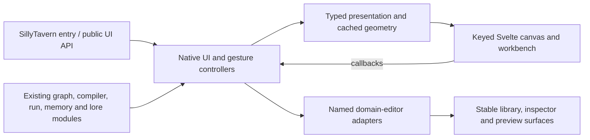

# Svelte UI migration — 0.18.0

Silly Canvas now uses keyed Svelte cards, groups, SVG wires and a Svelte workbench. Camera motion no longer redraws wires or asks every endpoint for its height. The controller batches visual work into animation frames, caches unscaled card dimensions and prepares duplication/Generate-wave analysis once per graph revision. ComfyUI-style selection is built into the same gesture controller.

The agreed [design](superpowers/specs/2026-10-07-svelte-ui-migration-design.md) and [implementation plan](superpowers/plans/2026-10-07-svelte-ui-migration.md) define the acceptance contract. PomegranateUI informed the headless bindings, keyed presentation and host-adapter architecture; its source was not copied. The bundled Svelte MIT notice is in [THIRD_PARTY_NOTICES.md](../THIRD_PARTY_NOTICES.md).

## Ownership and boundaries

| Location | Responsibility |
| --- | --- |
| `src/ui.js` | Compatible public exports; forwards to the UI controller |
| `src/ui/controller.js` | Host/domain orchestration, graph actions, keyboard shortcuts and specialized native editors |
| `src/ui/workbench.js`, `domain-surfaces.js` | Explicit mount/update and named library/inspector/preview/State/theme/model adapter boundaries |
| `src/ui/graph-analysis.js` | Per-graph revision cache; view and token/trace presentation do not invalidate it |
| `src/canvas.js` | Native editing and gesture state; same graph objects and callback API |
| `src/canvas/camera.js`, `frame.js`, `selection.js`, `geometry.js` | Camera math, dirty-frame coalescing, rectangle operations, measured sizes and incident-wire indexing |
| `src/canvas/presentation.js` | Plain card data; no DOM building |
| `ui/*.svelte`, `ui/types.ts` | Actual card/group/port/SVG/workbench/control markup and typed props/actions |
| `dist/silly-canvas-ui.js` | Committed, self-contained ESM containing Svelte and UI components |

Svelte receives data and callbacks. It imports no domain state, compiler or run modules. All native imports use the same `?v=0.18.0`, including nested adapter imports, so there is one authoritative state instance. Saved graph JSON, prompt order, generation hooks and compiler/runtime behavior are unchanged; version-query edits in those modules only invalidate browser caches.

The specialized library, inspector, preview, State window, theme and model editors remain native through the named adapters. This is an explicit migration boundary: the complete canvas and workbench are Svelte, while rich domain forms retain their existing behavior. Camera and token updates preserve active editor elements. Changing a graph or selection still refreshes its domain editor. No viewport culling or alternate graph-layout engine was introduced.

Camera-only work applies the viewport transform and grid, then updates the zoom controls once per frame. It never rebuilds cards, measures endpoints or runs graph analysis. Drag updates positions and incident wire paths once per frame. ResizeObserver refreshes cached border-box heights; a batch measurement fallback supports hosts without it. Full graph projections retain card, port and wire identities by ID. The fullscreen backdrop blur is removed, and wire glow is suspended during camera/drag gestures.

## Interaction contract

Plain empty-space drag selects an intersecting rectangle in any direction. Shift/Ctrl/Cmd rectangles add and Alt rectangles remove from the selection at the start of the gesture; Alt takes precedence. Shift-click adds, Ctrl/Cmd-click toggles and Alt-click removes. Clicking an already selected member narrows the selection on release; dragging it moves the complete set. Shift-drag preserves the set. A four-screen-pixel threshold prevents click jitter.

Middle-drag and Space+left-drag pan over cards without changing selection. Select/Pan controls make both modes discoverable. Wheel deltas respect magnitude and pixel/line/page units, keep the graph point under the cursor, and clamp zoom to 25–250%. Ctrl/Cmd+A includes folded members, Ctrl/Cmd+G groups selected blocks, and period fits the selection. Output keeps its delete/group protection. Escape restores an unfinished gesture, then clears selection, then closes the workbench. Text inputs, selects and contenteditable keep browser shortcuts; focused buttons keep Space/Enter activation.

Graph switch, close, resize, pointer cancellation and blur cancel partial gestures. Canvas deletion confirmations, group-member pickers, graph actions, context-menu clipboard reads and previews are guarded against a changed graph/session. Delayed model lists and dynamic-prompt refreshes cannot replace another graph’s active editor. Interrupted wheel updates reconcile the visible camera with graph coordinates. `Canvas.destroy()` releases host/document/window listeners, pending frames and ResizeObserver, then unmounts Svelte. Close/reopen retains one workbench/controller instance.

## Parity and verification

| Feature | Evidence |
| --- | --- |
| Prompt, ST, Generate, History, Injection, Note, Lorebook, Decider, State, Memory, Output | Existing Node/UI suites plus all-types Chromium card/port test |
| Named Decider keys, State values/stage dots, very tall cards | `decider-ui`, `wire-cond-ui`, `state`, `parity.spec`; measured endpoint matches actual unscaled card height |
| Merge/append/prepend, activate/result, conditional keys, loops, save paths, together ties | Native `wiring`, `wire-modes`, `wire-cond-ui`, `loops`, `loop-ui`, memory/forward suites; Chromium path/class and real port-drag checks |
| Blankets, fold/unfold, group enablement, movement, protected Output | Native `blankets`, `groups`, `selection-gestures`; browser group shortcut and keyboard fold/open |
| Rectangle directions, negative coordinates, zoomed selection, modifier clicks, movement threshold | Selection utilities/controller suites and real pointer browser tests |
| Copy/cut/paste, duplication, library pieces | Native `clip`, `extras-ui`, `notes`, `inspector`; Chromium copy/paste internal wire and one undo step |
| Undo/redo, preview, trace, token chips, ST/lore behavior | Existing history/token/trace/selection/lore suites; Chromium stable identity and async preview cancellation |
| Model search, State window, theme/customization, light/dark | Existing native UI suites; Chromium theme changes and model-list focus regression |
| Host entry, launchers, open/close/reopen, shared graph state | Browser harness loads actual `index.js`; installed-copy smoke has no build tools or `node_modules` |
| Desktop/narrow, keyboard/contenteditable, reduced motion | 1440×1000 and 700×900 captures, Neon/Parchment visual inspection, Chromium keyboard/layout tests |

The release check is `npm run check`: 44 Node test files, Svelte checking with zero errors/warnings, production build, 62 consistent local asset imports and 25 Chromium acceptance cases. Model-provider responses and SillyTavern are mocked; verification makes no production generation calls. The [independent review and fix evidence](superpowers/reviews/2026-10-07-svelte-ui-migration.md) records the complete review disposition.

`npm run smoke:install` copies only the installed extension assets and host fixture to a fresh temporary directory. It verifies the actual launcher API, shared domain graph, Svelte root, cards and reopen behavior without developer UI source or dependencies; all 35 browser requests are local with no missing files or page errors. `npm run capture` saves ignored screenshots/metrics. Desktop/narrow headers have no horizontal overflow, and canvas dimensions stay usable. The harness omits SillyTavern’s icon font, so production icons are covered by preserved classes and accessible labels.

## Performance evidence

Primary records are [the original renderer audit](benchmarks/2026-10-07-before.json) and [the final 54-case run](benchmarks/2026-10-07-after.json). Chromium 151.0.7922.34, 1440×900, device scale 1, on the same Windows audit machine. Graphs have 25/100/250 nodes and 46/196/496 chain plus skip-three wires, identical 260-pixel cards, eight columns and the same prompt text. Each sample uses 30 animation frames. Baseline wheel ±1 invoked a fixed 1.1× step; final wheel magnitudes are calibrated to the same 1.1× step. The final run includes the Svelte workbench and updating zoom/selection controls, with auxiliary panes hidden to retain the full canvas viewport.

| Nodes / wires | Zoom | Original zoom handler p95 | Final zoom handler p95 | Original median frame | Final median frame |
| --- | --- | --- | --- | --- | --- |
| 25 / 46 | 1.0 | 2.4 ms | 0.1 ms | 16.7 ms | 16.7 ms |
| 25 / 46 | 2.2 | 2.2 ms | 0.1 ms | 16.7 ms | 16.7 ms |
| 100 / 196 | 1.0 | 26.7 ms | 0.1 ms | 33.3 ms | 16.7 ms |
| 100 / 196 | 2.2 | 12.2 ms | 0.1 ms | 16.7 ms | 16.7 ms |
| 250 / 496 | 1.0 | 46.0 ms | 0.1 ms | 50.0 ms | 16.7 ms |
| 250 / 496 | 2.2 | 47.0 ms | 0.1 ms | 49.9 ms | 16.7 ms |

Those paired rows use Midnight. Across Midnight, SillyTavern and Neon at both zoom levels, all final zoom/pan cases have p95 handlers ≤0.2 ms, median frames ≤16.7 ms and p95 frames ≤16.8 ms. No camera interval exceeds 25 ms. Every gesture sample retains cards and wire paths, reads zero card heights and runs zero graph analyses. Zoom still lays out the small percentage readout once per frame; the former 497 layouts per 250-node wheel event are gone. Pan samples have zero layouts. Multi-drag has median frames 16.7 ms and p95 ≤16.8 ms; one interval in the large close-zoom Neon drag exceeded 25 ms.

Timings describe this synthetic local browser workload, not every device or arbitrary graph size. CI asserts identity, coordinate math, analysis counts and scheduling rather than noisy timing thresholds. Larger/complex graphs can still require full domain projection work after an edit; there is no culling. The audit isolates rendering, not provider latency or model generation. Run `npm run benchmark` to reproduce current measurements; new raw output goes to ignored `benchmark-results/latest.json`.

## Building and updating

Use Node.js 24+, `npm ci`, and `npx playwright install chromium`. Run `npm run check` after edits, and commit the regenerated `dist/silly-canvas-ui.js` with Svelte source. The extension install has no npm dependency or CDN request. The build is reproducible from the pinned lockfile. Before shipping a different version, run `node tools/bump-version.mjs <version>` and verify assets again; the tool updates nested native imports and package/lock metadata.
